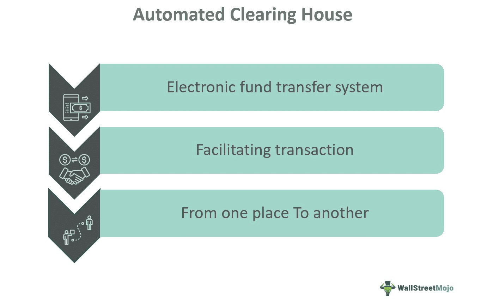

In the rapidly evolving world of finance, electronic payments have become integral to modern transaction methods, offering speed, security, and convenience unmatched by traditional cash-based systems. At the heart of these electronic transactions lies the Automated Clearing House (ACH), a crucial network facilitating the processing of vast volumes of credit and debit transactions efficiently and effectively. The ACH network plays a pivotal role by ensuring that funds are transferred securely between parties, supporting a wide array of transactions such as direct deposits, payroll, and bill payments.

Simultaneously, algorithmic trading (algo trading) has introduced a technological revolution in financial markets, where trades are executed based on pre-programmed instructions using complex algorithms. This approach capitalizes on technology to optimize trading decisions, thus enhancing trading efficiency and accuracy.

This article explores the convergence of electronic payments, specifically focusing on ACH, and algo trading—a synergy that is increasingly significant in today's financial landscape. The integration of these components has not only streamlined transaction processes but also improved the overall efficiency of the financial ecosystem. By examining each aspect, we can understand how electronic payments, ACH, and algo trading collectively advance the speed, reliability, and precision of payment processes and trading operations. This convergence is vital in ensuring efficient financial transactions, enabling the market to respond swiftly to changes and opportunities.

## Table of Contents

## Understanding Electronic Payments

Electronic payments encompass the digital transfer of funds between parties, replacing traditional cash transactions with transactions conducted online or through electronic channels. This modern payment method offers several distinct advantages. To begin with, electronic payments significantly increase the speed of transactions, allowing for nearly instantaneous transfers compared to the delays often associated with checks or cash-based payments. Enhanced security is another key benefit, as digital transactions can incorporate encryption and authentication protocols to protect against fraud and unauthorized access.

The reduced transaction costs associated with electronic payments make them highly appealing for businesses and consumers alike. By minimizing the reliance on physical infrastructures, such as brick-and-mortar banking facilities, electronic payments streamline operations and reduce overhead costs. Moreover, they eliminate the need for physical cash handling, which can be both costly and time-consuming.

The proliferation of e-commerce, online banking, and digital wallets has played a pivotal role in the widespread adoption of electronic payments. E-commerce platforms require seamless and efficient payment solutions to facilitate transactions between buyers and sellers across the globe. Similarly, online banking services have enabled consumers to manage their finances and execute transactions effortlessly. Digital wallets, such as PayPal, Apple Pay, and Google Wallet, further contribute by providing users with the convenience of storing payment information and making transactions with a click.

The electronic payments ecosystem is supported by various key players, including payment processors, financial institutions, and technology firms. Payment processors, such as Visa, Mastercard, and Stripe, function as intermediaries between consumers and financial institutions, ensuring the secure and swift processing of transactions. Financial institutions, including banks and credit unions, provide the necessary infrastructure and services to support electronic payments. Technology firms often develop the platforms and applications that facilitate and enhance the user experience in making digital transactions.

As digital transformation continues to impact industries globally, electronic payments are evolving rapidly. Innovative trends and developments are emerging, such as the integration of biometric authentication methods to further secure transactions, the adoption of QR codes for payment processing, and the exploration of cryptocurrencies as potential mainstream payment methods. The ongoing evolution of electronic payments is expected to foster even greater efficiency, security, and convenience, reflecting the dynamic nature of the digital economy.

## The Role of Automated Clearing House (ACH)

The Automated Clearing House (ACH) network plays a pivotal role in the processing of electronic payments by facilitating the transfer of funds between financial institutions through a batch processing system. It is instrumental in handling transactions such as direct deposits, payroll, and bill payments, which are vital components of the modern financial system. By enabling these transactions to be processed efficiently, ACH supports the seamless flow of funds in the economy.

ACH is characterized by its cost-effectiveness and scalability, making it an attractive option for businesses and individuals alike. This system reduces the need for paper-based transactions, lowering processing costs and the risk of errors associated with manual handling. Moreover, ACH's ability to accommodate a large [volume](/wiki/volume-trading-strategy) of transactions simultaneously makes it suitable for both small businesses and large corporations.

One significant advancement in the ACH network is the introduction of Same Day ACH, which has markedly improved processing times. This development allows for transactions to be processed on the same day they are initiated, enhancing the speed and reliability of the network. This feature is particularly beneficial for time-sensitive transactions, such as payroll and urgent bill payments, increasing the network's appeal to users who require quick and reliable financial transactions.

Within the electronic payments ecosystem, ACH functions as a backbone, ensuring the smooth execution of various types of payments. By providing a robust and efficient system for transaction processing, the ACH network supports the broader shift towards electronic payments, facilitating a more streamlined and efficient financial landscape. Its ongoing evolution continues to bolster its importance, ensuring that it remains a key element in supporting the efficiency and reliability of electronic payments in an increasingly digital world.

 to Algorithmic Trading

Algorithmic trading is a sophisticated approach within the financial markets harnessing the power of automation and pre-defined trading instructions for executing orders. At its core, this method of trading leverages complex algorithms and mathematical models to make rapid, high-frequency trading decisions based on predetermined parameters. This often includes variables such as timing, price, and quantity, allowing traders to capitalize on fleeting opportunities that manual trading would miss.

One of the primary advantages of [algorithmic trading](/wiki/algorithmic-trading) is its ability to enhance order execution speed significantly. By automating the decision-making process, trades can be executed in milliseconds, minimizing the delay and potential slippage that human intervention could introduce. This speed is complemented by a reduction in human error, a critical [factor](/wiki/factor-investing) when dealing with volatile markets and large transaction volumes.

The proficiency of algorithmic trading is also evident in its ability to process vast quantities of market data far beyond human capacity. Using advanced computational models, these algorithms are capable of analyzing multiple market conditions and indicators simultaneously, providing a competitive edge in market assessment and strategy execution.

Common strategies employed in algorithmic trading include [arbitrage](/wiki/arbitrage), market-making, and [trend following](/wiki/trend-following). Arbitrage strategies exploit price discrepancies between different markets or securities, enabling traders to buy low in one market and sell high in another. Market-making involves providing [liquidity](/wiki/liquidity-risk-premium) to the market by simultaneously quoting buy and sell prices, facilitating easier transactions for other market participants. Trend following strategies, on the other hand, focus on capitalizing on the [momentum](/wiki/momentum) of market trends by buying securities in a rising market and selling them in a declining one.

The synergy between technological advancements and finance, demonstrated through algorithmic trading, has transformed the trading landscape, promoting unprecedented levels of efficiency and innovation. With algorithms capable of adjusting to new market information almost instantaneously, the trading process becomes not only faster but also more reliable and data-driven. This advancement supports the continuous evolution of financial markets, enabling smarter and more strategic decision-making for traders worldwide.

Overall, algorithmic trading exemplifies the integration of technology into financial operations, driving significant improvements in trading efficiency and execution precision. Its continuous evolution is set to further revolutionize how financial markets operate, offering both challenges and opportunities for market participants.

## Interconnectivity: ACH and Algo Trading

The interplay between Automated Clearing House (ACH) and algorithmic trading is increasingly significant as technological advancements transform both mechanisms. ACH's role in processing electronic payments efficiently is indispensable for algorithmic traders who rely on the speed and reliability of transactions to maintain optimal liquidity management and timely fund settlements. As algo trading strategies often necessitate a swift response to market signals, the assurance provided by ACH in executing transactions consistently and predictably supports traders in maintaining their operational cadence.

Algorithmic trading, utilizing sophisticated algorithms, has the potential to optimize ACH network performance by mitigating transaction bottlenecks. This optimization can be achieved through advanced data analytics and predictive modelling to forecast transaction loads and adjust processing schedules dynamically. For example, [machine learning](/wiki/machine-learning) models could predict peak transaction times and pre-allocate resources within the ACH system to handle increased volumes without delay.

Financial institutions can leverage the integration of ACH and algo trading systems to streamline operations and mitigate associated risks. By employing real-time data analytics, institutions can identify inefficiencies and design strategic intervention points that reduce the likelihood of transaction failures or delays. This integration empowers financial entities to enhance liquidity management protocols, ensuring that funds are accurately and expediently routed to where they are most strategically advantageous.

Furthermore, the synergy between ACH and algo trading enhances data analytics capabilities, enabling more informed trading and payment decisions. With access to a rich dataset from both ACH transactions and market movements, traders can refine their algorithms to adapt to emerging trends and optimize their market positioning. Data-driven strategies improve overall trading efficacy and offer a competitive edge in the fast-paced financial markets.

In summary, the confluence of ACH and algorithmic trading exemplifies the benefits of technological integration in financial transactions. Both systems complement each other by enhancing speed, reliability, and analytical capacity, ultimately fostering a more efficient and responsive financial ecosystem.

## The Future of Electronic Payments and Algo Trading

As fintech continues to disrupt traditional financial services, the role of digital payments and algorithmic trading is set to expand significantly. The advent of innovative technologies such as blockchain and [artificial intelligence](/wiki/ai-artificial-intelligence) (AI) is poised to further transform both Automated Clearing House (ACH) networks and trading algorithms. Blockchain, with its decentralized and immutable ledger, offers enhanced security and transparency, crucial for ensuring the integrity of electronic payments. Smart contracts on blockchain platforms can automate payment processes, reducing the reliance on intermediaries and potentially lowering transaction costs. Meanwhile, AI can be leveraged to optimize algo trading strategies by analyzing vast datasets for patterns that might be invisible to human traders.

Financial regulations are expected to evolve, aiming to safeguard security, transparency, and fairness in electronic payment systems and algo trading practices. Regulatory bodies might introduce standards for blockchain implementation in financial transactions to prevent fraud and ensure compliance. Similarly, the oversight of AI-driven trading could be tightened to mitigate risks associated with high-frequency trading, such as market [volatility](/wiki/volatility-trading-strategies) and flash crashes.

In the future, increased collaboration between technology companies and financial institutions is likely to enhance payment and trading solutions. Partnerships can accelerate the development of robust platforms that integrate various technologies, enhancing the overall financial ecosystem. For instance, financial institutions could adopt AI-driven analytics to enhance decision-making in payment processing and trading, thereby improving operational efficiency.

Ultimately, the convergence of electronic payments and algorithmic trading will foster a more dynamic and efficient financial landscape. With continued technological advancements, stakeholders in finance are urged to remain adaptive, leveraging these innovations to improve services and maintain competitive advantage. As markets grow increasingly interconnected, the seamless integration of these systems will be pivotal in driving future economic activity.

## Conclusion

Electronic payments, the Automated Clearing House (ACH), and algorithmic trading have fundamentally transformed the financial landscape, enabling more efficient and secure transaction processes. By digitalizing financial exchanges, electronic payments facilitate quicker and more reliable monetary transactions—attributes that are critical for the resilient function of modern economies. The ACH network acts as a backbone for processing numerous electronic payments, proving invaluable for routine activities such as payroll processing and bill settlements. With its cost-effective and scalable solutions, ACH enhances the efficiency of financial operations across industries.

Algorithmic trading has redefined market dynamics by utilizing advanced algorithms and computing power to execute trades at a speed and precision unattainable by human traders. This has reduced market inefficiencies and enhanced liquidity, providing significant advantages to market participants. The interplay between ACH and algo trading underscores an evolving synergy where technology not only optimizes transactions but also boosts the agility of financial operations.

As technological advancements continue to reshape the financial sector, these systems will likely become more integral to global economic structures. Financial stakeholders must remain vigilant to new developments in tech and finance to leverage opportunities for innovation and new growth paradigms. In essence, the fusion of electronic payments, ACH, and algorithmic trading drives a transformation across the financial industry, heralding a future of streamlined processes and enhanced market strategies. This collaborative evolution marks the onset of an era characterized by unprecedented efficiency and dynamic economic growth.

## References & Further Reading

[1]: ["The Automated Clearing House System: Fourth Edition"](https://www.investopedia.com/terms/a/ach.asp) by David Walker

[2]: ["Algorithmic Trading & DMA: An Introduction to Direct Access Trading Strategies"](https://www.amazon.com/Algorithmic-Trading-DMA-introduction-strategies/dp/0956399207) by Barry Johnson

[3]: Kharpal, A. (2020). ["China is Building a System to Track Blockchain and Cryptocurrency Activity"](https://www.nbcnews.com/tech/tech-news/power-grabs-behind-china-s-plan-shape-future-tech-n1193261). CNBC.

[4]: National Automated Clearing House Association (NACHA). ["ACH Network"]((https://www.nacha.org/). 

[5]: Hendershott, T., Jones, C. M., & Menkveld, A. J. (2011). ["Does Algorithmic Trading Improve Liquidity?"](https://onlinelibrary.wiley.com/doi/full/10.1111/j.1540-6261.2010.01624.x) The Journal of Finance, 66(1), 1-33.