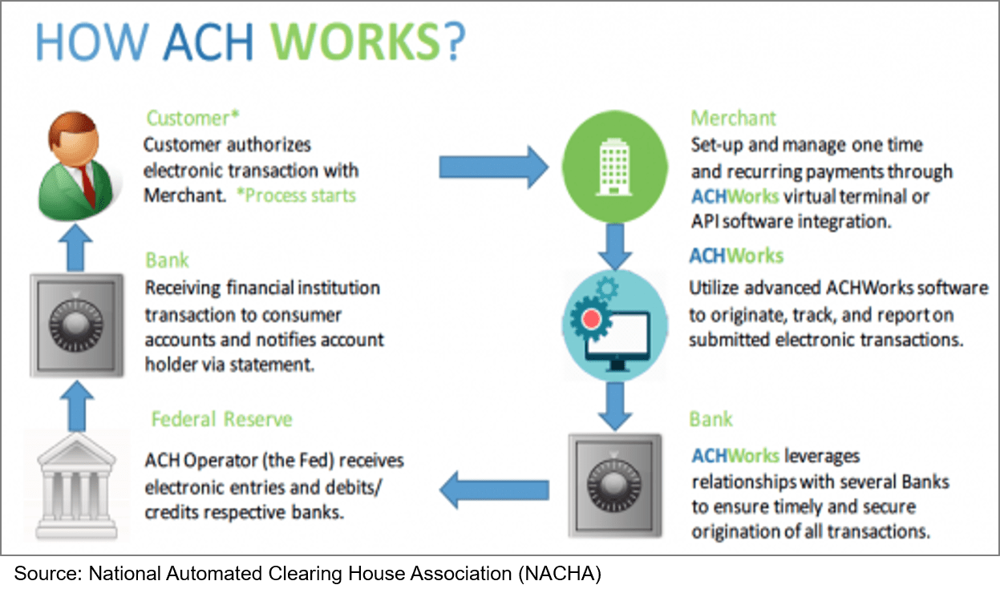

In today’s fast-paced financial world, efficient management of accounts and investments is crucial for traders and investors. As the financial markets grow more complex, the ability to move assets swiftly and accurately between accounts becomes increasingly necessary. The Automated Customer Account Transfer Service (ACATS) plays a pivotal role in facilitating these transfers. Developed by the National Securities Clearing Corporation (NSCC), ACATS stands out as a vital tool in the seamless transition of assets across brokerage accounts. It streamlines the procedures involved in transferring various securities, thereby saving significant time and cost compared to manual alternatives.

The influence of ACATS extends beyond mere operational efficiency; it significantly impacts algorithmic trading, a method of trading that uses complex algorithms to optimize trading strategies. In a landscape where milliseconds can make a difference in profitability, the ability to transfer accounts efficiently without interruptions becomes indispensable. Consequently, ACATS is not only a means of asset transfer but also a catalyst for broader market strategies and innovations in trading technology.



Understanding ACATS and its functionalities is essential for both individual investors and institutional players looking to maintain a competitive edge. As we explore ACATS's detailed workings and its role in various financial dynamics, the significance of such systems becomes evident in sustaining the fluidity and efficiency of modern financial markets.

## Table of Contents

## Understanding ACATS

The Automated Customer Account Transfer Service (ACATS) is an essential system developed by the National Securities Clearing Corporation (NSCC) to streamline the transfer of securities between brokerage accounts. This innovative service was introduced to address the inefficiencies of manual transfers, which were often time-consuming and prone to errors. By automating the process, ACATS facilitates the seamless transfer of various types of investment products, including stocks, bonds, mutual funds, and other financial instruments.

The core advantage of ACATS lies in its ability to reduce transfer times significantly. Before ACATS, manual transfers required a considerable amount of paperwork, coordination, and verification between entities. This often resulted in delays, with transfers taking several weeks to finalize. However, with the implementation of ACATS, the transfer process is expedited, typically being completed within three to six business days. This efficiency is achieved by automating the communication and processing steps involved in asset transfers.

Moreover, ACATS lowers the costs associated with account transfers. Manual processes invariably involve higher operational costs due to the manpower and resources needed to handle complex paperwork and verification tasks. By contrast, the automation provided by ACATS minimizes these expenses, leading to cost savings for both brokerage firms and their clients. Additionally, automation significantly reduces the potential for human error, thus increasing the reliability and accuracy of transfers. Mistakes in manual processing can be costly and time-consuming to correct, but the standardized procedures within ACATS ensure a more transparent and error-free transfer experience.

In conclusion, ACATS stands out as a pivotal development in the world of securities trading, enabling investors and traders to manage their accounts and assets with greater efficiency and confidence. The streamlined process introduced by ACATS not only facilitates faster transfers but also enhances overall effectiveness in asset management across the financial sector. As a result, it supports the evolving needs of the investing community by ensuring their investment transfers are handled swiftly and precisely.

## How ACATS Works

The Automated Customer Account Transfer Service (ACATS) functions by coordinating asset transfers between brokerage accounts, ensuring efficiency and accuracy. The transfer process begins with the receiving brokerage firm, which initiates the action upon receiving a completed transfer instruction form from the client. This form officially requests the movement of assets and requires the client’s signature to authorize the transaction.

Once the receiving firm obtains the transfer document, it forwards a request to the delivering firm, which currently holds the client's assets. The delivering firm is tasked with verifying the client’s details to ensure accuracy and legitimacy of the transfer. Verification involves confirming account details and asset specifics to prevent errors and potential fraud.

After verification, the delivering firm communicates its acceptance of the transfer request back to the receiving firm. This marks the initiation of the actual transfer process within the ACATS framework. Typically, ACATS manages to complete the transfer of assets within three to six business days. This timeline is largely dependent on the efficiency and responsiveness of the participating firms, as well as the specific assets involved in the transfer.

The ACATS system’s structured process allows for the smooth transition of assets, minimizing manual intervention and significantly reducing the likelihood of errors. By utilizing streamlined channels for communication and verification, ACATS ensures that asset transfers are handled with precision and reliability, allowing clients to seamlessly manage their investments across different brokerage firms.

## Securities Eligible and Ineligible for ACATS

The Automated Customer Account Transfer Service (ACATS) is designed to facilitate the efficient transfer of various financial assets between brokerage accounts. It supports the transfer of several types of securities, ensuring flexibility and ease for investors. Eligible assets that can be transferred through ACATS include publicly traded stocks, exchange-traded funds (ETFs), bonds, and cash. Additionally, most mutual funds are eligible for transfer, providing broad support for investors’ diversified portfolios. Certificates of deposit (CDs) from banks that are members of the National Securities Clearing Corporation (NSCC) may also be included in the transfer process, further enhancing the system's applicability.

On the other hand, there are specific types of securities that cannot be transferred using ACATS. Annuities, which are often complex insurance products designed for retirement income, are excluded from ACATS transfers. Certain proprietary investments, which may include custom or firm-specific financial products, are also ineligible. Furthermore, some over-the-counter (OTC) products cannot be moved via the ACATS system. The ineligibility of these securities is often due to the lack of standardization or the bespoke nature of the investment products, which present challenges to streamlined automation.

Understanding the scope of eligible and ineligible securities is vital for investors aiming to maximize the utility of ACATS for efficient portfolio management and seamless brokerage transitions. This knowledge empowers investors to make informed decisions when planning asset transfers, ensuring compliance with ACATS guidelines and avoiding unnecessary delays or complications.

## Role in Algorithmic Trading

Algorithmic trading involves the use of computer programs to execute trades at speeds and frequencies that are impossible for human traders. This type of trading relies heavily on the swift transfer of assets, which is essential for minimizing downtime and maintaining the integrity of complex, automated trading strategies. The Automated Customer Account Transfer Service (ACATS) is integral to this process, providing the infrastructure necessary for the automated, seamless transfer of securities across brokerage accounts.

The ACATS system ensures that algorithmic traders can change their brokerage accounts without significant interruptions or delays, which can be crucial for preserving trading algorithms that depend on uninterrupted access to market conditions. Given that [algorithmic trading](/wiki/algorithmic-trading) often involves executing a large number of trades across multiple market scenarios, any delay in the transfer of necessary assets could result in missed opportunities or financial losses.

For algorithmic traders, the automation provided by ACATS offers several advantages. Firstly, it reduces the time required for transferring assets, as the process typically concludes within three to six business days. This efficiency contrasts sharply with manual transfer processes, which can be fraught with errors and delays, potentially taking weeks to finalize. By minimizing these delays, algorithmic traders can optimize their strategies, ensuring they remain flexible and responsive to market fluctuations.

In practice, algorithmic trading involves a significant amount of data processing, with traders continuously adjusting their algorithms based on real-time data inputs. The following example in Python demonstrates a simplistic algorithmic approach to determining trade signals, emphasizing the importance of timely data:

```python
import numpy as np

def generate_trade_signals(prices, short_window, long_window):
    # Compute moving averages
    signals = np.zeros(len(prices))
    short_moving_avg = np.convolve(prices, np.ones(short_window) / short_window, mode='valid')
    long_moving_avg = np.convolve(prices, np.ones(long_window) / long_window, mode='valid')

    # Generate signals based on moving average crossover
    signals[(short_moving_avg > long_moving_avg)[:-1]] = 1
    signals[(short_moving_avg < long_moving_avg)[:-1]] = -1

    return signals

# Example price data and window sizes
prices = np.array([100, 102, 104, 103, 105, 107, 110, 108, 107, 111, 115])
short_window = 3
long_window = 5

signals = generate_trade_signals(prices, short_window, long_window)
print(signals)
```

In this code, trade signals are generated based on the crossover of moving averages of asset prices. Efficient transfer systems like ACATS ensure that the underlying assets can quickly be moved between accounts as dictated by such algorithmic strategies, allowing traders to act swiftly on generated signals.

Overall, the role of ACATS in algorithmic trading highlights its importance in the modern financial landscape. By providing a rapid and reliable transfer mechanism, it enables algorithmic traders to maintain optimal performance, adapt quickly to new trading environments, and sustain their strategic advantages in competitive markets.

## Benefits of Using ACATS

The Automated Customer Account Transfer Service (ACATS) presents significant advantages primarily through its efficiency. This system streamlines the traditionally cumbersome process of transferring securities between brokerage accounts, reducing a time-consuming task to a matter of days. In contrast to manual methods, which can be arduous and error-prone, ACATS automates the transfer process. This automation ensures accuracy and reliability, crucial factors in financial transactions where precision is paramount.

The efficiency of ACATS stems from its ability to minimize human errors, which are more prevalent in manual transfer processes. By eliminating the need for manual intervention in most steps, ACATS reduces the risk of common errors such as incorrect account numbers or miscommunication between brokerage firms. This reduction in errors leads to more reliable asset transfers, fostering trust among customers and reducing the time firms must spend on rectifying mistakes.

Moreover, ACATS enhances transparency in the transfer process. Both brokerage firms and customers benefit from a clear view of the transfer status at various stages. This visibility helps in aligning expectations and preparing for subsequent financial activities, effectively reducing stress and uncertainty for all parties involved.

The system also promotes a seamless experience for customers seeking to move assets. By drastically reducing transfer times, customers can more rapidly adapt to new opportunities or changes in their financial strategies. This capability is particularly beneficial in a fast-paced financial environment where the ability to react promptly to market changes can be a substantial advantage.

In conclusion, ACATS provides significant benefits by improving the speed, accuracy, and transparency of asset transfers. Its automated processes serve as a robust solution for modern brokerage firms and investors, supporting efficient financial operations and enhancing customer satisfaction.

## Challenges and Limitations

The Automated Customer Account Transfer Service (ACATS) has undeniably streamlined securities transfers, but it is not devoid of challenges and limitations. One primary limitation concerns the eligibility of certain securities. While ACATS accommodates a wide array of assets, including publicly traded stocks, ETFs, and most mutual funds, it cannot process transfers for specific securities. For instance, annuities, certain proprietary investments, and some over-the-counter (OTC) products are not eligible for transfer through ACATS. This restriction poses a limitation for investors who hold such securities, as they must seek alternative methods for transferring these assets.

Another significant limitation involves the fees that may be incurred during asset transfers. Some brokerage firms charge clients fees for using ACATS to move their accounts. These fees can vary significantly depending on the brokerage, potentially impacting an investor's decision to transfer accounts, especially if the asset [volume](/wiki/volume-trading-strategy) is substantial or the transfer involves multiple accounts.

Understanding these challenges is critical for investors and traders. Being aware of the ineligible securities ensures that individuals do not encounter unexpected hurdles during an account transfer. Meanwhile, awareness of potential fees allows investors to make informed decisions regarding the cost-effectiveness of transferring their accounts through ACATS. By recognizing these limitations, stakeholders can more effectively utilize ACATS, optimizing their asset management strategies and maintaining seamless investment transitions.

## Impact on the Financial Industry

The Automated Customer Account Transfer Service (ACATS) has profoundly influenced the financial industry by enhancing the mobility and flexibility offered to investors. This system allows investors to smoothly transition their assets between brokerage accounts, fostering a competitive environment among brokerage firms. By mitigating the complexities traditionally associated with manual transfers, ACATS empowers investors to leverage diverse brokerage services, tailored to their specific needs, ultimately enhancing customer satisfaction levels.

A primary contribution of ACATS to the financial markets is the increased efficiency and robustness it provides. By enabling seamless asset management and facilitating strategic account transitions, ACATS reduces the friction that can often deter investors from moving their portfolios. This reduction in friction is critical as it supports investor empowerment, allowing investors to realign their portfolios quickly in response to market dynamics.

For example, suppose an investor wants to respond swiftly to emerging market trends by reallocating assets from underperforming funds to more promising sectors. With ACATS, such reallocations are executed with minimal delay, ensuring that investors can take advantage of timely opportunities without significant interruption to their investment strategy.

Additionally, the system's integration with other financial technologies has forward-looking implications for the market's evolution. The process automation that ACATS provides is crucial in adapting to the modern demands of algorithmic and high-frequency trading, where the speed and accuracy of transactions are paramount. As financial markets continue to evolve towards more technologically driven ecosystems, efficient systems like ACATS are indispensable.

Moreover, the availability of ACATS facilitates better risk management and compliance for brokerage firms. By automating the transfer process, the chances of errors, including incorrect data entries or asset misallocations, are significantly minimized. This reliability not only protects the integrity of individual investor accounts but also supports the broader financial market's stability.

In summary, ACATS impacts the financial industry by promoting a more dynamic and responsive market environment. It enhances brokerage competitiveness, improves investor satisfaction through greater flexibility, and reinforces market resilience and efficiency through reliable asset management processes. As financial markets continue to innovate and grow, ACATS will remain a key component in shaping their future.

## Conclusion

In conclusion, ACATS is a fundamental system within the modern financial landscape, providing an essential backbone for the efficient transfer of customer accounts. This automated system significantly reduces the complexity, time, and error associated with moving various types of securities between brokerage firms, thus supporting both individual and institutional investors in executing their strategies with greater precision and speed. As technology and finance continue to converge and evolve, infrastructure like ACATS will be vital in maintaining and enhancing market dynamics. It ensures that investors can adapt swiftly to changing conditions and seize new opportunities across different platforms, thereby sustaining and promoting flexibility and competitiveness in the financial industry.

## References & Further Reading

[1]: National Securities Clearing Corporation. ["Automated Customer Account Transfer Service (ACATS)"](https://www.finra.org/rules-guidance/key-topics/customer-account-transfers)

[2]: Chan, Ernest P. ["Quantitative Trading: How to Build Your Own Algorithmic Trading Business"](https://github.com/ftvision/quant_trading_echan_book) John Wiley & Sons, Inc.

[3]: Lopez de Prado, Marcos. ["Advances in Financial Machine Learning"](https://www.amazon.com/Advances-Financial-Machine-Learning-Marcos/dp/1119482089) John Wiley & Sons.

[4]: Aronson, David. ["Evidence-Based Technical Analysis: Applying the Scientific Method and Statistical Inference to Trading Signals"](https://www.amazon.com/Evidence-Based-Technical-Analysis-Scientific-Statistical/dp/0470008741) John Wiley & Sons.

[5]: Jansen, Stefan. ["Machine Learning for Algorithmic Trading"](https://github.com/stefan-jansen/machine-learning-for-trading) Packt Publishing.

[6]: Securities and Exchange Commission. ["Investor Bulletin: Transferring Your Investment Account"](https://www.investor.gov/introduction-investing/general-resources/news-alerts/alerts-bulletins/investor-bulletins-79)

[7]: Financial Industry Regulatory Authority. ["Transferring Accounts from One Brokerage to Another: Understanding the Process"](https://www.finra.org/rules-guidance/key-topics/customer-account-transfers)