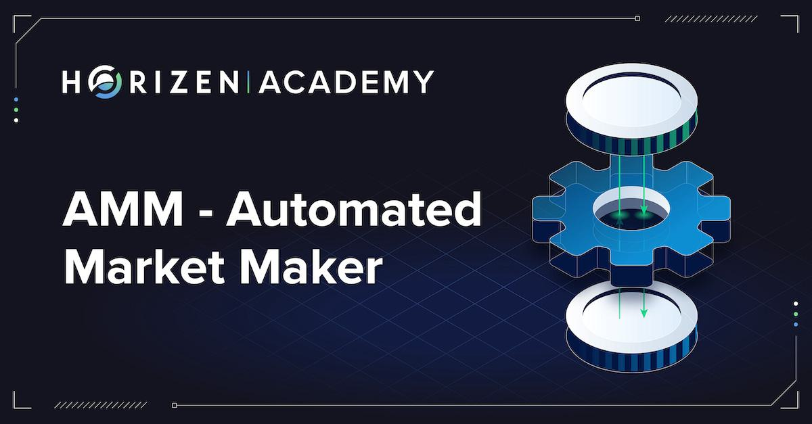

Automated market makers (AMMs) represent a paradigm shift in the cryptocurrency trading landscape, emerging as a core component of decentralized finance (DeFi). In contrast to traditional financial markets, which rely on the matching of buy and sell orders, AMMs utilize liquidity pools to facilitate continuous trading. This mechanism ensures that markets remain liquid, even in the absence of formal exchanges. Liquidity pools consist of cryptocurrency reserves deposited by users and are governed by smart contracts. These smart contracts execute trades in a permissionless and automated fashion, offering traders more autonomy and reduced costs.

AMMs operate on the principle of providing liquidity through these pools rather than matching individual buyers with sellers. By employing mathematical formulas—such as the widely recognized constant product formula $x \cdot y = k$—AMMs determine the pricing of assets within the pool. This formula maintains a balance between two tokens $x$ and $y$, ensuring that their product remains constant ($k$) as trading occurs, and automatically adjusts prices based on supply and demand.

The innovative approach of AMMs transforms the trading experience into one that democratizes access, allowing anyone to participate as a liquidity provider. This lowers barriers to entry significantly compared to traditional exchanges that often involve more centralized control and higher fees. Furthermore, the decentralized nature of AMMs aligns with the principles of DeFi, granting users greater control over their assets without intermediaries.

This article will explore the role of AMMs within algorithmic trading. It will examine the mechanisms that drive their operation, analyze the various AMM platforms and their unique characteristics, and assess the influence of AMMs on the broader crypto ecosystem. Through this exploration, the impact of AMMs on fostering a flexible, decentralized trading environment will be highlighted, alongside their potential future developments and challenges.

## Table of Contents

## How Automated Market Makers Work

Automated market makers (AMMs) operate by utilizing liquidity pools—collections of tokens deposited by users. These pools form the backbone of AMM systems, enabling decentralized trading without the reliance on order books. Instead, AMMs employ predefined mathematical formulas to determine asset prices within the pools. A common formula used in AMMs is $x \times y = k$, where $x$ and $y$ represent the quantities of two different tokens in the pool, and $k$ is a constant value. This formula ensures that the product of the quantities remains unchanged, facilitating price dynamics as traders execute trades.

Traders interact directly with these liquidity pools, exchanging one token for another based on the pool's algorithm. This interaction process eliminates the need for traditional buy/sell order matching systems. Instead, the price of a token in a pool is influenced by the ratio of tokens present, automatically adjusting based on the volume of tokens being swapped. As tokens are traded, their quantities in the pool change, and the price is correspondingly updated by the AMM’s algorithm. 

This arrangement leads to a more efficient trading environment, where token swaps occur seamlessly and continuously, enhancing market [liquidity](/wiki/liquidity-risk-premium). It also democratizes access to trading by allowing anyone to participate as a liquidity provider, thereby fostering a wider participation in the ecosystem. Through these mechanisms, AMMs offer a streamlined and more accessible approach to trading within the decentralized finance landscape.

## Key Advantages of AMMs

Automated market makers (AMMs) offer distinct advantages that have propelled their adoption in the decentralized finance (DeFi) sector. One of their primary benefits is the provision of continuous liquidity, which facilitates the trading of a wide array of [cryptocurrency](/wiki/cryptocurrency) pairs, including those that are less popular. This capability is fundamentally different from traditional markets, where liquidity often depends on the presence of buyers and sellers. In AMMs, liquidity pools ensure that trades can occur at any time, thereby maintaining market fluidity.

Moreover, AMMs democratize access to financial trading by enabling anyone to become a liquidity provider. This is accomplished by allowing individuals to contribute their assets to liquidity pools and earn a portion of the trading fees generated by the platform. This contrasts with conventional financial systems, where liquidity provision is typically limited to large institutions. The reduced entry barriers in AMMs are often complemented by lower fees compared to traditional exchanges, making them an attractive option for a broader audience.

Decentralization is a cornerstone of AMMs, eliminating the need for central intermediaries and allowing users to retain greater control over their assets. This decentralized nature aligns with the broader blockchain ethos, promoting transparency and reducing the risk associated with centralized control. In a decentralized framework, users engage directly with smart contracts, ensuring that transactions are executed autonomously and securely.

AMMs play a pivotal role in driving the growth of DeFi by facilitating diverse financial products, including yield farming and synthetic assets. These platforms effectively minimize transaction costs and foster an environment conducive to financial innovation. As AMMs evolve, they continue to support a wide range of financial activities, reinforcing their status as a vital component of the decentralized finance ecosystem. Through continuous advancements, AMMs enhance not only liquidity and accessibility but also the overall efficiency of financial systems.

## Popular AMM Platforms and Variations

Several notable Automated Market Makers (AMMs) have significantly influenced the landscape of decentralized finance (DeFi), each introducing unique features and innovations. Among the most prominent AMMs are Uniswap, SushiSwap, PancakeSwap, and Balancer, which have collectively reshaped how digital assets are traded on blockchain networks.

Uniswap stands out for pioneering the constant product formula approach, represented by the equation $x \times y = k$. This formula ensures that the product of the quantities of two tokens in a liquidity pool remains constant, which inherently adjusts the token prices based on supply and demand within the pool. Uniswap's simple yet effective model has set a benchmark for the development of subsequent AMMs, offering a streamlined and automated trading process without the need for traditional order [books](/wiki/algo-trading-books).

SushiSwap, a notable fork of Uniswap, expanded on the initial concept by incorporating community governance and incentive mechanisms to reward active participants. This platform attracted users by offering additional benefits, such as yield farming opportunities, thereby enhancing user engagement and liquidity provision.

PancakeSwap, operating on the Binance Smart Chain, optimizes for lower transaction fees compared to Ethereum-based AMMs. It supports a variety of yield farming and staking options, appealing to users seeking cost-efficient transactions and diverse investment opportunities. PancakeSwap's gamification features, such as lotteries and prediction markets, further differentiate it within the AMM ecosystem.

Balancer introduces a versatile approach by allowing more dynamic pool configurations, accommodating up to eight different assets within a single pool. Unlike the constant product formula, Balancer pools use a generalized AMM formula that accounts for the specific weight of each asset, enabling greater flexibility and control over the liquidity distribution.

Additionally, Curve distinguishes itself by specializing in the trading of stablecoins. It employs an efficient and low-slippage AMM model optimized for assets with small price variances. Curve's focus on stablecoins supports high-[volume](/wiki/volume-trading-strategy) trades with minimal fees, making it an essential platform for users aiming to swap stable assets efficiently.

The diversity among these AMM platforms underscores their critical role as flexible solutions tailored to various trading and liquidity needs within the DeFi ecosystem. Each platform's distinct approach contributes to the robustness and adaptability of decentralized trading, facilitating broader participation and innovation in the financial sector.

## Challenges and Future Prospects

Automated Market Makers (AMMs) have brought transformative changes to cryptocurrency trading, yet they are not devoid of challenges. One of the foremost issues faced by AMMs is impermanent loss. This occurs when liquidity providers supply assets to a pool, leading to potential losses when the prices of those assets fluctuate. The difference between the value of the assets had they been held outside the pool versus inside is termed impermanent loss. This risk is particularly pronounced in volatile markets where the price changes rapidly.

To mitigate the risks associated with impermanent loss, ongoing innovations in AMM design are focusing on aspects like dynamic fee structures and more sophisticated algorithms for asset pool balancing. Such measures aim to adjust trade fees based on [volatility](/wiki/volatility-trading-strategies), thereby providing better coverage for liquidity providers. Another focus area is enhancing interoperability across various blockchain networks, a necessary step for AMMs to support fiat-crypto trading more effectively. This is crucial for creating seamless trading experiences that integrate traditional financial assets with cryptocurrencies.

The future prospects for AMMs are promising, driven by their ability to integrate more diverse assets and introduce new trading features. Many AMMs are looking into incorporating derivatives and complex financial instruments, which would broaden the range of available trading options within decentralized finance (DeFi). Moreover, strengthening collaborations with other DeFi protocols is on the agenda for many AMM platforms, aiming to create a cohesive and expansive DeFi ecosystem.

As the DeFi space continues to grow and mature, AMMs are expected to play a pivotal role in advancing financial decentralization and empowering global users. AMMs create avenues for markets that are more inclusive and transparent, aligning with the core principles of blockchain technology. Furthermore, the ongoing evolution of smart contracts and blockchain technologies is likely to provide AMMs with more robust tools, enhancing their functionality and reliability.

The trajectory of AMMs points towards an increasingly integrated financial system where accessibility, efficiency, and decentralization are the norm. In such a landscape, AMMs will not only facilitate enhanced asset liquidity but also contribute to the democratization of global financial systems.

## Conclusion

Automated market makers (AMMs) have revolutionized the cryptocurrency trading landscape by introducing a seamless and decentralized method for the exchange of assets. Departing from the traditional reliance on intermediary infrastructures and centralized exchanges, AMMs employ liquidity pools driven by smart contracts to facilitate trades. This innovative mechanism not only ensures continuous market liquidity but also democratizes access to financial markets, reflecting the decentralized principles at the core of blockchain technology.

AMMs stand out by enabling any user to contribute to liquidity pools, removing the barriers that typically prevent individuals from participating in traditional financial systems. This democratization fosters a more inclusive market environment, offering reduced transaction costs and barriers to entry. These platforms typically use formulaic price discovery methods, such as the widely-adopted constant product formula illustrated by 'x * y = k', which efficiently determines trading ratios and asset pricing without relying on conventional order books.

As the DeFi ecosystem progresses, AMMs are poised to remain crucial to its expansion and maturation. Their inherent decentralization ensures they align with the principles of security and user autonomy that are fundamental to blockchain technology. Furthermore, as advancements continue, AMMs hold promise for creating financial systems that are more inclusive, transparent, and efficient, potentially integrating broader asset classes and enhancing cross-protocol functionality.

In summary, automated market makers have transformed crypto trading from a centralized, gatekeeper-driven arena to a more autonomous and accessible marketplace. With technological evolution and growing adoption, AMMs are expected to bolster the DeFi sector's growth, paving the way for a future where financial inclusivity and efficiency become the new norm.

## References & Further Reading

[1]: Adams, H., Zinsmeister, T., & Robinson, D. (2020). [Uniswap v2 Core](https://app.uniswap.org/whitepaper.pdf). Uniswap. 

[2]: Egorov, M. (2019). [StableSwap - Efficient Mechanism for Stablecoin Liquidity.](https://curve.fi/files/stableswap-paper.pdf) Curve Finance.

[3]: Koppel, J., & Randall, D. (2020). ["The Comprehensive Guide to Crypto Finance: Understanding the Role of AMMs in Decentralized Finance."](https://clustrmaps.com/person/Leon-dqvhui) Forbes.

[4]: Zamfir, V. (2018). ["What Are Automated Market Makers?"](https://beincrypto.com/learn/amm-explained/) Medium.

[5]: Buterin, V. (2020). ["On AMM Mechanisms."](https://www.blockchainlab.com/pdf/Ethereum_white_paper-a_next_generation_smart_contract_and_decentralized_application_platform-vitalik-buterin.pdf) Vitalik Buterin's Blog.