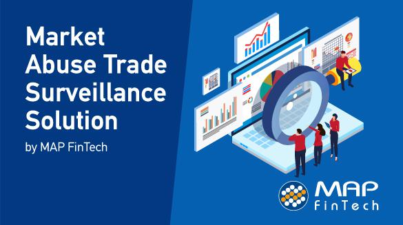

In today's financial markets, algorithmic trading has become a dominant force. This approach leverages sophisticated computer algorithms to execute trades at remarkable speeds and volumes, fundamentally transforming how trading occurs. However, the rapid ascent of algorithmic trading brings new challenges, primarily related to market integrity and the safeguarding of investor interests. The landscape now necessitates advanced systems and methodologies to monitor and manage trading activities effectively.

Automated trade surveillance systems have emerged as critical tools in this context. These systems are designed to ensure transparency and uphold the integrity of financial markets by detecting and analyzing potential market abuses and anomalous trading behavior. Their importance cannot be overstated as they offer the capability to oversee vast amounts of trading data, identifying patterns and activities that might signify fraudulent or manipulative practices.



The integration of artificial intelligence (AI) in these surveillance systems marks a significant advancement in trade monitoring capabilities. AI technologies, including machine learning and neural networks, provide the adaptability and scope necessary to navigate the complexities of modern financial markets. These technologies enable more precise monitoring, as they can learn and adapt to new threats more efficiently than traditional systems, greatly improving their effectiveness.

The focus of this article is to examine the intersection of automated trade surveillance and AI, exploring how these systems are revolutionizing trade monitoring capabilities. We will examine the advantages, the obstacles that need to be addressed, and the future direction of AI-enhanced trade surveillance in the evolving domain of algorithmic trading. As technological advancements continue to reshape financial markets, understanding and implementing robust surveillance mechanisms are imperative for maintaining market stability and investor trust.

## Table of Contents

## The Need for Automated Trade Surveillance

Automated trade surveillance has become an essential component in maintaining market integrity and ensuring investor confidence in today's fast-paced financial markets. The traditional rule-based systems, while functional to an extent, suffer from significant limitations. These systems are often inflexible, making it challenging to adapt to emerging threats and sophisticated trading strategies. As a result, the reliance on static rules often leads to the generation of false alarms, which can overwhelm compliance teams and dilute focus from genuine threats.

The high-frequency nature of algorithmic trading adds an additional layer of complexity to trade surveillance efforts. With trades occurring in microseconds, traditional methods struggle to process and analyze the vast amounts of data generated across multiple markets. This scenario necessitates more advanced solutions capable of managing the speed and volume inherent in modern trading practices. 

Moreover, the dynamic nature of financial markets introduces a host of unpredictable variables and potential systemic risks. Market manipulation tactics, such as spoofing and layering, are becoming increasingly sophisticated, demanding surveillance systems that can quickly identify and adapt to new patterns of abuse. These complexities underline the critical need for advanced technologies that can provide real-time insights and adjustments to protect the market's integrity robustly.

The introduction of AI and [machine learning](/wiki/machine-learning) into the trade surveillance arena holds promise for addressing these challenges. By moving beyond fixed, rule-based approaches, AI-driven systems offer the potential for a more nuanced understanding of trading behaviors, thereby enhancing the ability to detect and mitigate market manipulation effectively. As financial markets continue to evolve, ensuring that trade surveillance keeps pace with these changes is vital to safeguarding the stability and fairness of global trading environments.

## AI and Machine Learning in Trade Surveillance

AI and machine learning have significantly enhanced trade surveillance by providing tools that are both dynamic and adaptable. These technologies have emerged as crucial components in monitoring trading activities, allowing financial institutions to identify irregular patterns and potential market manipulation more effectively. The application of AI and machine learning in this context facilitates a more nuanced analysis of trade data, beyond what traditional surveillance systems can achieve.

One of the primary advantages of AI and machine learning is their ability to analyze vast amounts of data efficiently. This capability is critical in financial markets where data is generated at high velocity and [volume](/wiki/volume-trading-strategy). AI-driven models enable real-time monitoring by processing complex datasets rapidly, which is essential for timely detection and response to suspicious trading activities. Machine learning algorithms can automatically learn from data patterns, continuously improving their accuracy and reducing the rate of false positives that typically burden rule-based systems.

The ability to uncover hidden patterns is another significant benefit of AI and machine learning in trade surveillance. Traditional methods often struggle with detecting sophisticated manipulation tactics that do not conform to predefined rules. In contrast, machine learning models can identify unusual patterns and behaviors by analyzing correlations and trends within the data. This enhances compliance efforts by providing a more comprehensive understanding of trading activity and potentially unlawful practices.

Moreover, AI and machine learning provide enhanced decision-making capabilities. By integrating predictive analytics, these technologies enable the development of models that not only detect anomalies but also anticipate future market behaviors. This predictive capability is invaluable for proactive risk management and ensures that regulatory measures are not only reactive but also preventative.

To implement these solutions effectively, a variety of machine learning techniques can be employed. For instance, unsupervised learning algorithms, such as clustering and anomaly detection models, are popular for identifying unseen patterns and relationships in the data without predefined labels. Similarly, supervised learning models can be trained on historical data to predict potential violations. Python, with its robust libraries such as Scikit-learn and TensorFlow, serves as a powerful tool for developing these machine learning models:

```python
from sklearn.ensemble import IsolationForest
import numpy as np

# Sample data
trade_data = np.array([[10, 20], [15, 25], [5, 30], [1000, 2000], [12, 22]])

# Initialize Isolation Forest for anomaly detection
model = IsolationForest(contamination=0.1)
model.fit(trade_data)

# Predict anomalies
anomalies = model.predict(trade_data)

print(anomalies)
```

In this context, models such as the Isolation Forest can be utilized to detect outliers in transaction data that may indicate market manipulation. The rapid processing and predictive accuracy offered by such AI-driven approaches present a powerful advancement in trade surveillance, enhancing both efficiency and reliability in oversight functions.

## Benefits and Challenges of AI-Powered Surveillance

The integration of [artificial intelligence](/wiki/ai-artificial-intelligence) (AI) in trade surveillance systems offers numerous benefits, prominently in the enhancement of detecting complex trading patterns and optimizing operational efficiency. AI models are adept at analyzing vast and intricate datasets, thereby identifying nuanced trading behaviors that might elude traditional systems. This capability is particularly beneficial in [algorithmic trading](/wiki/algorithmic-trading) environments, where market manipulations can be subtle and require detailed scrutiny. The advent of AI tools facilitates not only the detection of these sophisticated behaviors but also enables a considerable reduction in the manual effort required for trade monitoring, thus substantially cutting down on operational costs.

Despite these advantages, the implementation of AI in trade surveillance is not without challenges. Model explainability remains a significant hurdle; stakeholders often struggle to comprehend how AI algorithms arrive at specific decisions. This opacity can lead to distrust among users and regulatory bodies, emphasizing the need for transparency in AI processes. Additionally, integrating diverse data sources into AI models is another complex task. Financial markets produce data at high velocity and in varying formats, making seamless data integration a challenging yet crucial requirement for effective AI deployment in trade surveillance.

Ensuring compliance with existing and emerging regulatory frameworks is critical but challenging for firms using AI-driven surveillance. The adaptability and learning capabilities of AI can outpace regulations, creating a gap between existing rules and AI applications. Therefore, establishing a trustworthy AI framework is essential. This involves setting clear objectives for AI systems, ensuring they align with regulatory goals, and maintaining adequate human oversight to monitor AI-driven decisions. By doing so, firms can harness the full potential of AI while remaining compliant with regulatory standards.

## Current Regulatory Landscape

Financial regulators are increasingly focusing on ensuring stable and trustworthy AI deployment in market practices. As algorithmic trading and AI-powered surveillance technologies continue to evolve, regulatory bodies like the U.S. Securities and Exchange Commission (SEC) and the Commodity Futures Trading Commission (CFTC) have implemented regulations designed to bolster the integrity of financial markets.

The SEC has established a comprehensive framework requiring detailed disclosure, robust risk management practices, and thorough oversight to mitigate risks associated with algorithmic trading. These rules cover a wide spectrum, from ensuring the operational resilience of trading systems to mandating the disclosure of significant market risks and trading strategies. Emphasizing transparency, the SEC requires detailed record-keeping and reporting mandates which ensure that firms using AI in trade surveillance can demonstrate compliance through audit trails and documentation.

Similarly, the CFTC has developed regulations targeting the security and reliability of automated trading systems, particularly in derivatives markets. By enforcing strict guidelines on systems' safety, risk mitigation, and the prevention of disruptive trading activities, the CFTC aims to preserve market stability. Regulations emphasize the importance of pre-trade functionality testing and post-trade analysis to identify systemic risks promptly—essential measures for firms utilizing AI-driven surveillance technologies.

Navigating these regulatory expectations is imperative for firms both eager and obligated to align AI applications with compliance standards. Companies must integrate comprehensive risk management controls, ensuring that their AI systems provide traceable, transparent outputs that align with SEC and CFTC requirements. This entails implementing rigorous data validation protocols, systematic stress testing of AI models, and regular audits to ensure systems remain compliant with evolving regulatory demands.

In summary, the regulatory landscape for AI in trade surveillance is characterized by a focus on transparency, risk management, and system integrity. By adhering to these regulatory frameworks, firms can leverage AI technologies effectively while ensuring adherence to legal standards and maintaining investor confidence.

## The Future of Trade Surveillance

The future of trade surveillance is contingent upon sustained collaboration between technology firms and regulatory bodies, focusing on the refinement of AI models. This synergy is critical for developing systems that are adept at identifying sophisticated and evolving trading patterns. As these partnerships evolve, there is an emphasis on enhancing AI-driven models through continuous learning and adaptation, a process that is vital for addressing new market threats and meeting stringent regulatory requirements.

The successful implementation of AI in trade surveillance requires adaptive systems that can learn from a continuous influx of data. For instance, machine learning algorithms should be capable of evolving in response to newly acquired data, ensuring that the systems remain responsive to novel forms of market manipulation. Incorporating advanced learning techniques, such as [reinforcement learning](/wiki/reinforcement-learning), could further enhance the predictive capabilities of these models, allowing them to make more informed decisions.

The integration of AI in market oversight is anticipated to revolutionize the landscape of trade surveillance. By leveraging powerful data analytics and real-time processing capabilities, AI systems can offer unparalleled insights into market dynamics. This transformation is expected to render financial markets more secure and reliable, as enhanced surveillance mechanisms will be able to effectively deter fraudulent activities and ensure compliance with regulatory standards.

AI-driven trade surveillance systems are poised to redefine traditional approaches, making market oversight not only more efficient but also more proactive. As technology firms and regulatory agencies continue to refine AI technologies, stakeholders in the financial industry must prioritize the establishment of robust frameworks that allow for seamless integration of AI. This includes developing transparent AI models with clear objectives and incorporating human oversight to maintain accountability and ensure ethical use.

In conclusion, the future of trade surveillance lies in embracing AI technologies that offer dynamic and adaptive monitoring solutions. Through collaborative efforts and a commitment to continuous innovation, the financial markets can look forward to a future characterized by enhanced security, integrity, and reliability.

## Conclusion

Automated trade surveillance systems, bolstered by the integration of AI and machine learning, are essential components in the architecture of modern financial markets. These advanced technologies offer robust mechanisms for detecting and responding to suspicious trading activities, thereby enhancing overall market integrity and protecting investor interests. Despite the inherent challenges that accompany the integration of AI, such as issues of model explainability and maintaining compliance with evolving regulations, the advantages far outweigh the drawbacks. AI-driven surveillance systems have demonstrated an ability to significantly reduce operational costs while improving the detection of complex and potentially harmful trading behaviors, thereby adding layers of security to financial markets.

For stakeholders in the financial sector, the path forward involves fostering collaborative environments where robust frameworks can be developed. Such frameworks should emphasize transparency, adaptability, and rigorous adherence to regulatory standards to address the dynamic nature of evolving market threats. This approach not only ensures compliance but also facilitates the continuous learning and enhancement of AI models used in trade surveillance. As regulatory landscapes evolve, stakeholders must remain agile, actively engaging with technological advancements and regulatory updates to harness the full potential of AI in trade surveillance. By doing so, financial institutions can contribute to creating a more secure, transparent, and reliable market environment for participants globally.

## References & Further Reading

[1]: Aldridge, I. (2013). ["High-Frequency Trading: A Practical Guide to Algorithmic Strategies and Trading Systems"](https://www.wiley.com/en-us/High+Frequency+Trading%3A+A+Practical+Guide+to+Algorithmic+Strategies+and+Trading+Systems%2C+2nd+Edition-p-9781118343500) John Wiley & Sons.

[2]: De Prado, M. L. (2018). ["Advances in Financial Machine Learning"](https://archive.org/download/massimo_motta_competition_policy_theory_and_prabookfi-org/Marcos%20Lopez%20de%20Prado%20-%20Advances%20in%20Financial%20Machine%20Learning-Wiley%20%282018%29.pdf) Wiley.

[3]: Van Vliet, B. (2018). ["Algorithmic Trading: Winning Strategies and Their Rationale"](https://www.wiley.com/en-us/Algorithmic+Trading%3A+Winning+Strategies+and+Their+Rationale-p-9781118460146) Wiley Finance Series.

[4]: Cummings, J. R. (2017). ["The regulatory challenges of algorithmic trading and high-frequency trading"](https://academic.oup.com/book/27407/chapter/197229790) Journal of Risk Finance.

[5]: Hendershott, T., Jones, C. M., & Menkveld, A. J. (2011). ["Does Algorithmic Trading Improve Liquidity?"](https://onlinelibrary.wiley.com/doi/full/10.1111/j.1540-6261.2010.01624.x) The Review of Financial Studies, 24(8), 2245-2293.

[6]: Charitou, A., & Karamanou, I. (2018). ["AI in Finance"](https://onlinelibrary.wiley.com/doi/10.1111/jbfa.12286) World Scientific Book.