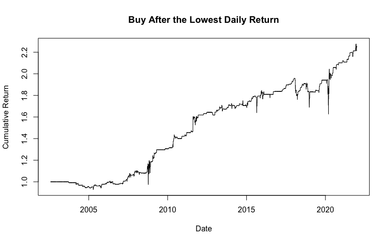

## Table of Contents

## What is automated trading?

Automated trading, also known as algorithmic trading, is a method of buying and selling financial assets using computer programs. These programs follow a set of rules and instructions to make trading decisions without human intervention. This means that once the trading software is set up, it can execute trades automatically based on the market conditions and the rules programmed into it.

People use automated trading because it can be faster and more efficient than trading manually. Computers can analyze large amounts of data quickly and can react to market changes almost instantly. This can help traders take advantage of opportunities that might be missed if they were trading by hand. However, automated trading also has risks, like technical failures or unexpected market events that the program might not handle well.

## What is edge analysis in trading?

Edge analysis in trading is about figuring out if a trading strategy gives you an advantage over other traders. It's like trying to see if your way of trading can make more money than just guessing or following the crowd. Traders use edge analysis to check if their strategies work better than just random picks in the market.

To do edge analysis, traders look at things like how often their strategy makes money, how big those profits are, and how much they might lose. They compare these numbers to what would happen if they just traded without any special plan. If their strategy does better, they say they have an "edge." This helps them decide if it's worth using their strategy or if they need to change it to do better in the market.

## How does automated trading use edge analysis?

Automated trading uses edge analysis to make sure its strategies are better than just guessing. The computer programs that do automated trading run lots of numbers and tests to see if their way of [picking](/wiki/asset-class-picking) trades will make more money than random choices. They look at things like how often they win, how much they win, and how much they might lose. If the computer finds that its strategy does better than random picks, it keeps using that strategy because it has an "edge."

This edge analysis helps the automated trading system keep getting better. The computer can keep trying different ways to trade and always check if the new way is better than the old one. If it finds a better way, it will start using that new strategy. This means the trading program can keep improving without needing people to change it all the time. By always looking for an edge, the automated trading system tries to stay ahead in the market.

## What are the basic components of an automated trading system?

An automated trading system has a few main parts that work together to make trades without people doing it by hand. The first part is the trading algorithm, which is like a set of rules the computer follows to decide when to buy or sell. This algorithm looks at things like price, how much the price is moving, and other market signs to make choices. The second part is the data feed, which gives the system all the information it needs about what's happening in the market right now. Without this, the system wouldn't know when to act.

The third part is the execution system, which actually makes the trades happen. Once the algorithm says it's time to buy or sell, the execution system sends the order to the market. It tries to do this as fast as possible to get the best price. The last part is the risk management and monitoring tools. These keep an eye on how the system is doing and can stop trading if things start going wrong. They help make sure the system doesn't lose too much money and keeps working well.

## What types of data are used in edge analysis for trading?

Edge analysis for trading uses different kinds of data to see if a trading strategy is better than just guessing. The main type of data is historical price data, which shows how prices have moved in the past. Traders look at this to see if their strategy would have made money before. They also use data about how much the price moves, called [volatility](/wiki/volatility-trading-strategies), to understand how risky their trades might be. Another important type of data is trading [volume](/wiki/volume-trading-strategy), which tells them how many people are buying and selling. This can help them see if their strategy works better when lots of people are trading or when it's quiet.

Besides these, traders also use data about other things happening in the market, like news and economic reports. This kind of data can affect prices a lot, so knowing about it helps traders see if their strategy can handle big changes. They might also look at data from other markets, like stocks, bonds, or commodities, to see if there are patterns that can help their strategy. By putting all this data together, traders can figure out if their way of trading gives them an edge over others.

## How can beginners start with automated trading edge analysis?

Beginners can start with automated trading edge analysis by first learning the basics of trading and how computers can help make trades. They should start by understanding what edge analysis means, which is checking if a trading strategy is better than just guessing. They can use simple tools like spreadsheets to look at past price data and see if their strategy would have made money before. It's important to keep things simple at first and not jump into complicated strategies right away. They can use free or low-cost trading platforms that have built-in tools for testing strategies.

As they get more comfortable, beginners can move on to using more advanced software that can run automated trading systems. These programs can do edge analysis automatically by looking at lots of data and testing different ways to trade. Beginners should start with small amounts of money to practice and see how their strategies work in real markets. It's also a good idea to keep learning and maybe join online groups where other traders share tips and ideas. By taking small steps and always checking if their strategy has an edge, beginners can slowly get better at automated trading.

## What are common strategies used in automated trading edge analysis?

One common strategy used in automated trading edge analysis is [trend following](/wiki/trend-following). This strategy looks at how prices have been moving and tries to make money by buying when prices are going up and selling when they are going down. The computer checks lots of past data to see if this way of trading would have worked before. If it sees that following trends made more money than guessing, it keeps using this strategy. This helps traders stay on the right side of big market moves and make money as prices keep going in one direction.

Another strategy is mean reversion, which is the opposite of trend following. Here, the computer looks for times when prices have moved too far away from their normal levels and bets that they will come back to those levels. For example, if a stock price goes way up but usually stays around a certain number, the computer might sell the stock, expecting it to go back down. By checking past data, the computer can see if this strategy gives an edge over just picking stocks randomly. Both trend following and mean reversion need the computer to do lots of math and tests to make sure they are better than guessing.

A third strategy is statistical [arbitrage](/wiki/arbitrage), which uses the computer's ability to look at many different things at once. This strategy tries to find small differences in prices between similar things, like two companies in the same business. The computer quickly buys the cheaper one and sells the more expensive one, hoping to make money as the prices get closer together. By running lots of tests on past data, the computer can see if this way of trading gives an edge. This strategy needs fast computers and lots of data to work well, but it can help traders make money from small price changes that others might not notice.

## What are the risks associated with automated trading edge analysis?

Automated trading edge analysis can be risky because it relies a lot on computers and past data. If the computer has a problem or the internet goes down, the trading system might stop working right when you need it most. Also, the past data the computer uses might not always be a good guide for what will happen next in the market. Things can change quickly, and what worked before might not work now. This means you could lose money if the market does something unexpected that your strategy wasn't ready for.

Another risk is that other traders might be using the same strategies as you. If everyone is trying to do the same thing, it can make the market move in ways that hurt your trades. Plus, automated trading can happen very fast, and sometimes the computer might make a mistake or trade too much, leading to big losses. It's important to always keep an eye on your trading system and be ready to step in if something goes wrong. Even though edge analysis can help you find good strategies, there's always a chance that things won't go as planned.

## How can one measure the effectiveness of an automated trading edge?

To measure how well an automated trading edge is working, you need to look at a few key things. First, you check how often your strategy makes money compared to how often it loses money. This is called the win rate. If your strategy wins more often than it loses, that's a good sign. You also need to see how much money you make when you win and how much you lose when you lose. If your wins are bigger than your losses, that helps too. Finally, you compare these numbers to what would happen if you just picked trades randomly. If your strategy does better than random picks, you know it has an edge.

Another way to measure the effectiveness of an automated trading edge is by looking at how it does over time. You can run your strategy on past data to see if it would have made money before. This is called [backtesting](/wiki/backtesting). If the strategy made money in the past, it might keep working in the future. But remember, the market can change, so what worked before might not work now. You also need to keep checking your strategy as you use it in real trading. If it stops working well, you might need to change it to keep your edge.

## What advanced techniques are used in expert-level edge analysis?

Expert-level edge analysis in automated trading goes beyond basic strategies and uses more advanced techniques to find an edge. One technique is [machine learning](/wiki/machine-learning), where computers learn from lots of data to find patterns that people might miss. These patterns can help predict how prices will move better than simple rules. Another technique is using lots of different data at the same time, like news, social media, and economic reports, to see how they all affect prices together. This can help find new edges that others might not see.

Another advanced technique is called high-frequency trading, where computers make trades very quickly, sometimes in just a few seconds. This can help take advantage of small price changes that happen fast. Experts also use something called portfolio optimization, which is about picking the right mix of things to trade to make the most money while keeping risk low. By using these advanced techniques, expert traders can find edges that are hard to see and keep making money even when the market changes.

## How do regulatory considerations impact automated trading edge analysis?

Regulatory considerations can have a big impact on automated trading edge analysis. Rules set by governments and financial watchdogs can limit what kinds of data traders can use and how they can use it. For example, some countries have strict rules about using personal data or news in trading, which can make it harder to find an edge. Also, regulators might set limits on how fast trades can happen or how much money can be traded at once. These rules are meant to keep the market fair and safe, but they can make it tougher for automated trading systems to work as well as they could.

On top of that, traders need to make sure their automated systems follow all the rules. If they don't, they could get in trouble and have to pay fines or even stop trading. This means they have to spend time and money making sure their systems are compliant. It can slow down the process of finding and using an edge because they have to be careful not to break any laws. So, while regulatory considerations are important for keeping the market honest, they can also make it harder for traders to use automated trading edge analysis to its full potential.

## What future trends are expected in automated trading edge analysis?

In the future, automated trading edge analysis is expected to become even smarter and faster. One big trend will be the use of [artificial intelligence](/wiki/ai-artificial-intelligence) (AI) and machine learning. These technologies will help trading systems find new patterns and edges that are hard for people to see. They can look at huge amounts of data from all over the world, like news, social media, and even weather reports, to make better trading decisions. This means that automated trading systems will get better at predicting what will happen in the market and making money from small changes in prices.

Another trend will be more rules and regulations about automated trading. Governments and financial watchdogs want to make sure that trading is fair and safe for everyone. This might mean new laws about what kinds of data can be used and how fast trades can happen. Traders will need to keep up with these changes and make sure their systems follow all the rules. Even with these new rules, the use of advanced technology in edge analysis will keep growing, helping traders find new ways to make money in the market.

## What are the statistical methods used in edge discovery?

Statistical methods play a crucial role in identifying trading edges by analyzing patterns, trends, and mean reversion in financial markets. Key statistical tests include the Durbin-Watson test, the Ljung-Box test, and the Hurst Exponent, each offering distinct insights into market behavior.

The Durbin-Watson test is primarily used to detect autocorrelation in the residuals of a regression analysis. This is essential for understanding whether past prices can predict future prices, a foundational concept in developing trading strategies. However, its limitation lies in its sensitivity mainly to first-order autocorrelation, which might not capture more complex dependence structures often present in financial time series data.

The Ljung-Box test is a more generalized form of autocorrelation test, used to determine if there are significant correlations in time series data at multiple lags. The strength of this test is its ability to test a range of lags simultaneously, providing a comprehensive view of the autocorrelation structure. However, it assumes that data is stationary, and its effectiveness diminishes with non-stationary time series, which are common in financial markets.

The Hurst Exponent provides insights into the [fractal](/wiki/fractal-indicators) nature of a time series, offering clues about its tendency towards persistence, randomness, or mean reversion. A Hurst Exponent value (H) of 0.5 indicates a random walk, values between 0 and 0.5 suggest mean-reverting behavior, and values between 0.5 and 1 imply a trending behavior. This measure is particularly valuable for traders as it aids in identifying underlying market characteristics that can be leveraged for developing trading strategies. However, the Hurst Exponent requires large datasets for reliable estimation, and short-term market anomalies might not be fully captured.

Mathematically, the Hurst Exponent can be estimated using the following formula for rescaled range (R/S) analysis:

$$

E\left(\frac{R(n)}{S(n)}\right) = Cn^H 
$$

Where $R(n)$ is the range of the first $n$ cumulative mean-adjusted series, $S(n)$ is the standard deviation of these values, and $C$ is a constant. This relationship helps assess whether a time series is characterized by a trending or mean-reverting nature.

For practical application, consider the following Python snippet that demonstrates how to calculate the Hurst Exponent for a given time series:

```python
import numpy as np

def hurst_exponent(ts):
    lags = range(2, 20)
    tau = [np.std(np.subtract(ts[lag:], ts[:-lag])) for lag in lags]
    reg = np.polyfit(np.log(lags), np.log(tau), 1)
    return reg[0] * 2.0

# Example usage
time_series = np.random.randn(1000)  # replace with actual time series data
print("Hurst Exponent: ", hurst_exponent(time_series))
```

In conclusion, while statistical methods like the Durbin-Watson test, the Ljung-Box test, and the Hurst Exponent are invaluable for edge discovery, traders must apply these tools with an understanding of their strengths and limitations. Paired with adequate data and complementary techniques, these methods enhance the robustness of trading strategies in [algorithmic trading](/wiki/algorithmic-trading) environments.

## How can one develop empirical trading strategies?

Developing empirical trading strategies involves leveraging data-driven insights to identify significant market conditions, capitalizing on patterns that may indicate potential trading opportunities. A critical aspect of this development process is recognizing significant days, characterized by extreme returns and volatility, which can serve as triggers for strategic decision-making.

### Identifying Significant Days

Significant days in trading are often marked by abnormal price movements or volatility spikes, which may result from economic announcements, geopolitical events, or unexpected market developments. To identify these days, traders typically employ statistical methods and volatility measures. One approach is setting thresholds for daily returns and volatility. For instance, a day could be deemed significant if its return deviates by more than two standard deviations from the mean return, or if the realized volatility exceeds a predetermined level.

Mathematically, this can be expressed as:

$$
R_t > \bar{R} + k \cdot \sigma(R)
$$

Where $R_t$ is the daily return, $\bar{R}$ is the average return, $\sigma(R)$ is the standard deviation of returns, and $k$ is the threshold multiplier, commonly set at 2 or 3.

### Methodology for Designing Strategies

Once significant days are identified, traders can design strategies to exploit these anomalies. A common approach involves analyzing the subsequent price behavior following such days. Traders may look for patterns that suggest continuation or reversal of trends. Techniques like event studies can be used to statistically validate these patterns over historical data.

Python can be a useful tool for implementing such methodologies. The following code snippet demonstrates how to identify significant days based on return thresholds using historical data:

```python
import pandas as pd
import numpy as np

# Load historical data
data = pd.read_csv('historical_data.csv', parse_dates=True, index_col='Date')

# Calculate returns
data['Return'] = data['Close'].pct_change()

# Calculate mean and standard deviation of returns
mean_return = data['Return'].mean()
std_return = data['Return'].std()

# Identify significant days
threshold = mean_return + 2 * std_return
significant_days = data[data['Return'] > threshold]
```

### Examples of Trading Advantages

Significant days often present unique market opportunities. For instance, following a large price drop due to a market shock, a "mean-reversion" strategy could be employed, assuming the price will partially recover. Conversely, a "[momentum](/wiki/momentum)" strategy might be appropriate when significant days are part of broader trends. Historical examples, such as the sharp declines during the 2008 financial crisis, followed by extended recoveries, illustrate how traders can systematically take advantage of these patterns by positioning themselves for the expected bounce-back.

Traders might also use options to capitalize on volatility spikes expected after significant days, exploiting increased option premiums resulting from higher implied volatility.

By effectively identifying and analyzing significant days, traders can create empirical strategies that not only enhance their ability to capitalize on extreme market conditions but also mitigate risks by providing systematic rules for engagement.

## References & Further Reading

[1]: Bergstra, J., Bardenet, R., Bengio, Y., & Kégl, B. (2011). ["Algorithms for Hyper-Parameter Optimization."](https://papers.nips.cc/paper/4443-algorithms-for-hyper-parameter-optimization) Advances in Neural Information Processing Systems 24.

[2]: ["Advances in Financial Machine Learning"](https://www.amazon.com/Advances-Financial-Machine-Learning-Marcos/dp/1119482089) by Marcos Lopez de Prado

[3]: ["Evidence-Based Technical Analysis: Applying the Scientific Method and Statistical Inference to Trading Signals"](https://www.amazon.com/Evidence-Based-Technical-Analysis-Scientific-Statistical/dp/0470008741) by David Aronson

[4]: ["Machine Learning for Algorithmic Trading"](https://github.com/PacktPublishing/Machine-Learning-for-Algorithmic-Trading-Second-Edition) by Stefan Jansen

[5]: ["Quantitative Trading: How to Build Your Own Algorithmic Trading Business"](https://books.google.com/books/about/Quantitative_Trading.html?id=j70yEAAAQBAJ) by Ernest P. Chan