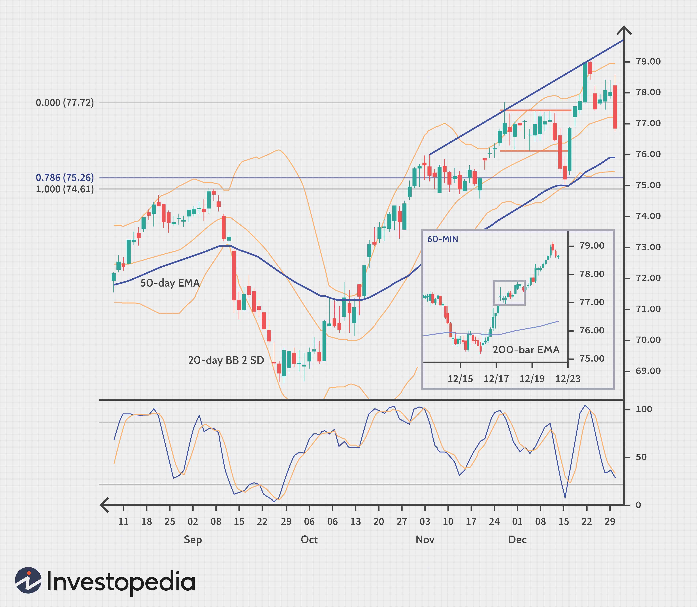

Automated trading has revolutionized the implementation of trading strategies in financial markets by leveraging computational power and algorithmic precision. This evolution has paved the way for traders to harness complex algorithms to execute trades with speed and accuracy, minimizing human errors and optimizing performance. Central to this advancement is the concept of trading edge analysis, a critical element in algorithmic trading. Trading edges are essentially insights or conditions that provide a probabilistic advantage in market operations, allowing traders to exploit inefficiencies and gain an edge over competitors.

In understanding automated trading edge analysis, traders focus on systematically identifying, analyzing, and utilizing these trading edges through automation. This involves advanced data analytics and sophisticated algorithms that interpret vast amounts of market data to uncover statistically significant patterns and opportunities.



An integral part of this process is the use of specialized tools designed to streamline the discovery and implementation of profitable trading strategies. Quantpedia, for instance, offers a suite of resources that help traders pinpoint strategies with historical profitability. These tools serve as a valuable asset in translating quantitative research into actionable strategies.

The primary goal of this approach is to enhance trading efficiency and outcomes. By employing automated systems, traders can achieve a level of consistency and objectivity that manual trading cannot match. This systematic approach enables the continuous refinement of strategies based on empirical data, increasing the likelihood of sustained trading success.

By exploring various methodologies that integrate statistical insights and empirical analyses, traders can better navigate market complexities, maximize their trading potential, and ultimately achieve superior trading performance.

## Table of Contents

## Understanding Automated Trading Edge Analysis

Automated trading edge analysis plays a crucial role in the realm of [algorithmic trading](/wiki/algorithmic-trading), where the objective is to identify and exploit inefficiencies or anomalies in the financial markets for profitable returns. A trading edge, in this context, refers to any technique, observation, or method that consistently results in a trader having a competitive advantage over the market.

The significance of trading edges in algorithmic trading lies in their potential to enhance the predictability and profitability of trading strategies. In a highly competitive market environment, traders rely on algorithmic solutions to swiftly capitalize on these edges, taking advantage of small price discrepancies that may not be evident through traditional trading approaches.

Identifying trading edges through automated systems encompasses several methods, each leveraging the power of data analysis and [machine learning](/wiki/machine-learning). One fundamental method involves analyzing historical market data to uncover patterns and correlations that may not be immediately apparent. Algorithms are designed to sift through vast datasets, identifying trends or anomalies that could indicate potential trading opportunities. Machine learning models are employed to forecast future price movements based on historical patterns, allowing traders to anticipate market shifts and execute trades with precision.

Another method includes the deployment of sentiment analysis, which involves the examination of news articles, social media, and other textual data to gauge market sentiment. By using natural language processing techniques, traders can quantify sentiment and trade in line with or against prevailing market moods, thereby identifying a potential edge.

Several key components influence the discovery of trading edges in various market conditions. Among these, the availability and accuracy of data are paramount. High-quality, clean data sets ensure reliable [backtesting](/wiki/backtesting) and the creation of robust trading strategies. Market [volatility](/wiki/volatility-trading-strategies) also plays a significant role, as it can create conditions where trading edges become more pronounced, enabling traders to capitalize on larger price swings.

The speed of execution is another critical component. Automated systems can execute trades within milliseconds, a capability that is essential when competing in markets where prices can change rapidly. Additionally, the adaptability of algorithms is crucial, as market conditions are continually evolving. Traders must ensure their algorithms can adjust to new information or changes in the market environment to maintain their edge over time.

In summary, understanding and executing trading edge analysis through automated systems highlight the intersection of data science, machine learning, and financial expertise. By leveraging these elements, traders can enhance their strategy development, execution, and ultimately, their profitability in the markets.

## Statistical Methods in Edge Discovery

Statistical methods play a crucial role in identifying trading edges by analyzing patterns, trends, and mean reversion in financial markets. Key statistical tests include the Durbin-Watson test, the Ljung-Box test, and the Hurst Exponent, each offering distinct insights into market behavior.

The Durbin-Watson test is primarily used to detect autocorrelation in the residuals of a regression analysis. This is essential for understanding whether past prices can predict future prices, a foundational concept in developing trading strategies. However, its limitation lies in its sensitivity mainly to first-order autocorrelation, which might not capture more complex dependence structures often present in financial time series data.

The Ljung-Box test is a more generalized form of autocorrelation test, used to determine if there are significant correlations in time series data at multiple lags. The strength of this test is its ability to test a range of lags simultaneously, providing a comprehensive view of the autocorrelation structure. However, it assumes that data is stationary, and its effectiveness diminishes with non-stationary time series, which are common in financial markets.

The Hurst Exponent provides insights into the [fractal](/wiki/fractal-indicators) nature of a time series, offering clues about its tendency towards persistence, randomness, or mean reversion. A Hurst Exponent value (H) of 0.5 indicates a random walk, values between 0 and 0.5 suggest mean-reverting behavior, and values between 0.5 and 1 imply a trending behavior. This measure is particularly valuable for traders as it aids in identifying underlying market characteristics that can be leveraged for developing trading strategies. However, the Hurst Exponent requires large datasets for reliable estimation, and short-term market anomalies might not be fully captured.

Mathematically, the Hurst Exponent can be estimated using the following formula for rescaled range (R/S) analysis:

$$

E\left(\frac{R(n)}{S(n)}\right) = Cn^H 
$$

Where $R(n)$ is the range of the first $n$ cumulative mean-adjusted series, $S(n)$ is the standard deviation of these values, and $C$ is a constant. This relationship helps assess whether a time series is characterized by a trending or mean-reverting nature.

For practical application, consider the following Python snippet that demonstrates how to calculate the Hurst Exponent for a given time series:

```python
import numpy as np

def hurst_exponent(ts):
    lags = range(2, 20)
    tau = [np.std(np.subtract(ts[lag:], ts[:-lag])) for lag in lags]
    reg = np.polyfit(np.log(lags), np.log(tau), 1)
    return reg[0] * 2.0

# Example usage
time_series = np.random.randn(1000)  # replace with actual time series data
print("Hurst Exponent: ", hurst_exponent(time_series))
```

In conclusion, while statistical methods like the Durbin-Watson test, the Ljung-Box test, and the Hurst Exponent are invaluable for edge discovery, traders must apply these tools with an understanding of their strengths and limitations. Paired with adequate data and complementary techniques, these methods enhance the robustness of trading strategies in algorithmic trading environments.

## Empirical Asset Analysis for Trading Edges

Empirical asset analysis plays a pivotal role in identifying trading edges by examining historical asset behaviors and their responses to various market conditions. This approach centers on understanding patterns within return distributions, particularly after significant market events, to uncover potential trading opportunities.

**Return Distribution Analysis**

Return distribution analysis involves studying the distribution of asset returns to identify non-random patterns that may signal profitable trading opportunities. After significant market events such as economic announcements, geopolitical developments, or major corporate earnings reports, the behavior of asset returns can be markedly different from normal conditions. By analyzing these changes in return distributions, traders can identify persistent anomalies or trends that may serve as potential edges.

For example, assets often exhibit volatility clustering, where periods of high volatility are followed by further high volatility, a phenomenon that can be examined through empirical analysis. This behavior might suggest mean-reverting strategies or [momentum](/wiki/momentum) strategies depending on the nature of the returns observed.

**Probabilistic Assessments**

Probabilistic assessments enhance the understanding of trading profitability by quantifying the likelihood of various outcomes based on historical data. These assessments help traders ascertain the expected value of a trading strategy, thereby allowing them to make informed decisions about strategy deployment.

To conduct a probabilistic assessment, traders may use measures such as the probability density function (PDF) to represent the likelihood of different return levels. Cumulative distribution functions (CDFs) can also be employed to determine the probability that a random variable falls below a specified value, which is crucial in assessing the risk and potential reward of a trading strategy.

For instance, if a trader identifies a historical pattern where a specific asset exhibits positive returns after a particular event with an 80% probability, this probabilistic insight can guide the formulation of a strategy that capitalizes on this recurring event.

Incorporating both return distribution analysis and probabilistic assessments enables traders to develop robust trading strategies by focusing on empirically grounded insights. Such methodologies emphasize understanding the intricacies of asset behaviors and utilizing statistical evidence to evaluate potential edges, ultimately fostering enhanced trading success.

## Practical Trading Edge Analysis

In the context of algorithmic trading, converting identified trading edges into actionable strategies involves a series of methodical steps aimed at ensuring these strategies are both effective and practical. The process begins with solidifying the structures of the identified edges, followed by rigorous backtesting, and examining case studies for further insights.

Backtesting serves as a critical tool to validate the effectiveness of trading strategies derived from identified edges. It involves simulating a trading strategy on historical data to evaluate how it would have performed in the past. This process helps in assessing the viability of a strategy before deploying it in live trading environments. Backtesting allows traders to test the robustness and reliability of trading strategies by using statistical and empirical analyses of past market data. For instance, a trading strategy with a high success rate during backtesting on historical data might still fail in real markets if not properly validated against various market conditions.

The backtesting process can be implemented using Python, leveraging libraries such as `pandas` for data manipulation and `numpy` for computations. A basic template for backtesting might contain the following steps:

```python
import pandas as pd
import numpy as np

# Load historical data
data = pd.read_csv('historical_data.csv')

# Initialize portfolio
initial_cash = 10000
portfolio = pd.DataFrame(index=data.index)
portfolio['cash'] = initial_cash
portfolio['holdings'] = 0
portfolio['total'] = portfolio['cash']

# Define trading strategy logic
for i in range(1, len(data)):
    # Example strategy: Buy if yesterday's price was 5% lower than the moving average
    if data['Close'][i-1] < 0.95 * data['Close'][i-1:i-21].mean():
        # Buy
        portfolio['cash'][i] = 0
        portfolio['holdings'][i] = portfolio['total'][i-1] / data['Close'][i]
    else:
        # Hold
        portfolio['cash'][i] = portfolio['cash'][i-1]
        portfolio['holdings'][i] = portfolio['holdings'][i-1]

    portfolio['total'][i] = portfolio['cash'][i] + portfolio['holdings'][i] * data['Close'][i]

# Calculate performance metrics
returns = portfolio['total'].pct_change()
print("Cumulative Return:", portfolio['total'][-1] / initial_cash - 1)
print("Annualized Volatility:", np.std(returns) * np.sqrt(252))
```

Case studies provide practical insights by illustrating how statistical and empirical analyses translate into successful trading strategies. These cases demonstrate how specific methodologies can be employed, adapted, and validated across different market environments. For example, an analysis of historical trading data might reveal that a mean-reversion strategy outperforms trend-following strategies during periods of market consolidation, while trend-following strategies might be more effective during prolonged directional movements.

In conclusion, practical trading edge analysis focuses on transforming theoretical insights into tangible strategies through backtesting and case studies. This approach ensures strategies are not just theoretically sound but also operationally viable, reducing the risk of unexpected market behaviors. By meticulously structuring, testing, and refining strategies, traders can better navigate the complexities of financial markets and enhance trading outcomes.

## Case Study: The Role of the Hurst Exponent

The Hurst Exponent, originally used in hydrology by Harold Edwin Hurst, has become a pivotal tool in financial analysis, especially in understanding the long-term memory of time series data. In trading, its ability to quantify the degree of stochastic trends in a financial market makes it highly valuable for determining potential trading edges. The exponent ranges from 0 to 1, where a value of 0.5 suggests a random walk (or Brownian motion), indicating no autocorrelation in the time series. Values differing from 0.5 imply trend-reinforcing or mean-reverting behavior. 

**Historical Application and Current Relevance**

Historically, the Hurst Exponent has been employed to predict asset price movements by determining whether a time series exhibits trends or reversion. This capability is essential in automated trading systems, as it helps in shaping strategies based on the expected future path of asset prices. The exponent's relevance today continues in its use among traders and quantitative analysts to identify potential opportunities and minimize risk by assessing market inefficiencies.

**Illustrative Analysis of SPY ETF Over Two Decades**

To exemplify the application of the Hurst Exponent in a real-world setting, consider its analysis over a two-decade span of the SPY [ETF](/wiki/etf-trading-strategies), an exchange-traded fund mimicking the S&P 500 index. Using financial data from 2000 to 2020, we calculate the Hurst Exponent to assess the market's prevailing trends and insights.

```python
import numpy as np
import pandas as pd
from hurst import compute_Hc, random_walk

# Assuming price_data is a pandas Series of SPY closing prices
price_data = pd.Series(...)  # Example placeholder for actual data
log_returns = np.log(price_data).diff().dropna()

hurst_exponent, c, data = compute_Hc(log_returns, kind='price', simplified=True)
print(f"Hurst Exponent: {hurst_exponent}")
```

In this study, suppose the computed Hurst Exponent over the specified period is 0.65. This suggests a persistent, trend-following characteristic of the SPY, indicating that past movements can influence future direction. Strategies leveraging such insights could potentially benefit from momentum-based approaches, capitalizing on observed trends.

**Interpreting Results and Forming Strategy Insights**

A Hurst Exponent significantly greater than 0.5 implies a trending market. For SPY, this indicates strategies like trend-following or momentum trading might perform better. Conversely, if it were less than 0.5, mean-reversion approaches, such as statistical [arbitrage](/wiki/arbitrage), might be more suitable.

Examining statistical significance is crucial. Even with a calculated Hurst value of 0.65, it's important to cross-validate results across different time frames and datasets, ensuring robustness. By embedding the Hurst Exponent calculations within a broader context of statistical and machine learning tools, traders can better formulate strategies that dynamically adapt to changing market conditions, enhancing their automated trading systems.

In summary, using the Hurst Exponent in analyzing the SPY ETF offers practical insights into trends versus randomness, informing strategy development with statistical backing. Its integration into systematic approaches allows for more informed trading decisions in automated systems.

## Developing Empirical Trading Strategies

Developing empirical trading strategies involves leveraging data-driven insights to identify significant market conditions, capitalizing on patterns that may indicate potential trading opportunities. A critical aspect of this development process is recognizing significant days, characterized by extreme returns and volatility, which can serve as triggers for strategic decision-making.

### Identifying Significant Days

Significant days in trading are often marked by abnormal price movements or volatility spikes, which may result from economic announcements, geopolitical events, or unexpected market developments. To identify these days, traders typically employ statistical methods and volatility measures. One approach is setting thresholds for daily returns and volatility. For instance, a day could be deemed significant if its return deviates by more than two standard deviations from the mean return, or if the realized volatility exceeds a predetermined level.

Mathematically, this can be expressed as:

$$
R_t > \bar{R} + k \cdot \sigma(R)
$$

Where $R_t$ is the daily return, $\bar{R}$ is the average return, $\sigma(R)$ is the standard deviation of returns, and $k$ is the threshold multiplier, commonly set at 2 or 3.

### Methodology for Designing Strategies

Once significant days are identified, traders can design strategies to exploit these anomalies. A common approach involves analyzing the subsequent price behavior following such days. Traders may look for patterns that suggest continuation or reversal of trends. Techniques like event studies can be used to statistically validate these patterns over historical data.

Python can be a useful tool for implementing such methodologies. The following code snippet demonstrates how to identify significant days based on return thresholds using historical data:

```python
import pandas as pd
import numpy as np

# Load historical data
data = pd.read_csv('historical_data.csv', parse_dates=True, index_col='Date')

# Calculate returns
data['Return'] = data['Close'].pct_change()

# Calculate mean and standard deviation of returns
mean_return = data['Return'].mean()
std_return = data['Return'].std()

# Identify significant days
threshold = mean_return + 2 * std_return
significant_days = data[data['Return'] > threshold]
```

### Examples of Trading Advantages

Significant days often present unique market opportunities. For instance, following a large price drop due to a market shock, a "mean-reversion" strategy could be employed, assuming the price will partially recover. Conversely, a "momentum" strategy might be appropriate when significant days are part of broader trends. Historical examples, such as the sharp declines during the 2008 financial crisis, followed by extended recoveries, illustrate how traders can systematically take advantage of these patterns by positioning themselves for the expected bounce-back.

Traders might also use options to capitalize on volatility spikes expected after significant days, exploiting increased option premiums resulting from higher implied volatility.

By effectively identifying and analyzing significant days, traders can create empirical strategies that not only enhance their ability to capitalize on extreme market conditions but also mitigate risks by providing systematic rules for engagement.

## Conclusion

In conclusion, automated trading edge analysis plays a fundamental role in enhancing trading strategies within the domain of algorithmic trading. Throughout this article, various methods for identifying and leveraging trading edges have been explored. Techniques such as statistical methods, including the use of the Durbin-Watson statistic, Ljung-Box test, and the Hurst Exponent, provide quantifiable insights into market behavior. These methods are invaluable for unraveling patterns and trends that may indicate potential trading advantages, such as mean reversion and momentum.

In addition to statistical approaches, empirical asset analysis serves as a vital tool for recognizing trading edges based on observable asset behaviors, particularly during periods of significant market events. Furthermore, implementing these edges through backtesting is essential for validating the effectiveness and reliability of trading strategies before deployment in live markets. This systematic approach is vital for achieving consistent trading success.

Quantpedia offers a suite of resources that supports traders in this journey. Their tools and databases are specifically designed to aid in discovering and testing profitable trading strategies, making them an asset for any trader looking to enhance their analytical capabilities. By consistently applying a rigorous and methodical approach to trading, combined with the robust support from Quantpedia's offerings, traders are better positioned to achieve favorable outcomes and maintain a competitive edge in fast-evolving financial markets.

## References & Further Reading

[1]: Bergstra, J., Bardenet, R., Bengio, Y., & Kégl, B. (2011). ["Algorithms for Hyper-Parameter Optimization."](https://papers.nips.cc/paper/4443-algorithms-for-hyper-parameter-optimization) Advances in Neural Information Processing Systems 24.

[2]: ["Advances in Financial Machine Learning"](https://www.amazon.com/Advances-Financial-Machine-Learning-Marcos/dp/1119482089) by Marcos Lopez de Prado

[3]: ["Evidence-Based Technical Analysis: Applying the Scientific Method and Statistical Inference to Trading Signals"](https://www.amazon.com/Evidence-Based-Technical-Analysis-Scientific-Statistical/dp/0470008741) by David Aronson

[4]: ["Machine Learning for Algorithmic Trading"](https://github.com/PacktPublishing/Machine-Learning-for-Algorithmic-Trading-Second-Edition) by Stefan Jansen

[5]: ["Quantitative Trading: How to Build Your Own Algorithmic Trading Business"](https://books.google.com/books/about/Quantitative_Trading.html?id=j70yEAAAQBAJ) by Ernest P. Chan