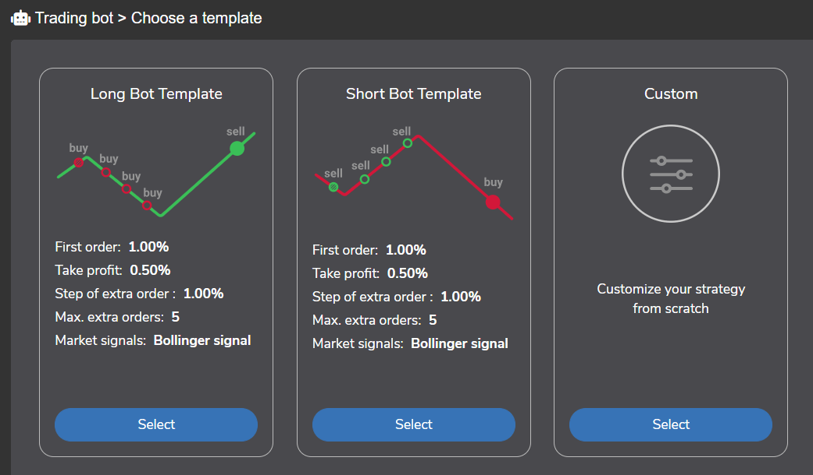

## Table of Contents

## What is an automated trading system?

An automated trading system is a computer program that buys and sells things like stocks, currencies, or other financial products without a person doing it manually. It uses rules and math formulas to decide when to trade. People set up these rules, and the computer follows them to make trades automatically. This can be helpful because the computer can work very fast and does not get tired or make emotional decisions like humans might.

These systems are popular among traders because they can save time and sometimes make more money by reacting quickly to changes in the market. However, they can also be risky. If the rules or math formulas are not set up well, the system might make bad trades. Also, the market can change in ways that the rules do not expect, which can lead to losses. So, while automated trading systems can be useful tools, it's important for people to keep an eye on them and understand how they work.

## What are the benefits of using an automated trading system?

Using an automated trading system can make trading easier and faster. The computer can look at a lot of information very quickly and make trades based on the rules you set up. This means you don't have to watch the markets all the time. The system can work 24/7, which can help you take advantage of trading opportunities even when you're sleeping or busy with other things.

Another benefit is that automated systems can help remove emotions from trading. People sometimes make bad decisions because they feel scared or too excited. A computer follows the rules without getting emotional, which can lead to more consistent trading. Over time, this can help you make more money and avoid big losses that come from emotional mistakes.

## What are the basic components of an automated trading system?

An automated trading system has a few main parts that work together to make trades without a person doing it manually. The first part is the trading strategy, which is like a set of rules that the computer follows to decide when to buy or sell. These rules can be based on things like price movements, how much a stock is traded, or other data. The strategy is important because it tells the system what to do in different situations.

The second part is the software that runs the trading strategy. This software can be something you buy, or you might write it yourself if you know how to program. It needs to be able to connect to the markets where you want to trade, so it can send orders to buy or sell. The software also keeps track of your trades and can give you reports on how well the strategy is working.

The last part is the data feed, which gives the system the information it needs to make decisions. This can include current prices, news, and other data that the trading strategy uses. A good data feed is important because if the information is wrong or slow, the system might make bad trades. Together, these parts help the automated trading system work smoothly and make trades based on the rules you set up.

## How do you choose a programming language for building an automated trading system?

When choosing a programming language for building an automated trading system, it's important to think about what you need the system to do and how easy it is to use the language. Some languages, like Python, are popular because they are easy to learn and have lots of tools that can help with trading. Python has libraries like Pandas for handling data and NumPy for doing math, which are really useful for analyzing market information. It's also good for connecting to trading platforms and getting real-time data.

Another thing to consider is how fast the language can run your trading strategy. If your strategy needs to make decisions very quickly, you might want to use a language like C++ or Java. These languages can run faster than Python, which can be important if you're trading in fast-moving markets. But they can be harder to learn and take more time to write code in. So, you need to balance how easy the language is to use with how fast it needs to be for your trading system.

Lastly, think about the support and community around the language. Languages like Python have big communities where you can find help and share ideas with other traders. This can make it easier to solve problems and improve your system. On the other hand, if you choose a less common language, you might have a harder time finding help. So, the choice of language depends on what you need, how fast you need it to be, and how much help you can get from others.

## What are the key steps to develop a trading strategy for an automated system?

To develop a trading strategy for an automated system, start by defining what you want to achieve. Do you want to make money over a long time, or are you looking for quick profits? Once you know your goal, you can decide on the rules for buying and selling. These rules should be based on things like price movements, trading volume, or other data you think is important. It's a good idea to use past data to test your rules and see if they would have made money in the past. This is called backtesting, and it helps you see if your strategy could work in real markets.

After you have a strategy that looks good in backtesting, you need to think about how to manage risk. This means setting rules for how much money you're willing to lose on each trade and how to protect your profits. You might decide to use stop-loss orders, which automatically sell a stock if it drops to a certain price, to limit your losses. It's also important to keep an eye on how your strategy is doing once it's running live. Markets can change, and a strategy that worked well in the past might not work as well in the future. So, be ready to make changes to your rules if you need to.

## How do you backtest a trading strategy in an automated trading system?

Backtesting a trading strategy means using old market data to see how well your rules would have worked in the past. You take your trading rules and apply them to historical data to see if they would have made money. This helps you find out if your strategy is good before you start using it with real money. To do this, you need a computer program that can read the old data and follow your trading rules step by step. It will pretend to buy and sell based on your rules and keep track of how much money you would have made or lost.

It's important to use a lot of old data from different times to make sure your strategy works well in different market conditions. Sometimes, a strategy might look good with data from one year but not work well with data from another year. You should also be careful not to overfit your strategy, which means making it too specific to the past data. If your strategy is too specific, it might not work well in the future when the market changes. After backtesting, you can make changes to your rules to try to make them better before you start trading for real.

## What are common pitfalls to avoid when developing an automated trading system?

When developing an automated trading system, one common pitfall is overfitting the strategy to past data. This happens when you make your trading rules too specific to the historical data you used for backtesting. While the strategy might look great in the past, it may not work well in the future because markets change. To avoid this, use a lot of different data from various time periods and be careful not to make your rules too complicated. Keep them simple and flexible so they can adapt to new market conditions.

Another pitfall is not managing risk properly. It's easy to focus on making money and forget about protecting it. Always set rules for how much you're willing to lose on each trade, and use tools like stop-loss orders to limit your losses. Also, don't put all your money into one trade or one type of investment. Spread it out to reduce the risk. Remember, even the best strategies can have losing streaks, so having a good risk management plan is crucial.

Lastly, many people forget to keep an eye on their system once it's running live. Markets can change, and a strategy that worked well in the past might not work as well in the future. It's important to regularly check how your system is doing and be ready to make changes if needed. Don't just set it and forget it; stay involved and keep learning from what's happening in the markets.

## How do you integrate real-time data feeds into an automated trading system?

To integrate real-time data feeds into an automated trading system, you first need to choose a reliable data provider that offers the kind of information your trading strategy needs. This could be stock prices, currency exchange rates, or other market data. Once you have a provider, you'll need to connect your trading system's software to their data feed. This often involves using an API, which is like a special set of instructions that lets your software talk to the data provider's system. You'll write code to tell your system how to get the data and use it to make trading decisions.

After you've set up the connection, you need to make sure your system can handle the data coming in quickly and accurately. Real-time data can change very fast, so your system needs to be able to process it without slowing down or missing important updates. You might need to use special tools or libraries in your programming language to help with this. Once everything is working, your system will be able to use the latest market information to make trades based on your strategy. It's important to keep testing and checking that the data feed is working correctly, so your system keeps making good decisions.

## What are the best practices for risk management in automated trading?

Risk management is very important in automated trading. One of the best ways to manage risk is to set clear rules for how much money you are willing to lose on each trade. This is called a stop-loss order. It tells the computer to sell a stock if it drops to a certain price, so you don't lose too much money. Another good idea is to not put all your money into one trade. Instead, spread it out over different trades and different types of investments. This is called diversification, and it can help protect you if one trade goes bad.

It's also important to keep an eye on how your automated trading system is doing. Markets can change, and a strategy that worked well before might not work as well now. So, you should check your system regularly and be ready to make changes if needed. Don't just set it and forget it. Also, think about using a smaller amount of money at first to test your system in the real market. This way, you can see how it works without risking too much. Remember, even the best strategies can have losing streaks, so always be ready to handle losses and keep learning from what's happening in the markets.

## How can machine learning be utilized to enhance an automated trading system?

Machine learning can make an automated trading system better by finding patterns in market data that are hard for people to see. It can learn from past trades and use that knowledge to make better decisions in the future. For example, machine learning can look at lots of data like stock prices, news, and how much people are buying and selling to predict what might happen next. This can help the trading system decide when to buy or sell to make more money. By using machine learning, the system can keep getting better over time as it learns more about the market.

Another way machine learning helps is by making the trading system more flexible. Markets change a lot, and what worked yesterday might not work today. Machine learning can adjust the trading rules to fit new market conditions. This means the system can adapt to different situations without a person having to change the rules all the time. It's like having a smart helper that keeps learning and improving how it trades, which can lead to better results and less risk.

## What are the regulatory considerations when deploying an automated trading system?

When you want to use an automated trading system, you need to think about the rules set by different countries or organizations. These rules are there to make sure trading is fair and safe. For example, in the United States, the Securities and Exchange Commission (SEC) and the Commodity Futures Trading Commission (CFTC) have rules about automated trading. They want to make sure that your system doesn't do things like making the market go crazy or tricking other traders. You need to follow these rules, which might mean getting special permission or licenses, keeping good records of your trades, and being ready for checks to make sure you're doing things right.

Another important thing to think about is data privacy and security. When your system uses real-time data feeds, you need to make sure that the information is safe and used in the right way. This means following laws like the General Data Protection Regulation (GDPR) in Europe or other similar laws in different places. These laws tell you how to handle personal information and keep it safe. If you don't follow these rules, you could get in big trouble, like getting fined or not being allowed to trade anymore. So, it's really important to know the rules and follow them carefully when you're using an automated trading system.

## How do you monitor and maintain an automated trading system for optimal performance?

To keep your automated trading system working well, you need to watch it closely all the time. Look at how it's doing every day or even more often. Check if it's making money like you expected and if it's following your trading rules correctly. If you see that the system is not working as well as before, you might need to change the rules a bit. Also, make sure the system is getting the right data and that it's not too slow. If the system is slow, it might miss good chances to trade. Keep an eye on any error messages or problems, and fix them quickly so your system keeps running smoothly.

It's also important to keep your system up to date. Markets change, and what worked last month might not work this month. So, you should keep learning about the market and update your trading rules if needed. Sometimes, you might need to add new data or use new tools to make your system better. Don't forget to test any changes you make before using them for real. This way, you can make sure the changes will help your system perform better without causing big problems. By staying involved and keeping your system in good shape, you can help it keep making money over time.

## What are the steps to build an automated trading system?

Step 1: Ideation  
The ideation phase is crucial in developing a successful automated trading system. It involves formulating a trading idea or strategy based on market observations. This could be derived from identifying patterns or anomalies in historical price data. For instance, you might notice a repeating pattern in stock prices just before earnings announcements. Alternatively, [backtesting](/wiki/backtesting) existing strategies can help ascertain potential profitability and improve upon them. For example, one might use the moving average crossover strategy, examining past performance to tweak parameters for better future returns.

Step 2: Creating the System  
Programming your strategy is the next step in building your trading system. Python, due to its simplicity and extensive library support, is often the preferred choice. Libraries such as NumPy and pandas are instrumental in handling financial data. Here is a simple example of how to implement a moving average crossover strategy in Python:

```python
import pandas as pd

# Load your historical data
data = pd.read_csv('historical_data.csv')
data['SMA50'] = data['Close'].rolling(window=50).mean()
data['SMA200'] = data['Close'].rolling(window=200).mean()

# Generate signals
data['Signal'] = 0
data['Signal'][50:] = np.where(data['SMA50'][50:] > data['SMA200'][50:], 1, 0)

# Positions
data['Position'] = data['Signal'].diff()
```

This code calculates the 50-day and 200-day simple moving averages (SMA) to generate buy (when SMA50 > SMA200) and sell signals.

Step 3: Backtesting  
Backtesting involves testing your trading strategy on historical data to evaluate its potential profitability. This is essential for identifying how well your strategy would have performed in the past under various market conditions. It's crucial to consider transaction costs, slippage, and market impacts to ensure realistic results. The Sharpe ratio can be calculated to measure risk-adjusted returns, which is given by:

$$
\text{Sharpe Ratio} = \frac{E[R_p - R_f]}{\sigma_p}
$$

Here, $R_p$ is the portfolio return, $R_f$ is the risk-free rate, and $\sigma_p$ is the standard deviation of the portfolio return.

Step 4: Paper Trading  
Before moving to live trading, it's advisable to test your strategy in a simulated environment that mimics real market conditions. Paper trading allows you to validate your system's performance and identify any operational issues without the risk of financial loss. Tools like QuantConnect or TradingView offer platforms for paper trading where traders can implement and test their strategies with real-time data.

Step 5: Live Trading  
The final step is deploying your system in the live market. This involves using real money to execute trades based on your coded strategy. Monitoring the system is vital to ensure it’s acting as expected and adapting to market changes. During this phase, integrating robust risk management protocols is essential to protect your capital from unexpected market [volatility](/wiki/volatility-trading-strategies). Regularly updating and reevaluating the strategy ensures alignment with current market conditions and technological advancements.

## What is Risk Management and Monitoring?

Effective risk management and monitoring are essential components in the development and operation of an automated trading system. By integrating robust risk management measures, traders can significantly reduce potential losses and protect their capital from unpredictable market fluctuations. 

To begin with, one of the primary strategies for safeguarding capital is the implementation of stop-loss mechanisms. These predetermined rules automatically sell a security when its price reaches a certain threshold, thereby limiting potential losses. For instance, a simple stop-loss implementation in Python might look like this:

```python
def stop_loss(price, trigger_price, current_position):
    if price <= trigger_price:
        execute_sell_order(current_position)

def execute_sell_order(position):
    # Logic to execute sell order
    pass
```

In addition to stop-loss orders, traders should establish a variety of risk management measures such as diversification, position sizing, and the use of leverage cautiously. Diversification helps spread the risk across different assets, reducing exposure to any single investment's adverse price movements.

Continuous monitoring of the trading system's performance is crucial. It allows traders to adapt algorithms to evolving market conditions. This monitoring should involve both automated performance tracking and manual reviews. Automated systems can generate regular reports that highlight key performance indicators such as win/loss ratio, average gain per trade, and drawdown levels. The consistent review of these metrics can provide insights into the system's efficacy and indicate areas for refinement.

Moreover, traders should employ volatility-based risk management strategies. Volatility can be measured using standard deviation, represented mathematically as:

$$
\sigma = \sqrt{\frac{\sum (x_i - \mu)^2}{N}}
$$

where $x_i$ is each individual trade return, $\mu$ is the mean return, and $N$ is the number of trades in the sample.

By benchmarking against implied volatility indices, traders can adjust their algorithms to enhance resilience under various market conditions. Additionally, real-time tracking of market volatility can prompt dynamic adjustments in position sizes and leverage uses.

Implementing regular reports is another critical element. Detailed transactional records and system logs help in backtracking any system discrepancies and in reviewing whether trades were executed accurately per the designed algorithms. Such reports facilitate ongoing system improvements and troubleshooting when needed.

In sum, integrating robust risk management measures, conducting regular monitoring, and embracing comprehensive reporting are indispensable practices in maintaining the health and efficacy of an automated trading system. By prudently managing risk, traders are better equipped to achieve sustained profitability while mitigating potential downsides.

## References & Further Reading

[1]: ["Advances in Financial Machine Learning"](https://www.amazon.com/Advances-Financial-Machine-Learning-Marcos/dp/1119482089) by Marcos Lopez de Prado

[2]: ["Evidence-Based Technical Analysis: Applying the Scientific Method and Statistical Inference to Trading Signals"](https://www.amazon.com/Evidence-Based-Technical-Analysis-Scientific-Statistical/dp/0470008741) by David Aronson

[3]: ["Machine Learning for Algorithmic Trading"](https://github.com/PacktPublishing/Machine-Learning-for-Algorithmic-Trading-Second-Edition) by Stefan Jansen

[4]: ["Quantitative Trading: How to Build Your Own Algorithmic Trading Business"](https://books.google.com/books/about/Quantitative_Trading.html?id=j70yEAAAQBAJ) by Ernest P. Chan

[5]: Bergstra, J., Bardenet, R., Bengio, Y., & Kégl, B. (2011). ["Algorithms for Hyper-Parameter Optimization."](https://dl.acm.org/doi/10.5555/2986459.2986743) Advances in Neural Information Processing Systems 24.