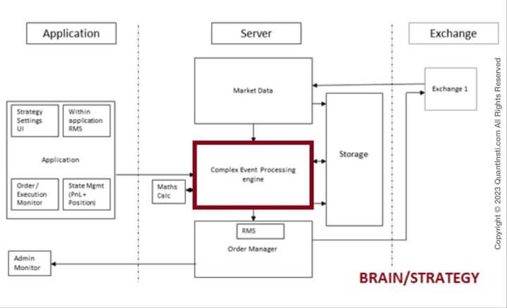

Algorithmic trading has significantly transformed the landscape of financial markets, offering traders enhanced efficiency and scalability that were previously unattainable with manual trading methods. At the forefront of this evolution are automated trading systems, which enable the execution of trades based on pre-defined rules, minimizing human intervention and error. These systems are designed to capitalize on market opportunities by leveraging computational power to execute orders with precision and speed.

This article aims to serve as a comprehensive guide for developing your own automated trading system within the framework of algorithmic trading. By focusing on key components, necessary skills, and strategic approaches, it provides a clear pathway for traders of varying levels of expertise to embark on the development process. Automated systems empower traders by reducing the influence of emotions—often detrimental in trading—and facilitating strategies that require the processing of complex datasets at rapid speeds.



Traders interested in automated systems can benefit from understanding their ability to operate within diverse market conditions, adapting to fluctuations with algorithmic precision. The ability to execute a higher volume of trades swiftly can lead to increased opportunities for profitability, although it also necessitates a robust strategy and thorough testing to ensure success. With the right tools and methodologies, automated trading systems can become an integral part of a trader’s arsenal, optimizing both efficiency and profitability in the dynamic environment of financial markets.

## Table of Contents

## Understanding Algo Trading

Algo trading, a sophisticated facet of modern finance, employs programmed computers to execute trades based on predefined criteria. These criteria can encompass a vast array of parameters, such as timing, price, and even complex mathematical models derived from historical market data. The fundamental aspect of algo trading is its capability to operate at speeds and frequencies unattainable by human traders, leveraging computational power to capitalize on fleeting opportunities in the marketplace.

Automated trading systems, a key subset of algo trading, extend this technological prowess by not only identifying and analyzing potential trades but also executing them automatically. The instructions or algorithms governing these systems can range from simple moving average strategies to intricate statistical [arbitrage](/wiki/arbitrage) models. For instance, a basic example in Python for executing trades based on moving averages might look like this:

```python
# Simple moving average crossover strategy
def moving_average_crossover(prices, short_window=40, long_window=100):
    signals = pd.DataFrame(index=prices.index)
    signals['short_mavg'] = prices['Close'].rolling(window=short_window, min_periods=1).mean()
    signals['long_mavg'] = prices['Close'].rolling(window=long_window, min_periods=1).mean()
    signals['signal'] = 0.0
    signals['signal'][short_window:] = np.where(signals['short_mavg'][short_window:] > signals['long_mavg'][short_window:], 1.0, 0.0) 
    signals['positions'] = signals['signal'].diff()
    return signals
```

It's crucial to distinguish between algorithmic and automated trading. Although all automated trading is algorithmic, not all algorithmic setups are automated. Algorithmic trading can involve manually implemented strategies, where traders use algorithms to inform their decisions but execute trades themselves. Conversely, automated trading signifies a fully hands-off approach post-implementation, wherein trades are executed without manual intervention based on the defined algorithm.

In summary, algorithmic and automated trading systems harness computational efficiency and precision to identify market trends and execute trades. They eliminate the psychological biases of human traders, instead relying on data-driven strategies to optimize market performance. This distinction highlights the versatility of algorithmic approaches, which can be as manual or automated as the trader desires, depending on their needs and the complexity of the strategies employed.

## Steps to Build an Automated Trading System

Step 1: Ideation  
The ideation phase is crucial in developing a successful automated trading system. It involves formulating a trading idea or strategy based on market observations. This could be derived from identifying patterns or anomalies in historical price data. For instance, you might notice a repeating pattern in stock prices just before earnings announcements. Alternatively, [backtesting](/wiki/backtesting) existing strategies can help ascertain potential profitability and improve upon them. For example, one might use the moving average crossover strategy, examining past performance to tweak parameters for better future returns.

Step 2: Creating the System  
Programming your strategy is the next step in building your trading system. Python, due to its simplicity and extensive library support, is often the preferred choice. Libraries such as NumPy and pandas are instrumental in handling financial data. Here is a simple example of how to implement a moving average crossover strategy in Python:

```python
import pandas as pd

# Load your historical data
data = pd.read_csv('historical_data.csv')
data['SMA50'] = data['Close'].rolling(window=50).mean()
data['SMA200'] = data['Close'].rolling(window=200).mean()

# Generate signals
data['Signal'] = 0
data['Signal'][50:] = np.where(data['SMA50'][50:] > data['SMA200'][50:], 1, 0)

# Positions
data['Position'] = data['Signal'].diff()
```

This code calculates the 50-day and 200-day simple moving averages (SMA) to generate buy (when SMA50 > SMA200) and sell signals.

Step 3: Backtesting  
Backtesting involves testing your trading strategy on historical data to evaluate its potential profitability. This is essential for identifying how well your strategy would have performed in the past under various market conditions. It's crucial to consider transaction costs, slippage, and market impacts to ensure realistic results. The Sharpe ratio can be calculated to measure risk-adjusted returns, which is given by:

$$
\text{Sharpe Ratio} = \frac{E[R_p - R_f]}{\sigma_p}
$$

Here, $R_p$ is the portfolio return, $R_f$ is the risk-free rate, and $\sigma_p$ is the standard deviation of the portfolio return.

Step 4: Paper Trading  
Before moving to live trading, it's advisable to test your strategy in a simulated environment that mimics real market conditions. Paper trading allows you to validate your system's performance and identify any operational issues without the risk of financial loss. Tools like QuantConnect or TradingView offer platforms for paper trading where traders can implement and test their strategies with real-time data.

Step 5: Live Trading  
The final step is deploying your system in the live market. This involves using real money to execute trades based on your coded strategy. Monitoring the system is vital to ensure it’s acting as expected and adapting to market changes. During this phase, integrating robust risk management protocols is essential to protect your capital from unexpected market [volatility](/wiki/volatility-trading-strategies). Regularly updating and reevaluating the strategy ensures alignment with current market conditions and technological advancements.

## Choosing the Right Tools and Technologies

When building an automated trading system, selecting the right tools and technologies is crucial for ensuring the system’s optimal performance and adaptability. This involves choosing trading platforms, advanced software, APIs, and ensuring the system's scalability for future market conditions.

**Trading Platforms**:  
A foundational step in constructing an automated trading system is selecting a suitable trading platform that facilitates both backtesting and real-time data access. MetaTrader and TradingView are popular choices due to their user-friendly interfaces and comprehensive features tailored to automated trading. These platforms allow traders to simulate their strategies on historical data, providing insights into the strategy’s potential efficacy before deploying it in live markets. Many proprietary broker platforms also offer comparable functionalities, allowing integration with their trading services.

**Advanced Software**:  
For traders seeking enhanced pattern recognition and automation, advanced software tools like TrendSpider and TradeIdeas are highly recommended. These tools leverage sophisticated algorithms to detect intricate patterns that might be invisible to the naked eye. They also offer automation features that can trigger trade executions based on the recognition of specific trends or patterns, thus aiding in the creation of a robust and responsive trading strategy.

**APIs for Market Access**:  
Application Programming Interfaces (APIs) are indispensable for achieving direct market access and enabling the system to respond instantaneously to market data. Through APIs, systems can place trades, retrieve market information, and manage trading activities in real-time. Platforms like [Interactive Brokers](/wiki/interactive-brokers-api) or Alpaca provide comprehensive API access for algorithmic traders, allowing seamless integration and execution of trades based on live data feeds.

```python
# Example of using an API for market data access in Python
import requests

API_KEY = "your_api_key"
BASE_URL = "https://api.broker.com/v2/"

def get_realtime_price(symbol):
    endpoint = f"{BASE_URL}marketdata/{symbol}/quotes"
    response = requests.get(endpoint, headers={"Authorization": f"Bearer {API_KEY}"})
    data = response.json()
    return data['price']

price = get_realtime_price("AAPL")
print(f"The real-time price of AAPL is: {price}")
```

**Scalability and Adaptation**:  
As markets evolve, so too must trading systems. It is vital to ensure that the system can adapt to new market protocols and integrate with various exchanges smoothly. This adaptability could involve updating algorithms, modifying system architecture, or integrating with new APIs and data providers. Moreover, as trading volumes and strategies expand, the system should also be scalable to handle increased data and transaction loads efficiently. This scalability ensures that the automated trading system remains reliable and performs consistently under varying market conditions.

Choosing the right tools and technologies is not just about immediate functionalities but also about preparing for future developments in trading environments. By leveraging robust platforms, sophisticated trading software, and efficient APIs, traders can build systems that not only meet current trading needs but are also poised to take advantage of future opportunities in the financial markets.

## Risk Management and Monitoring

Effective risk management and monitoring are essential components in the development and operation of an automated trading system. By integrating robust risk management measures, traders can significantly reduce potential losses and protect their capital from unpredictable market fluctuations. 

To begin with, one of the primary strategies for safeguarding capital is the implementation of stop-loss mechanisms. These predetermined rules automatically sell a security when its price reaches a certain threshold, thereby limiting potential losses. For instance, a simple stop-loss implementation in Python might look like this:

```python
def stop_loss(price, trigger_price, current_position):
    if price <= trigger_price:
        execute_sell_order(current_position)

def execute_sell_order(position):
    # Logic to execute sell order
    pass
```

In addition to stop-loss orders, traders should establish a variety of risk management measures such as diversification, position sizing, and the use of leverage cautiously. Diversification helps spread the risk across different assets, reducing exposure to any single investment's adverse price movements.

Continuous monitoring of the trading system's performance is crucial. It allows traders to adapt algorithms to evolving market conditions. This monitoring should involve both automated performance tracking and manual reviews. Automated systems can generate regular reports that highlight key performance indicators such as win/loss ratio, average gain per trade, and drawdown levels. The consistent review of these metrics can provide insights into the system's efficacy and indicate areas for refinement.

Moreover, traders should employ volatility-based risk management strategies. Volatility can be measured using standard deviation, represented mathematically as:

$$
\sigma = \sqrt{\frac{\sum (x_i - \mu)^2}{N}}
$$

where $x_i$ is each individual trade return, $\mu$ is the mean return, and $N$ is the number of trades in the sample.

By benchmarking against implied volatility indices, traders can adjust their algorithms to enhance resilience under various market conditions. Additionally, real-time tracking of market volatility can prompt dynamic adjustments in position sizes and leverage uses.

Implementing regular reports is another critical element. Detailed transactional records and system logs help in backtracking any system discrepancies and in reviewing whether trades were executed accurately per the designed algorithms. Such reports facilitate ongoing system improvements and troubleshooting when needed.

In sum, integrating robust risk management measures, conducting regular monitoring, and embracing comprehensive reporting are indispensable practices in maintaining the health and efficacy of an automated trading system. By prudently managing risk, traders are better equipped to achieve sustained profitability while mitigating potential downsides.

## Understanding Market Structures and Protocols

Market structures and protocols play a critical role in the efficiency and effectiveness of automated trading systems. Understanding these elements is essential for traders and developers aiming to optimize their strategies in volatile and competitive environments.

**Market Data Providers and Exchange Architecture**  
Market data providers supply crucial information about securities, commodities, and other tradable instruments. These data streams include quotes, trades, and market depths, which inform trading strategies and decisions. The architecture of exchanges is designed to handle vast amounts of data with minimal latency. Latency is the time delay between the occurrence of an event in the market and the response by a trading system. Lower latency can significantly enhance trading outcomes, especially in high-frequency trading ([HFT](/wiki/high-frequency-trading-strategies)) scenarios.

Exchanges typically organize this data into different feeds, such as Level 1 and Level 2, each providing varying depths of information. Level 1 data includes the best bid and ask prices, while Level 2 data shows the [order book](/wiki/order-book-trading-strategies) depth, revealing the supply and demand dynamics beyond the top of the book.

**Communication and Order Execution Protocols**  
A pivotal aspect of modern trading systems is the communication protocol used for order execution. The Financial Information eXchange (FIX) protocol is one of the most widely adopted standards for electronic trading. FIX is a non-proprietary, free, open standard specification that provides communication capabilities for real-time exchange of information related to securities transactions and markets.

Proprietary broker APIs provide another layer of interaction, granting traders the ability to directly connect their systems with brokerage platforms. These APIs facilitate the rapid execution of trades, access to market data, and account management functionalities. Developers must ensure their systems are flexible enough to adapt to various APIs, as different brokers may offer unique features or data sets.

**Co-location for Reduced Latency**  
In HFT environments, the speed of order execution is paramount. One way to reduce latency is through co-location services offered by exchanges. Co-location refers to placing trading servers physically close to exchange servers, minimizing the distance data must travel. This proximity reduces the time taken for order requests to reach the exchange, giving traders a competitive edge by enabling faster response times to market events.

Using co-location servers, traders can achieve execution speeds that are only constrained by the capabilities of their algorithms and network infrastructure. This setup is particularly beneficial for strategies that rely heavily on the rapid identification and exploitation of fleeting market opportunities.

Overall, an advanced understanding of market structures and protocols is indispensable for the development and performance of automated trading systems. Knowledge of data providers, exchange architecture, communication protocols like FIX, and the strategic use of co-location can profoundly influence the success of such systems.

## Advantages and Disadvantages of Automated Trading Systems

Automated trading systems (ATS) offer significant advantages, making them popular among traders seeking efficiency and consistency in the financial markets. One of the primary benefits of ATS is the elimination of human emotions, which can often lead to impulsive and irrational trading decisions. By executing trades based on pre-defined criteria, automated systems ensure adherence to strategies without emotional interference.

Additionally, ATS enhance speed, executing orders at a pace unattainable by manual trading. In a market where prices can change in milliseconds, this speed is crucial. Automated systems also increase the ability to manage complex and mathematically intensive strategies that would be challenging to execute manually. For instance, using algorithmic strategies that involve calculating moving averages, Bollinger Bands, or other technical indicators becomes feasible with automation. Python's Pandas library, for example, can efficiently handle such calculations with code snippets like:

```python
import pandas as pd

def moving_average(data, window_size):
    return data.rolling(window=window_size).mean()

# Example usage
data = pd.Series([1, 2, 3, 4, 5, 6, 7, 8, 9, 10])
ma = moving_average(data, 3)
print(ma)
```

However, automated trading systems come with their own set of challenges. System failures can occur, leading to potential financial loss. Such failures may arise due to hardware issues, software bugs, or connectivity problems. This necessitates a robust backup plan and system redundancy to ensure minimal downtime and loss.

Moreover, there is a dependency on technology, requiring a continuous commitment to monitoring and adapting the system to ensure its compatibility with ever-evolving market conditions. As markets change, algorithms must be updated and refined, requiring a dedicated effort for system maintenance and performance monitoring. Regular tuning and updating of these systems are crucial to maintain their effectiveness over time.

Financial costs can also pose barriers to entry for some traders. The development and maintenance of an automated trading system, which may include data feeds, software licenses, and server costs, require significant investment. Despite these financial implications, the potential for generating consistent profits often justifies the initial investment and ongoing expenses. By streamlining operations and removing human error, these systems can offer high returns, especially in volatile markets.

In summary, while automated trading systems present remarkable advantages like speed, emotionless execution, and the ability to handle complex models, they require significant investment and ongoing maintenance. Understanding these trade-offs is essential for traders aiming to leverage automation in their strategies.

## Conclusion

Building an automated trading system entails a structured approach encompassing strategy formulation, testing, and systematic deployment. Crafting a viable trading strategy is the initial step, requiring a deep understanding of market dynamics and trader objectives. This strategy must then be encoded using programming languages like Python, ensuring that the system can automatically execute trades following predefined criteria. 

Comprehensive testing, particularly through historical data backtesting and paper trading, is crucial. These phases allow traders to refine their algorithms and validate their potential profitability before committing actual capital. During backtesting, a system evaluates a strategy over historical data, ensuring that it is sound and adjusts for past market behaviors. The use of libraries such as `pandas` and `numpy` facilitates data manipulation and analysis in Python, enabling sophisticated backtesting.

```python
import pandas as pd
import numpy as np

# Simple example of calculating moving average for backtesting
data = pd.read_csv('historical_data.csv')
data['moving_average'] = data['Close'].rolling(window=20).mean()
```

The right selection of tools and careful testing significantly enhance the effectiveness of [algorithmic trading](/wiki/algorithmic-trading). Automated systems excel in speed and precision, executing trades faster than human capability and without the emotional biases that often impede decision-making. They are adept at processing quantitative models, allowing for more complex trading strategies beyond human calculation.

However, sustaining competitive advantage requires continuous learning and adaptation. Markets are inherently dynamic; thus, an automated system must be regularly updated and refined to align with evolving conditions. This includes algorithm optimization and the incorporation of new market information to prevent obsolescence.

In summary, while building an effective automated trading system is a multifaceted endeavor, it holds the promise of considerable benefits in trading efficiency and consistency. With a disciplined approach to testing and ongoing strategy evolution, traders can harness algorithmic trading's potential to achieve superior trading outcomes.

## References & Further Reading

[1]: ["Advances in Financial Machine Learning"](https://www.amazon.com/Advances-Financial-Machine-Learning-Marcos/dp/1119482089) by Marcos Lopez de Prado

[2]: ["Evidence-Based Technical Analysis: Applying the Scientific Method and Statistical Inference to Trading Signals"](https://www.amazon.com/Evidence-Based-Technical-Analysis-Scientific-Statistical/dp/0470008741) by David Aronson

[3]: ["Machine Learning for Algorithmic Trading"](https://github.com/PacktPublishing/Machine-Learning-for-Algorithmic-Trading-Second-Edition) by Stefan Jansen

[4]: ["Quantitative Trading: How to Build Your Own Algorithmic Trading Business"](https://books.google.com/books/about/Quantitative_Trading.html?id=j70yEAAAQBAJ) by Ernest P. Chan

[5]: Bergstra, J., Bardenet, R., Bengio, Y., & Kégl, B. (2011). ["Algorithms for Hyper-Parameter Optimization."](https://dl.acm.org/doi/10.5555/2986459.2986743) Advances in Neural Information Processing Systems 24.