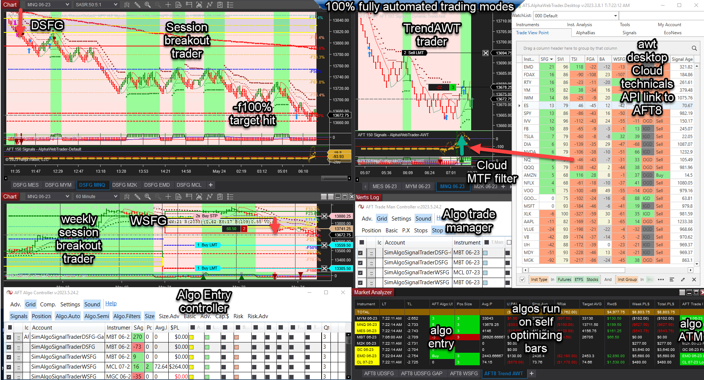

## Table of Contents

## What is an Automated Trading System (ATS)?

An Automated Trading System (ATS) is a computer program that helps people buy and sell things like stocks, currencies, or other financial products without them having to do it manually. It uses special rules, called algorithms, to decide when to buy or sell. These rules are based on things like numbers, patterns, and market trends. People set up the system with their rules, and then the computer does the trading for them, often much faster than a human could.

ATS can be really helpful because they can work all the time, even when the stock market is closed. They can also handle a lot of information and make decisions quickly. This means they can take advantage of small changes in the market that a person might miss. However, using an ATS also has risks. Sometimes the rules might not work as expected, or the market might change in ways the system can't predict. So, while ATS can be powerful tools, they need to be used carefully.

## How does an Automated Trading System work?

An Automated Trading System works by using a set of rules, called an algorithm, that tells the computer when to buy or sell things like stocks or currencies. People who want to use an ATS first decide what rules they want to follow. These rules might be based on numbers, like the price of a stock, or patterns, like how the price has been changing over time. Once the rules are set up, the computer watches the market and follows the rules to make trades. For example, if the rule says to buy a stock when its price goes below a certain number, the computer will do that automatically.

The system can work all the time, even when the market is closed, because it can check for new information and be ready to trade as soon as the market opens again. This means it can take advantage of small changes in the market that might happen very quickly. The computer can also handle a lot of information at once, which helps it make decisions faster than a human could. But, there are risks too. Sometimes the rules might not work as expected, or the market might change in a way the system can't predict. So, people using an ATS need to keep an eye on it and be ready to make changes if needed.

## What are the benefits of using an Automated Trading System?

One big benefit of using an Automated Trading System is that it can work all the time, even when you're sleeping or busy with other things. This means it can watch the market and make trades at any time, even when the market is closed. It can take advantage of small changes in the market that might happen very quickly, which a person might miss. Also, the system can handle a lot of information at once and make decisions much faster than a human could. This can lead to more trades and potentially more profits.

Another benefit is that an Automated Trading System follows a set of rules, called an algorithm, which helps take emotion out of trading. When people trade, they can sometimes make decisions based on feelings like fear or excitement, which can lead to mistakes. An ATS sticks to the rules you set, so it doesn't get affected by emotions. This can help make trading more consistent and disciplined. Overall, using an ATS can save time, reduce emotional trading, and possibly increase the chances of making successful trades.

## What are the potential risks associated with Automated Trading Systems?

Using an Automated Trading System can be risky because the rules, or algorithms, you set up might not work as expected. The market can change in ways that the system can't predict, which means it might make trades that end up losing money. For example, if the system is set up to buy a stock when its price goes down, but the price keeps falling, the system will keep buying and could end up with big losses. This is called a "black swan" event, where something very unexpected happens, and the system can't handle it.

Another risk is that the system might make trades too quickly. Because it can handle a lot of information and make decisions fast, it might start a chain reaction of buying and selling that can cause big changes in the market. This is called a "flash crash," and it can happen in just a few seconds. Also, if many people are using similar systems, they might all make the same trades at the same time, which can make the market go up and down a lot. So, while an ATS can be a powerful tool, it needs to be used carefully to avoid these risks.

## What types of Automated Trading Systems are available?

There are different types of Automated Trading Systems that people can use. One type is called a trend-following system. This system looks at how prices are moving over time and tries to make money by following the trend. If the price of a stock is going up, the system will buy it, hoping it will keep going up. If the price is going down, the system will sell it, hoping to avoid losing money. Another type is a mean-reversion system. This system believes that prices will eventually go back to their average value. So, if a stock's price is much higher than its average, the system will sell it, expecting the price to go down. If the price is much lower, it will buy, expecting it to go up.

Another type of Automated Trading System is an arbitrage system. This system looks for small differences in prices between different markets or different types of the same product. For example, if the same stock is being sold for a slightly different price on two different exchanges, the system will buy it where it's cheaper and sell it where it's more expensive, making a small profit from the difference. There are also systems that use machine learning. These systems can learn from past data and improve their rules over time. They can find patterns that might be hard for people to see and use those patterns to make trades. Each type of system has its own way of trying to make money, and people can choose the one that fits their goals and the amount of risk they are willing to take.

## How can someone set up their first Automated Trading System?

Setting up your first Automated Trading System starts with choosing a trading platform that supports automation. Popular platforms like MetaTrader 4 or 5, NinjaTrader, or TradeStation are good choices because they have tools to help you build your system. Once you've picked a platform, you need to decide what kind of system you want. Do you want a system that follows trends, one that bets on prices going back to their average, or maybe one that looks for small price differences between markets? Think about what kind of trading you want to do and what risks you're okay with.

After choosing your system type, you'll need to create the rules, or algorithms, that your system will follow. This might involve writing code if you're comfortable with programming, or using the platform's built-in tools to set up your rules without coding. Start with simple rules and test them using historical data to see how they would have worked in the past. This is called backtesting. Once you're happy with your rules, you can start using your system with real money, but it's a good idea to start small and keep an eye on how it's doing. Remember, even the best systems need to be watched and tweaked as the market changes.

## How does Algorithmic Trading work?

Algorithmic trading employs computer programs to execute trade orders based on a predefined set of rules, tailored to optimize trading outcomes. These rules can incorporate a wide array of variables such as timing, price, quantity of assets, and even trading signals derived from complex strategies. The core objective is to automate the decision-making process, allowing traders to capitalize on market opportunities with minimal lag and reduced emotional influence.

A fundamental example of algorithmic trading is the use of moving averages. For instance, a simple trading algorithm could be structured as follows: buy 50 shares of a stock when the short-term moving average (e.g., the 50-day moving average) surpasses the long-term moving average (e.g., the 200-day moving average), and sell when the short-term moving average falls below the long-term average. This type of strategy is known as a moving average crossover strategy and is popular for identifying trend reversals.

The primary advantage of using such algorithms is the precision in executing trades to exploit small price discrepancies that might be overlooked by human traders. These price differences are often very minor, necessitating rapid execution to capitalize on them before they dissipate. The algorithm's ability to process vast amounts of data swiftly enables it to make informed trading decisions without the delays associated with human intervention.

The effectiveness of an algorithm depends heavily on its architecture and the data it processes. An essential component of algorithmic trading is the ability to backtest a strategy using historical data before it is deployed in live markets. Backtesting helps to determine how a strategy might perform under various market conditions, thus reducing the risk of loss due to unforeseen market phenomena.

Algorithms often incorporate statistical or mathematical models, such as the following Python-based moving average crossover example:

```python
import pandas as pd

# Load historical stock data
data = pd.read_csv('historical_stock_data.csv')

# Calculate moving averages
data['50_day_MA'] = data['Close'].rolling(window=50).mean()
data['200_day_MA'] = data['Close'].rolling(window=200).mean()

# Generate buy/sell signals
data['Signal'] = 0
data.loc[data['50_day_MA'] > data['200_day_MA'], 'Signal'] = 1
data.loc[data['50_day_MA'] < data['200_day_MA'], 'Signal'] = -1

# Implementing the trading strategy
for i in range(1, len(data)):
    if data.loc[i, 'Signal'] == 1 and data.loc[i-1, 'Signal'] == 0:
        print(f"Buy 50 shares on {data.loc[i, 'Date']}")
    elif data.loc[i, 'Signal'] == -1 and data.loc[i-1, 'Signal'] == 0:
        print(f"Sell 50 shares on {data.loc[i, 'Date']}")
```

The algorithm first calculates the 50-day and 200-day moving averages of a stock's closing price. It then determines trading signals based on these averages, buying when the short-term moving average exceeds the long-term average and selling when it falls below. This script serves as a basic demonstration of how algorithmic trading can be formalized and executed in practice.

Ultimately, the power of algorithmic trading lies in its ability to consistently apply a disciplined trading strategy, enhancing the likelihood of achieving desired financial outcomes while reducing the impact of human error and emotional decision-making.

## What programming languages are commonly used in developing Automated Trading Systems?

When people want to build their own Automated Trading Systems, they often use programming languages like Python, C++, or Java. Python is very popular because it's easy to learn and has lots of tools that can help with trading. It's great for beginners and can do things like analyzing data, making charts, and connecting to trading platforms. C++ is used when speed is really important. It's a more complex language, but it can make the system run faster, which is crucial in trading where every second counts. Java is another choice, often used because it works well on different computers and has good support for big data and real-time trading.

Each of these languages has its own strengths. Python is easy to use and has a big community of people who share code and help each other. This makes it easier to find examples and learn from them. C++ is harder to learn but can make your trading system work much faster, which can be important in fast-moving markets. Java is good if you need your system to work on different types of computers and handle a lot of data at the same time. Choosing the right language depends on what you need your trading system to do and how comfortable you are with programming.

## How do you backtest an Automated Trading System?

Backtesting an Automated Trading System means checking how your trading rules would have worked in the past. You do this by using old market data to see if your system would have made money or lost money. First, you need to get this old data, which you can often find from your trading platform or other places online. Then, you set up your trading rules in the backtesting software. The software runs your rules against the old data, showing you how your system would have performed over time. This helps you see if your rules are good or if they need to be changed.

It's important to backtest carefully because the results can help you make your system better. You should look at different time periods and different market conditions to make sure your system works well in all situations. Sometimes, a system might work great in one time period but not in another. Also, be careful not to "overfit" your system, which means making it too specific to past data so it might not work well in the future. After backtesting, you can adjust your rules and test again until you're happy with how your system performs. Then, you can feel more confident about using it with real money.

## What are the key performance metrics to evaluate an Automated Trading System?

When you want to check how well your Automated Trading System is doing, you need to look at some important numbers. One key number is the total return, which tells you how much money your system made or lost over time. Another important one is the Sharpe Ratio, which measures how much return you're getting for the risk you're taking. A higher Sharpe Ratio means you're getting more return for less risk. You should also look at the drawdown, which is the biggest drop in your account's value from its highest point. A smaller drawdown means your system is less risky.

Another number to think about is the win rate, which is the percentage of trades that make money. But, it's not just about how often you win; you also need to look at the average win and the average loss. If your wins are bigger than your losses, your system can still be good even if you don't win every trade. Finally, consider the turnover rate, which shows how often your system trades. A high turnover rate might mean more costs from buying and selling, so you need to make sure the extra trades are worth it. By looking at all these numbers together, you can get a good idea of how well your Automated Trading System is working.

## How can one optimize an Automated Trading System for better performance?

To make your Automated Trading System work better, you need to keep an eye on how it's doing and make changes when needed. Start by looking at the key numbers like total return, Sharpe Ratio, drawdown, win rate, and turnover rate. If your system isn't making enough money or is too risky, you might need to change the rules it follows. Try different rules and see how they would have worked in the past by backtesting them. This can help you find the best way to set up your system. Also, don't forget to keep an eye on how much it costs to trade. If your system trades too much, the costs might eat into your profits, so you might want to trade less often or find a cheaper way to trade.

Another way to improve your system is to keep learning and updating it. Markets change over time, so what worked last year might not work this year. You can use new data to see if your rules still make sense, and you might need to adjust them. Some people use machine learning to help their systems learn from new information and get better over time. It's also a good idea to test your system in different market conditions, like when the market is going up or down, to make sure it can handle anything. By keeping your system up to date and making small changes when needed, you can help it perform better and make more money.

## What are the regulatory considerations when using Automated Trading Systems?

When using Automated Trading Systems, you need to think about the rules set by the people who watch over the markets, like the Securities and Exchange Commission (SEC) in the U.S. These rules are there to make sure trading is fair and safe for everyone. For example, you might need to register your system if it trades a lot, and you have to follow rules about how you trade and report what you're doing. Also, some countries have special rules for high-frequency trading, which is when systems trade very quickly. It's important to know these rules so you don't get in trouble.

Another thing to think about is that different countries have different rules. If you're trading in more than one country, you need to follow all the rules that apply. This can be tricky because the rules can change, so you need to keep up to date. Sometimes, you might need to work with lawyers or other experts to make sure you're doing everything right. Following the rules is important not just to avoid fines and other problems, but also to make sure your trading is honest and fair.

## How do advanced traders use machine learning and AI in Automated Trading Systems?

Advanced traders use machine learning and AI in Automated Trading Systems to make their trading better. They use these smart technologies to look at a lot of data from the past and find patterns that are hard for people to see. This helps them make better rules for their trading systems. For example, machine learning can learn what kinds of things make stock prices go up or down and use that to decide when to buy or sell. It can also keep learning from new data, so the trading system can get better over time. This means the system can change its rules to fit the market, which can help make more money.

Using AI and machine learning can also help traders handle more information and make decisions faster. These technologies can look at news, social media, and other information that might affect the market. By understanding all this data, the trading system can make smarter trades. But, even with all this help, traders need to keep an eye on their systems. The market can change in ways that even the smartest computer can't predict, so it's important to check and adjust the system to make sure it's still working well.

## References & Further Reading

[1]: Narang, R. K. (2013). ["Inside the Black Box: A Simple Guide to Quantitative and High-Frequency Trading"](https://onlinelibrary.wiley.com/doi/book/10.1002/9781118662717). Wiley.

[2]: Aldridge, I. (2017). ["High-Frequency Trading: A Practical Guide to Algorithmic Strategies and Trading Systems,"](https://www.amazon.com/High-Frequency-Trading-Practical-Algorithmic-Strategies/dp/1118343506) 2nd Edition. Wiley.

[3]: Hendershott, T., Jones, C. M., & Menkveld, A. J. (2011). ["Does Algorithmic Trading Improve Liquidity?"](https://onlinelibrary.wiley.com/doi/full/10.1111/j.1540-6261.2010.01624.x) The Review of Financial Studies, 24(5), 1460-1489.

[4]: Kissell, R. (2017). ["The Science of Algorithmic Trading and Portfolio Management"](https://www.sciencedirect.com/book/9780124016897/the-science-of-algorithmic-trading-and-portfolio-management). Academic Press.

[5]: Hasbrouck, J., & Saar, G. (2013). ["Low-Latency Trading"](https://www.sciencedirect.com/science/article/abs/pii/S1386418113000165). Journal of Financial Markets, 16(4), 646-679.

[6]: Cartea, Á., Jaimungal, S., & Penalva, J. (2015). ["Algorithmic and High-Frequency Trading"](https://assets.cambridge.org/97811070/91146/frontmatter/9781107091146_frontmatter.pdf). Cambridge University Press.

[7]: Mackenzie, D. (2020). ["Trading at the Speed of Light: How Ultrafast Algorithms Are Transforming Financial Markets"](https://pup-assets.imgix.net/onix/images/9780691217796/9780691217789.pdf). Princeton University Press.