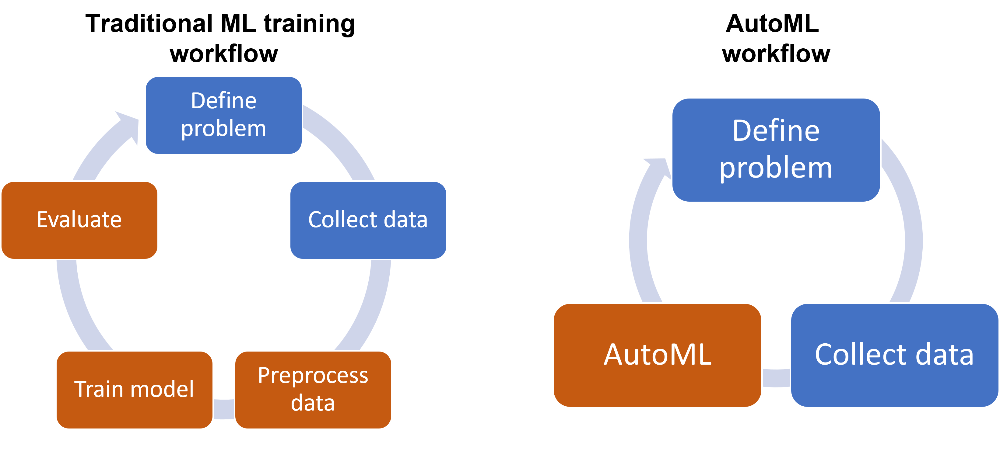

## Table of Contents

## What is automatic evaluation in the context of machine learning?

Automatic evaluation in machine learning refers to the process of using algorithms and metrics to assess the performance of a model without human intervention. This is important because it allows for quick and consistent evaluation of models, especially when dealing with large datasets or when frequent testing is required. Common metrics used in automatic evaluation include accuracy, precision, recall, and F1 score, which provide insights into how well a model is performing on a given task.

For example, in a classification problem, accuracy can be calculated as the ratio of correctly predicted instances to the total instances. This can be expressed as $$ \text{Accuracy} = \frac{\text{Number of Correct Predictions}}{\text{Total Number of Predictions}} $$. Automatic evaluation tools can compute this metric across the entire dataset, providing a clear and objective measure of the model's performance. This approach not only saves time but also reduces the potential for human error, making it an essential part of the machine learning workflow.

## Why is automatic evaluation important for machine learning models?

Automatic evaluation is important for machine learning models because it allows for quick and consistent checks on how well a model is doing. Without automatic evaluation, people would have to go through each prediction by hand, which would take a lot of time and could lead to mistakes. By using automatic methods, we can quickly see if a model is working well or if it needs to be improved. This is especially helpful when working with big sets of data where checking everything manually would be impossible.

Another reason automatic evaluation is important is that it helps keep the evaluation fair and the same every time. When humans do the checking, they might see things differently or make mistakes. But with automatic evaluation, the same rules are used every time, so the results are always fair and can be trusted. For example, if we use accuracy to check a model, the formula $$ \text{Accuracy} = \frac{\text{Number of Correct Predictions}}{\text{Total Number of Predictions}} $$ will be used the same way each time, giving us a clear and reliable way to see how good the model is.

## What are the common metrics used in automatic evaluation of machine learning models?

Common metrics used in automatic evaluation of [machine learning](/wiki/machine-learning) models include accuracy, precision, recall, and F1 score. Accuracy is a straightforward metric that measures the ratio of correct predictions to the total number of predictions. It's calculated using the formula $$ \text{Accuracy} = \frac{\text{Number of Correct Predictions}}{\text{Total Number of Predictions}} $$. Precision and recall are useful when dealing with imbalanced datasets. Precision measures the proportion of true positive predictions among all positive predictions, while recall measures the proportion of true positives identified among all actual positives.

The F1 score combines precision and recall into a single metric, providing a balanced measure of a model's performance. It's calculated as the harmonic mean of precision and recall, using the formula $$ \text{F1 Score} = 2 \times \frac{\text{Precision} \times \text{Recall}}{\text{Precision} + \text{Recall}} $$. These metrics help us understand different aspects of a model's performance. For instance, accuracy gives an overall view, while precision and recall focus on the model's ability to correctly identify positive instances. The F1 score is particularly useful when you need a single metric that balances both precision and recall.

## How does automatic evaluation differ from manual evaluation?

Automatic evaluation uses computer programs to check how well a machine learning model is doing. It uses numbers and formulas to quickly and consistently see if the model's predictions are right. For example, it might use accuracy, which is calculated as $$ \text{Accuracy} = \frac{\text{Number of Correct Predictions}}{\text{Total Number of Predictions}} $$. This way, the evaluation is fast and the same every time, which is helpful when dealing with big sets of data.

Manual evaluation, on the other hand, involves people looking at the model's predictions one by one. This can take a lot of time and might lead to different results because people can see things differently or make mistakes. While manual evaluation can be good for understanding the model's performance in detail, it's not practical for big datasets or when you need to check the model often. Automatic evaluation helps solve these problems by making the process quicker and more reliable.

## Can you explain the process of setting up an automatic evaluation system for a machine learning model?

Setting up an automatic evaluation system for a machine learning model starts with choosing the right metrics for your task. Common metrics include accuracy, which is calculated as $$ \text{Accuracy} = \frac{\text{Number of Correct Predictions}}{\text{Total Number of Predictions}} $$, precision, recall, and the F1 score. Once you decide on the metrics, you need to split your data into training and testing sets. The training set is used to build the model, while the testing set is used to evaluate how well the model performs on new data. You can use libraries like scikit-learn in Python to help with this process. For example, you might use the `train_test_split` function to divide your data.

After preparing your data, you can write a script to automatically calculate the chosen metrics on the test set. This script will run the model on the test data and then use the results to compute the metrics. For instance, if you're using accuracy, your script would count the number of correct predictions and divide it by the total number of predictions. This process can be automated to run every time you update your model, ensuring you always have the latest performance metrics. By setting up this system, you can quickly and consistently check how well your model is doing without having to manually go through each prediction.

## What are the challenges faced when implementing automatic evaluation in machine learning?

One of the main challenges when implementing automatic evaluation in machine learning is choosing the right metrics. Different problems need different ways to check how well a model is doing. For example, if you use accuracy, which is calculated as $$ \text{Accuracy} = \frac{\text{Number of Correct Predictions}}{\text{Total Number of Predictions}} $$, it might not be the best choice for imbalanced datasets where one type of outcome is much more common than the others. In such cases, using metrics like precision, recall, or the F1 score might give a better idea of the model's performance. Deciding which metrics to use can be tricky and requires a good understanding of the problem you're trying to solve.

Another challenge is making sure the automatic evaluation system works well with big datasets. When you have a lot of data, running the evaluation can take a long time and use a lot of computer power. You need to make sure your system can handle this without slowing down too much. Also, if the data changes over time, you need to keep updating your evaluation system to make sure it's still giving you accurate results. This means you have to keep an eye on things and be ready to make changes whenever needed.

## How do accuracy, precision, recall, and F1 score contribute to automatic evaluation?

Accuracy, precision, recall, and F1 score are important metrics used in automatic evaluation to see how well a machine learning model is doing. Accuracy is the simplest metric and tells you the percentage of correct predictions out of all predictions. It's calculated using the formula $$ \text{Accuracy} = \frac{\text{Number of Correct Predictions}}{\text{Total Number of Predictions}} $$. While accuracy is good for some problems, it might not be the best choice if your data is imbalanced, meaning one type of outcome is much more common than the others. That's where precision and recall come in. Precision looks at how many of the positive predictions were actually correct, while recall checks how many of the actual positives were correctly identified. These two metrics help you understand different aspects of your model's performance, especially when dealing with imbalanced data.

The F1 score combines precision and recall into one number, giving you a balanced view of your model's performance. It's calculated using the formula $$ \text{F1 Score} = 2 \times \frac{\text{Precision} \times \text{Recall}}{\text{Precision} + \text{Recall}} $$. The F1 score is useful when you need a single metric that takes into account both false positives and false negatives. By using these four metrics together, you can get a complete picture of how well your model is working. For example, if your model has high accuracy but low recall, it might be missing a lot of important cases. By looking at all these metrics, you can make better decisions about how to improve your model.

## What role do confusion matrices play in automatic evaluation?

Confusion matrices are really helpful in automatic evaluation because they show you how well your machine learning model is doing in a clear way. A confusion matrix is like a table that tells you how many times your model got things right and how many times it got things wrong. It breaks down the predictions into true positives, true negatives, false positives, and false negatives. By looking at these numbers, you can see if your model is good at spotting the thing you're looking for or if it's making a lot of mistakes. For example, if you're trying to predict if an email is spam or not, the confusion matrix will show you how many times your model correctly identified spam emails (true positives) and how many times it wrongly said a normal email was spam (false positives).

These numbers from the confusion matrix are also used to calculate important metrics like accuracy, precision, recall, and the F1 score. Accuracy is just the total number of correct predictions divided by the total number of predictions, which is shown as $$ \text{Accuracy} = \frac{\text{Number of Correct Predictions}}{\text{Total Number of Predictions}} $$. Precision and recall focus on the positive predictions and actual positives, helping you understand if your model is good at finding the right things without making too many mistakes. The F1 score combines precision and recall into one number, giving you a balanced view of your model's performance. By using a confusion matrix, you can easily see where your model needs to get better and make smarter choices about how to improve it.

## How can cross-validation be used to enhance automatic evaluation?

Cross-validation helps make automatic evaluation better by checking how well a model works on different parts of the data. Instead of using just one set of data to test the model, cross-validation splits the data into several smaller parts, or "folds." The model is trained on all but one of these folds and then tested on the left-out fold. This process is repeated so that each fold gets a chance to be the test set. By doing this, you get a more reliable idea of how the model will perform on new data it hasn't seen before. For example, if you use 5-fold cross-validation, you would train the model 5 times, each time leaving out a different fifth of the data for testing. This helps you see if the model's performance is consistent across different parts of the data.

Using cross-validation can also help you spot problems like overfitting, where the model does well on the training data but not on new data. If the model's performance changes a lot from one fold to another, it might be overfitting. Cross-validation gives you a more complete picture of the model's strengths and weaknesses. You can use metrics like accuracy, which is calculated as $$ \text{Accuracy} = \frac{\text{Number of Correct Predictions}}{\text{Total Number of Predictions}} $$, to see how well the model does on each fold. By averaging these scores across all folds, you get a good overall measure of the model's performance. This way, you can trust the automatic evaluation more because it's based on a thorough check of the model's abilities.

## What advanced techniques exist for automatic evaluation beyond traditional metrics?

Beyond traditional metrics like accuracy, precision, recall, and F1 score, there are advanced techniques for automatic evaluation that can give you a deeper understanding of how well a machine learning model is doing. One such technique is using learning curves, which show how the model's performance changes as it gets more data to learn from. By plotting the model's performance on both the training and validation sets as the amount of data increases, you can see if the model is overfitting or underfitting. If the performance on the training set is much better than on the validation set, it might be overfitting. On the other hand, if both performances are low and don't improve much with more data, the model might be underfitting. Learning curves help you decide if you need more data, a different model, or more tweaking to make your model better.

Another advanced technique is using ROC (Receiver Operating Characteristic) curves and AUC (Area Under the Curve). These tools are especially useful for classification problems where you want to understand the trade-off between true positive rate and false positive rate. An ROC curve plots the true positive rate against the false positive rate at various threshold settings. The AUC, which is calculated as the area under the ROC curve, gives you a single number that represents the overall performance of the model. A higher AUC means the model is better at distinguishing between positive and negative classes. For example, an AUC of 1 means the model is perfect, while an AUC of 0.5 means it's no better than random guessing. Using ROC curves and AUC can help you see how well your model works across different decision thresholds, giving you a more complete picture of its performance.

## How do you handle class imbalance issues in automatic evaluation?

When dealing with class imbalance in automatic evaluation, you need to be careful because traditional metrics like accuracy can be misleading. If one class is much more common than the others, a model could seem to do well just by always predicting the common class. For example, if you're trying to predict rare diseases and only 1% of your data has the disease, a model that always says "no disease" would have a high accuracy of 99%, but it's not useful. To handle this, you can use metrics like precision, recall, and the F1 score. Precision tells you how many of the positive predictions were correct, while recall shows how many of the actual positives were found. The F1 score combines these two into one number, giving you a balanced view of the model's performance. It's calculated as $$ \text{F1 Score} = 2 \times \frac{\text{Precision} \times \text{Recall}}{\text{Precision} + \text{Recall}} $$. These metrics help you understand how well your model works on the less common classes.

Another way to deal with class imbalance is by using techniques like oversampling, undersampling, or using special algorithms like SMOTE (Synthetic Minority Over-sampling Technique). Oversampling means adding more copies of the minority class to balance the data, while undersampling means removing some examples from the majority class. SMOTE creates new, synthetic examples of the minority class to make the dataset more balanced. These methods help make sure your model gets enough examples of the less common classes to learn from. Once your data is more balanced, you can use automatic evaluation to check how well your model is doing. By combining these techniques with the right metrics, you can get a better idea of how your model will perform in real-world situations where class imbalance is common.

## What are the latest research trends in automatic evaluation for machine learning?

The latest research trends in automatic evaluation for machine learning focus on improving the reliability and robustness of evaluation methods. One significant trend is the development of new metrics that go beyond traditional measures like accuracy, precision, recall, and the F1 score. Researchers are exploring metrics that can better capture the nuances of model performance, especially in complex tasks like natural language processing and computer vision. For instance, in natural language generation, metrics like BLEU and ROUGE are being supplemented with more advanced measures such as BERTScore, which uses embeddings to assess semantic similarity between generated and reference texts. These new metrics aim to provide a more comprehensive evaluation of a model's capabilities, addressing issues like class imbalance and the need for context-aware assessments.

Another trend is the use of adversarial evaluation techniques, where models are tested against specially designed inputs to reveal weaknesses. This approach helps in understanding how models might perform in real-world scenarios where they could face unexpected or manipulated data. Additionally, there is growing interest in automated machine learning (AutoML) systems that not only build models but also automatically evaluate them using a variety of metrics and validation techniques. These systems can incorporate cross-validation, learning curves, and even techniques like SMOTE to handle class imbalance, ensuring a thorough and fair assessment of model performance. By integrating these advanced evaluation methods, researchers aim to create more reliable and adaptable machine learning models that can better meet the challenges of diverse applications.

## References & Further Reading

[1]: Sokolova, M., & Lapalme, G. (2009). ["A systematic analysis of performance measures for classification tasks."](https://www.sciencedirect.com/science/article/pii/S0306457309000259) Information Processing & Management, 45(4), 427-437.

[2]: Powers, D. M. W. (2011). ["Evaluation: From Precision, Recall and F-Measure to ROC, Informedness, Markedness & Correlation."](https://arxiv.org/abs/2010.16061) Journal of Machine Learning Technologies, 2(1), 37-63.

[3]: Kuang, K. S. C., Quek, S. T., & Tan, S. Y. (2011). ["A review of change detection algorithms for structural health monitoring of pipeline systems."](https://www.researchgate.net/profile/K-Kuang) Annals of Operations Research, 186, 55-83.

[4]: Hanley, J. A., & McNeil, B. J. (1982). ["The meaning and use of the area under a receiver operating characteristic (ROC) curve."](https://pubmed.ncbi.nlm.nih.gov/7063747/) Radiology, 143(1), 29-36.

[5]: Van Aelst, S., & Rousseeuw, P. J. (2009). ["Minimum volume ellipsoid"](https://www.researchgate.net/publication/229803108_Minimum_Volume_Ellipsoid) Wiley Interdisciplinary Reviews: Computational Statistics, 1(1), 71-82.

[6]: Pedregosa, F., Varoquaux, G., Gramfort, A., Michel, V., Thirion, B., Grisel, O., ... & Duchesnay, E. (2011). ["Scikit-learn: Machine learning in Python."](https://dl.acm.org/doi/10.5555/1953048.2078195) Journal of Machine Learning Research, 12, 2825-2830.