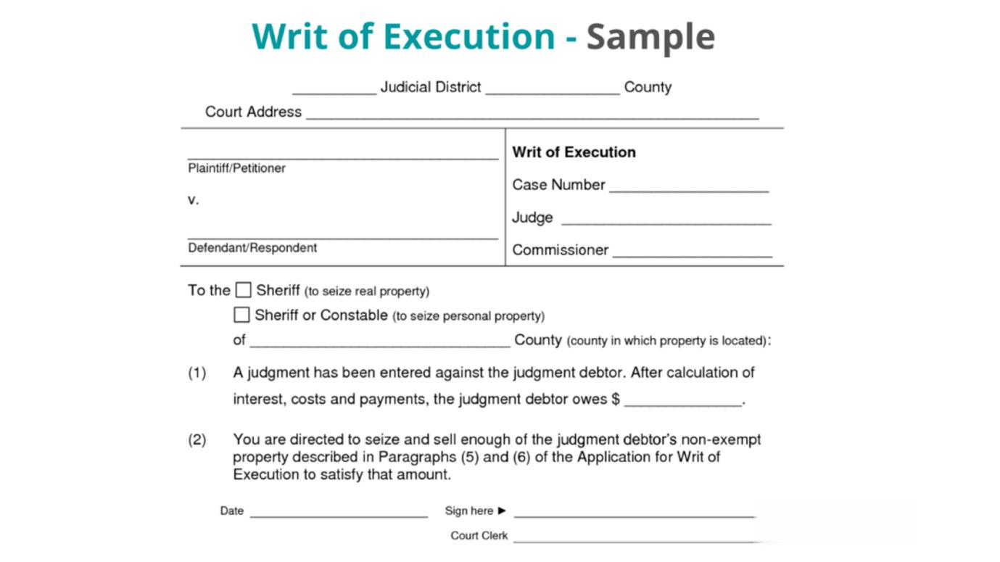

Automated execution and algorithmic trading, often referred to as algo trading, have profoundly transformed financial markets by enabling more rapid and efficient trade execution. These technological advancements have allowed for the execution of complex trading strategies that far surpass human speed and capacity, thereby increasing market efficiency and liquidity.

The advent of automated trading systems has been instrumental in handling the large volumes and fast-paced nature of modern financial markets. Utilizing sophisticated algorithms, these systems can analyze vast datasets to identify and capitalize on trading opportunities often within fractions of a second— an endeavor unfeasible by manual trading methods. As such, algo trading has become a cornerstone of modern finance, facilitating seamless and expedited transactions in various asset classes including equities, foreign exchange (forex), and digital currencies such as cryptocurrencies.



The integration of automated execution systems within the stock market, for instance, allows for the processing of numerous trades simultaneously, thereby minimizing the bid-ask spreads and reducing transaction costs. In forex markets, where trading occurs round the clock, automated systems help traders capitalize on market fluctuations at any given time without the need for constant human oversight. Similarly, in the emerging sphere of cryptocurrencies, automated trading strategies are used to manage the extraordinary volatility and high liquidity of digital assets.

This expansion of algo trading across various markets underscores its pivotal role in streamlining operations that were once constrained by human limitations, paving the way for a more dynamic and interconnected global financial landscape.

## Table of Contents

## What Is Automatic Execution?

Automatic execution represents a significant technological advancement in trading, whereby trades are executed automatically without the necessity for human intervention. This method relies heavily on predefined trading signals which are typically generated from various technical indicators. These indicators can include moving averages, relative strength index (RSI), or Bollinger Bands, among others. The primary objective of using automatic execution is to exploit trading opportunities swiftly and efficiently, which traditional manual trading could not match.

The concept of automatic execution fundamentally revolves around minimizing latency and reducing the likelihood of manual input errors. In trading, latency refers to the delay between the occurrence of a market event and the corresponding response by a trading system. Lower latency in trade execution can often result in more favorable trade prices, as prices can change within fractions of a second. Automatic execution significantly reduces this latency by allowing immediate actions in response to market conditions. 

Furthermore, manual trading is prone to human errors such as incorrect data entry or delayed response to market movements. Automated systems eliminate these errors by executing trades based on precise algorithms without any human input. For example, if a company’s stock reaches a certain price point, an automatic execution system can be programmed to execute a buy or sell order instantaneously.

Here's a simple Python pseudocode example illustrating how automatic trade execution might work using a moving average crossover strategy:

```python
def moving_average(data, window_size):
    return data.rolling(window=window_size).mean()

def execute_trade(signal, position):
    if signal == 'buy' and position != 'long':
        print("Executing Buy Order")
        return 'long'
    elif signal == 'sell' and position != 'short':
        print("Executing Sell Order")
        return 'short'
    return position

# Sample historical price data
price_data = get_historical_price_data()

short_window = 40  # Short moving average period
long_window = 100  # Long moving average period

short_mavg = moving_average(price_data, short_window)
long_mavg = moving_average(price_data, long_window)

position = None
for current_price, short, long in zip(price_data, short_mavg, long_mavg):
    if short > long:
        signal = 'buy'
    elif short < long:
        signal = 'sell'
    else:
        signal = 'hold'

    position = execute_trade(signal, position)
```

This simple example demonstrates how an automatic trading system could respond to market signals without human interference. By setting fixed rules for when to buy or sell, automatic execution enables a disciplined trading strategy that operates consistently under defined market conditions.

## Understanding Automatic Execution

Automatic execution in trading signifies the automation of trade orders, allowing transactions to be executed with minimal human intervention. This method has grown increasingly common, largely due to significant technological advances. It has become a staple in high-frequency trading ([HFT](/wiki/high-frequency-trading-strategies)) and market maker operations, where speed and efficiency are paramount.

One of the critical aspects of automatic execution is its continuous operation capability. Trading systems can function around the clock, taking advantage of market fluctuations at any time of the day or night. This 24/7 operational capability is especially advantageous in the [forex](/wiki/forex-system) market, which is one of the largest decentralized global markets and operates across different time zones.

The automatic execution utilizes sophisticated algorithms and real-time data analysis to identify trading opportunities. These systems analyze various market indicators and execute trades based on predefined parameters, significantly reducing the latency that is inherent with manual trading. By eliminating human delays, traders can respond instantaneously to market events, often gaining a competitive edge.

For example, consider a basic scenario where a trading algorithm is set to buy a currency pair when its 50-day moving average crosses above its 200-day moving average (a common indicator of a bullish market). With automatic execution, once the condition is met, the system can immediately execute the trade without waiting for human confirmation, ensuring timely entry into favorable market conditions.

In high-frequency trading, thousands of trades can be made in fractions of a second, generating profits from minuscule price discrepancies. Market makers also benefit from automatic execution by continuously providing [liquidity](/wiki/liquidity-risk-premium) to the markets through automated buying and selling at quoted prices. The efficiency gained from such automatic processes facilitates smoother market operations and contributes to the overall liquidity and stability of financial markets.

However, the deployment of automatic execution systems requires robust infrastructure and significant computational power. These systems must also be monitored continuously to ensure they are functioning as intended and to address any potential technical glitches or market changes that were not anticipated when the algorithms were programmed.

## Setting Up Automatic Trading

Automated trading systems have become integral tools for traders, allowing them to implement sophisticated strategies with minimal manual intervention. These systems are configured to utilize a variety of strategies and indicators, each designed to optimize trade execution and effectively manage risk.

One common approach is the incorporation of moving averages, which serve as indicators to identify trends in market prices. For example, a system may execute a buy order when a short-term moving average crosses above a long-term moving average, signaling a potential upward trend. Conversely, a sell order might be triggered when the short-term moving average crosses below the long-term moving average.

Stop-loss orders are crucial components of automated systems, facilitating risk management by specifying a price level at which a trade will be automatically exited to prevent further losses. This feature ensures that a trader’s exposure to adverse market movements is limited, preserving capital over time.

Fibonacci ratios are used to determine potential reversal levels by applying mathematical relationships found in the Fibonacci sequence. Traders often set entry or [exit](/wiki/exit-strategy) points at these ratios, anticipating that prices may retrace to these levels following significant movements.

The setup of these systems typically involves specifying parameters for each indicator and strategy through a computer interface. Python, for instance, is a favored language for developing automated trading scripts due to its versatility and numerous libraries designed for financial data analysis. A simple Python script for executing a moving average crossover strategy might utilize libraries such as `pandas` for data manipulation and `TA-Lib` for technical analysis.

```python
import pandas as pd
import talib

# Sample data in a DataFrame
data = pd.DataFrame({
    'close': [40, 42, 41, 43, 44, 45, 41, 40, 39, 42]  # Closing prices
})

# Calculating moving averages
data['short_ma'] = talib.SMA(data['close'], timeperiod=3)
data['long_ma'] = talib.SMA(data['close'], timeperiod=5)

# Identifying crossover points
data['signal'] = 0
data['signal'][data['short_ma'] > data['long_ma']] = 1
data['positions'] = data['signal'].diff()

print(data)
```

This script calculates the short-term and long-term moving averages from closing prices and uses these to generate buy (1) or sell (-1) signals based on their crossovers. This level of automation enables traders to execute entry and exit strategies seamlessly while maintaining adherence to predetermined risk management protocols.

By setting up automated trading systems with these and other technical indicators, traders can enhance their ability to operate efficiently and effectively in today's fast-paced financial markets.

## Automated Execution Strategies

Automated execution strategies employ various algorithmic techniques to optimize trading performance across different market conditions. Among these, trend-following, mean reversion, statistical [arbitrage](/wiki/arbitrage), and high-frequency trading are widely recognized for their distinctive approaches and benefits.

Trend-following strategies capitalize on the [momentum](/wiki/momentum) of market movements by identifying and trading in the direction of prevailing trends. These strategies often utilize technical indicators such as moving averages or the Moving Average Convergence Divergence (MACD) to generate signals. The primary advantage of trend-following is its ability to capture significant price movements when trends are strong and persistent. However, it performs optimally in markets with clear and sustained trends, and may suffer losses during sideways or choppy markets.

Mean reversion strategies are based on the premise that asset prices will eventually revert to their historical averages. These strategies identify overbought or oversold conditions using statistical measures like Bollinger Bands or the Relative Strength Index (RSI). By betting against extreme price movements, traders aim to profit from the eventual return of prices to their average. Mean reversion strategies excel in range-bound markets where asset prices oscillate within established limits, but they can be ineffective in markets experiencing strong trends.

Statistical arbitrage involves exploiting pricing inefficiencies between related financial instruments. This strategy often relies on complex mathematical models and statistical techniques, such as co-integration and [pair trading](/wiki/pair-trading), to identify mispriced assets and execute trades that exploit these discrepancies. The benefit of [statistical arbitrage](/wiki/statistical-arbitrage) lies in its potential for consistent, low-risk returns by betting on the convergence of prices. However, it requires sophisticated modeling and substantial computational resources to identify profitable opportunities.

High-frequency trading (HFT) leverages advanced technology and low-latency connections to execute a large number of orders in fractions of a second. HFT strategies often involve market-making, statistical arbitrage, or exploiting short-lived price inefficiencies. The main advantage of HFT is the ability to generate small, but frequent, profits that accumulate over time. However, this strategy demands significant investment in technology and infrastructure, along with the ability to manage large volumes of data in real-time.

Each of these strategies benefits from automation, as it allows for the rapid execution and continual adaptation required to maintain a competitive edge in today's fast-paced markets. Careful selection of the appropriate strategy and market conditions can maximize the efficacy of automated execution systems.

## Disruption from Automatic Execution

Automation in trading, while vastly improving efficiency and execution speed, can also introduce significant risks and market disruptions. One of the most notable examples is the Flash Crash of May 6, 2010, where the U.S. stock market experienced a rapid and severe downturn before recovering almost as quickly. During this event, the Dow Jones Industrial Average plunged about 1,000 points within minutes, wiping out nearly $1 trillion in market value and causing widespread panic among investors [[1](https://www.sec.gov/news/studies/2010/marketevents-report.pdf)].

Automated trading systems and algorithmic executions, particularly in high-frequency trading (HFT), were identified as contributing factors to this disruption. These systems trade large volumes of securities at exceptionally high speeds, often acting on pre-programmed instructions without human oversight in real-time. While effective in normal market conditions, these systems can create feedback loops during volatile periods, exacerbating price swings and causing liquidity to evaporate temporarily.

For example, algorithms may trigger sell orders as market prices decline, increasing downward pressure. This phenomenon can be modeled mathematically to show how even small initial trades can cascade into large-scale market adjustments:

$$
P_{t+1} = P_t \cdot (1 - \eta S_t)
$$

Where:
- $P_t$ is the price at time $t$,
- $\eta$ is a sensitivity parameter,
- $S_t$ represents the sum of sell orders due to automated strategies.

Unregulated or poorly managed [algorithmic trading](/wiki/algorithmic-trading) can inadvertently lead to situations where multiple systems react simultaneously to perceived market signals, amplifying the initial market move.

To mitigate such risks, continuous monitoring of trading systems is crucial. This involves implementing robust risk management strategies, such as circuit breakers, which temporarily halt trading when indexes decline by a certain percentage. Furthermore, comprehensive testing of algorithms under various scenarios, including stress testing for extreme market conditions, is recommended to ensure resilience.

Regulatory bodies have also recognized the need for oversight in automated trading. In response to the Flash Crash, the Commodity Futures Trading Commission (CFTC) and the Securities and Exchange Commission (SEC) recommended several measures to address potential weaknesses in algorithmic trading systems and introduced new regulations targeting HFT practices [[2](https://www.cftc.gov/sites/default/files/idc/groups/public/@swaps/documents/file/dfstudy_algo021014.pdf)]. These included enhanced transparency requirements, mandatory registration for HFT operators, and tighter controls on the deployment of algorithms.

In conclusion, while automatic execution has transformed financial markets by increasing efficiency and liquidity, it remains essential to balance these benefits with effective risk management and regulatory compliance to prevent unforeseen market disruptions.

References:
1. SEC and CFTC, "Findings Regarding the Market Events of May 6, 2010," September 2010. Available at: [https://www.sec.gov/news/studies/2010/marketevents-report.pdf](https://www.sec.gov/news/studies/2010/marketevents-report.pdf)
2. CFTC, "Review of the CFTC’s Regulatory Oversight of Automated Trading," February 2014. Available at: [https://www.cftc.gov/sites/default/files/idc/groups/public/@swaps/documents/file/dfstudy_algo021014.pdf](https://www.cftc.gov/sites/default/files/idc/groups/public/@swaps/documents/file/dfstudy_algo021014.pdf)

## Conclusion

Algorithmic trading and automated execution systems have played a transformative role in the landscape of financial markets, fundamentally reshaping how trades are conducted. These systems offer unparalleled advantages, especially in terms of speed and precision, which surpass human capabilities. Automation allows for trades to be executed in milliseconds, crucial in markets where timing directly influences profitability. Additionally, by removing human emotions from the trading equation, algo trading minimizes impulsive decisions often detrimental to investment outcomes.

Despite these advantages, traders must remain vigilant about the potential risks associated with automated trading. Systematic errors, technical glitches, and market anomalies can lead to significant financial losses if not carefully managed. Events like the Flash Crash of 2010 demonstrate the potential for automated systems to exacerbate market [volatility](/wiki/volatility-trading-strategies). Therefore, robust risk management practices are essential. Traders should ensure their algorithms are thoroughly backtested and that strategies include fail-safes like stop-loss orders.

Moreover, continuous monitoring and adjustments are vital to maintaining system effectiveness. As markets evolve, so too must the algorithms, adapting to new data and trends. Traders should also stay informed about regulatory changes that govern automated trading to ensure compliance and reduce the risk of disputes.

In summary, while algo trading offers substantial benefits, striking a balance between leveraging technology and managing its inherent risks is crucial. By implementing rigorous risk management strategies and maintaining adaptability, traders can harness the full potential of automated execution systems, driving innovation and efficiency in the financial markets.

## References & Further Reading

[1]: SEC and CFTC, "Findings Regarding the Market Events of May 6, 2010," September 2010. Available at: [https://www.sec.gov/news/studies/2010/marketevents-report.pdf](https://www.sec.gov/news/studies/2010/marketevents-report.pdf)

[2]: CFTC, "Review of the CFTC’s Regulatory Oversight of Automated Trading," February 2014. Available at: [https://www.cftc.gov/sites/default/files/idc/groups/public/@swaps/documents/file/dfstudy_algo021014.pdf](https://www.cftc.gov/sites/default/files/idc/groups/public/@swaps/documents/file/dfstudy_algo021014.pdf)

[3]: ["Advances in Financial Machine Learning"](https://www.amazon.com/Advances-Financial-Machine-Learning-Marcos/dp/1119482089) by Marcos Lopez de Prado

[4]: ["Evidence-Based Technical Analysis: Applying the Scientific Method and Statistical Inference to Trading Signals"](https://www.amazon.com/Evidence-Based-Technical-Analysis-Scientific-Statistical/dp/0470008741) by David Aronson

[5]: ["Machine Learning for Algorithmic Trading"](https://github.com/stefan-jansen/machine-learning-for-trading) by Stefan Jansen

[6]: ["Quantitative Trading: How to Build Your Own Algorithmic Trading Business"](https://www.amazon.com/Quantitative-Trading-Build-Algorithmic-Business/dp/1119800064) by Ernest P. Chan