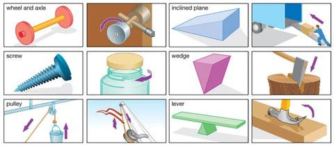

## Table of Contents

## What is automatic exercise?

Automatic exercise is a feature that some financial contracts have. It means that if certain conditions are met at the end of the contract, the contract will be exercised automatically without the owner needing to do anything. This is common in options trading, where an option might automatically be exercised if it is profitable at expiration.

This feature helps make sure that people don't miss out on profits because they forgot to act. For example, if you own a call option and the stock price is above the strike price at expiration, the option will automatically be exercised, and you will buy the stock at the strike price. This can be very helpful, especially for people who might not be able to keep a close eye on their investments all the time.

## How does automatic exercise work?

Automatic exercise is a feature in options trading that happens when an option reaches its expiration date. If the option is "in the money," which means it has value, it will be exercised automatically without the owner having to do anything. For example, if you have a call option and the stock price is higher than the strike price at expiration, the option will automatically be exercised, and you will buy the stock at the strike price.

This feature is helpful because it makes sure people don't miss out on profits just because they forgot to act. It's especially useful for people who can't watch their investments all the time. However, it's important to know that not all options have automatic exercise, so it's good to check the terms of your specific option contract.

## What are the benefits of automatic exercise?

Automatic exercise helps people not miss out on money they could make. If you have an option that is worth something when it expires, it will automatically be exercised. This means you don't have to remember to do anything, which is really helpful if you're busy or can't always check your investments.

It also makes things easier and less stressful. You don't have to worry about forgetting to exercise your option and losing money. This can give you peace of mind, knowing that the system will take care of it for you if your option is in the money at expiration.

## Can you provide examples of automatic exercise in daily life?

Imagine you have a coupon for a free coffee at your favorite cafe. The coupon says it will be used automatically if you visit the cafe on the last day it's valid. So, if you go to the cafe on that day, you don't need to remember to show the coupon. The cafe will give you the free coffee automatically because the coupon is still good.

Another example is a gym membership that renews automatically. If you signed up for a year and the membership is set to renew at the end of that year, it will happen without you doing anything. As long as you haven't canceled it, the gym will charge your card and your membership will continue. This makes it easy because you don't have to remember to renew it yourself.

## What technologies or devices are commonly used in automatic exercise?

In options trading, automatic exercise is handled by computer systems at the stock exchange or the brokerage firm. These systems check the value of options when they expire. If an option is worth something, the computer will automatically exercise it. This means the system will buy or sell the stock for you without you needing to do anything. The technology behind this includes trading platforms and algorithms that manage the process.

For everyday examples, like gym memberships or coupons, the technology can be simpler. A gym might use a membership management system that automatically renews your membership by charging your card. This system keeps track of when your membership is due to expire and processes the payment without any action from you. Similarly, a store might use a point-of-sale system that checks for valid coupons when you make a purchase, automatically applying any that are still good.

## How is automatic exercise different from traditional exercise?

Automatic exercise and traditional exercise are two different things. Automatic exercise is about options trading or things like gym memberships and coupons that happen without you doing anything. For example, if you have an option that is worth money when it expires, the computer system at the stock exchange will automatically exercise it for you. Or, if you have a gym membership that renews automatically, the gym's system will charge your card without you needing to remember to renew it.

Traditional exercise, on the other hand, is about physical activities that you do to stay healthy and fit. This can include things like running, lifting weights, or doing yoga. You have to decide to do these activities and put in the effort yourself. Unlike automatic exercise, where a system does the work for you, traditional exercise requires you to be active and make a conscious effort to move your body.

## What are the psychological impacts of engaging in automatic exercise?

Engaging in automatic exercise, like having options automatically exercised or memberships automatically renewed, can give you peace of mind. You don't have to worry about forgetting to do something important, like exercising an option that could make you money. This can reduce stress and make you feel more relaxed because you know the system will take care of it for you.

However, relying on automatic exercise might also make you feel less in control. Some people might feel anxious about not being able to make their own decisions, especially if they prefer to manage their investments or memberships themselves. It's important to find a balance that works for you, where you feel both secure and in control of your choices.

## How can automatic exercise be integrated into a busy lifestyle?

Automatic exercise can make life easier for busy people. If you have a job or a lot of things to do, it can be hard to remember to exercise your options or renew your gym membership on time. With automatic exercise, you don't have to worry about that. The system will do it for you, so you can focus on other things without missing out on money or losing your membership.

For example, if you have a call option that is worth money when it expires, the computer system will automatically buy the stock for you. This means you don't need to check your investments every day. You can spend your time working or being with your family, and still make money from your options. It's a simple way to keep your financial life running smoothly, even when you're busy.

## What are the potential risks or limitations of automatic exercise?

Automatic exercise can be helpful, but it also has some risks. One big risk is that you might not want the option to be exercised, but it happens anyway because you forgot to cancel it. For example, if the stock price is just a little bit above the strike price, you might not want to buy the stock because it's not worth it to you. But if you don't cancel the automatic exercise, you'll end up buying the stock anyway.

Another limitation is that automatic exercise might not always work the way you expect. Sometimes, there can be technical problems with the computer systems that handle the automatic exercise. If there's a glitch, your option might not be exercised even if it should be. This means you could miss out on money you could have made. It's important to keep an eye on your investments, even if you're using automatic exercise, to make sure everything goes as planned.

## How does automatic exercise adapt to different fitness levels?

Automatic exercise, like gym memberships that renew on their own, can be helpful for people at different fitness levels. If you're just starting out, you might not know much about fitness. An automatic gym membership means you don't have to remember to sign up again. You can go to the gym whenever you want without worrying about your membership running out. This can make it easier for beginners to keep going and get better at exercising.

For people who are already fit, automatic exercise can still be useful. If you're busy but want to keep up your fitness routine, having your membership renew automatically means you don't have to think about it. You can focus on your workouts and not on the paperwork. This way, you can keep exercising at your level without any interruptions.

## What research has been conducted on the effectiveness of automatic exercise?

Research on automatic exercise, like options trading and gym memberships, shows it can be really helpful. Studies have found that when options are automatically exercised, people don't miss out on money they could make. This is because the computer system does the work for them. For gym memberships, research shows that automatic renewals help people keep going to the gym. They don't have to remember to sign up again, so they can focus on working out and staying healthy.

However, there are also some challenges with automatic exercise. Some studies have pointed out that people might not always want their options to be exercised, but it happens anyway if they forget to cancel it. This can lead to buying stocks they don't really want. For gym memberships, research has shown that some people feel less in control when things happen automatically. They might prefer to decide for themselves when to renew their membership. So, while automatic exercise can be very useful, it's important to understand both the good and the bad sides.

## How can one measure the progress and impact of automatic exercise on their health?

To measure the progress and impact of automatic exercise on your health, you can look at how often you go to the gym or use your membership. If your membership renews automatically, you might find it easier to keep going regularly because you don't have to worry about signing up again. You can track how many times you visit the gym each week or month. This can help you see if you're becoming more active over time. Also, you can pay attention to how you feel. If you're feeling stronger, less tired, or happier, that's a good sign that the automatic exercise is helping your health.

Another way to measure the impact is by looking at specific health markers. For example, you can check your weight, blood pressure, or even how well you sleep. If these numbers get better over time, it means the automatic exercise is working. You can also ask your doctor to do regular check-ups to see if there are any improvements in your overall health. By keeping an eye on these things, you can tell if the automatic exercise is making a positive difference in your life.

## How does automatic exercise work?

Options contracts provide holders with the right, but not the obligation, to buy or sell an underlying asset at a predetermined strike price. The ability to exercise these options manually is crucial; however, automatic exercise offers a consistent safeguard by ensuring that in-the-money options are exercised at expiration without the need for manual intervention. This process is notably facilitated by the Options Clearing Corporation (OCC).

Automatic exercise operates primarily at the expiration of the options contract. At this point, the OCC's systems automatically evaluate options to determine whether they are in-the-money. An option is considered in-the-money if it would result in a positive cash flow upon exercise. For call options, this means the spot price of the underlying asset exceeds the strike price, while for put options, the strike price is higher than the spot price of the underlying asset.

Consider the mathematical expression for determining if a call option is in-the-money, which can be represented as: 

$$

\text{In-the-money Condition (Call)}: \quad S > K 
$$

Where:
- $S$ is the spot price of the underlying asset.
- $K$ is the strike price of the option.

Similarly, for put options, the condition is:

$$

\text{In-the-money Condition (Put)}: \quad K > S 
$$

When options meet these conditions at expiration, the OCC automatically exercises these positions on behalf of the option holder. This automated process is vital for preventing missed profit opportunities due to an oversight, unavailability, or forgetfulness.

It is important to note the distinction between American and European style options. American style options allow the holder to exercise their rights at any point up to and including the expiration date, providing greater flexibility. Conversely, European style options restrict this action to the expiration date only. Despite these style differences, at expiration, the automatic exercise applies to both styles when the options are in-the-money. This ensures that traders who may overlook or unable to act on their options still benefit from their positions, thus maximizing their potential returns.

By implementing automatic exercise, traders leverage a mechanism that eliminates the necessity for constant monitoring, allowing them to focus on broader strategic considerations. This feature is particularly valuable in environments driven by speed and efficiency, where every moment counts in seizing profitable opportunities.

## What are the risks and benefits of automatic exercise?

Automatic exercise of options provides both significant benefits and notable risks for traders, particularly in automated and fast-moving markets. This mechanism ensures that traders do not miss profitable opportunities by automating the process of exercising in-the-money options at expiration. The primary advantage is the convenience and automatic assurance of potential profit realization when the market moves favorably.

However, automatic exercise does not come without its challenges. One primary risk is the potential for unexpected financial obligations. When an option is automatically exercised, the trader may be required to purchase or sell the underlying assets, which can lead to unforeseen financial consequences. For instance, if a call option on a stock is automatically exercised and the trader does not hold enough cash to cover the purchase, they may need to liquidate other holdings or borrow funds to fulfill the obligation. Conversely, a put option could result in the need to deliver shares that the trader does not own, potentially leading to short-selling situations.

Understanding the specific policies and procedures of brokerage firms concerning automatic exercise is crucial. Each firm may have different thresholds for what constitutes an "in-the-money" option at expiration. Most brokerage firms follow the guidelines set by the Options Clearing Corporation (OCC), which standardizes this process. However, firm-specific variations can affect how options are automatically exercised. For instance, some firms may exercise options that are only slightly in-the-money, while others may avoid exercising unless the in-the-money amount is significant.

To mitigate the risks associated with automatic exercise, traders should consider setting up alerts and notifications regarding their option positions and expiration dates. By staying informed, they can make preemptive decisions if necessary. For instance, if an option's potential exercise could lead to undesirable financial outcomes, a trader might choose to close or roll over the position before expiration.

To illustrate the financial implications with a simple example, assume a trader holds a call option with a strike price significantly below the current market price of the underlying asset. If this option is automatically exercised, the formula for the profit (excluding transaction costs) is:

$$
\text{Profit} = (\text{Market Price} - \text{Strike Price}) \times \text{Number of Contracts} \times 100
$$

While this calculation appears straightforward, failing to account for costs like margin requirements and potential taxes can affect net profitability.

In conclusion, automatic exercise is a tool imbued with both convenience and risk. It requires traders to actively understand their positions and the policies of their brokers to harness its benefits effectively while minimizing financial exposure.

## References & Further Reading

[1]: ["Option Trading: Pricing and Volatility Strategies and Techniques"](https://www.wiley.com/en-us/Option+Trading%3A+Pricing+and+Volatility+Strategies+and+Techniques+-p-9781119198673) by Euan Sinclair

[2]: ["Options, Futures, and Other Derivatives (10th Edition)"](https://www.amazon.com/Options-Futures-Other-Derivatives-10th/dp/013447208X) by John C. Hull

[3]: ["The Options Playbook: Featuring 40 strategies for bulls, bears, rookies, all-stars and everyone in between"](https://www.amazon.com/Options-Playbook-Featuring-strategies-all-stars/dp/B0CV3YFBWF) by Brian Overby

[4]: ["Algorithmic Trading: Winning Strategies and Their Rationale"](https://www.wiley.com/en-us/Algorithmic+Trading%3A+Winning+Strategies+and+Their+Rationale-p-9781118746912) by Ernest P. Chan

[5]: The Options Clearing Corporation. ["Automatic Exercise Rules"](https://www.theocc.com/Company-Information/Documents-and-Archives/By-Laws-and-Rules) 

[6]: Chance, Don M., "An Introduction to Derivatives and Risk Management." (9th Edition). 

[7]: ["Machine Learning in Finance: From Theory to Practice"](https://www.amazon.com/Machine-Learning-Finance-Theory-Practice/dp/3030410676) by Matthew F. Dixon, Igor Halperin, Paul Bilokon