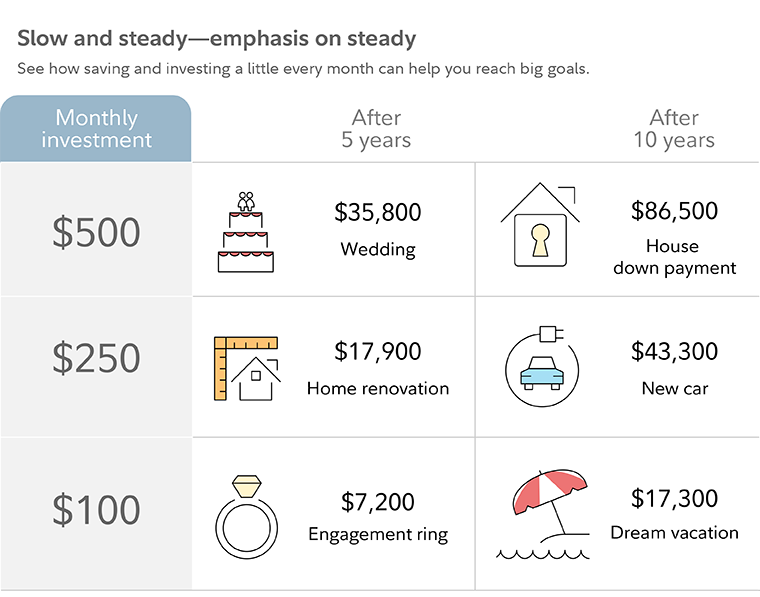

## Table of Contents

## What is an Automatic Investment Plan (AIP)?

An Automatic Investment Plan (AIP) is a way to invest money regularly without having to remember to do it each time. It works by setting up a plan where a certain amount of money is automatically taken from your bank account and put into an investment, like a mutual fund or a stock, at regular intervals, such as monthly or weekly. This makes investing easier because you don't have to think about it every time, and it helps you build up your investments over time.

Using an AIP can be a good strategy for people who want to save for the future, like for retirement or a big purchase. It helps you stay disciplined with your investing because the money is moved automatically. Plus, by investing regularly, you can take advantage of something called "dollar-cost averaging," which means you buy more shares when prices are low and fewer when prices are high, which can lead to better overall returns on your investment.

## How does an Automatic Investment Plan work?

An Automatic Investment Plan (AIP) works by setting up a regular transfer of money from your bank account into an investment account. You decide how much money you want to invest and how often, like every month or every two weeks. Once you set it up, the money is automatically moved on the dates you choose. This means you don't have to remember to invest each time, making it easier to save money regularly.

When you use an AIP, you can invest in things like mutual funds, stocks, or other types of investments. One good thing about this plan is that it helps you use a strategy called dollar-cost averaging. This means you buy more shares when the price is low and fewer when the price is high. Over time, this can help you get a better average price for your investments. It's a simple way to keep investing without having to think about it too much.

## What are the benefits of using an Automatic Investment Plan?

Using an Automatic Investment Plan (AIP) has many benefits. One big benefit is that it makes saving money easy. You set it up once, and then money moves from your bank to your investment account without you having to do anything else. This means you don't forget to invest, and it helps you stay on track with your saving goals. It's like setting a reminder that never fails.

Another benefit is that AIPs help you use a strategy called dollar-cost averaging. This means you buy more shares when prices are low and fewer when prices are high. Over time, this can lead to better returns on your investment because you're not trying to guess when to buy. It's a smart way to invest without needing to watch the market every day.

Lastly, AIPs can help you build a habit of saving. By investing a little bit regularly, you can slowly grow your money over time. This is good for long-term goals like saving for retirement or buying a house. It's a simple way to make sure you're always putting some money aside for the future.

## What are the different types of Automatic Investment Plans available?

There are several types of Automatic Investment Plans, but they all work in a similar way. One common type is a mutual fund AIP, where you set up regular transfers from your bank account into a mutual fund. This can be a good choice if you want to invest in a variety of stocks or bonds without having to pick them yourself. Another type is a stock AIP, where you invest in individual stocks automatically. This might be right for you if you want to focus on certain companies or industries.

Another option is a 401(k) or similar retirement plan AIP. Many people use this to save for retirement by automatically putting part of their paycheck into their retirement account. This can be a great way to save for the future without even thinking about it. Lastly, there are also AIPs for other types of investments like ETFs or index funds. These work similarly to mutual funds but might have different fees or investment strategies.

Choosing the right type of AIP depends on your goals and what you feel comfortable with. Some people like the simplicity of mutual funds or ETFs, while others might want to pick their own stocks. No matter which type you choose, the key is that it helps you save money regularly without having to remember to do it each time.

## How can someone set up an Automatic Investment Plan?

Setting up an Automatic Investment Plan (AIP) is easy. First, you need to decide what you want to invest in, like a mutual fund, a stock, or a retirement account. Once you know what you want, you can go to the website of the investment company or talk to a financial advisor. They will help you set up your plan. You'll need to tell them how much money you want to invest and how often, like every month or every two weeks. You'll also need to give them your bank account information so they can take the money out automatically.

After you've given them all the information, the company will set up the AIP for you. They'll make sure the money is moved from your bank to your investment account on the dates you chose. You don't have to do anything else after that. The money will keep moving automatically, helping you save without having to think about it. If you ever want to change how much you're investing or stop the plan, you can just call the company or go back to their website and make the changes.

## What are the costs associated with Automatic Investment Plans?

When you set up an Automatic Investment Plan (AIP), you might have to pay some costs. One common cost is the fee that the investment company charges for managing your money. This could be a small percentage of your investment, like 0.5% to 1% each year. Another possible cost is a transaction fee, which is what you pay every time money is moved from your bank to your investment account. These fees are usually pretty small, but they can add up over time.

Some AIPs might also have other fees, like account maintenance fees or fees for buying and selling certain investments. It's important to read all the information the investment company gives you so you know exactly what you might have to pay. The good news is that many companies now offer low-cost or even no-cost AIPs, especially for things like index funds or ETFs. So, it's a good idea to shop around and find a plan that fits your budget and helps you save money in the long run.

## Can Automatic Investment Plans be customized to fit individual financial goals?

Yes, Automatic Investment Plans can be customized to fit your personal financial goals. When you set up an AIP, you can choose how much money you want to invest and how often. For example, if you're saving for a big purchase like a house, you might decide to invest more money each month. If you're just starting to save for retirement and want to go slow, you can set a smaller amount. You can also pick the type of investment that matches your goals, like stocks if you want to grow your money quickly, or bonds if you want something safer.

Another way to customize your AIP is by changing it as your life changes. If you get a raise at work, you might want to increase how much you invest. Or if you have a baby and need to save for their college, you can adjust your plan to fit that new goal. Most investment companies make it easy to change your AIP whenever you need to, so you can keep it working for you no matter what happens.

## What are the risks involved with Automatic Investment Plans?

When you use an Automatic Investment Plan, there are some risks you should know about. One big risk is that the value of your investments can go up and down. If the stock market has a bad day, week, or even year, the money you've invested might lose value. This is normal with investing, but it can be scary to see your savings go down. Also, if you're investing in just one stock or a small group of stocks, you might be taking on more risk than if you spread your money out over many different investments.

Another risk is that you might forget about your AIP and not check it often enough. It's easy to set it up and then not think about it, but it's important to look at your investments now and then. You might need to change how much you're investing or switch to different investments if your goals change. If you don't keep an eye on things, you could miss out on better opportunities or keep money in investments that aren't doing well. So, while AIPs make saving easier, you still need to pay attention to make sure they're working for you.

## How does dollar-cost averaging relate to Automatic Investment Plans?

Dollar-cost averaging is a strategy that works really well with Automatic Investment Plans. It means you invest the same amount of money at regular times, like every month. When you do this, you buy more shares when prices are low and fewer when prices are high. This can help you get a better average price for your investments over time. With an AIP, you set up your plan to do this automatically, so you don't have to think about it. It's like setting a routine that helps you invest smarter without any extra effort.

Using dollar-cost averaging with an AIP takes away the worry of trying to guess the best time to invest. Instead of trying to buy when the market is at its lowest, you just keep investing regularly. This can make investing less stressful and more predictable. Over time, this steady approach can lead to good results, especially if you're saving for long-term goals like retirement. It's a simple way to build your investments without having to watch the market every day.

## What impact do market conditions have on Automatic Investment Plans?

Market conditions can affect your Automatic Investment Plan because they change the value of your investments. If the market goes up, the value of what you're investing in, like stocks or mutual funds, will also go up. This means your savings will grow more quickly. But if the market goes down, the value of your investments will drop too. This is normal and happens to everyone who invests in the market. The good news is that with an AIP, you keep investing the same amount no matter what the market is doing, which can help you buy more when prices are low.

Even though market conditions can make your investments go up and down, using an AIP can help you handle these changes better. When you invest regularly, you're using a strategy called dollar-cost averaging. This means you buy more shares when prices are low and fewer when prices are high. Over time, this can lead to a better average price for your investments. So, even if the market is going through a rough patch, your AIP keeps you on track and helps you take advantage of lower prices. It's like having a plan that works for you no matter what the market is doing.

## How can one monitor and adjust an Automatic Investment Plan over time?

To monitor and adjust your Automatic Investment Plan, you should check your investments regularly. This means looking at your account to see how your money is doing. You can do this by logging into your investment account online or by getting statements from your investment company. It's a good idea to check your AIP at least once every few months. This way, you can see if your investments are growing or if they're losing value. If you see something you don't like, you can make changes to your plan.

Adjusting your AIP is easy. If you want to change how much money you're investing each month, or if you want to switch to different investments, you can do this by contacting your investment company. They can help you make the changes you need. You might want to invest more if you get a raise at work, or less if you need money for something else. Also, if your financial goals change, like if you decide to save for a house instead of just retirement, you can adjust your AIP to fit those new goals. Keeping your plan up to date helps make sure it's always working for you.

## What advanced strategies can be employed with Automatic Investment Plans to optimize returns?

One advanced strategy to optimize returns with an Automatic Investment Plan is to use asset allocation. This means spreading your money across different types of investments, like stocks, bonds, and real estate. By doing this, you can balance risk and reward. For example, you might put more money into stocks when you're young because they can grow a lot over time, but as you get closer to retirement, you might shift more money into bonds because they're safer. You can set up your AIP to automatically adjust these allocations based on your age or other factors, which helps keep your investments in line with your goals without you having to do much work.

Another strategy is to use tax-efficient investing. This means choosing investments that will help you pay less in taxes. For example, you might invest in tax-free municipal bonds or put money into a Roth IRA where your earnings grow tax-free. With an AIP, you can set up regular contributions to these tax-advantaged accounts, which can help you save more money over time. By combining these strategies with your AIP, you can make your investments work harder for you and keep more of your returns.

## References & Further Reading

[1]: Bergstra, J., Bardenet, R., Bengio, Y., & Kégl, B. (2011). ["Algorithms for Hyper-Parameter Optimization."](https://dl.acm.org/doi/10.5555/2986459.2986743) Advances in Neural Information Processing Systems 24.

[2]: ["Advances in Financial Machine Learning"](https://www.amazon.com/Advances-Financial-Machine-Learning-Marcos/dp/1119482089) by Marcos Lopez de Prado

[3]: ["Evidence-Based Technical Analysis: Applying the Scientific Method and Statistical Inference to Trading Signals"](https://www.amazon.com/Evidence-Based-Technical-Analysis-Scientific-Statistical/dp/0470008741) by David Aronson

[4]: ["Machine Learning for Algorithmic Trading"](https://github.com/stefan-jansen/machine-learning-for-trading) by Stefan Jansen

[5]: ["Quantitative Trading: How to Build Your Own Algorithmic Trading Business"](https://www.amazon.com/Quantitative-Trading-Build-Algorithmic-Business/dp/1119800064) by Ernest P. Chan