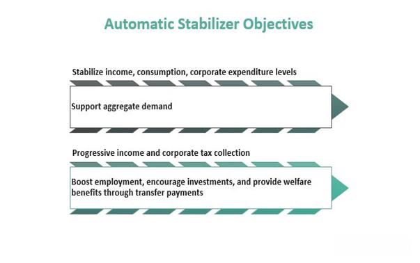

Economic fluctuations are inherent to the business cycle, presenting challenges that often necessitate policy interventions to stabilize the economy. Among these interventions, automatic stabilizers stand out as essential fiscal tools. Automatic stabilizers encompass government policies that automatically adjust in response to economic conditions, helping to smooth economic cycles without requiring specific governmental action. By their nature, these tools mitigate the volatility of economic fluctuations, thus playing a crucial role in sustaining economic stability.

This article aims to elucidate the functioning of automatic stabilizers within the broader context of fiscal policy, highlighting their significance in maintaining economic equilibrium during periods of downturn, such as the COVID-19 pandemic. The pandemic underscored the importance of having robust automatic systems to counteract severe economic shocks without delay.



Additionally, the integration of automatic stabilizers with algorithmic trading is examined, presenting an intersection between fiscal policy and financial technology. Algorithmic trading, which relies on complex algorithms to execute trades, increasingly incorporates economic indicators, including those related to automatic stabilizers. This incorporation helps in understanding market conditions more accurately and adapting trading strategies accordingly.

Furthermore, the article discusses the comparative effectiveness of automatic stabilizers in developed versus developing countries. Developed nations typically possess sophisticated fiscal systems capable of deploying automatic stabilizers effectively. In contrast, developing nations often face structural challenges that may limit the effectiveness of these tools, necessitating tailored approaches to policy implementation.

The exploration of automatic stabilizers also provides insights into their contribution to corporate social responsibility (CSR) and sustainability efforts. By ensuring economic stability, automatic stabilizers support sustainable growth, benefiting society at large. The implications for CSR extend to promoting equitable economic conditions, reducing poverty, and supporting community welfare initiatives.

In conclusion, understanding automatic stabilizers is vital for comprehending their role in global economic frameworks and for crafting strategies that promote robust, stable economic growth. Subsequent sections of this article will delve into detailed examples, theoretical underpinnings, and real-world applications reflecting the power and potential of these tools in the modern fiscal and financial landscape.

## Table of Contents

## What Are Automatic Stabilizers?

Automatic stabilizers are fundamental components of fiscal policy, designed to mitigate fluctuations in economic activity through mechanisms that operate without the need for explicit government intervention. These tools activate in response to economic conditions, providing an inherent form of insurance against the cyclical nature of economies.

The core examples of automatic stabilizers include progressive tax systems and welfare programs such as unemployment insurance. Progressive tax systems inherently adjust the tax burden based on income levels; during economic expansions, when income typically rises, so does the tax liability, effectively reducing disposable income and cooling the economy. Conversely, in downturns, as income falls, tax liabilities decrease, increasing disposable income and stimulating economic activity.

Similarly, welfare programs and unemployment insurance play a critical role during economic downturns. Unemployment insurance provides temporary financial support to individuals who have lost their jobs, helping to sustain consumer spending and stabilize demand in the economy. These programs escalate in response to rising unemployment, automatically injecting funds into the economy when it is most needed.

The operation of automatic stabilizers can be described mathematically. Consider $T$ as the total tax revenue and $Y$ as the national income. In a progressive tax system, $T = t(Y)$, where $t$ is a function that increases with $Y$. During a downturn, $Y$ decreases, and the function $t(Y)$ ensures $T$ decreases proportionally, increasing disposable income ($Y - T$).

Automatic stabilizers are rooted in Keynesian economic theory, which champions the use of policy tools to smooth out the irregularities of the economic cycle. These stabilizers help avoid the extremes of economic cycles—both severe recessions and unsustainable expansions—by automatically adjusting fiscal conditions to sustain aggregate demand. Their non-discretionary nature means they can respond more swiftly than discretionary fiscal interventions, which require legislative processes to be enacted. This immediacy enhances their effectiveness in maintaining economic stability and supporting long-term growth.

## Types of Automatic Stabilizers

Automatic stabilizers are crucial components of fiscal policy designed to moderate the fluctuations in an economy's output and employment levels. Among these, several key mechanisms exist that function without requiring new legislative action or intervention, automatically adjusting based on the prevailing economic conditions.

**Progressive Tax Systems**

Progressive tax systems are structured to impose a higher tax rate on higher income brackets, effectively redistributing income in a manner that stabilizes disposable income across economic cycles. During economic booms, individuals and businesses earn more, thus moving into higher tax brackets and paying a larger portion of their income in taxes. This mechanism decreases their disposable income, which in turn tempers excessive spending and overheating in the economy. Conversely, during recessions, earnings tend to decrease, moving many taxpayers into lower brackets and reducing their tax burden. This increase in disposable income supports consumer spending, cushioning the economy from further contractions.

Mathematically, a progressive tax can be expressed as:
$$
T = f(I)
$$
where $T$ is the tax liability, and $f(I)$ represents a function that increases the tax rate with increases in income $I$.

**Unemployment Benefits**

Unemployment benefits are designed to provide temporary financial assistance to individuals who have lost their jobs. This stabilizer maintains consumer spending as recipients continue to purchase goods and services despite being unemployed. The continuation of spending helps sustain demand within the economy, aiding in a faster recovery from downturns. The benefits formula is typically based on a proportion of previous earnings capped at a certain level to ensure adequacy and financial discipline.

In Python, the calculation of benefits can be simplified as:
```python
def calculate_unemployment_benefit(previous_earnings, benefit_rate=0.5, max_benefit=500):
    return min(previous_earnings * benefit_rate, max_benefit)
```

**Welfare Programs**

Welfare programs support vulnerable groups by increasing government assistance during economic slowdowns. These programs are crucial for maintaining minimum living standards for low-income individuals and families, managing poverty levels, and preventing sharp declines in overall economic activity. By providing aid automatically when certain economic thresholds or criteria are met, welfare programs help stabilize aggregate demand, thus softening the impact of economic fluctuations on the most affected populations.

**Corporate Tax Policies**

Corporate tax policies can also serve as automatic stabilizers by adjusting tax liabilities in response to economic conditions. For instance, during a downturn, corporate profits may decline, automatically reducing the total tax bill based on profit levels. This reduction leaves more capital at the disposal of companies to invest or sustain operations, aiding in economic recovery and cushioning employment levels. Conversely, during economic booms, higher profits result in higher tax payments, which can reduce excessive corporate investment that might lead to unproductive asset bubbles.

These automatic stabilizers form an integral part of a well-functioning economic system, enabling governments to respond efficiently to economic variations without the delays associated with discretionary fiscal policy measures.

## Role of Automatic Stabilizers in Economic Theory

Automatic stabilizers are deeply rooted in Keynesian economic theory, which emerged as a response to the inadequacies of classical economics during the Great Depression. Keynesian economics posits that aggregate demand is often the driving force behind economic growth and employment levels, suggesting that during downturns, government intervention is necessary to stabilize the economy. Automatic stabilizers, such as progressive tax systems and welfare programs, are instrumental in this framework, as they adjust fiscal parameters automatically in response to economic changes, thereby helping maintain economic equilibrium.

Keynesian economics focuses on the total spending in the economy and its effects on output and inflation. Automatic stabilizers play a significant role by modulating this spending without the need for active policy adjustments. For example, during an economic downturn, tax receipts tend to fall due to lower incomes, while government expenditures on social welfare programs increase as more individuals qualify for benefits. This combination supports aggregate demand by maintaining consumption levels, thus softening the impact of recessions.

The inherent non-discretionary nature of automatic stabilizers ensures that they act swiftly, providing fiscal support without requiring time-consuming legislative processes. This immediate responsiveness is crucial, as it helps mitigate the risks of deep recessions by sustaining consumer spending and business activity even when market conditions are unfavorable. By providing a counter-cyclical fiscal response, automatic stabilizers help avoid unsustainable economic booms and busts, promoting steady growth and stability.

Furthermore, automatic stabilizers can be understood through their mathematical relationship with economic output. If $Y$ represents the aggregate output and $C$, $I$, $G$, and $NX$ are consumption, investment, government spending, and net exports respectively, the basic Keynesian identity is:

$$
Y = C + I + G + NX
$$

During economic downturns, automatic stabilizers primarily influence $C$ and $G$. Progressive taxation adjusts disposable income levels, thereby affecting consumption $C$, while increased government spending $G$ through welfare programs injects additional funds into the economy.

The operational efficiency of automatic stabilizers is also evident in their ability to provide stability with minimal administrative overhead. Their automatic nature means that once policies are in place, they require little to no intervention from policymakers, which avoids potential delays and ensures timely support for the economy. This contrasts with discretionary fiscal policies, which necessitate legislative approval and can be subject to political variability. Automatic stabilizers thus ensure a steady approach to mitigating the effects of economic fluctuations, aligning with Keynesian principles of maintaining and supporting aggregate demand.

## Algorithmic Trading and Automatic Stabilizers

Algorithmic trading leverages computer algorithms to execute trades based on predefined criteria, offering a rapid and efficient response to changing market conditions. These algorithms often incorporate a myriad of economic indicators, including those derived from automatic stabilizers, to enhance trading strategies. Automatic stabilizers, such as unemployment insurance claims and tax revenue variations, provide crucial insights into economic conditions and guide traders in formulating optimal strategies.

Incorporating automatic stabilizers into [algorithmic trading](/wiki/algorithmic-trading) involves a sophisticated analysis of economic indicators to anticipate market trends. For example, a rise in unemployment claims may indicate an impending economic slowdown, prompting algorithms to adopt a more conservative trading strategy. Conversely, an increase in tax revenues could suggest economic expansion, encouraging more aggressive trading strategies. By integrating these stabilizers, algorithms can adjust their trading strategies in real-time, reducing exposure to market [volatility](/wiki/volatility-trading-strategies).

Modern trading systems utilize advanced techniques like [backtesting](/wiki/backtesting) and [machine learning](/wiki/machine-learning) to analyze the potential impacts of automatic stabilizers on market conditions. Backtesting allows traders to simulate trading strategies using historical data to evaluate their effectiveness during previous economic cycles, offering insights into how similar conditions might unfold in the future. Python code for backtesting might involve:

```python
import pandas as pd
import numpy as np
from backtesting import Backtest, Strategy

# Example strategy using simple moving average
class SMA_Strategy(Strategy):
    n1 = 10
    n2 = 20

    def init(self):
        self.sma1 = self.I(pd.Series.rolling, self.data.Close, self.n1).mean
        self.sma2 = self.I(pd.Series.rolling, self.data.Close, self.n2).mean

    def next(self):
        if self.sma1[-1] > self.sma2[-1]:
            self.buy()
        elif self.sma1[-1] < self.sma2[-1]:
            self.sell()

# Loading historical market data
data = pd.read_csv('market_data.csv')
bt = Backtest(data, SMA_Strategy, commission=.002, exclusive_orders=True)
stats = bt.run()
bt.plot()
```

Machine learning techniques further enhance these strategies by training models to recognize patterns and relationships within the data. These models analyze a wealth of information, including the behavior of stabilizers, to predict economic trends and adjust trading algorithms accordingly. For instance, algorithms equipped with machine learning capabilities may analyze historical data on unemployment trends in relation to stock market performance, adapting their trading strategies based on learned insights.

The integration of automatic stabilizers within algorithmic trading provides a nuanced toolset for navigating complex financial environments. These methodologies offer both opportunities and challenges, requiring ongoing refinement and assessment to ensure optimal performance in dynamic market conditions.

## Real-World Applications and Case Studies

Renaissance Technologies, a quant [hedge fund](/wiki/hedge-fund-trading-strategies) founded by James Simons, is renowned for its sophisticated use of algorithms to capitalize on market inefficiencies. This fund incorporates economic indicators, including automatic stabilizers such as tax receipts and unemployment rates, into its trading strategies. By doing so, Renaissance Technologies can adapt to shifting economic conditions and maintain consistent returns across varying market cycles. The firm's Medallion Fund, for example, has achieved exceptional performance by leveraging complex mathematical models and statistical analysis that account for economic stabilization mechanisms.

Two Sigma Investments applies a similar data-driven approach to investment, emphasizing the role of automatic stabilizers in its trading decisions. By analyzing a vast array of economic indicators, such as government fiscal data, tax revenue trends, and unemployment [statistics](/wiki/bayesian-statistics), Two Sigma develops investment strategies that are responsive to the current economic environment. This careful examination of economic health and stability allows the firm to optimize its portfolio management and achieve risk-adjusted returns. Employing advanced machine learning models, Two Sigma continuously refines its strategies to account for automatic stabilizers' influence on economic trends.

Citadel LLC, another leading hedge fund, extensively uses quantitative research to harness economic indicators for informed investment decisions. The firm's approach involves interpreting vast datasets that include automatic stabilizers-related information. By understanding the implications of economic policies on business operations and market dynamics, Citadel's investment strategies can anticipate and react to potential changes in market sentiment. The firm's commitment to quantitative analysis and risk management ensures that it capitalizes on opportunities arising from economic fluctuations while mitigating associated risks.

These case studies demonstrate the pivotal role of automatic stabilizers within sophisticated trading strategies and highlight the importance of integrating economic indicators into algorithmic models. This approach not only enhances trading performance but also contributes to more resilient financial systems capable of enduring economic volatility.

## Conclusion

Automatic stabilizers are indispensable components of fiscal policy, designed to attenuate economic fluctuations and enhance the stability and resilience of financial systems. These mechanisms operate automatically, without requiring new legislative actions, thus providing timely and effective responses to shifts in economic activity. By automatically adjusting taxation and welfare benefits, automatic stabilizers help to maintain aggregate demand, especially during downturns, mitigating the severity of recessions and helping to avoid overheating in periods of expansion.

The integration of automatic stabilizers with algorithmic trading systems underscores a sophisticated blend of fiscal policy and financial technology. Algorithmic traders leverage data related to automatic stabilizers, such as unemployment rates and tax revenues, to refine trading strategies. This integration enables a responsive and data-driven approach to trading, which can optimize performance across diverse economic conditions. These systems present both opportunities and challenges, as they must interpret the broad economic signals embedded in stabilizer data and adapt to rapidly changing market conditions.

Understanding the role of automatic stabilizers within fiscal policy is crucial for developing strategies aimed at fostering global economic stability and growth. As economies become increasingly interconnected, the ability to predict and respond to fiscal signals efficiently can help governments and businesses better manage economic transitions. This understanding supports the formulation of robust economic policies that promote resilience against external shocks. Ultimately, effective use of automatic stabilizers is vital for sustaining economic health, ensuring equitable growth, and maintaining investor confidence in volatile markets.

## References & Further Reading

[1]: ["Automatic Fiscal Stabilizers: Institutions and Quantitative Implications"](https://www.oecd.org/en/publications/2020/12/automatic-fiscal-stabilisers-recent-evolution-and-policy-options-to-boost-their-effectiveness_7d1ca7ac.html) by Xavier Debrun and Radhicka Kapoor, International Monetary Fund.

[2]: Auerbach, A. J., & Feenberg, D. (2000). ["The Significance of Federal Taxes as Automatic Stabilizers."](https://www.aeaweb.org/articles?id=10.1257/jep.14.3.37) National Bureau of Economic Research.

[3]: ["Macroeconomics"](https://www.khanacademy.org/economics-finance-domain/macroeconomics) by N. Gregory Mankiw.

[4]: Blanchard, O., & Perotti, R. (2002). ["An Empirical Characterization of the Dynamic Effects of Changes in Government Spending and Taxes on Output."](https://www.nber.org/papers/w7269) The Quarterly Journal of Economics.

[5]: ["Algorithmic Trading: Winning Strategies and Their Rationale"](https://www.wiley.com/en-us/Algorithmic+Trading%3A+Winning+Strategies+and+Their+Rationale-p-9781118460146) by Ernest P. Chan

[6]: ["The Role of Unemployment Insurance as an Automatic Stabilizer During a Recession"](https://www.semanticscholar.org/paper/The-Role-of-Unemployment-Insurance-as-an-Automatic-Vroman/0a649bd1c7d793ef9628f9e8d4069fdc57b761a9) by Jeffrey B. Liebman, National Bureau of Economic Research.

[7]: Bernanke, B. S. (2004). ["The Great Moderation."](https://www.federalreserve.gov/boarddocs/speeches/2004/20040220/) Speech by Ben Bernanke at the Eastern Economic Association, Washington, D.C.

[8]: ["Keynes: The Return of the Master"](https://en.wikipedia.org/wiki/Keynes:_The_Return_of_the_Master) by Robert Skidelsky.