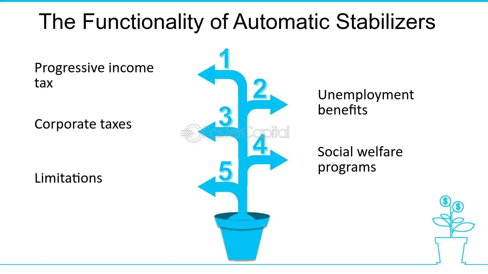

## Table of Contents

## What are automatic stabilizers?

Automatic stabilizers are features built into government budgets that help stabilize the economy without any new actions from policymakers. They work automatically to increase spending or decrease taxes during economic downturns and do the opposite during economic booms. This helps to smooth out the highs and lows of the business cycle, making the economy more stable.

For example, during a recession, when people's incomes fall, they pay less in taxes. This means they have more money to spend, which can help boost the economy. At the same time, more people might need to claim unemployment benefits, which also puts more money into the economy. These stabilizers help to cushion the impact of economic downturns without the need for new legislation.

## How do automatic stabilizers work?

Automatic stabilizers are parts of the government's budget that help the economy without needing new laws. They work by changing how much money people and businesses have, depending on whether the economy is doing well or not. For example, if the economy is in a recession and people are losing jobs, automatic stabilizers like unemployment benefits kick in. These benefits give money to people who are out of work, helping them to keep spending on things they need, which can help the economy recover.

On the other hand, when the economy is doing well, automatic stabilizers can take money out of the economy to prevent it from growing too fast. For instance, as people earn more money, they pay more in taxes. This means they have less money to spend, which can help slow down the economy and keep it from overheating. By working in this way, automatic stabilizers help to balance the economy without the government having to make new decisions every time the economy changes.

## What is the purpose of automatic stabilizers in an economy?

Automatic stabilizers help keep the economy steady without the government having to do anything new. They work by changing how much money people and businesses have, depending on whether the economy is doing well or not. For example, if the economy is in a recession and people are losing jobs, automatic stabilizers like unemployment benefits kick in. These benefits give money to people who are out of work, helping them to keep spending on things they need, which can help the economy recover.

On the other hand, when the economy is doing well, automatic stabilizers can take money out of the economy to prevent it from growing too fast. For instance, as people earn more money, they pay more in taxes. This means they have less money to spend, which can help slow down the economy and keep it from overheating. By working in this way, automatic stabilizers help to balance the economy without the government having to make new decisions every time the economy changes.

## Can you give examples of automatic stabilizers?

Automatic stabilizers are parts of the government's budget that help the economy without needing new laws. One example is unemployment benefits. When people lose their jobs during a recession, they can get unemployment benefits. This gives them money to spend on things they need, which helps the economy because people are still spending even if they're not working.

Another example is income tax. When the economy is doing well and people are earning more money, they pay more in taxes. This means they have less money to spend, which can help slow down the economy so it doesn't grow too fast. On the other hand, during a recession, people earn less and pay less in taxes, so they have more money to spend, which can help the economy recover.

Other examples include welfare programs like food stamps and social security. During tough economic times, more people might need these programs, which puts more money into the economy. When the economy is doing well, fewer people need these programs, which means less money is being spent by the government.

## How do automatic stabilizers affect government spending?

Automatic stabilizers change how much the government spends without needing new laws. During a recession, when people lose jobs, more people need help from programs like unemployment benefits. This means the government has to spend more money to support these people. So, automatic stabilizers increase government spending during tough economic times.

On the other hand, when the economy is doing well, fewer people need help from these programs. This means the government spends less money on things like unemployment benefits and welfare. So, automatic stabilizers help reduce government spending during good economic times. By doing this, they help balance the economy without the government having to make new decisions every time things change.

## How do automatic stabilizers impact tax revenues?

Automatic stabilizers change how much money the government gets from taxes. When the economy is doing well, people earn more money and pay more in taxes. This means the government gets more tax revenue. It's like when you do well at your job and get a bigger paycheck, you pay more in taxes too.

But when the economy is not doing well, like during a recession, people earn less money. So, they pay less in taxes. This means the government gets less tax revenue. It's like when you're not working as much, you don't have as much money to pay taxes. Automatic stabilizers help balance this out by changing tax revenues based on how the economy is doing.

## What is the difference between automatic stabilizers and discretionary fiscal policy?

Automatic stabilizers and discretionary fiscal policy are two ways the government can affect the economy, but they work differently. Automatic stabilizers are parts of the government's budget that help the economy without needing new laws. They change automatically based on how the economy is doing. For example, when people lose their jobs, they get unemployment benefits, which helps them keep spending money and supports the economy. On the other hand, when people earn more money, they pay more in taxes, which can help slow down the economy if it's growing too fast.

Discretionary fiscal policy, on the other hand, involves the government making new decisions and laws to change how much it spends or taxes. This type of policy needs action from policymakers, like Congress or the President, to take effect. For example, the government might decide to spend more money on building roads or cut taxes to help the economy during a recession. Unlike automatic stabilizers, discretionary fiscal policy doesn't happen on its own; it needs someone to make a new decision each time.

## How effective are automatic stabilizers in smoothing economic cycles?

Automatic stabilizers help a lot in making the ups and downs of the economy less extreme. They do this by changing how much money people and the government have, depending on if the economy is doing well or not. For example, during a recession, when people lose their jobs, they get unemployment benefits. This gives them money to spend, which helps the economy because people are still buying things even if they're not working. When the economy is doing well, people pay more in taxes, which takes some money out of the economy and helps stop it from growing too fast.

However, automatic stabilizers are not perfect and can't fix everything. They help smooth out the economy but can't stop big economic problems on their own. Sometimes, the government needs to do more, like making new laws to spend more money or cut taxes, to really help the economy. But overall, automatic stabilizers are a good way to make the economy more stable without the government having to make new decisions every time things change.

## What are the limitations of automatic stabilizers?

Automatic stabilizers help make the economy more stable, but they have some limits. One big problem is that they might not be strong enough to fix big economic problems. For example, during a really bad recession, the money from unemployment benefits and lower taxes might not be enough to get the economy back on track. In these cases, the government might need to do more, like passing new laws to spend more money or cut taxes even more.

Another limit is that automatic stabilizers can take time to work. When the economy starts to go down, it takes a while for people to lose their jobs and start getting unemployment benefits. This means that automatic stabilizers might not help the economy right away. They work slowly, which can be a problem when quick action is needed to stop an economic crisis from getting worse.

## How do automatic stabilizers interact with monetary policy?

Automatic stabilizers and monetary policy both help keep the economy steady, but they do different things. Automatic stabilizers are parts of the government's budget that change how much money people and the government have, without needing new laws. They help during tough times by giving people money through things like unemployment benefits, and during good times by taking money out through higher taxes. Monetary policy, on the other hand, is controlled by the central bank, like the Federal Reserve in the U.S. They change interest rates and control the money supply to manage the economy.

These two policies can work together to make the economy more stable. For example, if the economy is in a recession, automatic stabilizers help by putting more money into people's pockets. At the same time, the central bank might lower interest rates to make borrowing cheaper, encouraging people and businesses to spend and invest more. During good economic times, automatic stabilizers take money out of the economy, and the central bank might raise interest rates to slow things down and prevent the economy from growing too fast. By working together, automatic stabilizers and monetary policy can help smooth out the ups and downs of the economy.

## Can automatic stabilizers be adjusted or modified by policymakers?

Automatic stabilizers are parts of the government's budget that help the economy without needing new laws. They work by themselves, so usually, policymakers don't change them directly. For example, if people lose their jobs, they automatically get unemployment benefits. This helps them keep spending money, which is good for the economy. But since these stabilizers work on their own, policymakers can't adjust them every time the economy changes.

However, policymakers can change the rules or the size of these stabilizers. For instance, they might decide to increase the amount of unemployment benefits people can get or change how much people pay in taxes. By doing this, they can make automatic stabilizers work better or differently. But these changes don't happen quickly; they need new laws or decisions from the government. So, while automatic stabilizers usually work without being adjusted, policymakers can make changes to them over time to help the economy.

## What role do automatic stabilizers play in different economic theories?

In Keynesian economics, automatic stabilizers are very important. Keynesians believe that the government should help the economy when it's not doing well. Automatic stabilizers do this by giving people more money during bad times, like through unemployment benefits, and taking money out during good times, like through higher taxes. This helps keep the economy from getting too high or too low. Keynesians think this is a good way to make the economy more stable without the government having to make new decisions every time.

In contrast, some economists who believe in free markets, like those who follow classical or neoliberal theories, might not like automatic stabilizers as much. They think the economy should fix itself without the government getting involved. These economists might worry that automatic stabilizers could make people rely too much on the government or mess up how the economy naturally works. But even they might see some good in automatic stabilizers, as long as they don't stop the economy from fixing itself.

## What is the role of automatic stabilizers in economic theory?

Automatic stabilizers are deeply rooted in Keynesian economic theory, which emerged as a response to the inadequacies of classical economics during the Great Depression. Keynesian economics posits that aggregate demand is often the driving force behind economic growth and employment levels, suggesting that during downturns, government intervention is necessary to stabilize the economy. Automatic stabilizers, such as progressive tax systems and welfare programs, are instrumental in this framework, as they adjust fiscal parameters automatically in response to economic changes, thereby helping maintain economic equilibrium.

Keynesian economics focuses on the total spending in the economy and its effects on output and inflation. Automatic stabilizers play a significant role by modulating this spending without the need for active policy adjustments. For example, during an economic downturn, tax receipts tend to fall due to lower incomes, while government expenditures on social welfare programs increase as more individuals qualify for benefits. This combination supports aggregate demand by maintaining consumption levels, thus softening the impact of recessions.

The inherent non-discretionary nature of automatic stabilizers ensures that they act swiftly, providing fiscal support without requiring time-consuming legislative processes. This immediate responsiveness is crucial, as it helps mitigate the risks of deep recessions by sustaining consumer spending and business activity even when market conditions are unfavorable. By providing a counter-cyclical fiscal response, automatic stabilizers help avoid unsustainable economic booms and busts, promoting steady growth and stability.

Furthermore, automatic stabilizers can be understood through their mathematical relationship with economic output. If $Y$ represents the aggregate output and $C$, $I$, $G$, and $NX$ are consumption, investment, government spending, and net exports respectively, the basic Keynesian identity is:

$$
Y = C + I + G + NX
$$

During economic downturns, automatic stabilizers primarily influence $C$ and $G$. Progressive taxation adjusts disposable income levels, thereby affecting consumption $C$, while increased government spending $G$ through welfare programs injects additional funds into the economy.

The operational efficiency of automatic stabilizers is also evident in their ability to provide stability with minimal administrative overhead. Their automatic nature means that once policies are in place, they require little to no intervention from policymakers, which avoids potential delays and ensures timely support for the economy. This contrasts with discretionary fiscal policies, which necessitate legislative approval and can be subject to political variability. Automatic stabilizers thus ensure a steady approach to mitigating the effects of economic fluctuations, aligning with Keynesian principles of maintaining and supporting aggregate demand.

## References & Further Reading

[1]: ["Automatic Fiscal Stabilizers: Institutions and Quantitative Implications"](https://www.oecd.org/en/publications/2020/12/automatic-fiscal-stabilisers-recent-evolution-and-policy-options-to-boost-their-effectiveness_7d1ca7ac.html) by Xavier Debrun and Radhicka Kapoor, International Monetary Fund.

[2]: Auerbach, A. J., & Feenberg, D. (2000). ["The Significance of Federal Taxes as Automatic Stabilizers."](https://www.aeaweb.org/articles?id=10.1257/jep.14.3.37) National Bureau of Economic Research.

[3]: ["Macroeconomics"](https://www.khanacademy.org/economics-finance-domain/macroeconomics) by N. Gregory Mankiw.

[4]: Blanchard, O., & Perotti, R. (2002). ["An Empirical Characterization of the Dynamic Effects of Changes in Government Spending and Taxes on Output."](https://www.nber.org/papers/w7269) The Quarterly Journal of Economics.

[5]: ["Algorithmic Trading: Winning Strategies and Their Rationale"](https://www.wiley.com/en-us/Algorithmic+Trading%3A+Winning+Strategies+and+Their+Rationale-p-9781118460146) by Ernest P. Chan

[6]: ["The Role of Unemployment Insurance as an Automatic Stabilizer During a Recession"](https://www.semanticscholar.org/paper/The-Role-of-Unemployment-Insurance-as-an-Automatic-Vroman/0a649bd1c7d793ef9628f9e8d4069fdc57b761a9) by Jeffrey B. Liebman, National Bureau of Economic Research.

[7]: Bernanke, B. S. (2004). ["The Great Moderation."](https://www.federalreserve.gov/boarddocs/speeches/2004/20040220/) Speech by Ben Bernanke at the Eastern Economic Association, Washington, D.C.

[8]: ["Keynes: The Return of the Master"](https://en.wikipedia.org/wiki/Keynes:_The_Return_of_the_Master) by Robert Skidelsky.