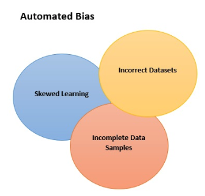

## Table of Contents

## What is automation bias in the context of machine learning?

Automation bias in machine learning happens when people trust the decisions made by machines too much. They might ignore their own knowledge or not check the machine's decisions carefully. This can be a problem because machines can make mistakes too. For example, if a machine learning model suggests a diagnosis in healthcare, doctors might follow it without questioning, even if it's wrong.

This bias can lead to serious issues in many areas, like healthcare, finance, or self-driving cars. When people depend too much on automated systems, they might miss important details or not use their own skills to make better decisions. It's important for people to stay alert and always check the machine's suggestions to make sure they are correct and safe.

## How does automation bias affect decision-making processes?

Automation bias can change how people make choices. When people rely too much on machines, they might not think as carefully about their decisions. They might just follow what the machine says without using their own knowledge or checking if the machine is right. This can lead to mistakes because machines aren't perfect and can sometimes give wrong information. For example, if a machine suggests a wrong diagnosis in a hospital, a doctor might follow it without questioning, which could harm the patient.

This kind of bias can be a big problem in many areas, like driving cars, making financial decisions, or even in everyday tasks. People might stop paying attention to important details because they trust the machine too much. Over time, this can make people less good at making decisions on their own. It's important for people to stay alert and always check the machine's suggestions to make sure they are correct and safe. By doing this, they can use the machine's help but still use their own skills to make the best choices.

## Can you provide examples of automation bias in everyday applications?

In everyday life, automation bias can show up when people use navigation apps like Google Maps or Waze. These apps suggest routes to get from one place to another. Sometimes, people follow these suggestions without thinking about other options or checking if the route makes sense. For example, the app might suggest a longer route because of a small traffic delay, but if someone looked at the map, they might see a shorter way that's just as good. By always following the app without questioning, people might end up taking longer or more complicated routes.

Another common example is with home devices like smart thermostats or home security systems. These devices make decisions based on data and algorithms, like when to turn on the heat or alert you about a possible intruder. People might start to trust these devices so much that they stop paying attention to their own feelings or observations. For instance, if a smart thermostat decides to turn on the heat, someone might not check if the room is actually cold or if there's another way to stay warm. This can lead to wasting energy or missing important signs that something is wrong with the system.

## What are the potential risks associated with automation bias in machine learning systems?

Automation bias in [machine learning](/wiki/machine-learning) systems can lead to serious problems. When people trust machines too much, they might not notice when the machine makes a mistake. For example, in healthcare, if a machine learning model suggests a wrong diagnosis, doctors might follow it without checking, which can harm patients. In finance, if an automated system suggests a risky investment, people might go along with it without questioning, which can lead to big financial losses. These mistakes can happen in many areas, like driving cars or making decisions about security, and they can have big consequences.

Another risk is that automation bias can make people worse at making their own decisions. When people rely too much on machines, they might stop using their own skills and knowledge. Over time, this can make them less good at thinking for themselves. For example, if someone always follows a navigation app without looking at a map, they might forget how to find their way on their own. This can be a problem if the machine stops working or gives wrong information. It's important for people to stay alert and always check the machine's suggestions to make sure they are correct and safe.

## How can automation bias lead to errors or misjudgments in machine learning models?

Automation bias can lead to errors or misjudgments in machine learning models when people trust the machine's decisions too much. They might not question the model's output, even if it's wrong. For example, in healthcare, if a machine learning model suggests a wrong diagnosis, doctors might follow it without checking other possibilities. This can harm patients because the model might have made a mistake based on the data it was trained on or because it didn't consider all the important factors. When people don't use their own knowledge to check the machine's decisions, they can miss important details that the model got wrong.

Another way automation bias can cause errors is by making people less good at making their own decisions. When people rely too much on machines, they might stop using their own skills and knowledge. Over time, this can make them worse at thinking for themselves. For example, if someone always follows a navigation app without looking at a map, they might forget how to find their way on their own. This can be a big problem if the machine stops working or gives wrong information. It's important for people to stay alert and always check the machine's suggestions to make sure they are correct and safe.

## What strategies can be employed to mitigate the effects of automation bias in machine learning?

To reduce the impact of automation bias in machine learning, it's important for people to stay alert and always check the machine's suggestions. They should use their own knowledge and experience to make sure the machine's decisions are correct. For example, in healthcare, doctors should look at the patient's symptoms and medical history to see if the machine's diagnosis makes sense. By doing this, they can catch any mistakes the machine might make. It's also helpful to have more than one person look at the machine's decisions, so they can talk about it and make sure they are making the best choice.

Another strategy is to train people to understand how machine learning models work and what their limits are. This can help them know when to trust the machine and when to be careful. For example, if people know that a model might make mistakes in certain situations, they can be more careful in those cases. It's also important to keep improving the machine learning models by giving them more and better data, so they can make better decisions. By combining these strategies, people can use machine learning to help them make decisions, but still use their own skills to make sure they are making the best choices.

## How does automation bias differ from other types of biases in machine learning, such as algorithmic bias?

Automation bias and algorithmic bias are different kinds of problems in machine learning. Automation bias happens when people trust the machine's decisions too much and don't check them carefully. They might follow what the machine says without using their own knowledge, which can lead to mistakes. For example, if a machine learning model suggests a wrong diagnosis in a hospital, a doctor might follow it without questioning, which could harm the patient. This kind of bias is about how people interact with machines and can happen in many areas, like healthcare, finance, or driving cars.

On the other hand, algorithmic bias is about problems with the machine learning model itself. This can happen if the data used to train the model is not fair or if the model is not built in the right way. For example, if a model is trained on data that only includes certain types of people, it might make wrong predictions for others. This kind of bias is about the machine's own mistakes and can be fixed by using better data or changing how the model works. While automation bias is about how people use the machine's decisions, algorithmic bias is about making the machine's decisions better in the first place.

## What role does human oversight play in reducing automation bias in machine learning applications?

Human oversight is really important for reducing automation bias in machine learning applications. When people keep an eye on what the machine is doing, they can catch any mistakes it might make. For example, in a hospital, if a machine learning model suggests a diagnosis, a doctor can check it against the patient's symptoms and medical history. By doing this, the doctor can make sure the machine's suggestion is right and not just follow it blindly. Human oversight helps make sure that the machine's decisions are checked and corrected if needed, which can stop big problems from happening.

Having people watch over the machine also helps them stay good at making their own decisions. When people always check the machine's suggestions, they keep using their own knowledge and skills. This is important because machines can make mistakes, and people need to be ready to step in and fix them. Over time, this practice can make people better at understanding when to trust the machine and when to be careful. By combining human oversight with machine learning, we can use the best of both to make better and safer decisions.

## How can machine learning algorithms be designed to be more resistant to automation bias?

Machine learning algorithms can be made more resistant to automation bias by including features that encourage people to check the machine's decisions. For example, the algorithm can show how sure it is about its decision, like giving a percentage or a confidence score. This way, if the score is low, people know they should be more careful and check the decision more closely. Another way is to make the algorithm explain why it made a certain decision. If people can understand the machine's reasoning, they are more likely to question it if something doesn't seem right. By making the machine's decisions easier to understand and check, people are less likely to just follow them without thinking.

Another important way to make algorithms more resistant to automation bias is by training them on diverse and high-quality data. If the data used to train the algorithm is fair and includes many different situations, the algorithm is less likely to make mistakes that could lead to automation bias. For example, if a healthcare algorithm is trained on data from a wide range of patients, it's more likely to give accurate diagnoses for all kinds of people. By using better data, the algorithm can make better decisions, which makes it easier for people to trust and check those decisions. This combination of clear explanations and good data can help reduce the risk of automation bias.

## What are the ethical implications of automation bias in machine learning?

Automation bias in machine learning can lead to big ethical problems. When people trust machines too much, they might make choices that hurt others. For example, in healthcare, if a doctor follows a wrong diagnosis from a machine without checking, it could harm the patient. This is not fair to the patient, who deserves the best care. In other areas like finance or hiring, automation bias can lead to unfair decisions that affect people's lives, like giving loans to the wrong people or not hiring someone who should get the job. These mistakes can cause harm and make people lose trust in the systems that are supposed to help them.

To deal with these ethical problems, it's important for people to always check the machine's decisions and use their own knowledge. This can help make sure the decisions are fair and safe. Also, the people who make the machine learning models should think about how their work can affect others. They should try to make the models as fair and accurate as possible, using good data and clear explanations. By doing this, they can help reduce the harm that automation bias might cause and make sure the technology is used in a way that is good for everyone.

## How can organizations measure the impact of automation bias in their machine learning systems?

Organizations can measure the impact of automation bias by looking at how often people follow the machine's decisions without checking them. They can do this by keeping track of how many times the machine's suggestions are followed and then comparing those suggestions to what actually happens. For example, in a hospital, they might look at how many times doctors followed the machine's diagnosis and see if those diagnoses were right or wrong. If the machine often makes mistakes that doctors don't catch, it might mean that automation bias is a problem.

Another way to measure the impact is by asking people about their experiences with the machine learning system. Organizations can use surveys or interviews to find out if people feel like they trust the machine too much or if they think they should check its decisions more often. By listening to what people say, organizations can understand if automation bias is affecting how decisions are made. This can help them figure out if they need to train people more or change how the machine learning system works to make it better.

## What advanced techniques are being researched to further understand and combat automation bias in machine learning?

Researchers are working on new ways to understand and fight automation bias in machine learning. One advanced technique is called "explainable AI" (XAI). This technique helps make the decisions of machine learning models easier to understand. When people can see why a machine made a certain choice, they are more likely to check it carefully. For example, if a model gives a diagnosis in a hospital, XAI can show which symptoms or data led to that diagnosis. This helps doctors decide if the machine's suggestion makes sense or if they need to look at other options. By making the machine's decisions clear, XAI can reduce the chances of people trusting the machine too much without thinking.

Another technique being researched is "human-in-the-loop" systems. These systems keep people involved in the decision-making process, even when machines are doing most of the work. For example, a machine learning model might suggest a decision, but it will also ask a person to review and approve it. This way, people don't just follow the machine's suggestions without thinking. They use their own knowledge to check if the machine's decision is right. By combining human oversight with machine learning, these systems can help catch any mistakes the machine might make and make sure the final decisions are fair and safe.

## References & Further Reading

[1]: Mosier, K. L., & Skitka, L. J. (1996). Human decision makers and automated decision aids: Made for each other?. In R. Parasuraman & M. Mouloua (Eds.), Automation and human performance: Theory and applications. Lawrence Erlbaum Associates.

[2]: Parasuraman, R., & Riley, V. (1997). ["Humans and Automation: Use, Misuse, Disuse, Abuse."](https://psycnet.apa.org/record/1997-05566-005) Human Factors, 39(2), 230–253.

[3]: Cummings, M. L. (2014). ["The role of humans in autonomous systems."](https://www.semanticscholar.org/paper/The-Human-Role-in-Autonomous-Weapon-Design-and-Cummings/37d95ee07e9f56fe96b2f2cf98d372dbf0e69c5e/figure/1) The Bridge, 44(3), 5-12.

[4]: Bussone, A., Stumpf, S., & O’Sullivan, D. (2015). ["The role of explanations on trust and reliance in clinical decision support systems."](https://ieeexplore.ieee.org/document/7349687) In: Berkovsky, S., & Freyne, J. (Eds.) Health Informatics: Building a Healthcare Future Through Trusted Knowledge (pp. 204-212). Springer, Cham.

[5]: Sarter, N. B., & Woods, D. D. (1994). ["Pilot interaction with cockpit automation: Operational experiences with the flight management system."](https://www.researchgate.net/profile/David-Woods-19/publication/23586654_Pilot_Interaction_With_Cockpit_Automation_Operational_Experiences_With_the_Flight_Management_System/links/02e7e529c96fb02c5a000000/Pilot-Interaction-With-Cockpit-Automation-Operational-Experiences-With-the-Flight-Management-System.pdf) The International Journal of Aviation Psychology, 4(4), 369-385.