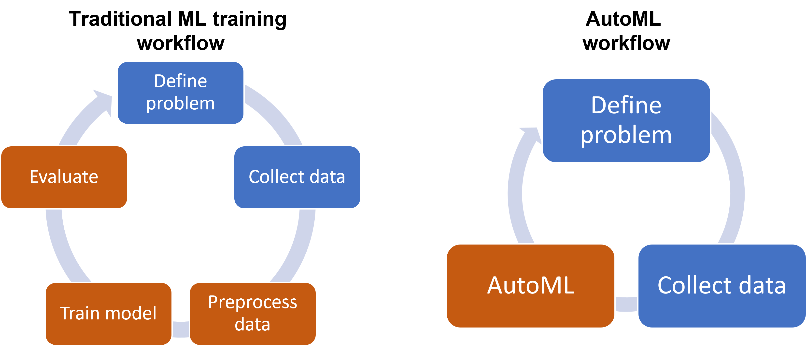

## Table of Contents

## What is AutoML and why is it important?

AutoML, or Automated Machine Learning, is a technology that makes it easier for people to use machine learning without needing to know a lot about it. It helps by automatically doing things like choosing the right model, setting up the model, and even making the model better over time. This means that even if you're not an expert in machine learning, you can still use it to solve problems or make predictions.

AutoML is important because it helps more people use machine learning. Before AutoML, only people who knew a lot about machine learning could use it. Now, with AutoML, businesses, researchers, and others can solve problems faster and more easily. This can lead to new discoveries and better ways of doing things, making life easier and more efficient for everyone.

## How does AutoML differ from traditional machine learning?

AutoML and traditional machine learning differ mainly in how much human effort is needed to create and improve models. In traditional machine learning, a person has to do a lot of work. They need to choose the right model, like a decision tree or a neural network, and then they have to set up the model by choosing the right settings. After that, they have to test the model and make it better over time. This can take a lot of time and requires a lot of knowledge about machine learning.

AutoML makes this process easier and faster. With AutoML, a computer does most of the work. It tries different models and settings automatically, and it picks the best one without a person having to do much. This means that even if you don't know a lot about machine learning, you can still use it to solve problems. AutoML is like having a smart helper that does the hard parts of machine learning for you, making it easier for more people to use this powerful technology.

## What are the key components of an AutoML system?

The first key component of an AutoML system is data preprocessing. This part takes the raw data and gets it ready for the [machine learning](/wiki/machine-learning) models. It includes cleaning the data, which means fixing any mistakes or missing parts, and also transforming the data into a format that the models can use easily. This step is important because good data leads to better model performance.

The second component is model selection and hyperparameter tuning. AutoML systems try out many different models, like decision trees or neural networks, to see which one works best for the given data. They also change the settings of these models, called hyperparameters, to make the models work even better. This is done automatically, so you don't have to know a lot about each model to use them effectively.

The third component is model evaluation and deployment. Once the AutoML system has picked the best model and tuned its settings, it tests the model to see how well it works. If the model does well, it can be used to make predictions or solve problems. The AutoML system can also keep an eye on the model over time and make changes if needed to keep it working well.

## Can you explain the process of feature engineering in AutoML?

Feature engineering in AutoML is the process of creating new features or changing existing ones to make the data better for the machine learning models. In traditional machine learning, people would have to do this by hand, which can be a lot of work and needs a good understanding of the data. But in AutoML, this process is done automatically. The system looks at the data and tries different ways to create or change features to see what works best. This means you don't have to know a lot about the data to make the models work well.

AutoML systems use different methods to do feature engineering. They might combine existing features to make new ones, like adding or multiplying them together. They might also change features to make them fit better with the model, like turning a date into the day of the week. The system keeps trying different things until it finds the best way to set up the features. This helps the models work better without you having to do a lot of work.

## What are some popular AutoML tools and platforms available today?

Some popular AutoML tools and platforms available today include Google Cloud AutoML, H2O Driverless AI, and DataRobot. Google Cloud AutoML is a service that lets you create and use machine learning models easily. It works well for tasks like understanding pictures, recognizing speech, and predicting things. H2O Driverless AI is another tool that helps you build models quickly. It does a lot of the work for you, like choosing the best model and setting it up. DataRobot is also very popular and helps businesses use machine learning without needing a lot of technical knowledge. It can handle different types of data and make models that work well.

These tools are important because they make machine learning easier for everyone. Before these tools, you needed to know a lot about machine learning to use it. Now, with AutoML tools, you can solve problems and make predictions even if you're not an expert. This can help businesses make better decisions, help researchers find new things, and make life easier for people in many ways.

## How does AutoML handle model selection and hyperparameter tuning?

AutoML handles model selection and hyperparameter tuning by trying out many different models and settings automatically. It starts by choosing from a variety of models like decision trees, neural networks, and others. Then, it runs these models on the data to see which one works best. This process is called model selection. AutoML systems use special methods to pick the best model without needing a person to do it. They can use techniques like cross-validation to make sure the model works well on different parts of the data.

After selecting a model, AutoML moves on to hyperparameter tuning. Hyperparameters are like the settings of the model that you can change to make it work better. AutoML tries different combinations of these settings to find the best ones. It might use methods like grid search, random search, or more advanced techniques like Bayesian optimization to do this. By trying out many different settings, AutoML can find the best way to set up the model without you having to know a lot about it. This makes the whole process easier and faster, so you can use machine learning even if you're not an expert.

## What are the benefits of using AutoML for businesses and data scientists?

AutoML helps businesses by making it easier to use machine learning without needing a lot of technical knowledge. This means that even if a business doesn't have a team of data scientists, they can still use machine learning to make better decisions. For example, a small company can use AutoML to predict what customers might want to buy next, helping them sell more without hiring expensive experts. AutoML can also save time and money because it automates the hard parts of building and tuning models, letting businesses focus on other important tasks.

For data scientists, AutoML is a big help because it lets them work faster and try out more ideas. Instead of spending a lot of time choosing the right model and setting it up, data scientists can use AutoML to do this work quickly. This means they have more time to think about the big picture and solve harder problems. AutoML also helps data scientists by giving them tools to test many different models and settings, which can lead to better results and new discoveries.

## What challenges and limitations does AutoML face?

AutoML faces some challenges and limitations that can make it hard to use in certain situations. One big challenge is that AutoML might not work as well with very complex data or special problems that need a lot of human knowledge to solve. For example, if you're trying to predict something that depends on many different things in a complicated way, AutoML might not be able to find the best model on its own. It might need a person to help guide it or give it more information about the problem.

Another limitation is that AutoML can take a lot of time and computer power to try out all the different models and settings. This can be a problem for businesses that need quick results or don't have a lot of computer resources. Also, AutoML might not always explain why it chose a certain model or setting, which can be important for people who need to understand how the model works and trust its predictions. This lack of transparency can make it harder for some people to use AutoML in their work.

## How can AutoML be integrated into existing data workflows?

AutoML can be integrated into existing data workflows by adding it as a step in the process where machine learning models are needed. For example, if a business already has a system that collects data and uses it to make decisions, they can add AutoML to automatically create and tune models based on that data. This means that instead of having someone manually build and adjust the models, AutoML can do it faster and without needing a lot of technical knowledge. This can be done by connecting AutoML tools to the existing data pipeline, so that data flows from collection to model creation seamlessly.

Integrating AutoML also involves making sure it fits well with other tools and systems that are already in use. For instance, if a company uses a certain software for data analysis, they need to make sure that AutoML can work with that software. This might mean using APIs or other ways to connect the AutoML system to the existing tools. By doing this, businesses can keep using their current systems while adding the power of AutoML to make better predictions and decisions.

## What are the ethical considerations when using AutoML?

When using AutoML, it's important to think about ethical issues. One big concern is fairness. AutoML systems might make decisions that treat some people unfairly because the data they use can have biases. For example, if the data about hiring shows that men are hired more often than women, the AutoML system might learn to do the same thing, even if it's not fair. It's important to check the data and the models to make sure they don't hurt certain groups of people.

Another ethical issue is privacy. AutoML often needs a lot of data to work well, and this data can include personal information about people. It's important to make sure that this data is used in a way that respects people's privacy and follows the law. Also, people should know how their data is being used and have a say in it. By thinking about these ethical issues, we can use AutoML in a way that is good for everyone and doesn't cause harm.

## How does AutoML impact the role of data scientists?

AutoML changes the job of data scientists by making some parts of their work easier and faster. Instead of spending a lot of time choosing the right model and setting it up, data scientists can use AutoML to do this work quickly. This means they have more time to think about the big picture and solve harder problems. AutoML helps data scientists by giving them tools to test many different models and settings, which can lead to better results and new discoveries. They can focus more on understanding the data and coming up with new ideas, rather than doing the same tasks over and over.

However, AutoML doesn't take away the need for data scientists. They are still important because they can understand the data and the problem in a way that AutoML can't. Data scientists can guide AutoML to make better choices and help make sure the models are fair and respect people's privacy. They also need to explain the results of the models to others, which is something AutoML can't do on its own. So, while AutoML makes some parts of their job easier, data scientists are still needed to make sure the models are used in the right way and for the right reasons.

## What future developments can we expect in the field of AutoML?

In the future, we can expect AutoML to become even easier to use and more powerful. One big change might be that AutoML systems will get better at understanding and working with different types of data. Right now, AutoML can be tricky to use with very complex data or special problems. But in the future, these systems might be able to handle these challenges better, making it easier for more people to use machine learning. They might also use less computer power and time, so even small businesses can use them without spending a lot of money.

Another thing that might happen is that AutoML will become more transparent. Right now, it can be hard to understand why an AutoML system chose a certain model or setting. In the future, these systems might explain their choices better, which would help people trust them more. This could also make it easier for data scientists to work with AutoML, because they would understand what the system is doing and be able to guide it better. Overall, these changes could make AutoML even more helpful for businesses and researchers, letting them solve problems and make discoveries faster and easier.

## References & Further Reading

[1]: Hutter, F., Kotthoff, L., & Vanschoren, J. (Eds.). (2019). ["Automated Machine Learning: Methods, Systems, Challenges."](https://link.springer.com/book/10.1007/978-3-030-05318-5) Springer.

[2]: Thornton, C., Hutter, F., Hoos, H. H., & Leyton-Brown, K. (2013). ["Auto-WEKA: Combined Selection and Hyperparameter Optimization of Classification Algorithms."](https://arxiv.org/abs/1208.3719) In Proceedings of the 19th ACM SIGKDD International Conference on Knowledge Discovery and Data Mining.

[3]: Feurer, M., Klein, A., Eggensperger, K., Springenberg, J., Blum, M., & Hutter, F. (2015). ["Efficient and Robust Automated Machine Learning."](https://dl.acm.org/doi/10.5555/2969442.2969547) Advances in Neural Information Processing Systems 28.

[4]: Quanming, Y., Zhao, P., & Zhang, Z. (2018). ["Taking human out of learning applications: A survey on automated machine learning."](https://www.researchgate.net/publication/328651973_Taking_Human_out_of_Learning_Applications_A_Survey_on_Automated_Machine_Learning) ACM Transactions on Intelligent Systems and Technology.

[5]: Lee, J., & Huen, J. (2020). ["AutoML: a survey of the state-of-the-art."](https://www.sciencedirect.com/science/article/pii/S0950705120307516) Artificial Intelligence Review.