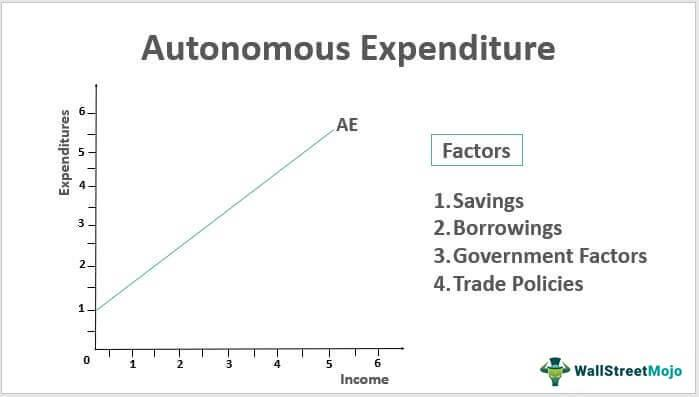

## Table of Contents

## What is autonomous expenditure?

Autonomous expenditure is the spending that happens in an economy no matter what the income level is. It includes things like government spending on public services, investment by businesses in new projects, and money spent by people on basic needs like food and housing. These types of spending don't change much even if people's incomes go up or down.

Understanding autonomous expenditure is important because it helps us see what drives the economy. When autonomous expenditure goes up, it can lead to more jobs and higher incomes, which then encourages even more spending. On the other hand, if autonomous expenditure goes down, it can slow down the economy. Economists use this concept to predict how changes in spending might affect the overall economy.

## How does autonomous expenditure differ from induced expenditure?

Autonomous expenditure and induced expenditure are two different types of spending in an economy. Autonomous expenditure is the spending that happens no matter what the income level is. This includes things like government spending on public services, business investments in new projects, and people's spending on basic needs like food and housing. These types of spending don't change much even if people's incomes go up or down.

On the other hand, induced expenditure is the spending that changes based on people's income levels. When people earn more money, they tend to spend more on things like vacations, new clothes, or eating out. This type of spending goes up when incomes rise and goes down when incomes fall. Induced expenditure is important because it shows how changes in income can lead to changes in overall spending in the economy.

Understanding the difference between these two types of expenditure helps economists predict how the economy might grow or shrink. Autonomous expenditure provides a stable base of spending, while induced expenditure can cause bigger swings in economic activity. Together, they help shape the overall health and direction of the economy.

## Can you provide examples of autonomous expenditure?

Autonomous expenditure includes spending that happens no matter how much money people have. One example is government spending on public services like schools and hospitals. Governments usually keep spending on these services steady, even if the economy is doing well or badly. Another example is business investment in new projects, like building a new factory. Companies might decide to invest in these projects because they believe it will help them grow in the future, not because people's incomes have changed.

Another type of autonomous expenditure is people's spending on basic needs. This includes buying food and paying for housing. People need to eat and have a place to live no matter how much money they make, so this spending stays pretty much the same even if their income goes up or down. These examples show that autonomous expenditure is important because it helps keep the economy stable, no matter what is happening with people's incomes.

## What role does autonomous expenditure play in the economy?

Autonomous expenditure is like the steady heartbeat of the economy. It includes spending that happens no matter how much money people have, like government spending on schools and hospitals, business investments in new projects, and people's spending on basic needs like food and housing. This kind of spending doesn't change much even if people's incomes go up or down. Because it stays steady, autonomous expenditure helps keep the economy stable. It's like a safety net that keeps things going even when other parts of the economy might be struggling.

When autonomous expenditure goes up, it can have a big effect on the economy. For example, if the government decides to spend more on building new roads, this can create jobs and put more money in people's pockets. This extra money can then lead to more spending on other things, which helps the economy grow. On the other hand, if autonomous expenditure goes down, like if businesses cut back on investments, it can slow things down. Understanding how autonomous expenditure works helps economists predict how the economy might change and plan for the future.

## How is autonomous expenditure calculated in economic models?

In economic models, autonomous expenditure is calculated by looking at the parts of spending that don't change much with people's incomes. This includes things like government spending on public services, business investments in new projects, and people's spending on basic needs like food and housing. Economists add up all these different types of spending to get the total amount of autonomous expenditure. They use data from government budgets, business reports, and consumer surveys to figure out how much money is being spent in these areas.

Once they have this total, economists use it in bigger models to understand how the whole economy works. They look at how changes in autonomous expenditure can affect things like job growth, income levels, and overall economic growth. For example, if the government decides to spend more on building new schools, economists can use their models to predict how this might lead to more jobs and more money in people's pockets. This helps them give advice on how to keep the economy stable and growing.

## What impact does a change in autonomous expenditure have on the economy?

When autonomous expenditure changes, it can have a big effect on the economy. Autonomous expenditure is the spending that stays the same no matter how much money people have. This includes things like government spending on schools and hospitals, business investments in new projects, and people's spending on basic needs like food and housing. If autonomous expenditure goes up, like if the government decides to spend more on building new roads, it can create more jobs and put more money in people's pockets. This extra money can then lead to more spending on other things, which helps the economy grow.

On the other hand, if autonomous expenditure goes down, it can slow things down. For example, if businesses cut back on investments because they're worried about the future, this can lead to fewer jobs and less money for people to spend. When people have less money, they spend less, which can make the economy shrink. Understanding how changes in autonomous expenditure affect the economy helps economists predict what might happen next and plan for the future.

## How does autonomous expenditure relate to the Keynesian consumption function?

Autonomous expenditure is a key part of the Keynesian consumption function. This function, created by economist John Maynard Keynes, helps explain how much people spend based on their income. In the Keynesian model, total consumption is made up of two parts: autonomous consumption and induced consumption. Autonomous consumption is the spending that people do no matter how much money they have, like buying food or paying rent. This is similar to autonomous expenditure, which includes government spending, business investments, and spending on basic needs.

The Keynesian consumption function shows that even when people have no income, they still need to spend on basic things. This is the autonomous part of consumption. As people's income goes up, they spend more on other things, which is the induced part of consumption. Autonomous expenditure plays a big role here because it helps keep the economy stable. When governments or businesses keep spending even during tough times, it helps support the economy. So, in the Keynesian model, autonomous expenditure is important because it helps predict how the economy will do, no matter what's happening with people's incomes.

## What are the factors that can influence autonomous expenditure?

Autonomous expenditure can change because of many things. One big thing that can change it is government policy. If the government decides to spend more money on things like schools or roads, this can make autonomous expenditure go up. On the other hand, if the government cuts back on spending, it can make autonomous expenditure go down. Another thing that can affect it is how confident businesses feel about the future. If businesses think things will be good, they might spend more on new projects, which would increase autonomous expenditure. But if they're worried, they might cut back on spending, making autonomous expenditure go down.

Another [factor](/wiki/factor-investing) that can influence autonomous expenditure is changes in people's basic needs. For example, if food prices go up a lot, people might have to spend more money just to eat, which would increase autonomous expenditure. Also, big events like natural disasters or economic crises can change how much money people and governments need to spend on basic things. These events can make autonomous expenditure go up because everyone needs to spend more to get by. Understanding these factors helps economists predict how the economy might change and plan for the future.

## How do government policies affect autonomous expenditure?

Government policies can have a big impact on autonomous expenditure. When the government decides to spend more money on things like building new schools or fixing roads, this can make autonomous expenditure go up. This is because government spending is a big part of autonomous expenditure. It doesn't change much even if people's incomes go up or down. So, if the government spends more, it can help keep the economy stable and even help it grow by creating jobs and putting more money in people's pockets.

On the other hand, if the government cuts back on spending, it can make autonomous expenditure go down. This can happen if the government wants to save money or if it thinks the economy is doing too well and needs to slow down. When the government spends less, it can lead to fewer jobs and less money for people to spend, which can make the economy shrink. So, government policies are really important because they can change how much money is being spent in the economy, no matter what's happening with people's incomes.

## What is the multiplier effect of autonomous expenditure, and how is it calculated?

The multiplier effect of autonomous expenditure is how a change in this spending can lead to a bigger change in the overall economy. Imagine the government decides to spend more money on building new roads. This spending creates jobs for construction workers, who then have more money to spend on things like food and clothes. The people who sell food and clothes then have more money to spend too. This chain reaction means that the initial spending by the government can lead to a lot more spending in the economy overall. This is the multiplier effect.

To calculate the multiplier effect, economists use a simple formula. The multiplier is 1 divided by (1 - the marginal propensity to consume, or MPC). The MPC is the part of extra income that people spend instead of saving. For example, if people spend 80% of any extra money they get, the MPC is 0.8. So, the multiplier would be 1 divided by (1 - 0.8), which is 1 divided by 0.2, or 5. This means that for every dollar the government spends, the total spending in the economy could go up by five dollars. This helps economists understand how changes in autonomous expenditure can affect the whole economy.

## How do autonomous expenditures contribute to economic stability or instability?

Autonomous expenditures help keep the economy stable because they don't change much even when people's incomes go up or down. This includes things like government spending on schools and hospitals, business investments in new projects, and people's spending on basic needs like food and housing. When these types of spending stay steady, they act like a safety net for the economy. For example, if people lose their jobs and have less money to spend, the government can keep spending on public services, which helps keep some jobs and money flowing in the economy. This can prevent the economy from getting too bad too quickly.

However, changes in autonomous expenditures can also cause instability. If the government suddenly cuts back on spending or if businesses stop investing in new projects, it can lead to fewer jobs and less money for people to spend. This can make the economy shrink and cause problems like higher unemployment. On the other hand, if the government or businesses suddenly spend a lot more, it can cause the economy to grow too fast, which might lead to inflation. So, while autonomous expenditures help keep things stable, big changes in them can make the economy unstable.

## What are some advanced economic theories or models that incorporate autonomous expenditure?

One advanced economic theory that includes autonomous expenditure is the Keynesian Cross model. This model helps economists understand how total spending in the economy affects things like jobs and income. In the Keynesian Cross model, autonomous expenditure is a big part of what keeps the economy going. It includes things like government spending on public services, business investments in new projects, and people's spending on basic needs like food and housing. These types of spending don't change much even if people's incomes go up or down. The model shows that when autonomous expenditure goes up, it can lead to more jobs and higher incomes, which then encourages even more spending. This helps the economy grow.

Another model that uses autonomous expenditure is the IS-LM model. This model looks at how interest rates and total spending affect the economy. In the IS-LM model, autonomous expenditure is important because it helps set the level of total spending in the economy. If the government spends more on things like building new roads, it can create more jobs and put more money in people's pockets. This extra money can then lead to more spending on other things, which helps the economy grow. The IS-LM model helps economists understand how changes in autonomous expenditure can affect things like interest rates and overall economic growth.

## What is the Role of Autonomous Expenditure?

Autonomous expenditure plays a pivotal role in shaping economic growth, as it constitutes spending that remains unaffected by current income levels. Its significance lies in its ability to establish a stable demand for goods and services, acting as a foundation upon which economic activity is built. Key components of autonomous expenditure typically include government spending, investments, and exports, each contributing uniquely to economic dynamics.

Government spending, often considered a major element of autonomous expenditure, includes expenditures on infrastructure, defense, healthcare, and education. These expenditures are usually predetermined in the budget and are not directly linked to the current economic output. By injecting funds into the economy regardless of the prevailing income levels, government spending can stimulate production and job creation, consequently fostering economic growth. For instance, infrastructure projects can create employment and improve productivity, laying down the groundwork for further private sector investment.

Investments, particularly those undertaken by businesses and the public sector, add another layer to autonomous expenditure. These are often influenced by long-term expectations rather than immediate income changes. Investments in technology, research and development, or capital goods, drive innovation and efficiency, contributing to sustained economic expansion. For example, investing in renewable energy technologies not only ensures future energy security but also creates new markets and industries.

Exports, as a component of autonomous expenditure, bring in income from abroad and are determined by foreign demand, rather than domestic income levels. They provide an avenue for domestic businesses to scale operations beyond local markets, supporting economies of scale and enhanced competitiveness. Exports can be particularly beneficial for nations with a comparative advantage in certain industries, thereby fueling economic growth.

Understanding autonomous expenditure is crucial for identifying growth-stimulating factors. It sets a baseline demand that cushions the economy against cyclical fluctuations. When autonomous expenditure is high, economies tend to experience more robust growth as the initial demand encourages further consumption and investment. Conversely, during downturns, sustained autonomous expenditure can mitigate the severity of recessions by maintaining a level of demand that prevents further economic contraction.

In the context of economic models, autonomous expenditure is represented as a component of the aggregate expenditure function. This function can be expressed as:

$$
AE = C + I + G + (X - M)
$$

Where:
- $AE$ is the aggregate expenditure,
- $C$ denotes consumption,
- $I$ is investment,
- $G$ represents government spending,
- $X$ stands for exports, and
- $M$ denotes imports.

In this equation, $I$, $G$, and $X$ can be considered part of autonomous spending as they are less sensitive to short-term income changes. Autonomous aspects of these investments stabilize overall demand.

In summary, autonomous expenditure is an essential element that drives economic growth by maintaining demand irrespective of income variations. Components like government spending, investment, and exports play key roles in ensuring that the economy continues to advance and innovate, thereby fostering long-term stability and prosperity.

## References & Further Reading

[1]: Blanchard, O., & Leigh, D. (2013). ["Growth Forecast Errors and Fiscal Multipliers."](https://www.imf.org/external/pubs/ft/wp/2013/wp1301.pdf) American Economic Review, 103(3), 117-120.

[2]: Carlin, B. P., Polson, N. G., & Stoffer, D. S. (2009). ["A Case Studies Approach to Bayesian Computing Using R."](https://www.jstor.org/stable/2290282) John Wiley & Sons.

[3]: DeLong, J. B., & Summers, L. H. (2012). ["Fiscal Policy in a Depressed Economy."](https://www.brookings.edu/wp-content/uploads/2012/03/2012a_DeLong.pdf) Brookings Papers on Economic Activity, 2012(Spring), 233-297.

[4]: Aldridge, I. (2013). ["High-Frequency Trading: A Practical Guide to Algorithmic Strategies and Trading Systems."](https://www.amazon.com/High-Frequency-Trading-Practical-Algorithmic-Strategies/dp/1118343506) John Wiley & Sons.

[5]: Hull, J. C. (2012). ["Options, Futures, and Other Derivatives."](https://www.semanticscholar.org/paper/Options%2C-Futures%2C-and-Other-Derivatives-Hull/89bdee500c8623864fc9eb7a471546aa713acc44) Pearson Education, 9th Edition.