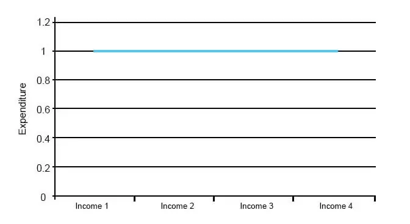

Fiscal policy, autonomous expenditure, and algorithmic trading are pivotal components of economic management, each influencing distinct aspects of economies worldwide. The integration of these elements is essential for optimizing economic performance and enhancing market efficiency. 

Fiscal policy, through government spending and taxation, plays a crucial role in stabilizing economies, promoting growth, and redistributing income. Its effective management can lead to sustainable economic development and minimize the adverse effects of economic fluctuations. Strategic deployment of fiscal policy can be instrumental in addressing short-term economic challenges while setting the stage for long-term growth.



Autonomous expenditure, which includes components of spending that are not influenced by the current level of income, such as government spending, investments, and exports, provides a stable demand base for goods and services. It acts as a catalyst for economic growth, allowing for a continuous flow of transactions that fuels economic expansion regardless of the immediate income context. Recognizing the significance of autonomous expenditure is vital for identifying factors that stimulate and sustain economic momentum.

Algorithmic trading, a technological advancement in the financial markets, automates the execution of trades with remarkable speed and precision. By minimizing human error and reacting swiftly to market changes, algorithmic trading enhances market efficiency. However, its impact on market stability, and potential to increase volatility, necessitates a balanced approach. Integrating algorithmic trading with macroeconomic indicators can optimize trading strategies and align them with fiscal and economic policies.

Understanding the interplay between fiscal policy, autonomous expenditure, and algorithmic trading is crucial for both short-term economic management and long-term strategic planning. As global economies continue to evolve, the proactive and synergistic integration of these elements will be indispensable for addressing emerging economic challenges and leveraging opportunities for growth and stability.

## Table of Contents

## Understanding Fiscal Policy

Fiscal policy is a critical tool used by governments to influence economic conditions through alterations in spending and taxation. By adjusting these levers, policymakers aim to achieve several key objectives: economic stabilization, growth promotion, and income redistribution.

Economic stabilization is central to fiscal policy, as it strives to smooth out the fluctuations in economic cycles. During times of economic downturn or recession, expansionary fiscal policy is often implemented. This involves increasing government expenditures and/or reducing taxes to stimulate demand. For example, when a government increases spending on infrastructure projects, it can spur job creation and business activity, thereby boosting economic output. Conversely, during periods of economic overheating or inflation, contractionary fiscal policy may be adopted. This involves reducing government spending or increasing taxes to cool down excessive demand.

Growth promotion is another primary goal of fiscal policy. By investing in key sectors such as education, healthcare, and infrastructure, governments can foster an environment conducive to long-term economic development. For instance, tax incentives for research and development can encourage innovation and boost productivity. Moreover, by maintaining a stable macroeconomic environment, fiscal policy can enhance investor confidence, leading to increased private investment.

Income redistribution aims to lessen economic inequalities within a society. Progressive taxation, where higher earners pay a larger percentage of their income in taxes, is one way to achieve this. Additionally, government spending on social programs, such as healthcare, education, and social security, can support lower-income groups and reduce poverty.

Implementing fiscal policy strategies is not without challenges. Policymakers must balance short-term demands with long-term objectives, often facing political constraints and budgetary limitations. Moreover, the effectiveness of fiscal interventions can be influenced by timing, with delays in implementation potentially dampening their intended impact.

A significant challenge is the potential for crowding out, where increased government borrowing leads to higher interest rates, reducing private sector investment. To mitigate this, governments need to monitor debt levels and ensure sustainability. The effectiveness of fiscal policy also depends on the economy's fiscal multiplier, which measures the change in economic output resulting from a change in government spending or taxation. A higher multiplier indicates a more significant impact on the economy from fiscal measures.

In conclusion, fiscal policy plays a pivotal role in shaping economic conditions. Its successful application requires careful planning, consideration of economic contexts, and the ability to adapt to changing circumstances. Understanding the mechanisms and implications of fiscal policy is essential for optimizing its benefits and minimizing potential drawbacks.

## The Role of Autonomous Expenditure

Autonomous expenditure plays a pivotal role in shaping economic growth, as it constitutes spending that remains unaffected by current income levels. Its significance lies in its ability to establish a stable demand for goods and services, acting as a foundation upon which economic activity is built. Key components of autonomous expenditure typically include government spending, investments, and exports, each contributing uniquely to economic dynamics.

Government spending, often considered a major element of autonomous expenditure, includes expenditures on infrastructure, defense, healthcare, and education. These expenditures are usually predetermined in the budget and are not directly linked to the current economic output. By injecting funds into the economy regardless of the prevailing income levels, government spending can stimulate production and job creation, consequently fostering economic growth. For instance, infrastructure projects can create employment and improve productivity, laying down the groundwork for further private sector investment.

Investments, particularly those undertaken by businesses and the public sector, add another layer to autonomous expenditure. These are often influenced by long-term expectations rather than immediate income changes. Investments in technology, research and development, or capital goods, drive innovation and efficiency, contributing to sustained economic expansion. For example, investing in renewable energy technologies not only ensures future energy security but also creates new markets and industries.

Exports, as a component of autonomous expenditure, bring in income from abroad and are determined by foreign demand, rather than domestic income levels. They provide an avenue for domestic businesses to scale operations beyond local markets, supporting economies of scale and enhanced competitiveness. Exports can be particularly beneficial for nations with a comparative advantage in certain industries, thereby fueling economic growth.

Understanding autonomous expenditure is crucial for identifying growth-stimulating factors. It sets a baseline demand that cushions the economy against cyclical fluctuations. When autonomous expenditure is high, economies tend to experience more robust growth as the initial demand encourages further consumption and investment. Conversely, during downturns, sustained autonomous expenditure can mitigate the severity of recessions by maintaining a level of demand that prevents further economic contraction.

In the context of economic models, autonomous expenditure is represented as a component of the aggregate expenditure function. This function can be expressed as:

$$
AE = C + I + G + (X - M)
$$

Where:
- $AE$ is the aggregate expenditure,
- $C$ denotes consumption,
- $I$ is investment,
- $G$ represents government spending,
- $X$ stands for exports, and
- $M$ denotes imports.

In this equation, $I$, $G$, and $X$ can be considered part of autonomous spending as they are less sensitive to short-term income changes. Autonomous aspects of these investments stabilize overall demand.

In summary, autonomous expenditure is an essential element that drives economic growth by maintaining demand irrespective of income variations. Components like government spending, investment, and exports play key roles in ensuring that the economy continues to advance and innovate, thereby fostering long-term stability and prosperity.

## Algorithmic Trading: Revolutionizing Markets

Algorithmic trading automates trade execution using sophisticated algorithms that are capable of handling complex mathematical models and vast datasets. This approach allows trading activities to occur at speeds and precision levels unattainable by human traders, fundamentally transforming the landscape of financial markets.

Algorithmic trading enhances market efficiency by minimizing human errors, which can occur due to emotional biases or slower reaction times. This efficiency is achieved through the consistent application of predefined criteria for trade execution, ensuring that trades are entered or exited optimally. For instance, algorithmic systems can track price movements, trade volumes, and historical patterns in real-time, executing transactions when desired conditions are met. This reduces the probability of human errors and enables the exploitation of trading opportunities with a precision that manual trading cannot match.

However, the introduction of [algorithmic trading](/wiki/algorithmic-trading) is not without its challenges. One significant concern is the potential for increased [volatility](/wiki/volatility-trading-strategies). Algorithms operating without human intervention can amplify price swings, particularly when multiple algorithms respond simultaneously to the same market event. Additionally, these algorithms may inadvertently contribute to systemic risks if designed with similar strategies, leading to cascading effects during market stress. Such risks necessitate effective risk management and regulatory oversight to mitigate adverse impacts on financial stability.

Integrating algorithmic trading with macroeconomic indicators can significantly enhance trading strategies. By incorporating indicators such as GDP growth rates, interest rates, and inflation figures, algorithms can be programmed to take account of broader economic trends, allowing for more informed decision-making. For example, if a positive economic indicator suggests impending currency appreciation, an algorithm can automatically initiate buy orders in affected currencies, capitalizing on anticipated market movements.

Python, a popular programming language in the field of algorithmic trading, offers numerous libraries such as NumPy for numerical computations, Pandas for data manipulation, and Scikit-learn for implementing [machine learning](/wiki/machine-learning) algorithms. A simple example of a trading algorithm in Python might look like this:

```python
import pandas as pd
import numpy as np

# Sample data
data = pd.DataFrame({
    'price': [100, 102, 101, 105, 110],
    'volume': [200, 250, 230, 240, 500]
})

# Simple moving average strategy
data['SMA_3'] = data['price'].rolling(window=3).mean()

# Buy signal when price is above the 3-period SMA
data['buy_signal'] = np.where(data['price'] > data['SMA_3'], True, False)

print(data)
```

In this code, a simple moving average (SMA) strategy identifies buy signals based on whether the current price exceeds the calculated SMA over a specified period.

Algorithmic trading represents a paradigm shift in how trades are executed and strategies formulated. By effectively utilizing technology and integrating macroeconomic data, it offers the potential to navigate complex markets more adeptly, although careful consideration of its limitations and risks must be maintained.

## Integration of Fiscal Policy and Algo Trading

Integrating fiscal policy with algorithmic trading represents a promising frontier for aligning economic strategies with market dynamics. Fiscal policy, notably through its instruments of government spending and taxation, has a direct influence on the economic environment. These instruments can impact market conditions by altering disposable income, aggregate demand, and investment levels. Algorithmic trading, characterized by the use of advanced mathematical models and data analysis to execute trades, offers the capability to respond rapidly to these fiscal changes. 

Implementing fiscal policy changes can frequently result in shifts in financial markets. For instance, an increase in government spending might boost consumer confidence and demand, leading to upward movements in stock prices. Conversely, tax hikes might dampen spending and investment, resulting in market contractions. Algorithmic trading systems, with their high-speed processing capabilities, can be programmed to recognize these fiscal signals quickly, optimizing trading strategies to capitalize on these anticipated market movements.

The integration of the two domains is not without challenges, chiefly due to the complexity of accurately interpreting economic policy impacts in real-time and the subsequent calibration of trading algorithms. Nonetheless, this integration offers new avenues for enhancing economic performance. For example, fiscal policy data such as treasury yields or government expenditure reports can act as inputs for algorithmic models, thereby enabling more responsive and dynamic trading strategies.

Such integration can also assist governments and financial institutions in achieving broader economic objectives, such as economic stabilization and growth. By fine-tuning algorithmic models to align with fiscal policy intents, markets can potentially experience reduced volatility and enhanced [liquidity](/wiki/liquidity-risk-premium). Moreover, this dynamic interaction can mitigate some challenges posed by economic unpredictability, fostering a more resilient economic framework.

Overall, exploring the synergy between fiscal policy and algorithmic trading is crucial for contemporary economic management, offering a pathway to optimize financial market responses and achieve economic stability and growth.

## Conclusion

The intricate interaction between fiscal policy, autonomous expenditure, and algorithmic trading forms a foundation for understanding modern economic systems. Each component holds distinct functions, yet they can overlap significantly, influencing economic stability and growth. As global economies face ever-evolving challenges, continuous innovation and adaptation in these domains become imperative.

Fiscal policy remains a powerful tool for governments to manage economic fluctuations. By adjusting spending and taxation, policymakers can influence aggregate demand, thus impacting economic growth and employment levels. However, the efficacy of fiscal policy can be contingent upon the responsiveness of autonomous expenditure­—spending that does not fluctuate with current income levels. Autonomous components such as government capital expenditure, investments, and net exports provide a steady demand that can mitigate the volatility of income-dependent spending.

Algorithmic trading brings a technological edge to financial markets, enhancing efficiency by executing trades at speeds beyond human capability. Yet, without careful integration with fiscal trends and autonomous spending patterns, algorithmic strategies can inadvertently increase market volatility. Market participants who harmonize these elements can refine their risk management and investment tactics, leveraging real-time economic data and fiscal signals to optimize trading algorithms.

The convergence of these three elements is not merely theoretical but a pressing practical necessity. Economic entities that strategically blend fiscal policy insights, autonomous spending behaviors, and advanced algorithmic trading frameworks gain a distinct advantage. Such integration supports not only immediate market responses but also long-term economic resilience and stability.

Ongoing developments and breakthroughs in technology, policy-making, and economic theory can further this integration. By staying at the forefront of innovation—whether through advances in machine learning for predictive analytics, novel fiscal approaches to macroeconomic challenges, or comprehensive models of automatic expenditure—a balanced and dynamic economic strategy can be achieved. Achieving growth and stability in today's complex markets necessitates embracing this triad's transformative potential, ensuring economic systems are prepared to exploit opportunities while safeguarding against systemic risks.

## References & Further Reading

[1]: Blanchard, O., & Leigh, D. (2013). ["Growth Forecast Errors and Fiscal Multipliers."](https://www.imf.org/external/pubs/ft/wp/2013/wp1301.pdf) American Economic Review, 103(3), 117-120.

[2]: Carlin, B. P., Polson, N. G., & Stoffer, D. S. (2009). ["A Case Studies Approach to Bayesian Computing Using R."](https://www.jstor.org/stable/2290282) John Wiley & Sons.

[3]: DeLong, J. B., & Summers, L. H. (2012). ["Fiscal Policy in a Depressed Economy."](https://www.brookings.edu/wp-content/uploads/2012/03/2012a_DeLong.pdf) Brookings Papers on Economic Activity, 2012(Spring), 233-297.

[4]: Aldridge, I. (2013). ["High-Frequency Trading: A Practical Guide to Algorithmic Strategies and Trading Systems."](https://www.amazon.com/High-Frequency-Trading-Practical-Algorithmic-Strategies/dp/1118343506) John Wiley & Sons.

[5]: Hull, J. C. (2012). ["Options, Futures, and Other Derivatives."](https://www.semanticscholar.org/paper/Options%2C-Futures%2C-and-Other-Derivatives-Hull/89bdee500c8623864fc9eb7a471546aa713acc44) Pearson Education, 9th Edition.