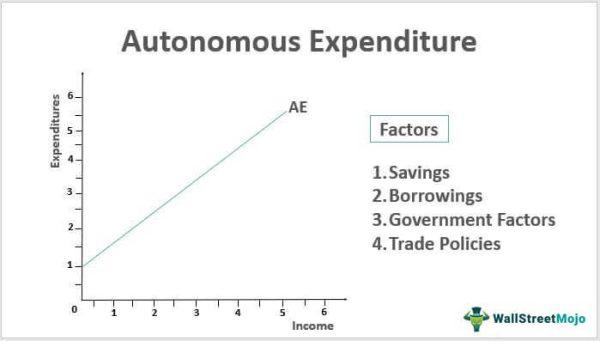

Algorithmic trading has become an integral part of modern financial markets, fundamentally transforming how trades are executed and enhancing market efficiency. This form of trading involves using complex algorithms to automatically execute trading orders based on a predetermined set of rules, which can incorporate various quantitative data and financial indicators. The adoption of algorithmic trading has been rapid, as it offers significant advantages including speed, precision, and the ability to process vast amounts of information in real-time. According to sources such as the Financial Times, algorithmic trading now accounts for a substantial portion of the trade volume in global financial markets. Its growing importance is underscored by its usage in various asset classes and by institutional investors seeking to optimize their trading strategies and reduce the impact of market anomalies. 

At the same time, autonomous investments have come to the fore, signifying a new direction in how investment decisions are made and implemented. Unlike traditional investment approaches where decisions are fundamentally driven by human analysis and discretion, autonomous investments rely significantly on automated systems powered by artificial intelligence and machine learning. These systems are capable of evaluating vast datasets to identify investment opportunities, thus maintaining a pivotal role in the accelerating dynamics of the global economy. Autonomous investments help streamline decision-making processes, reduce costs, and offer the potential for improved returns by effectively managing risks through diversified portfolios and constant adjustment to market conditions.



In light of these advancements, understanding the impact of economic factors on both autonomous investment and algorithmic trading is crucial. Economic factors, such as gross domestic product (GDP) growth, interest rates, inflation, and trade policies, greatly influence financial markets and investment behaviors. By examining these relationships, investors and policymakers can better predict market trends, align their strategies, and harness the potential of algorithmic trading and autonomous investment systems accordingly. This section will explore the interplay between these economic factors and advanced investment strategies, highlighting their combined impact on global financial markets.

## Table of Contents

## Understanding Economic Factors in Investment

Economic factors play a crucial role in shaping investment decisions by influencing the expected returns and risks associated with different asset classes. These factors encompass a range of macroeconomic indicators and policy decisions that can drive or impede economic growth. Understanding these elements is essential for investors seeking to optimize their portfolios and manage risks effectively.

Economic indicators, such as Gross Domestic Product (GDP) growth, interest rates, and trade policies, are pivotal in dictating asset allocation and investment strategies. GDP growth is a primary indicator of economic health, reflecting the overall output and consumption in an economy. A rising GDP signals robust economic activity, often leading investors to favor equities due to the potential for higher corporate earnings. Conversely, declining GDP may prompt a shift towards safer investments such as bonds, as companies may experience lower profits during economic downturns.

Interest rates, set by central banks, influence the cost of borrowing and the return on savings, thereby affecting investment decisions. Lower interest rates tend to stimulate economic activity by reducing the cost of financing, encouraging businesses to invest in growth and consumers to spend more. For investors, low interest rates often make bonds less attractive, driving a preference for stocks or other riskier assets that promise higher returns. On the other hand, high interest rates can attract investors to bonds, offering more significant yields and serving as a hedge against inflation.

Trade policies, including tariffs and trade agreements, also influence investment decisions by affecting international commerce and economic relations between countries. Protectionist policies, such as tariffs, may lead to higher costs for imported goods, impacting corporate profitability and consumer prices. These policies can trigger supply chain shifts, prompting investors to reassess their exposure to affected sectors and regions.

Economic stability, characterized by moderate inflation and consistent GDP growth, fosters a favorable environment for investment by reducing uncertainty and supporting reliable forecasting. In contrast, economic [volatility](/wiki/volatility-trading-strategies), driven by political instability, unexpected policy changes, or global crises, can disrupt markets and lead to erratic asset prices. Investors navigate this uncertainty by diversifying their portfolios and employing hedging strategies to mitigate potential losses.

Policy changes, such as fiscal stimulus measures or regulatory reforms, also significantly influence investment outcomes. Expansionary fiscal policies, involving increased government spending or tax cuts, can boost economic activity and enhance corporate earnings prospects, thus lifting stock markets. Regulatory reforms, aimed at increasing transparency or competition, can alter the risk-reward profile of specific industries and influence capital flows.

In summary, understanding and responding to economic factors is vital for making informed investment decisions. By analyzing macroeconomic indicators and policy changes, investors can better estimate potential returns and risks, allowing them to strategically allocate assets and protect their portfolios against adverse economic cycles.

## The Concept of Autonomous Investment

Autonomous investment refers to the expenditure on capital or goods that is not influenced directly by current income levels or economic conditions. Unlike induced investment, which varies with the levels of GDP and income, autonomous investment is typically stable and driven by factors such as technological innovation, governmental policy decisions, or fundamental shifts in market structure. This form of investment is pivotal for maintaining long-term economic growth and stability, as it often addresses critical infrastructure and foundational needs irrespective of short-term economic fluctuations.

Autonomous investments are integral to economic stability as they provide the underpinning for sustained growth. By focusing on essential sectors like infrastructure, education, and technology, these investments enhance a country's growth potential and productivity. For instance, investment in renewable energy infrastructure by governments is a classic example of autonomous investment. Such projects are typically guided by strategic long-term objectives, such as reducing carbon emissions and enhancing energy security, rather than immediate economic return.

Governments are the primary [agents](/wiki/agents) of autonomous investments, often embarking on projects that [carry](/wiki/carry-trading) significant social or economic externalities. A classic example can be seen in the construction of highways and transportation networks, which, although requiring substantial investment upfront, yield benefits over time through improved logistics and connectivity. Such investments also tend to stimulate private sector activity by lowering transportation costs and opening new markets.

The broader impacts of autonomous investments are significant, contributing to economic resilience by diversifying the industrial base and creating employment opportunities. For example, educational investments enhance the skill level of the workforce, thereby improving productivity and innovation capacity. Similarly, investments in public health infrastructure contribute to a healthier population, reducing economic losses due to illness and enhancing overall workforce efficiency.

In summary, autonomous investment plays a fundamental role not only in supporting immediate economic requirements but also in laying the groundwork for future economic prospects. By addressing foundational needs and enabling technological and infrastructural advancements, these investments ensure robust economic dynamics independent of prevailing economic cycles. This is crucial for fostering a stable and resilient economic environment conducive to long-term growth and development.

## Algorithmic Trading: Revolutionizing Investment Strategies

Algorithmic trading refers to the use of complex algorithms and automated platforms to execute trades in financial markets. The history of [algorithmic trading](/wiki/algorithmic-trading) can be traced back to the late 1970s when the New York Stock Exchange implemented a designated order turnaround system to automate order processing. The practice gained [momentum](/wiki/momentum) in the early 2000s with the advent of high-frequency trading ([HFT](/wiki/high-frequency-trading-strategies)), where programs are used to execute a large number of orders at extremely fast speeds, often in milliseconds.

The primary benefits of algorithmic trading include enhanced speed, accuracy, and efficiency compared to traditional human trading strategies. Algorithms can process vast amounts of market data in real-time, enabling quicker decision-making. This speed advantage is crucial in contemporary markets, where prices can fluctuate rapidly. Additionally, algorithms can execute trades with high precision, reducing the likelihood of human error and emotional biases that could negatively impact trading decisions.

From an efficiency standpoint, algorithmic trading allows for the simultaneous management of multiple trades across diverse markets, optimizing the execution process. Furthermore, removing human emotions from trading ensures that decisions are based purely on quantitative data and pre-established criteria, leading to more consistent outcomes.

However, algorithmic trading is not without its challenges and risks. System failures represent a significant risk, as technical glitches can lead to substantial financial losses. A notable example is the "flash crash" of May 6, 2010, when algorithmic trades caused the Dow Jones Industrial Average to plunge nearly 1,000 points within minutes, before recovering quickly. 

Regulatory issues also pose challenges. The rapid pace of algorithmic trading can lead to market volatility and raises concerns about fairness and transparency. Regulatory bodies globally have been grappling with how to effectively oversee and manage the impacts of algorithmic trading. This includes implementing measures such as circuit breakers and order limits to prevent excessive market disruptions.

Conclusively, while algorithmic trading revolutionizes investment strategies through its speed and precision, it necessitates robust risk management frameworks and appropriate regulatory oversight to mitigate its inherent risks.

## Impact of Economic Factors on Algo Trading

Economic factors play a pivotal role in shaping the strategies and decisions within algorithmic trading. Algorithmic trading, which leverages computer algorithms to execute orders based on pre-defined criteria, is particularly sensitive to macroeconomic indicators. These indicators can include GDP growth rates, interest rates, inflation, employment figures, and government fiscal policies, all of which provide insight into the current and future state of an economy.

**Influence of Economic Indicators on Algorithmic Trading Strategies**

Algorithmic trading systems are designed to quickly process large datasets that contain economic indicators. They can instantly react to new information, adjusting trading strategies in real-time based on economic forecasts or unanticipated economic developments. For instance, a sudden increase in interest rates might signal a tightening monetary policy, prompting algorithms to adjust their strategies by reallocating investments from interest-sensitive stocks to those less impacted by rate fluctuations. Similarly, a drop in unemployment rates might be perceived as a signal of economic strength, potentially impacting trading strategies that focus on consumer-facing sectors.

Moreover, the degree of influence an economic indicator has can vary depending on the type of algorithm in use. For example, mean-reversion algorithms, which are based on the concept that prices will revert to their historical average, may react differently to economic data compared to trend-following algorithms that might see such data as indicative of emerging trends.

**Examples of Economic Events Triggering Algorithmic Trading Activity**

Historical economic events have often led to significant algo trading activity. The 2008 financial crisis, for instance, caused extreme market volatility. During such times, algorithmic systems that employ volatility [arbitrage](/wiki/arbitrage) became highly active, capitalizing on price differences in a rapidly changing market. Similarly, Brexit's announcement in 2016 led to a swift depreciation of the British pound, triggering algorithmic systems to adjust their positions across currency markets almost instantaneously.

Another notable event was the COVID-19 pandemic, which dramatically affected global economies and led to massive shifts in asset allocations. Algorithms had to rapidly respond to changes initiated by government interventions, fiscal stimuli, and shifts in consumer behavior. This exemplified how algorithmic trading can capitalize on both short-term volatility and long-term economic shifts, balancing risk and opportunity in unprecedented scenarios.

**Role of AI and Machine Learning in Algorithmic Trading**

Artificial intelligence (AI) and [machine learning](/wiki/machine-learning) are increasingly integral to algorithmic trading. These technologies enhance the ability of algorithms to adapt to changing economic conditions by learning from historical data patterns and identifying correlations that may not be evident to human traders. Machine learning models can be designed to predict the impact of economic indicators on stock prices, identifying profitable trading opportunities that emerge from complex macroeconomic interactions.

For example, in Python, a simple linear regression model can be employed to understand the relationship between [interest rate](/wiki/interest-rate-trading-strategies) changes and stock market prices:

```python
from sklearn.linear_model import LinearRegression
import numpy as np

# Example data
interest_rates = np.array([0.5, 1.0, 1.5, 2.0, 2.5])
stock_prices = np.array([100, 98, 95, 92, 90])

# Reshape data for the regression model
interest_rates = interest_rates.reshape(-1, 1)

# Train the model
model = LinearRegression().fit(interest_rates, stock_prices)

# Predict stock price at a new interest rate level
predicted_price = model.predict(np.array([[3.0]]))
print(predicted_price)
```

This code snippet illustrates how machine learning can be used to predict stock prices based on changing economic variables, helping to inform trading decisions. By continuously learning and adapting to new data, AI-driven algos are capable of responding with greater accuracy and efficiency, enhancing their ability to predict and act upon subtle economic changes.

In summary, economic factors significantly influence algorithmic trading strategies and decisions. They act as crucial inputs that drive real-time market responses and long-term strategic planning. The integration of AI and machine learning enables these algorithms to adapt autonomously to dynamic economic landscapes, ensuring that they can exploit opportunities and mitigate risks effectively.

## Technological Advancements in Autonomous Investment Strategies

The integration of [artificial intelligence](/wiki/ai-artificial-intelligence) (AI) and big data analytics in autonomous investment has significantly transformed the investment landscape. These technologies have enabled more nuanced and precise investment strategies by leveraging vast amounts of data and sophisticated algorithms to make informed decisions with minimal human intervention.

AI algorithms in autonomous investment are designed to process complex and large datasets at high speed, allowing investors to identify patterns and trends that might not be immediately apparent through traditional analysis. Machine learning, a subset of AI, empowers these systems to continuously improve their predictive accuracy by learning from historical data and adjusting their models accordingly. This capability enhances decision-making, enabling investors to optimize portfolio management and forecast market movements with greater precision.

Big data analytics complements AI by providing the necessary data infrastructure to store, manage, and analyze voluminous datasets efficiently. This synergy facilitates the extraction of actionable insights from a myriad of data sources, including financial reports, market news, social media sentiment, and macroeconomic indicators. By utilizing algorithms capable of processing and analyzing these data streams in real-time, investors gain a competitive edge in identifying investment opportunities and managing risks effectively.

Looking forward, several technological innovations hold the potential to further revolutionize autonomous investment strategies. Quantum computing, although still in its nascent stage, promises to amplify computational capabilities exponentially. It could allow for the simulation of intricate economic models that are currently too complex for classical computers, thereby enhancing investment forecasts and enabling more accurate risk assessments.

Moreover, the development of more sophisticated AI models, such as [reinforcement learning](/wiki/reinforcement-learning) and generative adversarial networks (GANs), might provide unprecedented capabilities in scenario analysis and portfolio optimization. These models could simulate various market conditions and investment strategies to identify robust performance pathways across diverse economic landscapes.

Accessibility to advanced trading technologies has become increasingly feasible for smaller firms and individual investors. Cloud computing services have democratized access to high-performance computing resources, allowing even modestly funded investors to implement and benefit from AI-driven investment strategies. Additionally, user-friendly platforms and APIs enable the deployment of custom trading algorithms without necessitating extensive technical expertise.

The reduction in costs associated with data storage and computing power has further aided in leveling the playing field. As a result, individuals and small financial entities are now able to leverage complex analytics and execute trades with a speed and accuracy comparable to larger institutional investors. This technological democratization fosters innovation and competition in financial markets, encouraging a more dynamic and resilient investment ecosystem.

## Balancing Risks and Rewards in Autonomous Investment and Algo Trading

Balancing risks and rewards in autonomous investment and algorithmic trading involves navigating numerous challenges to optimize outcomes. Key strategies for managing risks include diversification, stress testing, and the use of stop-loss orders. Diversification reduces exposure to any single asset or sector, mitigating potential losses. Stress testing simulates adverse market conditions to ensure the robustness of trading strategies. Stop-loss orders automatically sell assets when certain price levels are reached, limiting losses during volatile market conditions.

Regulatory frameworks are crucial in maintaining secure and fair trading environments. Regulations like the Markets in Financial Instruments Directive II (MiFID II) in Europe and the Dodd-Frank Act in the United States aim to increase transparency and reduce risks associated with high-frequency trading. These frameworks mandate systematic reporting and monitoring, helping prevent market abuses and reduce systemic risks.

Investors can implement best practices to harness the potential benefits while mitigating risks. It is vital to continually monitor algorithm performance and adapt strategies based on evolving market conditions. Utilizing advanced risk management tools and maintaining a diverse investment portfolio are fundamental practices. Furthermore, ensuring thorough back-testing of algorithms against historical data can help anticipate how strategies might perform under various scenarios.

Incorporating machine learning can enhance the adaptability of trading algorithms. These systems can analyze vast amounts of data to identify patterns and predict future trends, providing a competitive edge. However, investors must remain vigilant of overfitting, where models become too tailored to past data and fail to generalize to unseen conditions.

Ultimately, balancing risks and rewards in autonomous investment and algorithmic trading requires a combination of robust risk management, adherence to regulatory standards, and the strategic application of technology. The evolving nature of financial markets necessitates adaptive and informed approaches to investment decision-making.

## Conclusion

The interplay between economic factors, autonomous investments, and algorithmic trading emphasizes an evolving landscape in global financial markets. Economic indicators such as GDP growth, interest rates, and trade policies not only shape traditional investment decisions but also significantly impact the strategies employed by algorithmic trading systems. Autonomous investments, characterized by their independence from short-term economic fluctuations, contribute to economic stability and infrastructure development, often serving as a counterbalance during economic downturns. 

Algorithmic trading has revolutionized investment strategies by enabling rapid, data-driven decisions that minimize human error and emotional bias. The integration of artificial intelligence (AI) and machine learning further enhances the flexibility and adaptability of algorithms, allowing them to react in real-time to economic changes. However, this sophistication comes with inherent risks, including the potential for system failures and the need for robust regulatory oversight to prevent market manipulation and ensure fair trading practices.

Looking forward, the reliance on autonomous investment and algorithmic trading is expected to grow, driven by technological innovations and the increasing availability of big data analytics. As global financial markets become more interdependent, the ability to swiftly adapt to shifting economic conditions will be crucial for maintaining a competitive edge. Investors, both institutional and individual, must continue to balance the potential rewards of these advanced strategies with the accompanying risks. This requires a commitment to continuous learning, the adoption of best practices, and engagement with evolving regulatory frameworks to optimize their investment outcomes and sustain economic growth.

## References & Further Reading

[1]: Bergstra, J., Bardenet, R., Bengio, Y., & Kégl, B. (2011). ["Algorithms for Hyper-Parameter Optimization."](https://dl.acm.org/doi/10.5555/2986459.2986743) Advances in Neural Information Processing Systems 24.

[2]: ["Advances in Financial Machine Learning"](https://www.amazon.com/Advances-Financial-Machine-Learning-Marcos/dp/1119482089) by Marcos Lopez de Prado

[3]: ["Evidence-Based Technical Analysis: Applying the Scientific Method and Statistical Inference to Trading Signals"](https://www.amazon.com/Evidence-Based-Technical-Analysis-Scientific-Statistical/dp/0470008741) by David Aronson

[4]: ["Machine Learning for Algorithmic Trading"](https://github.com/stefan-jansen/machine-learning-for-trading) by Stefan Jansen

[5]: ["Quantitative Trading: How to Build Your Own Algorithmic Trading Business"](https://www.amazon.com/Quantitative-Trading-Build-Algorithmic-Business/dp/1119800064) by Ernest P. Chan