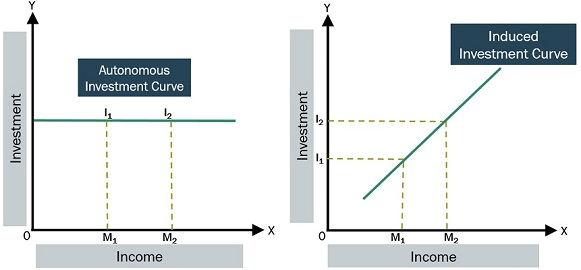

## Table of Contents

## What is autonomous investment?

Autonomous investment is money spent on things like new factories, machines, or technology that businesses do not directly link to their current sales or profits. It is called "autonomous" because it happens independently of how well the business is doing at the moment. For example, a company might decide to build a new research facility even if their sales are not increasing, because they believe it will help them in the long run.

These investments are important because they can lead to new products, better ways of doing things, and overall growth in the economy. When businesses make autonomous investments, they are betting on future growth and innovation. This can create jobs and improve productivity, which benefits everyone in the economy. However, these investments can be risky because they do not guarantee immediate returns and depend on the company's predictions about the future.

## How does autonomous investment differ from induced investment?

Autonomous investment and induced investment are two different types of spending by businesses. Autonomous investment is when a business spends money on things like new factories or machines without directly linking it to their current sales or profits. It's like a company deciding to build a new research lab even if their sales aren't going up right now. They do this because they believe it will help them in the future, even though it's a bit of a gamble.

On the other hand, induced investment is when a business spends money because their sales are going up or they expect them to go up soon. It's more of a reaction to what's happening right now in the market. For example, if a company sees that more people are buying their products, they might decide to buy more machines to make even more products. Induced investment is less risky because it's based on what's already happening, not just what might happen in the future.

Both types of investment are important for the economy. Autonomous investment can lead to new innovations and long-term growth, while induced investment helps businesses keep up with current demand. Together, they help create jobs and improve the economy, but they work in different ways.

## What are the main types of autonomous investments?

Autonomous investments are the kinds of spending that businesses do without directly thinking about their current sales or profits. One main type of autonomous investment is in research and development (R&D). Companies might spend money on R&D to create new products or improve existing ones, even if they're not making more money right now. They do this because they believe it will help them in the future. Another type is investment in infrastructure, like building new factories or offices. These are big projects that might not pay off right away, but companies hope they will lead to growth later on.

Another type of autonomous investment is in technology and equipment. Businesses might buy new machines or software that can help them work better, even if they don't need them right now. They do this because they think these tools will make them more efficient in the long run. Lastly, there's investment in human capital, like training programs for employees. Companies spend money on training not because they're getting more business now, but because they believe better-trained workers will help them grow in the future. All these types of autonomous investments are important because they help businesses prepare for the future, even though they're a bit risky.

## What role does government policy play in autonomous investment?

Government policy can have a big impact on autonomous investment. Governments can make rules and offer incentives that encourage businesses to spend money on things like new factories, research, and technology. For example, if the government gives tax breaks for companies that invest in green energy, more businesses might decide to build solar power plants or buy electric vehicles. This kind of policy can make it less risky for companies to spend money on things that might not pay off right away, but are good for the future.

On the other hand, government policy can also make autonomous investment harder. If the government makes it more expensive or complicated to start new projects, businesses might decide not to invest as much. For instance, if there are a lot of regulations and permits needed to build a new factory, a company might choose to wait or not do it at all. So, government policies can either help or hurt autonomous investment, depending on what they do.

## How do interest rates affect autonomous investment decisions?

Interest rates play a big role in how businesses decide to spend money on autonomous investments. When interest rates are low, it's cheaper for businesses to borrow money. This means they might be more willing to take a chance on big projects like building new factories or investing in research and development. They can borrow the money they need without worrying too much about high interest payments, which makes these long-term investments seem less risky.

On the other hand, when interest rates are high, borrowing money becomes more expensive. This can make businesses think twice about spending on things that won't pay off right away. They might decide it's not worth taking on the extra cost of high interest rates for projects that don't guarantee immediate returns. So, lower interest rates can encourage more autonomous investment, while higher interest rates might make businesses more cautious and less likely to invest in the future.

## What impact does technological advancement have on autonomous investment?

Technological advancement can boost autonomous investment a lot. When new technology comes out, businesses might want to spend money on it even if they're not making more money right now. They do this because they think the new technology will help them do things better or make new products in the future. For example, if a new type of machine comes out that can make things faster, a company might decide to buy it, hoping it will help them grow later on.

However, technological advancement can also make businesses more cautious about autonomous investment. If technology is changing very fast, companies might worry that the money they spend on new tech today could be wasted if something even better comes out soon. So, they might wait to see what happens before they invest a lot of money. This can slow down autonomous investment because businesses want to be sure they're spending on the right things.

## How do economic cycles influence the level of autonomous investment?

Economic cycles, which are the ups and downs in the economy, can really change how much businesses spend on autonomous investment. When the economy is doing well and growing, businesses might feel more confident about the future. They might decide to spend money on things like new factories or research, even if they don't need them right now. They do this because they think the good times will keep going and their investments will pay off later.

But when the economy is not doing so well, like during a recession, businesses can get more cautious. They might not want to spend money on big projects that won't help them right away. They're worried about making money now, so they might hold off on autonomous investments until they feel the economy is getting better. This can slow down innovation and growth, but it's a way for businesses to protect themselves during tough times.

## What are the key economic indicators that investors monitor for autonomous investment?

Investors keep an eye on several key economic indicators when deciding on autonomous investments. One important indicator is the Gross Domestic Product (GDP) growth rate. When GDP is growing, it often means the economy is doing well, and businesses might feel more confident about spending money on things like new factories or research, even if they don't need them right away. Another indicator they watch is the unemployment rate. Low unemployment can mean people have more money to spend, which might encourage businesses to invest in the future.

Interest rates are also a big deal for investors. When interest rates are low, it's cheaper for businesses to borrow money for big projects, making autonomous investments more appealing. On the other hand, high interest rates can make borrowing more expensive, which might make businesses think twice about spending on things that won't pay off immediately. Finally, investors also look at business confidence surveys. If businesses feel good about the future, they're more likely to make autonomous investments, hoping for long-term growth.

## How does global trade affect autonomous investment strategies?

Global trade can have a big impact on how businesses decide to spend money on autonomous investments. When trade is going well, businesses might feel more confident about the future. They might decide to spend money on things like new factories or research, even if they don't need them right now. They do this because they think that by selling their products in other countries, they can grow their business over time. For example, if a company sees that it can sell its products in a new market, it might invest in a new factory to make more products to meet that demand.

However, global trade can also make businesses more cautious about autonomous investments. If there are a lot of trade barriers, like tariffs or restrictions, it can be harder for businesses to sell their products in other countries. This can make them less likely to spend money on big projects that won't help them right away. They might worry that their investments won't pay off if they can't sell their products easily in other markets. So, businesses keep a close eye on global trade conditions when deciding whether to make autonomous investments.

## What are the long-term benefits and risks associated with autonomous investment?

Autonomous investment can lead to big benefits for businesses and the economy over time. When companies spend money on things like new factories, research, and technology without worrying about current sales, they are betting on future growth. This can lead to new products, better ways of doing things, and overall growth in the economy. For example, if a company builds a new research lab, it might discover a new product that becomes very popular. This can create jobs, boost the economy, and help the company grow even more in the future.

However, autonomous investment also comes with risks. Since these investments don't depend on current sales or profits, there's no guarantee they will pay off. A company might spend a lot of money on a new factory, but if the market changes or the new product doesn't sell well, they could lose money. It's like betting on the future without knowing what will happen. So, while autonomous investment can lead to great rewards, it also carries the risk of big losses if things don't go as planned.

## How can predictive analytics and big data influence autonomous investment?

Predictive analytics and big data can really help businesses make better decisions about autonomous investments. These tools let companies look at a lot of information to see patterns and predict what might happen in the future. For example, a business can use big data to see how people are buying things now and guess how they might buy in the future. This can help them decide if it's a good idea to spend money on a new factory or new technology, even if they don't need it right away. By using predictive analytics, businesses can feel more sure about their investments because they have more information to go on.

However, using predictive analytics and big data also has its challenges. Sometimes, the data can be wrong or hard to understand, which can lead to bad decisions. Also, just because the data says something might happen doesn't mean it will happen for sure. So, while these tools can help businesses make smarter autonomous investments, they still need to be careful and think about other things too. But overall, predictive analytics and big data can give businesses a better chance of making good choices about spending money on things that will help them grow in the future.

## What are the advanced financial models used to assess the viability of autonomous investments?

Advanced financial models help businesses figure out if it's a good idea to spend money on autonomous investments. One model they use is called the Discounted Cash Flow (DCF) model. This model looks at all the money a business might make from an investment in the future and then figures out how much that money is worth right now. It's like trying to guess how much a future dollar is worth today. If the number comes out positive, it means the investment could be a good idea. Another model is the Real Options Valuation, which treats investments like options in the stock market. It helps businesses see the value of waiting to invest or changing their plans if things change.

Another model that businesses use is the Monte Carlo Simulation. This model uses a computer to run a lot of different scenarios to see what might happen with an investment. It's like playing out different futures to see how likely each one is. This can help businesses understand the risks and rewards of their investments better. All these models help businesses make smarter decisions about spending money on things like new factories or research, even if they don't need them right away. They give businesses a way to look into the future and see if their bets on growth will pay off.

## References & Further Reading

[1]: Bergstra, J., Bardenet, R., Bengio, Y., & Kégl, B. (2011). ["Algorithms for Hyper-Parameter Optimization."](https://dl.acm.org/doi/10.5555/2986459.2986743) Advances in Neural Information Processing Systems 24.

[2]: ["Advances in Financial Machine Learning"](https://www.amazon.com/Advances-Financial-Machine-Learning-Marcos/dp/1119482089) by Marcos Lopez de Prado

[3]: ["Evidence-Based Technical Analysis: Applying the Scientific Method and Statistical Inference to Trading Signals"](https://www.amazon.com/Evidence-Based-Technical-Analysis-Scientific-Statistical/dp/0470008741) by David Aronson

[4]: ["Machine Learning for Algorithmic Trading"](https://github.com/stefan-jansen/machine-learning-for-trading) by Stefan Jansen

[5]: ["Quantitative Trading: How to Build Your Own Algorithmic Trading Business"](https://www.amazon.com/Quantitative-Trading-Build-Algorithmic-Business/dp/1119800064) by Ernest P. Chan