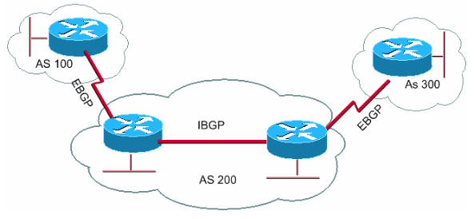

## Table of Contents

## What is an Autonomous System Number (ASN)?

An Autonomous System Number (ASN) is a unique identifier given to a collection of IP networks and routers that operate under a single organization's control. This system helps manage and route internet traffic efficiently. Think of it like a special code that helps different parts of the internet talk to each other smoothly.

ASNs are important because they help internet service providers (ISPs) and other large networks connect with each other. When data travels across the internet, it moves through different autonomous systems. The ASN makes sure this data knows where to go, kind of like how a postal code helps mail get to the right address. This way, even if the internet is made up of many different networks, they can all work together seamlessly.

## How is an ASN used on the internet?

An ASN, or Autonomous System Number, is like a special ID number that helps different parts of the internet work together. When you send an email or visit a website, your data travels through many different networks. Each of these networks has its own ASN. The ASN helps these networks know how to pass your data along to the right place. It's like giving each network a name so they can talk to each other and make sure your information gets where it needs to go.

When an internet service provider (ISP) or a big company wants to connect their network to the rest of the internet, they need an ASN. This number tells other networks, "Hey, I'm part of the internet too, and here's how you can reach me." Without ASNs, it would be really hard for all these different networks to connect and share data. So, ASNs are super important for keeping the internet running smoothly and making sure everyone can stay connected.

## Who assigns ASNs and how are they managed?

ASNs are assigned by organizations called Regional Internet Registries (RIRs). There are five RIRs around the world, each responsible for a different part of the globe. For example, ARIN handles North America, while RIPE NCC takes care of Europe. If you want an ASN, you apply to the RIR that covers your area. They check if you meet their rules, and if you do, they give you a unique ASN.

Once you have an ASN, you need to manage it carefully. This means making sure your network information stays up to date and following the rules set by your RIR. If you don't manage it well, you could lose your ASN. Also, if your network grows or changes, you might need to ask for more ASNs or change how your current ones are used. It's all about keeping things running smoothly and making sure everyone on the internet can connect with you.

## What is the difference between a 2-byte and a 4-byte ASN?

A 2-byte ASN is a shorter number used to identify networks on the internet. It can go from 1 to 65,535. These numbers were used first and are still common today. But because the internet grew a lot, we ran out of these shorter numbers.

So, we started using 4-byte ASNs. These are longer numbers that can go from 1 to 4,294,967,295. They give us way more options and can handle the bigger internet we have now. Both types of ASNs work together to keep the internet running smoothly, but 4-byte ASNs are needed because we need more unique numbers as the internet keeps growing.

## How can an organization obtain an ASN?

To get an ASN, an organization needs to apply to a Regional Internet Registry (RIR) that covers their area. There are five RIRs around the world, like ARIN for North America and RIPE NCC for Europe. The organization fills out an application form and provides details about their network and why they need an ASN. The RIR then checks if the organization meets their rules, which might include having a certain number of IP addresses or proving they need to connect to other networks.

Once the RIR approves the application, they assign a unique ASN to the organization. This number can be either a 2-byte or a 4-byte ASN, depending on what's available and what the organization needs. After getting the ASN, the organization needs to keep their network information up to date and follow the RIR's rules. If they don't, they could lose their ASN. So, it's important for them to manage it well and make sure it helps their network connect smoothly with the rest of the internet.

## What are the costs associated with getting an ASN?

Getting an ASN can cost money, but how much depends on where you are and which Regional Internet Registry (RIR) you apply to. For example, in North America, ARIN might charge a one-time fee of around $500 to $1,000 for a new ASN. In Europe, RIPE NCC might have a different fee, maybe around €1,000. These fees help the RIRs cover the costs of managing and keeping track of all the ASNs.

Besides the initial fee, there might be other costs to think about. Some RIRs charge yearly fees to keep your ASN active. These fees can be around $100 to $200 a year, but they can change. Also, if you need help with your application or managing your ASN, you might need to pay for that help. So, it's a good idea to check with your RIR to know all the costs before you apply.

## What is the role of an ASN in BGP (Border Gateway Protocol)?

An ASN, or Autonomous System Number, plays a big role in BGP, which stands for Border Gateway Protocol. BGP is like a special language that helps different networks on the internet talk to each other. When a network wants to send data to another network, it uses BGP to figure out the best way to get there. The ASN is like a name tag for each network. When networks use BGP, they include their ASN in the messages they send. This way, other networks know who they're talking to and can route the data correctly.

In simple terms, think of BGP as a big map that helps data find its way across the internet. The ASN is like a street address on that map. When a network sends data, it tells BGP, "I'm network number 12345, and I need to send this data to network number 67890." BGP looks at the ASNs and decides the best path for the data to take. Without ASNs, BGP wouldn't know how to guide the data, and the internet wouldn't work as well. So, ASNs are super important for making sure data can travel smoothly from one network to another.

## How does an ASN facilitate internet routing?

An ASN, or Autonomous System Number, helps the internet work smoothly by giving each network a unique number. When data travels across the internet, it moves through many different networks. Each of these networks has its own ASN. Think of an ASN like a special name tag that helps other networks know who they are talking to. When a network wants to send data to another network, it uses the ASN to make sure the data goes to the right place.

The internet uses a system called BGP, or Border Gateway Protocol, to decide the best path for data to travel. BGP is like a big map that helps data find its way. When a network sends data, it includes its ASN in the message. Other networks use these ASNs to figure out the best route for the data. Without ASNs, it would be hard for BGP to guide data correctly, and the internet wouldn't work as well. So, ASNs are really important for making sure data can move smoothly from one network to another.

## What are the best practices for managing an ASN?

Managing an ASN well means keeping your network information up to date. When you get an ASN, you need to tell the Regional Internet Registry (RIR) about your network, like what IP addresses you use and how your network connects to others. If anything changes, like if you add new IP addresses or change how your network works, you should update this information quickly. This helps other networks know how to reach you and keeps the internet running smoothly. Also, it's important to pay any fees on time, like yearly fees, so you don't lose your ASN.

Another good practice is to keep your network secure. This means setting up good security rules to protect your network from bad people who might try to mess with it. If someone tries to use your ASN in a bad way, like sending spam or attacking other networks, it could cause problems for you and others. So, always watch your network and make sure it's safe. By doing these things, you can make sure your ASN helps your network work well with the rest of the internet.

## Can an ASN be transferred or sold, and what are the implications?

An ASN can be transferred or sold, but it depends on the rules of the Regional Internet Registry (RIR) that gave it to you. If you want to transfer your ASN to another organization or sell it, you need to ask your RIR for permission. They will check to make sure the transfer follows their rules. For example, the new owner might need to show they really need the ASN and can manage it well. If the RIR says yes, then the ASN can be transferred or sold.

When an ASN is transferred or sold, it can affect how your network works with others on the internet. The new owner needs to update all the network information so other networks know how to reach them. If this isn't done right, it could cause problems with internet traffic. Also, the new owner takes on the responsibility of keeping the ASN secure and following the RIR's rules. If they don't, they could lose the ASN, which would be bad for their network and the internet as a whole.

## How do ASNs impact internet security and privacy?

ASNs can affect internet security and privacy in important ways. When a network has an ASN, it helps other networks know how to reach it. But if someone uses an ASN to do bad things, like sending spam or attacking other networks, it can cause big problems. This is why it's important for the people who own ASNs to keep their networks safe. If they don't, bad people might use their ASN to do harmful things, which can hurt the whole internet.

ASNs also play a role in privacy. When data travels across the internet, it goes through many networks, each with its own ASN. If these networks aren't careful, they might see or keep information about the data that's passing through. This could be a problem for privacy if the data includes personal information. So, it's important for networks to follow good privacy rules and make sure they're not keeping or sharing data they shouldn't. By doing this, they help keep the internet a safer and more private place for everyone.

## What future developments can we expect regarding ASN management and allocation?

In the future, we might see changes in how ASNs are managed and given out. As the internet keeps growing, we might need even more ASNs than we do now. This could mean using bigger numbers or finding new ways to share them. Also, the groups that give out ASNs, called RIRs, might start using new technology to make it easier and faster to manage ASNs. They might also make new rules to make sure ASNs are used in a fair and safe way.

Another thing that might happen is that we could see more automation in how ASNs are managed. Right now, people have to do a lot of work to apply for and keep track of ASNs. In the future, computers might be able to do more of this work, making it easier for everyone. This could help make the internet work better and be safer. But no matter what changes come, the main goal will always be to make sure the internet stays connected and works well for everyone.

## What are ASNs and how are they implemented in algorithmic trading?

In [algorithmic trading](/wiki/algorithmic-trading), low latency and efficient data transmission are integral to the success of trading strategies, which demand quick execution and minimal delay. Autonomous System Numbers (ASNs) play a pivotal role in achieving these objectives by optimizing the data flow between servers of trading platforms and market exchanges.

ASNs serve as unique identifiers for networks on the internet, enabling seamless routing of data packets across diverse networks. By strategically managing their own ASNs, trading firms can create reliable and direct data pathways between their systems and the exchanges. This direct connectivity helps in bypassing unnecessary intermediate networks, thereby reducing the number of network hops. Fewer hops translate to lower latencies, which is critical in high-frequency and algorithmic trading environments where milliseconds can influence financial outcomes significantly.

Moreover, ASNs facilitate better control over network routes through Border Gateway Protocol (BGP), which is utilized to determine the best path for data transmission. By leveraging BGP, trading firms can dynamically adjust routes based on current network conditions, thus optimizing the speed and efficiency of data exchanges. This adaptability is essential for avoiding congested paths and ensuring that trading algorithms receive the latest market data in real-time, enhancing their responsiveness and accuracy.

The ownership of ASNs also allows trading firms to peer directly with major Internet Service Providers (ISPs) and other key financial networks, further reducing latency and increasing the efficiency of data transfers. This direct peering can be demonstrated by the formula for calculating the total round-trip time (RTT) for a data packet, given as:

$$
RTT = \sum_{i=1}^{n} (d_i + p_i + t_i)
$$

where $d_i$ represents the propagation delay for each link $i$, $p_i$ denotes the processing delay at each intermediate device, and $t_i$ corresponds to any transmission delay. By minimizing $n$, the number of hops, through direct ASN peering, total latency $RTT$ can be significantly reduced.

In conclusion, the implementation of ASNs in algorithmic trading provides trading firms with the capability to maintain competitive advantage by ensuring swift, efficient, and reliable data transmission, thus optimizing trade execution and market interaction.

## References & Further Reading

[1]: Rekhter, Y., & Li, T. (1995). ["A Border Gateway Protocol 4 (BGP-4)."](https://www.rfc-editor.org/rfc/rfc1771) RFC 1771.

[2]: "Internet Exchange Points: Their Importance to the Nasdaq Trading Experience." (2020). Nasdaq.

[3]: Patel, K. (2018). ["Data Hopping: Architecting Low Latency for Algorithmic Trading in the Cloud Era."](https://algotrading101.com/learn/live-algo-trading-on-the-cloud-aws/) IEEE.

[4]: Stewart, J., "BGP4: Inter-Domain Routing in the Internet," Addison-Wesley, 1999.

[5]: Huston, G. (2001). ["Anatomy: A Look Inside Network."](https://www.cs.hmc.edu/~mike/public_html/courses/cs125/Readings/Anatomy-ALookInsideNATs.pdf) Asia-Pacific Network Operations and Management.

[6]: Narayanan, A., & Ferreira, E. (2014). ["The Impact of High-Frequency Trading on Market Liquidity: Evidence from the London Stock Exchange"](https://www.ncbi.nlm.nih.gov/pmc/articles/PMC4185134/). University of Warwick, Department of Economics.

[7]: Cartea, Á., Jaimungal, S., & Penalva, J. (2015). ["Algorithmic and High-Frequency Trading,"](https://assets.cambridge.org/97811070/91146/frontmatter/9781107091146_frontmatter.pdf) Cambridge University Press.