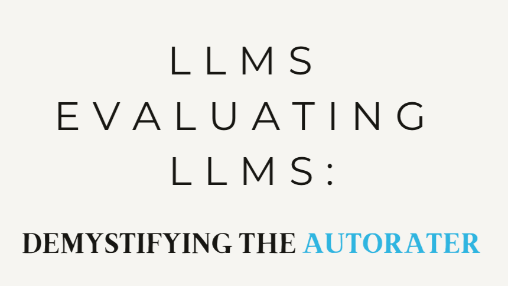

## Table of Contents

## What is Autorater Evaluation in the context of machine learning?

Autorater Evaluation in machine learning refers to the process of automatically assessing the performance of a model or system that rates or scores items, such as essays, products, or other entities. This evaluation typically involves comparing the model's ratings against a set of human-generated ratings or a gold standard to determine how well the model performs. The goal is to ensure that the model's ratings are reliable and consistent with human judgment, which is crucial for applications where automated ratings are used in decision-making processes.

The evaluation process often includes calculating various metrics such as accuracy, precision, recall, and correlation coefficients to quantify the agreement between the model's ratings and the human ratings. For example, a common metric used is the Pearson correlation coefficient, which measures the linear relationship between two sets of ratings. If the model's ratings closely align with human ratings, the correlation coefficient will be high, indicating good performance. By using these metrics, developers can fine-tune their models to improve their rating accuracy and reliability, ensuring that the autorater system meets the required standards for its intended use.

## Why is Autorater Evaluation important for machine learning models?

Autorater Evaluation is important for machine learning models because it helps to check if the model's ratings are good enough to be used in real life. When a model rates things like essays or products, it's important that these ratings match what humans would give. If the model's ratings are different from human ratings, people might not trust the model. By doing an autorater evaluation, we can see how close the model's ratings are to human ratings and make changes to the model to make it better.

The evaluation uses different ways to measure how well the model is doing. One common way is to use a number called the Pearson correlation coefficient, which shows how much the model's ratings and human ratings go together. If this number is high, it means the model is doing a good job. By looking at these numbers, people who make the models can see what needs to be fixed. This helps make sure the model will work well when it's used for things like grading schoolwork or rating customer reviews.

## What are the basic metrics used in Autorater Evaluation?

In Autorater Evaluation, the basic metrics used are accuracy, precision, recall, and correlation coefficients. Accuracy measures how often the model's ratings match the human ratings exactly. Precision looks at how many of the model's positive ratings were correct, and recall checks how many of the actual positive ratings the model caught. These metrics help us see how well the model is doing at rating things the same way humans do.

Another important metric is the correlation coefficient, which shows how closely the model's ratings follow the human ratings. The Pearson correlation coefficient, for example, is often used and can be calculated with the formula $$ r = \frac{\sum (X_i - \bar{X})(Y_i - \bar{Y})}{\sqrt{\sum (X_i - \bar{X})^2 \sum (Y_i - \bar{Y})^2}} $$, where $$X_i$$ and $$Y_i$$ are individual ratings, and $$\bar{X}$$ and $$\bar{Y}$$ are the means of the ratings. A high correlation coefficient means the model's ratings are very similar to human ratings, which is what we want. By using these metrics, we can make sure the model is reliable and useful for real-world applications.

## How does Autorater Evaluation differ from traditional model evaluation methods?

Autorater Evaluation focuses on how well a [machine learning](/wiki/machine-learning) model can rate or score items, like essays or products, compared to how humans would rate them. This is different from traditional model evaluation methods, which often look at how well a model can predict or classify things. In traditional evaluation, you might use metrics like accuracy, precision, and recall to see if a model can tell if an email is spam or not. But with autorater evaluation, these same metrics are used to see if the model's ratings match human ratings, which is a more specific task.

The key difference is that autorater evaluation uses correlation coefficients, like the Pearson correlation coefficient, to measure how closely the model's ratings follow human ratings. The formula for the Pearson correlation coefficient is $$ r = \frac{\sum (X_i - \bar{X})(Y_i - \bar{Y})}{\sqrt{\sum (X_i - \bar{X})^2 \sum (Y_i - \bar{Y})^2}} $$, where $$X_i$$ and $$Y_i$$ are individual ratings, and $$\bar{X}$$ and $$\bar{Y}$$ are the means of the ratings. Traditional methods might not use this kind of metric because they are more focused on binary outcomes or categories, not on how well the model can mimic human judgment in rating tasks.

## What are the common challenges faced when implementing Autorater Evaluation?

Implementing Autorater Evaluation can be tricky because it's hard to get a model to rate things the same way humans do. Humans can be inconsistent, and what one person thinks is a good rating might be different from what another person thinks. This makes it tough to find a good set of human ratings to compare the model's ratings to. Also, if the model is rating something like essays, it needs to understand the text well, which is a big challenge in itself.

Another challenge is choosing the right metrics to use. Metrics like accuracy, precision, and recall are common, but they might not show the full picture of how well the model is doing. The Pearson correlation coefficient, which is calculated with the formula $$ r = \frac{\sum (X_i - \bar{X})(Y_i - \bar{Y})}{\sqrt{\sum (X_i - \bar{X})^2 \sum (Y_i - \bar{Y})^2}} $$, is often used to see how closely the model's ratings follow human ratings. But even this might not be enough, and sometimes you need to use other ways to check if the model is really doing a good job.

## Can you explain how to set up an Autorater Evaluation system?

Setting up an Autorater Evaluation system involves gathering a good set of human ratings to compare with the model's ratings. You start by collecting a bunch of items that need to be rated, like essays or products. Then, you get a group of people to rate these items. It's important that these human raters are trained and follow clear guidelines so their ratings are as consistent as possible. Once you have these human ratings, you can use them as a gold standard to see how well your model's ratings match up.

Next, you need to choose the right metrics to measure how well the model is doing. Common metrics are accuracy, precision, recall, and the Pearson correlation coefficient. The Pearson correlation coefficient, calculated with the formula $$ r = \frac{\sum (X_i - \bar{X})(Y_i - \bar{Y})}{\sqrt{\sum (X_i - \bar{X})^2 \sum (Y_i - \bar{Y})^2}} $$, shows how closely the model's ratings follow the human ratings. A high value for this coefficient means the model is doing a good job. You might also need to write some code to calculate these metrics. Here's a simple example in Python to calculate the Pearson correlation coefficient:

```python
import numpy as np

def pearson_correlation(x, y):
    x_mean = np.mean(x)
    y_mean = np.mean(y)
    numerator = np.sum((x - x_mean) * (y - y_mean))
    denominator = np.sqrt(np.sum((x - x_mean)**2) * np.sum((y - y_mean)**2))
    return numerator / denominator if denominator != 0 else 0

# Example usage
model_ratings = [4, 5, 3, 2, 1]
human_ratings = [4, 4, 3, 2, 1]
correlation = pearson_correlation(model_ratings, human_ratings)
print(f"Pearson Correlation Coefficient: {correlation}")
```

By using these steps and metrics, you can set up an Autorater Evaluation system to make sure your model's ratings are reliable and useful for real-world applications.

## What role does data quality play in Autorater Evaluation?

Data quality is very important for Autorater Evaluation because it makes sure that the model's ratings can be compared to good human ratings. If the human ratings are not good, the model's ratings might look bad even if the model is doing a good job. For example, if different people rate the same essay differently, it's hard to know if the model's rating is right or wrong. So, it's important to have clear rules for human raters and to make sure they follow these rules to get good, consistent ratings.

Having good data also helps when calculating metrics like the Pearson correlation coefficient, which is used to see how closely the model's ratings follow the human ratings. The formula for the Pearson correlation coefficient is $$ r = \frac{\sum (X_i - \bar{X})(Y_i - \bar{Y})}{\sqrt{\sum (X_i - \bar{X})^2 \sum (Y_i - \bar{Y})^2}} $$. If the human ratings are not consistent, this number might be low even if the model is doing well. So, good data quality helps make sure that the metrics we use to evaluate the model are accurate and reliable.

## How can bias be detected and mitigated in Autorater Evaluation?

Bias in Autorater Evaluation can be detected by comparing the model's ratings across different groups of items or raters. For example, if the model rates essays written by one group of students differently than essays written by another group, even when the essays are similar in quality, this might show bias. To find this kind of bias, you can look at the average ratings given to different groups and use statistical tests to see if the differences are significant. Another way to detect bias is by using fairness metrics, like the difference in the Pearson correlation coefficient $$ r = \frac{\sum (X_i - \bar{X})(Y_i - \bar{Y})}{\sqrt{\sum (X_i - \bar{X})^2 \sum (Y_i - \bar{Y})^2}} $$ between different groups. If the correlation is much lower for one group, it might mean the model is biased against that group.

To mitigate bias, you can start by making sure the training data used to build the model is fair and represents all groups equally. If the data is biased, the model will learn those biases. You can also use techniques like re-weighting the data to give more importance to underrepresented groups or using fairness constraints in the model training process. Another approach is to regularly check the model's performance across different groups and adjust the model if you find any unfairness. By doing these things, you can help make sure the model's ratings are fair and useful for everyone.

## What advanced techniques can enhance the accuracy of Autorater Evaluation?

To make Autorater Evaluation more accurate, you can use a technique called ensemble methods. This means you use many different models to rate things and then combine their ratings to get a final score. By doing this, you can make the final rating more reliable because you're using the strengths of different models. Another advanced technique is to use [deep learning](/wiki/deep-learning), which is a type of machine learning that can understand complex patterns in data. Deep learning models, like neural networks, can be very good at rating things like essays or products because they can learn from a lot of examples and get better over time.

Another way to improve Autorater Evaluation is by using cross-validation. This means you split your data into different parts and use some parts to train the model and other parts to test it. By doing this many times with different splits, you can make sure the model is good at rating things it hasn't seen before. You can also use advanced metrics like the Cohen's kappa coefficient, which measures how much the model's ratings agree with human ratings after accounting for chance. The formula for Cohen's kappa is $$ \kappa = \frac{p_o - p_e}{1 - p_e} $$, where $$p_o$$ is the observed agreement and $$p_e$$ is the expected agreement by chance. By using these advanced techniques and metrics, you can make your Autorater Evaluation system more accurate and reliable.

## How does Autorater Evaluation integrate with continuous learning and model updating?

Autorater Evaluation is important for continuous learning and model updating because it helps make sure the model keeps getting better over time. When a model rates things like essays or products, it needs to be checked regularly to see if its ratings are still good compared to human ratings. By doing Autorater Evaluation often, you can find out if the model needs to be updated. If the model's ratings start to drift away from human ratings, you can use the results of the evaluation to make changes to the model. This might mean retraining the model with new data or tweaking how it works to keep its ratings accurate.

One way to integrate Autorater Evaluation with continuous learning is to set up a system where the model is always learning from new data. Every time new ratings come in, you can use them to update the model. For example, you might use a technique called online learning, where the model updates itself little by little as it sees new data. To check how well the model is doing after these updates, you can use metrics like the Pearson correlation coefficient $$ r = \frac{\sum (X_i - \bar{X})(Y_i - \bar{Y})}{\sqrt{\sum (X_i - \bar{X})^2 \sum (Y_i - \bar{Y})^2}} $$. If the correlation stays high, it means the model's updates are working well. By keeping an eye on these metrics, you can make sure the model stays accurate and reliable as it learns and changes over time.

## What are the latest research developments in Autorater Evaluation?

Recent research in Autorater Evaluation has focused on improving the accuracy and fairness of machine learning models used for rating tasks. One key development is the use of advanced natural language processing (NLP) techniques, like transformer models, to better understand and rate text-based content such as essays or customer reviews. These models can capture complex linguistic patterns and context, leading to more accurate ratings. Another important area of research is the development of new metrics for evaluating autoraters. For example, researchers have been exploring the use of the Cohen's kappa coefficient $$ \kappa = \frac{p_o - p_e}{1 - p_e} $$, which measures the agreement between the model's ratings and human ratings while accounting for chance. This helps in assessing the model's performance more accurately and ensuring its ratings are reliable.

Additionally, there has been significant work on addressing bias in autorater systems. Researchers are developing methods to detect and mitigate bias by analyzing the model's ratings across different demographic groups. Techniques like adversarial training and fairness constraints are being used to ensure that the model's ratings are fair and unbiased. Another trend is the integration of Autorater Evaluation with continuous learning and model updating. By using online learning approaches, models can be updated in real-time with new data, and their performance can be continuously monitored using metrics like the Pearson correlation coefficient $$ r = \frac{\sum (X_i - \bar{X})(Y_i - \bar{Y})}{\sqrt{\sum (X_i - \bar{X})^2 \sum (Y_i - \bar{Y})^2}} $$. This ensures that the model remains accurate and reliable as it evolves over time.

## How can Autorater Evaluation be optimized for large-scale machine learning deployments?

Optimizing Autorater Evaluation for large-scale machine learning deployments involves making sure the system can handle a lot of data and still give accurate ratings. One way to do this is by using distributed computing, where the work of rating and evaluating is spread out across many computers. This can help speed up the process and make sure the system can keep up with a lot of ratings coming in at once. Another way is to use efficient algorithms and data structures that can handle big data quickly. For example, you might use techniques like sampling to only look at a part of the data instead of all of it, which can make the evaluation faster without losing too much accuracy.

Another important part of optimizing Autorater Evaluation for large-scale deployments is using metrics that can be calculated quickly and still give a good idea of how well the model is doing. The Pearson correlation coefficient $$ r = \frac{\sum (X_i - \bar{X})(Y_i - \bar{Y})}{\sqrt{\sum (X_i - \bar{X})^2 \sum (Y_i - \bar{Y})^2}} $$ is a good metric for this because it can be calculated efficiently even with a lot of data. You can also use techniques like online learning, where the model keeps updating itself as new data comes in. This helps the model stay accurate over time without needing to stop and retrain from scratch, which can be slow and hard to do on a large scale. By using these methods, you can make sure your Autorater Evaluation system works well even when it's handling a lot of data.