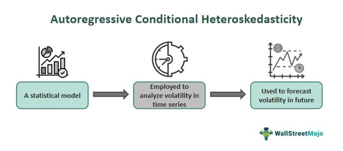

Algorithmic trading has revolutionized financial markets by leveraging advances in technology to automate buy and sell decisions. At its core, algorithmic trading relies heavily on predictive models to analyze market trends and perform transactions at speeds and accuracies that far exceed human capabilities. These models use vast amounts of historical data to identify patterns and make forecasts, which form the backbone of trading strategies.

One crucial aspect of these predictive models is their ability to account for volatility in financial time series. Volatility refers to the degree of variation in the price of a financial instrument over time and is a key indicator of risk. Accurate modeling of volatility is essential for developing strategies that maximize returns while managing risk. Among the various approaches to modeling volatility, the Autoregressive Conditional Heteroskedasticity (ARCH) model stands out as a significant development in capturing and predicting the ever-changing market conditions.



Introduced by Robert F. Engle in 1982, the ARCH model addresses the issue of heteroskedasticity—where the variability of a series changes over time—in financial data. Unlike traditional econometric models that assume constant variance, ARCH models recognize that volatility clusters over certain periods, leading to more accurate forecasts of future price movements. This characteristic is particularly essential in financial markets, where sharp volatility spikes are common around significant economic events.

ARCH models have paved the way for more sophisticated volatility models, such as the Generalized Autoregressive Conditional Heteroskedasticity (GARCH) model. These advancements have contributed to more robust forecasting techniques used in algorithmic trading. By accurately modeling volatility, traders can better anticipate market movements and refine their trading algorithms to navigate the uncertainty inherent in financial markets effectively.

The significance of ARCH models goes beyond just forecasting; they facilitate enhanced risk management strategies within algorithmic trading. By understanding and predicting periods of high volatility, traders can adjust their portfolios and risk appetites accordingly, ultimately leading to more stable and profitable trading outcomes.

In conclusion, the integration of ARCH models within algorithmic trading has highlighted the importance of volatility modeling in financial time series. It exemplifies how econometric innovations continue to shape trading strategies, underscoring the ongoing evolution of financial markets driven by data-driven insights.

## Table of Contents

## What is Autoregressive Conditional Heteroskedasticity (ARCH)?

Autoregressive Conditional Heteroskedasticity (ARCH) models, developed by Nobel laureate Robert F. Engle, revolutionized the econometric analysis of time-series data, particularly by addressing the challenges posed by varying [volatility](/wiki/volatility-trading-strategies) over time. Engle introduced ARCH models in his seminal 1982 paper as a means to better capture and model the heteroskedastic nature of financial time series—a common phenomenon where the variance of a series is not constant but depends on past periods' error terms.

ARCH models operate by modeling time-varying volatility as a function of past squared deviations from the mean, thus allowing for clusters of volatility—periods of swings followed by periods of relative calm—commonly observed in financial data. The basic ARCH model can be expressed as:

$$

\sigma_t^2 = \alpha_0 + \alpha_1 \epsilon_{t-1}^2 + \cdots + \alpha_q \epsilon_{t-q}^2 
$$

where $\sigma_t^2$ is the conditional variance of the error term at time $t$, $\epsilon_{t-1}^2, \ldots, \epsilon_{t-q}^2$ are the squared errors from previous periods, and $\alpha_0, \alpha_1, \ldots, \alpha_q$ are parameters to be estimated. This formulation helps capture how past shocks affect current volatility, reflecting real-world scenarios where, say, a market crash might lead to a sustained period of high volatility.

In econometrics and finance, ARCH models have become fundamental in understanding and forecasting volatility in asset returns. This is critically important for risk management, derivatives pricing, and portfolio allocation because volatility is a key risk [factor](/wiki/factor-investing) in financial markets. Understanding its behavior allows for more informed decisions and strategies.

Variance modeling through ARCH is crucial as financial data is often non-linear and subject to large, unexpected changes. Traditional linear models fail to capture the varying nature of volatility, hence ARCH models offer a more nuanced approach. This is imperative in providing insights into the behavior of returns over time, which feeds into better forecasting and risk assessment.

By accurately depicting time-series behavior, ARCH models provide valuable tools for traders, risk managers, and policymakers who need to predict and react to market dynamics effectively, enabling them to anticipate periods of market turbulence with greater accuracy.

## ARCH Model in Financial Markets

The ARCH model plays a significant role in the financial markets by providing a framework for understanding and forecasting the volatility clusters that often characterize financial time series data. Volatility clusters refer to periods where high-volatility events are followed by more high-volatility events, and low-volatility events are similarly clustered. This behavior is a common trait in financial markets, driven by the uneven flow of information and investor reactions.

Traders leverage ARCH models to anticipate market movements by modeling the volatility of asset returns. The core idea behind the ARCH model is that current volatility can be predicted based on past error terms from a mean model. In mathematical terms, the variance of the current error term is a function of the past squared error terms. This approach allows traders to estimate the likelihood of significant price changes, thereby equipping them to make informed decisions about risk management and asset allocation.

For instance, a trader might use an ARCH model to gauge the risk of holding a particular stock or portfolio in environments perceived to be highly volatile. By analyzing the volatility patterns, they can devise strategies such as adjusting hedge ratios or optimizing their portfolios to minimize risk exposure.

A key comparison can be made between ARCH and its successor, the GARCH (Generalized Autoregressive Conditional Heteroskedasticity) model. While the ARCH model captures volatility through past squared innovations, the GARCH model extends this by incorporating lagged conditional variances. This results in a more flexible approach to modeling volatility, as it accounts for both past shocks and the persistence of volatility over time. In practical terms, GARCH models are often preferred for their ability to provide a more comprehensive framework for predicting future volatility since they smooth out volatility estimates rather than relying solely on spikes.

Overall, ARCH models are instrumental in providing insights into volatility patterns observed in financial markets, enabling traders to adapt their strategies to changing market conditions. While alternatives like the GARCH model offer enhancements in volatility modeling by providing a more robust and smoother prediction, the foundational insights from ARCH remain valuable in constructing and developing volatility forecasting tools and strategies.

## Algorithmic Trading Strategies Using ARCH Models

Algorithmic trading has revolutionized financial markets by leveraging computational algorithms to make trading decisions at speeds and frequencies that are impossible for human traders. Central to successful [algorithmic trading](/wiki/algorithmic-trading) is the reliance on statistical predictions, which allow traders to anticipate market movements and volatility.

Autoregressive Conditional Heteroskedasticity (ARCH) models play a significant role in this predictive framework. Developed by Robert F. Engle, ARCH models are used to model financial time series data characterized by periods of volatility clustering—where high-volatility events are followed by more high-volatility events. By predicting these clusters, ARCH models help algorithmic traders better understand and forecast market risks.

When it comes to integrating ARCH models into trading algorithms, one of the most significant advantages is their ability to predict changes in volatility, which is a critical component of pricing derivatives, risk management, and constructing robust portfolios. For instance, a trading algorithm may use an ARCH model to estimate the expected volatility of a stock over a specific period. This information can then inform decisions on how much of the stock to buy or sell or whether to hedge against potential risks.

Consider a case where ARCH models are implemented in an intra[day trading](/wiki/day-trading-spy) strategy. The model predicts that the volatility of a particular asset is about to increase significantly based on historical price patterns. The trading algorithm can respond by shorting the asset or buying options that anticipate increased price movement, thereby capitalizing on volatility itself as a strategic factor.

Furthermore, ARCH models are compared to other volatility models, such as the Generalized Autoregressive Conditional Heteroskedasticity (GARCH) models, which extend ARCH by introducing lag volatilities into the model. GARCH models often provide even more predictive power for trading algorithms due to their ability to capture both short and long-volatility dynamics.

Although ARCH models offer valuable insights and predictions for algorithmic trading, their complexity and computational demands shouldn't be underestimated. Successful traders often employ a mix of models and continuously adapt these to capture the nuances of market behavior, sometimes combining ARCH models with machine learning techniques to fine-tune predictions further.

In summary, ARCH models are a foundational tool in algorithmic trading strategies for predicting market volatility. Their ability to adapt to volatility clusters allows traders to anticipate and react to market changes efficiently, transforming volatility from a risk into an opportunity.

## Advantages and Limitations of ARCH in Trading

Incorporating Autoregressive Conditional Heteroskedasticity (ARCH) models in algorithmic trading offers several advantages, particularly in enhancing risk management. By effectively modeling time series volatility, ARCH models enable traders to anticipate periods of high or low market volatility, helping them to adjust their trading strategies accordingly. This capability is crucial for both profit maximization and loss minimization, as it allows for better informed decisions in dynamic market environments.

One significant advantage is the improvement in risk assessment and management. By predicting the variability in return data, ARCH models help in identifying volatility clusters, which are periods when high volatility persists for a time. This foresight aids traders in managing their portfolios with a focus on volatility exposure, leading to more stable returns over time. Consequently, algorithmic trading systems leveraging ARCH models can dynamically adjust their strategies, such as altering position sizes or recalibrating stop-loss limits, to align with current and anticipated market conditions.

Despite these benefits, there are notable limitations associated with the use of ARCH models in trading applications. One primary limitation is the complexity inherent in model estimation. ARCH models involve estimating numerous parameters to accurately capture volatility patterns, which can be computationally intensive. This demand for high computational power can hinder real-time application, particularly for high-frequency trading strategies where decisions must be executed within milliseconds.

Moreover, ARCH models, while adept at capturing past volatility behavior, may not always adequately predict future volatility due to their reliance on historical data patterns. Financial markets are influenced by a wide array of factors, such as macroeconomic events or sudden geopolitical shifts, that may not be reflected in historical data alone. Thus, the accuracy of ARCH models in predicting such events can be limited.

In terms of alternative models, the Generalized Autoregressive Conditional Heteroskedasticity (GARCH) model often provides a more flexible approach to volatility forecasting. Unlike ARCH, which assumes that volatility is a function solely of past squared returns, GARCH incorporates past variances as well, offering a more comprehensive view of volatility dynamics. This enhancement can result in better predictive performance in certain scenarios, particularly where volatility shows strong persistence over time.

Overall, while ARCH models present valuable tools for risk management and volatility forecasting in algorithmic trading, their utility is bounded by computational demands and the inherent challenges in predicting future market conditions purely based on historical data. The ongoing development and integration of [machine learning](/wiki/machine-learning) techniques with econometric models could potentially address some of these limitations, paving the way for more robust trading strategies.

## Future Directions for ARCH in Algorithmic Trading

Emerging trends in financial econometrics continue to enhance the usability and precision of ARCH models within the context of algorithmic trading. As the complexity and the [volume](/wiki/volume-trading-strategy) of financial data grow, the integration of machine learning techniques with traditional econometric models like ARCH presents a promising path forward for improving predictive accuracy and, consequently, trading performance.

Machine learning offers several advantages when combined with ARCH models. Machine learning algorithms, particularly those concerning [deep learning](/wiki/deep-learning) and ensemble methods, can be employed to identify complex patterns and non-linear relationships in financial time series data that ARCH models may struggle to capture independently. For instance, hybrid models combining ARCH with [neural network](/wiki/neural-network)s can utilize the robust volatility clustering detection of ARCH while leveraging the pattern recognition capabilities of machine learning to better forecast extreme market movements.

Python, being a popular language for quantitative analysis, provides several tools to facilitate this integration. Packages such as `arch` for ARCH modeling, alongside `scikit-learn` and `TensorFlow` for machine learning, allow for experimental setups that blend these approaches. Here is a simple example:

```python
import numpy as np
import pandas as pd
from arch import arch_model
from sklearn.ensemble import RandomForestRegressor

# Sample data
returns = np.random.normal(0, 1, 1000)
returns_squared = np.square(returns)

# ARCH model
arch_mod = arch_model(returns, vol='ARCH', p=1)
arch_fit = arch_mod.fit()

# Use ARCH model output as inputs to machine learning
feature_matrix = np.column_stack((returns_squared, arch_fit.conditional_volatility))

# Random forest regressor for enhancing volatility prediction
rf = RandomForestRegressor(n_estimators=100)
rf.fit(feature_matrix[:-1], returns[1:])

predicted_volatility = rf.predict(feature_matrix[:-1])
```

Looking forward, one can anticipate several advancements and challenges in the deployment of ARCH models for algorithmic trading. The primary expected advancements include the development of more sophisticated hybrid models that can efficiently combine econometric foundations with modern machine learning techniques, paving the way for algorithms that adapt to rapid changes in market conditions with greater agility.

Challenges that need addressing include the computational demands of these hybrid systems, as they can be intensive and costly. Moreover, ensuring transparency and interpretability of these models becomes crucial, given the black-box nature of many machine learning methods. There is a necessity for standard development practices that enhance the robustness and reliability of integrated ARCH and machine learning solutions in live trading environments.

Overall, the future of ARCH models in algorithmic trading appears promising, with technological advancements supporting an era of more accurate and adaptive trading strategies. Integrating ARCH with machine learning methods offers exciting opportunities to not only model volatility more precisely but to gain a deeper understanding of market dynamics.

## Conclusion

Autoregressive Conditional Heteroskedasticity (ARCH) models have proven to be pivotal in understanding and forecasting financial volatility, a core element in the dynamics of financial markets. Developed by Robert F. Engle, these models adeptly capture and describe time-varying volatility, enabling traders and analysts to account for periods of sudden increased variance, which often precede market shifts. By effectively modeling these volatility patterns, ARCH models provide critical insights into risk management and price movements.

The significance of ARCH models extends beyond volatility prediction; they serve as a cornerstone in the architecture of algorithmic trading strategies. By arming traders with enhanced predictive capabilities, ARCH models facilitate more informed decision-making processes. These models allow algorithms to adjust dynamically to market conditions, thus optimizing trading performance and profitability.

As financial markets continue evolving, so too do the econometric models employed to understand them. With the integration of machine learning techniques and computational advancements, the future of ARCH models holds promise for more refined and accurate predictive analytics. This ongoing evolution underscores the importance of adapting and enhancing econometric models to remain competitive in rapidly changing financial environments. The continuous development and integration of ARCH models signal a robust future where sophisticated mathematical frameworks increasingly support complex trading strategies.

## References & Further Reading

[1]: Engle, R. F. (1982). ["Autoregressive Conditional Heteroscedasticity with Estimates of the Variance of United Kingdom Inflation."](https://doi.org/10.2307/1912773) Econometrica, 50(4), 987-1007.

[2]: Bollerslev, T. (1986). ["Generalized Autoregressive Conditional Heteroskedasticity."](https://www.sciencedirect.com/science/article/abs/pii/0304407686900631) Journal of Econometrics, 31(3), 307-327.

[3]: Tsay, R. S. (2010). ["Analysis of Financial Time Series"](https://cpb-us-w2.wpmucdn.com/blog.nus.edu.sg/dist/0/6796/files/2017/03/analysis-of-financial-time-series-copy-2ffgm3v.pdf) (3rd ed.). Wiley-Interscience.

[4]: Engle, R. F., & Patton, A. J. (2001). ["What Good is a Volatility Model?"](https://web-static.stern.nyu.edu/rengle/EnglePattonQF.pdf) Quantitative Finance, 1(2), 237-245.

[5]: Poon, S.-H., & Granger, C. W. J. (2003). ["Forecasting Volatility in Financial Markets: A Review."](https://www.aeaweb.org/articles?id=10.1257/002205103765762743) Journal of Economic Literature, 41(2), 478-539.