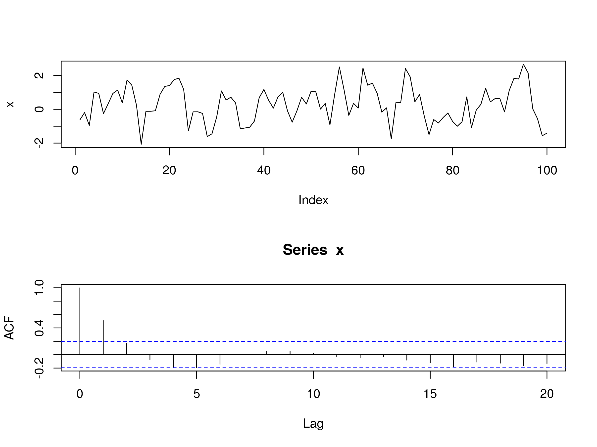

Algorithmic trading, a fixture in contemporary financial markets, involves the use of computer algorithms to automatically execute trading decisions at high speeds. This method outpaces human capabilities, allowing the analysis of complex market data and execution of orders in fractions of a second. The significant advantage of algorithmic trading lies in its ability to exploit market inefficiencies, optimize execution speed, and minimize the emotional biases often associated with human traders.

Central to the efficiency of algorithmic trading are quantitative models, which form the backbone of decision-making processes. These models use statistical and mathematical computations to predict future market behaviors based on historical data. By employing these techniques, traders aim to identify potential opportunities for profit while managing risk. One such model that has gained prominence in predictive analytics within trading algorithms is the AutoRegressive Moving Average (ARMA) model.



The ARMA model, a staple in time series analysis, is valued for its proficiency in capturing the autocorrelations within a dataset. The model is composed of two parts: the autoregressive (AR) part, which regresses the variable onto its own past values, and the moving average (MA) component, which models the error term as a linear combination of past error terms. This combination enables the ARMA model to effectively model and forecast time series data, which is crucial for predicting price movements in financial markets.

The purpose of this article is to explore the utilization of ARMA models in algorithmic trading. By understanding how ARMA functions within trading algorithms, traders can enhance their ability to develop effective strategies. The model's significance is underscored by its application in determining market trends and crafting strategies that leverage these predictions. Understanding and implementing ARMA can thus lead to more informed trading decisions and improved capital management.

In light of these factors, it is crucial for traders and analysts to develop a strong comprehension of ARMA models. By grasping the nuances of these models, they can be leveraged to craft robust trading strategies, enhancing decision-making processes and leading to potentially profitable outcomes.

## Table of Contents

## Understanding ARMA Models

The AutoRegressive Moving Average (ARMA) model is a widely used statistical tool for time series analysis, particularly in financial markets. It combines two fundamental components: autoregression (AR) and moving average (MA), to model and predict future values based on past behaviors of a given time series.

### Components of ARMA Models

**1. Autoregression (AR):** This component represents a model that uses the dependency between an observation and a certain number of lagged observations (i.e., previous values). The AR part of the ARMA model can be mathematically expressed as:

$$

X_t = c + \sum_{i=1}^{p} \phi_i X_{t-i} + \epsilon_t 
$$

where:
- $X_t$ is the time series value at time $t$.
- $c$ is a constant.
- $\phi_i$ are the parameters of the model.
- $p$ is the order of the autoregressive model.
- $\epsilon_t$ is the error term (white noise).

**2. Moving Average (MA):** This component models the relationship between an observation and a residual error from a moving average model applied to lagged observations. The MA part can be expressed as:

$$

X_t = \mu + \sum_{i=1}^{q} \theta_i \epsilon_{t-i} + \epsilon_t 
$$

where:
- $\mu$ is the mean of the series.
- $\theta_i$ are the parameters of the model.
- $q$ is the order of the moving average model.

Thus, a combined ARMA($p, q$) model is represented as:

$$

X_t = c + \sum_{i=1}^{p} \phi_i X_{t-i} + \sum_{i=1}^{q} \theta_i \epsilon_{t-i} + \epsilon_t 
$$

### Differentiation from Other Time Series Models

ARMA models are distinct primarily in their combination of autoregressive and moving average components to capture both short-term dependencies and shocks in data. Unlike ARIMA (AutoRegressive Integrated Moving Average), ARMA assumes stationarity of the time series and does not include a differencing component typically used in ARIMA to establish stationary data. GARCH (Generalized Autoregressive Conditional Heteroskedasticity), on the other hand, is designed to model [volatility](/wiki/volatility-trading-strategies) and typically incorporates variance into its predictions, distinguishing its focus from ARMA.

### Significance of Orders

The orders $p$ and $q$ are critical as they determine the complexity and specificity of an ARMA model. These orders dictate how many past observations ($p$ for AR) and past error terms ($q$ for MA) influence the current value. Choosing optimal values for $p$ and $q$ often requires balancing model accuracy against the risk of overfitting.

### Common Challenges

Implementing ARMA models in practice involves several challenges:
- **Stationarity Requirement:** ARMA assumes that the time series is stationary. Non-stationary data must first be transformed.
- **Parameter Estimation:** Selecting appropriate $p$ and $q$ orders is non-trivial and often involves trial and error or information criteria (such as AIC or BIC).
- **Overfitting:** There's a risk of overfitting if too many parameters are used, which can degrade out-of-sample model performance.
- **Error Term Independence:** Assumes that the error terms are independent, an assumption that may not always hold, impacting model accuracy.

In summary, ARMA models provide a foundational methodological framework in time series analysis in financial markets, balancing simplicity and applicability through their dual-component system. Understanding these components and their interactions is pivotal for effective implementation and analysis in diverse financial scenarios.

## ARMA in Algorithmic Trading

ARMA (AutoRegressive Moving Average) models play a crucial role in [algorithmic trading](/wiki/algorithmic-trading) by providing a robust framework for predicting future market behavior. These models leverage historical price data to identify patterns and trends that can inform trading decisions. The core strength of ARMA lies in its ability to model time series data, capturing the underlying structure in a financial time series through its autoregressive (AR) and moving average (MA) components.

### Role in Predicting Future Market Behavior

ARMA models forecast future values by expressing a time series as a function of past values (autoregressive part) and past errors (moving average part). The general form of an ARMA(p, q) model is expressed as:

$$

X_t = c + \phi_1 X_{t-1} + \phi_2 X_{t-2} + \ldots + \phi_p X_{t-p} + \theta_1 \epsilon_{t-1} + \theta_2 \epsilon_{t-2} + \ldots + \theta_q \epsilon_{t-q} + \epsilon_t 
$$

where $X_t$ is the time series value at time $t$, $c$ is a constant, $\phi$ and $\theta$ are coefficients for the AR and MA parts respectively, and $\epsilon_t$ is the white noise error term.

### Integration into Trading Algorithms

Incorporating ARMA models into trading algorithms involves using these forecasts to generate buy or sell signals. For example, an algorithm might trigger a buy signal when the predicted price increase surpasses a certain threshold, indicating potential profitability. Conversely, a sell signal might be generated if predictions indicate a significant drop in price. These signals can help automate trading processes, allowing traders to execute strategies based on quantitative insights rather than intuition alone.

### Benefits of Using ARMA

ARMA models are particularly beneficial for analyzing historical price data due to their simplicity and efficiency. They provide a structured approach to identify patterns such as trends and seasonality in time series data, which can be pivotal for making informed trading decisions. By understanding these patterns, traders can gain insights into market dynamics and anticipate future movements.

### Reducing Risks in Trading

One of the notable advantages of ARMA models is their potential to reduce trading risks. By accurately forecasting market trends, traders can proactively adjust their portfolios to mitigate potential losses. For instance, predictions of a market downturn could prompt a reallocation of assets into safer investments or the initiation of hedging strategies to protect against adverse market movements.

### Real-World Examples

Several financial institutions and hedge funds have successfully integrated ARMA models into their trading strategies. For instance, a case study might involve quant funds using ARMA models to systematically predict daily or weekly stock returns. By continually refining these models and calibrating their parameters based on historical data, these funds aim to enhance their predictive accuracy, thereby increasing their competitive edge in the markets.

In conclusion, ARMA models serve as a fundamental component in algorithmic trading, offering predictive capabilities that are essential for formulating effective trading tactics. Their use in analyzing historical data, managing risks, and providing actionable insights underscores their value in financial markets. As more sophisticated models and computational tools evolve, ARMA continues to be integral to developing robust algorithmic strategies.

## Advantages and Limitations

AutoRegressive Moving Average (ARMA) models are pivotal in algorithmic trading strategies, offering various advantages and certain limitations that must be considered to optimize financial decision-making processes effectively.

One of the primary advantages of ARMA models is their ability to model and predict time series data using relatively simple linear equations. This simplicity allows traders to forecast future prices based on historical data effectively. The ARMA model consists of two parts: the autoregressive (AR) part, which is a linear regression of the current value against previous values, and the moving average (MA) part, which models the current value as a sum of past forecast errors. This dual-component mechanism enables ARMA models to capture both [momentum](/wiki/momentum) and noise in the price series, providing a robust framework for predicting market trends in algorithmic trading.

When comparing ARMA models to other time series models like ARIMA (AutoRegressive Integrated Moving Average) and GARCH (Generalized AutoRegressive Conditional Heteroskedasticity), ARMA stands out in its simplicity and computational efficiency. ARIMA includes an additional differencing term to handle non-stationary data, making it more suitable for datasets exhibiting trends over time. In contrast, ARMA assumes the time series data is stationary. GARCH models incorporate varying volatility over time, which is particularly useful in financial time series, where volatility clustering is common. Despite these differences, ARMA models are often preferred for their ease of implementation and interpretation in scenarios where the assumption of stationarity holds true.

However, there are notable limitations and pitfalls associated with ARMA models in trading algorithms. One challenge is the assumption of stationarity, which is often not met in real-world financial data. Non-stationary data can lead to inaccurate predictions if not properly addressed. Another issue is the model's inability to capture complex patterns such as sudden market shifts or non-linear dependencies, which can lead to sub-optimal trading decisions.

Model selection and parameter tuning are critical in effectively utilizing ARMA models. The orders of the autoregressive and moving average components, represented as AR(p) and MA(q), respectively, need to be carefully determined. Selecting inappropriate values for these parameters can lead to overfitting or underfitting, problems that can degrade the model's predictive performance. The Akaike Information Criterion (AIC) or Bayesian Information Criterion (BIC) are commonly employed to compare different model specifications and choose the one that minimizes predictive error.

Overfitting is a common concern when applying ARMA models to financial data. Overfitting occurs when the model captures the noise in the training data rather than the underlying trend, resulting in poor performance on unseen data. To address overfitting, traders can use techniques such as cross-validation, whereby the data is split into training and testing sets, and the model's performance is evaluated on the test set. Regularization techniques, which add penalties for complexity to the model, can also be applied to reduce overfitting risks.

In conclusion, ARMA models offer substantial benefits for algorithmic trading, particularly in scenarios with stationary time series data. However, their effectiveness hinges on correct model selection, parameter tuning, and mitigating issues like overfitting. By understanding and addressing these aspects, traders can harness ARMA models to develop robust and efficient trading strategies.

## Practical Implementation of ARMA Models

Implementing AutoRegressive Moving Average (ARMA) models in algorithmic trading involves a systematic approach that includes several key steps. This section outlines a comprehensive guide on integrating ARMA models into trading strategies, along with tools, data preparation, optimization tips, and [backtesting](/wiki/backtesting) methodologies.

### Step-by-Step Guide to Implementing ARMA Models

1. **Understanding the Model**: Familiarity with the ARMA model is crucial. It comprises two components: Autoregression (AR), where future values are assumed to be a linear function of previous values, and Moving Average (MA), which models the error of the forecast as a linear combination of past error terms.

2. **Data Collection**: Acquire high-quality time series data, typically historical price data, which is essential for building an accurate model. Data should be in a continuous time format and free from missing values.

3. **Data Preparation and Preprocessing**:
   - **Stationarity**: Check for stationarity in the time series data since ARMA models perform optimally on stationary data. Stationarity can often be achieved through differencing or other transformations.
   - **Normalization**: Scale or normalize the data to ensure that the model coefficients are on a comparable scale, optimizing model convergence.

4. **Selecting Model Order**: Determine the order of the AR and MA components, commonly denoted as ARMA(p, q). Tools such as the Akaike Information Criterion (AIC) or the Bayesian Information Criterion (BIC) can assist in selecting the best order.

5. **Fitting the Model**: Use statistical software packages or programming languages like Python to fit the ARMA model. Python’s `statsmodels` library provides a straightforward implementation:
   ```python
   import pandas as pd
   from statsmodels.tsa.arima.model import ARIMA

   # Example data
   data = pd.read_csv('historical_prices.csv')
   model = ARIMA(data['Close'], order=(p, 0, q))
   model_fit = model.fit()
   print(model_fit.summary())
   ```

6. **Optimization**: Optimize the model by fine-tuning the parameters to improve forecast accuracy. This involves iterating different configurations and assessing their predictive performance.

### Tools and Software for ARMA Modeling

- **Python**: Libraries such as `statsmodels` for ARMA implementation and `pandas` for data manipulation.
- **R**: Known for its robust statistical modeling capabilities, packages like `forecast` offer extensive tools for time series analysis.
- **MATLAB**: Provides comprehensive tools for statistical analysis and time series modeling.

### Backtesting and Validation

Backtesting is essential to validate the model's predictive power and profitability in a trading strategy. Implement the following:
- **Historical Data Simulation**: Use out-of-sample historical data to test the model.
- **Performance Metrics**: Evaluate the model using metrics such as Mean Absolute Error (MAE), Root Mean Square Error (RMSE), and the Sharpe ratio.
- **Cross-validation**: Employ techniques like rolling or expanding windows to ensure the robustness of the model across different data periods.

### Tips for Optimization

- **Hyperparameter Tuning**: Iteratively test different values of p and q to find the most effective combination.
- **Model Diagnostics**: Use diagnostic plots and statistics to check for autocorrelation in residuals, ensuring model adequacy.
- **Regular Updates**: Continuously update the model with new data to adapt to market changes.

Integrating ARMA models into trading strategies requires careful consideration of data preparation, model selection, and validation to enhance predictive accuracy and trading performance.

## Future Trends and Developments

Algorithmic trading is undergoing significant transformation with the incorporation of emerging technologies and advanced statistical models. The increasing role of these tools is reshaping traditional trading strategies, providing more accurate predictions and adaptations to market dynamics.

One area of potential advancement is in the development of ARMA modeling techniques. Researchers and practitioners are exploring ways to enhance the classical ARMA (AutoRegressive Moving Average) model, which combines autoregression (AR) and moving averages (MA) to predict future points in a time series. Possible improvements include the integration with more complex models such as ARIMA (AutoRegressive Integrated Moving Average) and GARCH (Generalized Autoregressive Conditional Heteroskedasticity), enhancing their ability to model non-stationary data and volatility clusters in financial time series.

Machine learning and AI are also influencing the use of ARMA models. Machine learning algorithms can be employed to identify patterns and features in market data that traditional ARMA models might miss. Techniques such as neural networks and ensemble methods can be combined with ARMA to create hybrid models that capitalize on the strengths of both statistical and [machine learning](/wiki/machine-learning) approaches. These hybrid models have the potential to improve the prediction accuracy of market behavior by adapting to complex and non-linear relationships present in the data.

Predictions for future applications of ARMA models in trading include their use in more sophisticated quantitative strategies. For instance, ARMA models can be incorporated into high-frequency trading algorithms that require real-time data analysis and rapid decision-making. Furthermore, ARMA can be used to enhance risk management practices by forecasting asset price volatility and informing the dynamic adjustment of investment portfolios.

Traders can stay ahead by integrating new insights and technologies with traditional models. One approach is to leverage big data analytics to feed ARMA models with vast amounts of information, allowing for more precise forecasting and a comprehensive understanding of market signals. Additionally, developing expertise in programming and statistical software tools such as Python’s `statsmodels` library can enable traders to implement and fine-tune ARMA models effectively. By doing so, they can harness the latest advancements in statistical modeling to enhance their trading strategies, while remaining adaptive and responsive to the fast-evolving financial landscape. 

Overall, the interplay between traditional ARMA models and cutting-edge technologies promises to drive future innovations in algorithmic trading, offering new opportunities for capturing market efficiencies and achieving competitive advantages.

## Conclusion

The exploration of ARMA models within the context of algorithmic trading highlights their fundamental role in predicting market trends and creating effective trading strategies. ARMA models' ability to capture the dynamics of time series data emphasizes their utility in analyzing historical price information, enabling traders to make informed future market forecasts. Although they offer notable advantages, including risk reduction and efficient data analysis, traders must remain aware of their limitations, such as overfitting and model selection challenges.

The significance of ARMA models is underscored in their integration with algorithmic trading strategies, providing the structural basis for many successful trading algorithms. As the financial markets continue to evolve, it is increasingly important for traders and analysts to maintain a commitment to continuous learning and adaptability. The landscape of algorithmic trading is rapidly changing with the advent of new technological advancements, including machine learning and [artificial intelligence](/wiki/ai-artificial-intelligence), which may complement or enhance traditional models like ARMA.

Balancing the strengths of traditional modeling with emerging technologies is essential for maintaining a competitive edge. While traditional models offer a critical foundation for forecasting and analysis, the integration of innovative tools and techniques can lead to more comprehensive and robust trading strategies. 

Traders are encouraged to actively engage with ARMA models, applying them to their trading methodologies to leverage their full potential. By doing so, they can enhance their predictive accuracy and obtain a deeper understanding of market behaviors. Exploring and utilizing ARMA models, alongside evolving technologies, will position traders to harness more effective strategies in the dynamic world of financial markets.

## References & Further Reading

[1]: Box, G. E. P., Jenkins, G. M., & Reinsel, G. C. (2015). ["Time Series Analysis: Forecasting and Control."](https://onlinelibrary.wiley.com/doi/book/10.1002/9781118619193) Wiley Series in Probability and Statistics.

[2]: Hyndman, R. J., & Athanasopoulos, G. (2018). ["Forecasting: Principles and Practice."](https://otexts.com/fpp2/) OTexts.

[3]: Tsay, R. S. (2010). ["Analysis of Financial Time Series."](https://onlinelibrary.wiley.com/doi/book/10.1002/9780470644560) Wiley Series in Probability and Statistics.

[4]: Lütkepohl, H. (1991). ["Introduction to Multiple Time Series Analysis."](https://link.springer.com/book/10.1007/978-3-540-27752-1) Springer.

[5]: Enders, W. (2014). ["Applied Econometric Time Series."](https://www.wiley.com/en-us/Applied+Econometric+Time+Series%2C+4th+Edition-p-9781118808566) Wiley.