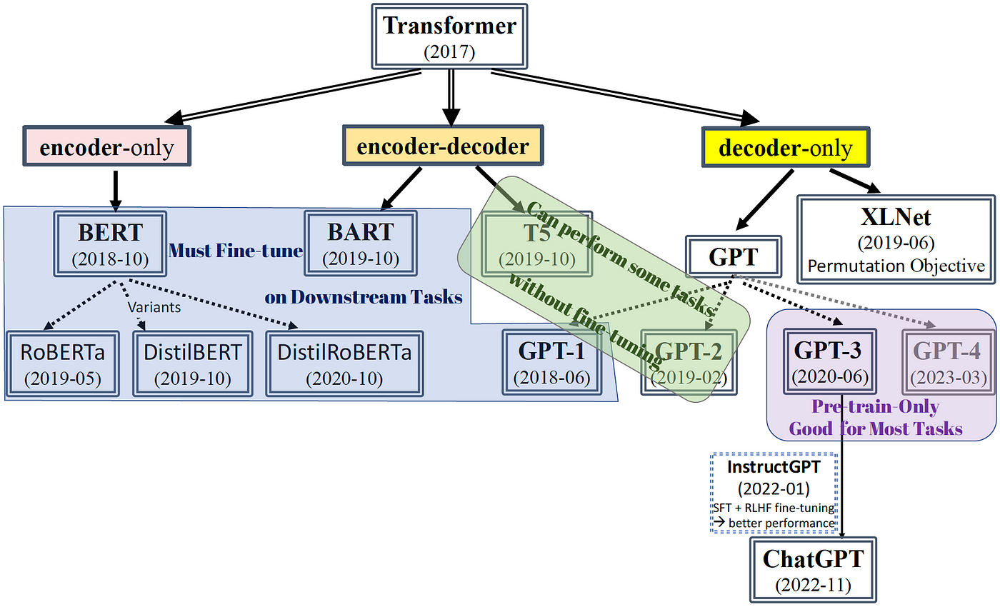

## Table of Contents

## What is an Autoregressive Transformer and how does it differ from other types of Transformers?

An Autoregressive Transformer is a type of neural network model used mainly for generating sequences, like text or music. It works by predicting the next item in a sequence based on all the previous items. Imagine you're writing a sentence, and the model helps you guess the next word. It does this by looking at all the words you've written so far. This is done using a special part of the model called the "decoder," which pays attention to the entire sequence up to that point to make its prediction.

The main difference between an Autoregressive Transformer and other types of Transformers, like the Encoder-Decoder Transformer used in machine translation, is how they handle the sequence data. In an Encoder-Decoder Transformer, both the input and output sequences are processed at the same time, allowing the model to see the whole input before starting to generate the output. On the other hand, an Autoregressive Transformer only uses the decoder part and processes the sequence one item at a time, making it more suitable for tasks where you need to generate new content step by step, like writing a story or composing music.

## How does the basic architecture of an Autoregressive Transformer work?

The basic architecture of an Autoregressive Transformer is built around a decoder-only structure. This means it uses a series of layers that look at the sequence it has generated so far to predict the next item. Each layer in the decoder includes self-attention mechanisms that allow the model to weigh the importance of different parts of the sequence when making its prediction. The self-attention mechanism helps the model understand which parts of the input are most relevant to the next item it needs to generate. After the self-attention, the data goes through a feed-forward neural network, which processes it further before moving on to the next layer or making the final prediction.

In simpler terms, imagine you're writing a story and want to guess the next word. The Autoregressive Transformer looks at all the words you've written so far and decides which ones are most important for choosing the next word. It then uses this information to make its best guess. This process repeats for each new word you want to add to your story. The model keeps refining its understanding and predictions as it goes along, making it good at tasks like writing or composing music where you generate content one piece at a time.

## Can you explain the concept of autoregression in the context of Transformers?

Autoregression in the context of Transformers means that the model predicts the next item in a sequence by using all the items it has seen so far. Imagine you're writing a sentence and want to guess the next word. The Autoregressive Transformer looks at all the words you've written and uses them to decide what word should come next. It does this over and over, always using the entire sequence up to that point to make its prediction. This makes it really good for tasks like writing stories or composing music, where you need to generate new content one piece at a time.

The way this works in the Transformer architecture is by using only the decoder part of the model. The decoder has layers that pay attention to the sequence it has generated so far. This is called self-attention, and it helps the model figure out which parts of the sequence are most important for predicting the next item. After the self-attention step, the data goes through a feed-forward [neural network](/wiki/neural-network), which processes it further before moving on to the next layer or making the final prediction. So, the Autoregressive Transformer keeps refining its understanding and predictions as it goes along, making it great for generating sequences step by step.

## What are some common applications of Autoregressive Transformers?

Autoregressive Transformers are widely used in tasks where you need to generate sequences, like writing text or composing music. They're especially good at language modeling, which means predicting what word comes next in a sentence. For example, if you're writing a story, an Autoregressive Transformer can help you guess the next word based on all the words you've written so far. This makes them very useful in applications like chatbots, where the model needs to generate human-like responses one word at a time.

Another common use is in text generation, where the model creates whole pieces of writing, like articles or stories. They can also be used for machine translation, where the model translates a sentence from one language to another by generating the translated sentence word by word. In music composition, Autoregressive Transformers can generate melodies or entire songs by predicting the next note or chord based on the sequence of notes played so far. These models are powerful tools for creative tasks, helping people generate new content in a way that feels natural and coherent.

## How does the training process of an Autoregressive Transformer differ from non-autoregressive models?

The training process of an Autoregressive Transformer focuses on predicting the next item in a sequence based on all the previous items. Imagine you're writing a story and want to guess the next word. The model looks at all the words you've written so far and tries to predict the next one. This is done by using a special part called the "decoder," which pays attention to the entire sequence up to that point. During training, the model is given a sequence and tries to predict each item one by one, always using the items it has seen so far. It learns by comparing its predictions to the actual next items in the sequence and adjusting its weights to get better at guessing.

In contrast, non-autoregressive models, like the Encoder-Decoder Transformer used in machine translation, don't predict items one by one. Instead, they process the entire input sequence at once and then generate the entire output sequence at once. For example, in machine translation, the model sees the whole sentence in one language and then tries to translate it into another language in one go. During training, these models learn to map the entire input to the entire output without the step-by-step prediction process of Autoregressive Transformers. This makes them faster at generating outputs but sometimes less accurate at capturing the nuances of long sequences.

## What are the key differences between GPT, GPT-2, and GPT-3 in terms of architecture and capabilities?

GPT, GPT-2, and GPT-3 are all Autoregressive Transformers developed by OpenAI, but they have some important differences. GPT, or Generative Pre-trained Transformer, was the first in the series and introduced the idea of using a transformer-based model for language tasks. It had 12 layers and about 117 million parameters. GPT-2, the next version, was much bigger with 48 layers and 1.5 billion parameters. This made it better at understanding and generating text, and it could do more tasks without needing much extra training. GPT-3 took this even further, with 96 layers and a huge 175 billion parameters. This made it even more powerful, able to generate very human-like text and do a wide range of language tasks.

The capabilities of these models grew with their size. GPT was good at simple language tasks like text completion but was limited in its ability to handle complex tasks. GPT-2 could do more, like generating coherent paragraphs and even writing short stories, and it needed less fine-tuning for new tasks. GPT-3 is the most advanced, able to generate very long and coherent pieces of text, answer questions, and even help with coding tasks. It can do all this with very little extra training, making it a very versatile tool. The main difference in architecture between them is the number of layers and parameters, which directly impacts their performance and capabilities.

## How does XLNet improve upon traditional Autoregressive Transformers?

XLNet improves upon traditional Autoregressive Transformers by using a method called "permutation language modeling." This means that instead of always predicting the next word in a fixed order, XLNet can look at words in different orders. This helps the model understand the context better because it can see how words relate to each other in many different ways. For example, if you're writing a story, XLNet can guess the next word by looking at all the other words around it, not just the ones that came before. This makes its predictions more accurate and its generated text more natural.

Another way XLNet improves is by using a technique called "two-stream self-attention." This means it can pay attention to the entire sequence at once, not just the part it has seen so far. This helps it capture long-distance relationships between words, which is important for understanding the overall meaning of a text. Traditional Autoregressive Transformers can only look at the words that came before, so they might miss important connections. By being able to see the whole picture, XLNet can generate better and more coherent text.

## What is the role of attention mechanisms in Autoregressive Transformers and how do they contribute to performance?

Attention mechanisms in Autoregressive Transformers help the model focus on the most important parts of the sequence when predicting the next item. Imagine you're writing a story and want to guess the next word. The attention mechanism looks at all the words you've written so far and decides which ones are most important for choosing the next word. This is done using something called "self-attention," where the model weighs the importance of each word in relation to the others. By doing this, the model can better understand the context and make more accurate predictions.

The attention mechanism contributes to the performance of Autoregressive Transformers by allowing them to capture long-distance relationships between words. For example, if you're writing a long story, the model needs to remember details from earlier parts to make sense of what comes later. The attention mechanism helps the model do this by keeping track of the entire sequence and figuring out which parts are most relevant at any given moment. This makes the generated text more coherent and natural, improving the overall quality of the model's output.

## Can you discuss the efficiency and scalability issues faced by Autoregressive Transformers and how models like Sparse Transformer and Linformer address these?

Autoregressive Transformers can be slow and hard to scale up because they need to process the whole sequence to predict the next item. Imagine you're writing a long story, and the model has to look at every word you've written so far to guess the next one. This can take a lot of time and computer power, especially if the story is very long. The more layers and parameters the model has, the more resources it needs, which can make it difficult to use on smaller computers or for real-time tasks.

Models like the Sparse Transformer and Linformer try to solve these problems in different ways. The Sparse Transformer uses a special kind of attention that only looks at certain parts of the sequence instead of the whole thing. This makes it faster and more efficient because it doesn't have to process as much data. For example, if you're writing a story, the Sparse Transformer might only look at the most important words to guess the next one, which saves time and resources. On the other hand, Linformer changes the way the attention mechanism works by using a lower-dimensional representation of the sequence. This means it can process the data more quickly and with less computer power, making it easier to scale up and use in different situations.

## How do advanced models like the Universal Transformer and the Feedback Transformer enhance the capabilities of standard Autoregressive Transformers?

The Universal Transformer enhances the capabilities of standard Autoregressive Transformers by using a dynamic number of processing steps for each input. Imagine you're writing a story, and the Universal Transformer can take more time to think about the next word if it's a tricky one. This is done using a technique called "adaptive computation time," where the model decides how many steps it needs to process each part of the sequence. This makes it better at understanding and generating text because it can focus more on the parts that are hard to predict. The Universal Transformer also uses a special kind of attention that can look at the entire sequence at once, not just the parts it has seen so far. This helps it capture long-distance relationships between words, making its predictions more accurate and its generated text more natural.

The Feedback Transformer improves upon standard Autoregressive Transformers by allowing the model to refine its predictions over multiple steps. Think of it like writing a story and being able to go back and change earlier words to make the whole story better. The Feedback Transformer does this by feeding its own output back into the model, allowing it to adjust and improve its predictions as it goes along. This makes it better at generating coherent and high-quality text because it can keep refining its understanding of the sequence. By using this feedback loop, the Feedback Transformer can capture more complex patterns and relationships in the data, leading to more accurate and natural language generation.

## What are some of the latest innovations in Autoregressive Transformers, such as the Adaptive Span Transformer and the Routing Transformer?

The Adaptive Span Transformer introduces a new way to process sequences by allowing the model to focus on different lengths of text at different times. Imagine you're writing a story and you want to guess the next word. The Adaptive Span Transformer can look at just a few words or a whole paragraph to make its prediction, depending on what it thinks is most important. This flexibility helps the model understand the context better and generate more natural text. It does this by using a technique called "adaptive span selection," where it dynamically chooses the right span of text to pay attention to. This makes it more efficient and effective, especially for long and complex sequences.

The Routing Transformer takes a different approach by letting the model decide which parts of the sequence are most relevant for each prediction. Think of it like writing a story and choosing which words or sentences to focus on to guess the next word. The Routing Transformer uses a method called "routing" to send different parts of the sequence to different layers of the model. This helps it capture more complex relationships and patterns in the text, leading to more accurate predictions. By allowing the model to route the sequence in a way that best suits the task, the Routing Transformer can improve both the quality and the efficiency of text generation.

## How can Autoregressive Transformers be optimized for specific tasks, and what are the current research trends in this area?

Autoregressive Transformers can be optimized for specific tasks by fine-tuning them on task-specific data. Imagine you're using a model to help you write stories, and you want it to get better at understanding your writing style. You can train the model on lots of your stories, so it learns what words you like to use and how you structure your sentences. This is called fine-tuning, and it helps the model perform better on the specific task you want it to do. Another way to optimize these models is by using techniques like pruning, where you remove parts of the model that aren't very important, making it faster and more efficient. You can also use quantization, which means using fewer bits to represent the model's weights, making it smaller and easier to run on smaller computers.

Current research trends in optimizing Autoregressive Transformers focus on making them more efficient and versatile. One trend is the development of models that can handle multiple tasks at once, like writing stories and answering questions. Researchers are working on ways to train these models on a wide range of tasks, so they can switch between them easily. Another trend is improving the model's ability to understand and generate long sequences. This is important for tasks like writing [books](/wiki/algo-trading-books) or composing long pieces of music. Researchers are exploring new attention mechanisms and architectures that can capture long-distance relationships in the text more effectively. These innovations aim to make Autoregressive Transformers more powerful and useful for a variety of applications.

## References & Further Reading

[1]: Vaswani, A., Shazeer, N., Parmar, N., Uszkoreit, J., Jones, L., Gomez, A. N., Kaiser, Ł., & Polosukhin, I. (2017). ["Attention is All You Need."](https://arxiv.org/abs/1706.03762) Advances in Neural Information Processing Systems.

[2]: Radford, A., Narasimhan, K., Salimans, T., & Sutskever, I. (2018). ["Improving Language Understanding by Generative Pre-Training."](https://www.semanticscholar.org/paper/Improving-Language-Understanding-by-Generative-Radford-Narasimhan/cd18800a0fe0b668a1cc19f2ec95b5003d0a5035) OpenAI.

[3]: Radford, A., Wu, J., Child, R., Luan, D., Amodei, D., & Sutskever, I. (2019). ["Language Models are Unsupervised Multitask Learners."](https://cdn.openai.com/better-language-models/language_models_are_unsupervised_multitask_learners.pdf) OpenAI.

[4]: Brown, T., Mann, B., Ryder, N., Subbiah, M., Kaplan, J., Dhariwal, P., Neelakantan, A., Shyam, P., Sastry, G., Askell, A., Agarwal, S., Herbert-Voss, A., Krueger, G., Henighan, T., Child, R., Ramesh, A., Ziegler, D., Wu, J., Winter, C., ... & Amodei, D. (2020). ["Language Models are Few-Shot Learners."](https://arxiv.org/abs/2005.14165) arXiv preprint arXiv:2005.14165.

[5]: Yang, Z., Dai, Z., Yang, Y., Carbonell, J., Salakhutdinov, R. R., & Le, Q. V. (2019). ["XLNet: Generalized Autoregressive Pretraining for Language Understanding."](https://arxiv.org/abs/1906.08237) arXiv preprint arXiv:1906.08237.

[6]: Correia, G., Niculae, V., & Martins, A. F. T. (2019). ["Adaptively Sparse Transformers."](https://arxiv.org/abs/1909.00015) arXiv preprint arXiv:1909.00015.

[7]: Tay, Y., Bahri, D., Metzler, D., Juan, D.-C., Zhao, Z., & Zheng, C. (2020). ["Synthesizer: Rethinking Self-Attention in Transformer Models."](https://arxiv.org/abs/2005.00743) arXiv preprint arXiv:2005.00743.

[8]: Press, O., & Wolf, L. (2016). ["Using the Output Embedding to Improve Language Models."](https://arxiv.org/abs/1608.05859) arXiv preprint arXiv:1608.05859. 

[9]: Rao, K., & McMahan, H. B. (2019). ["Natural TTS synthesis by conditioning Wavenet on MEL spectrogram predictions."](https://arxiv.org/abs/1712.05884) 2018 IEEE International Conference on Acoustics, Speech and Signal Processing (ICASSP).