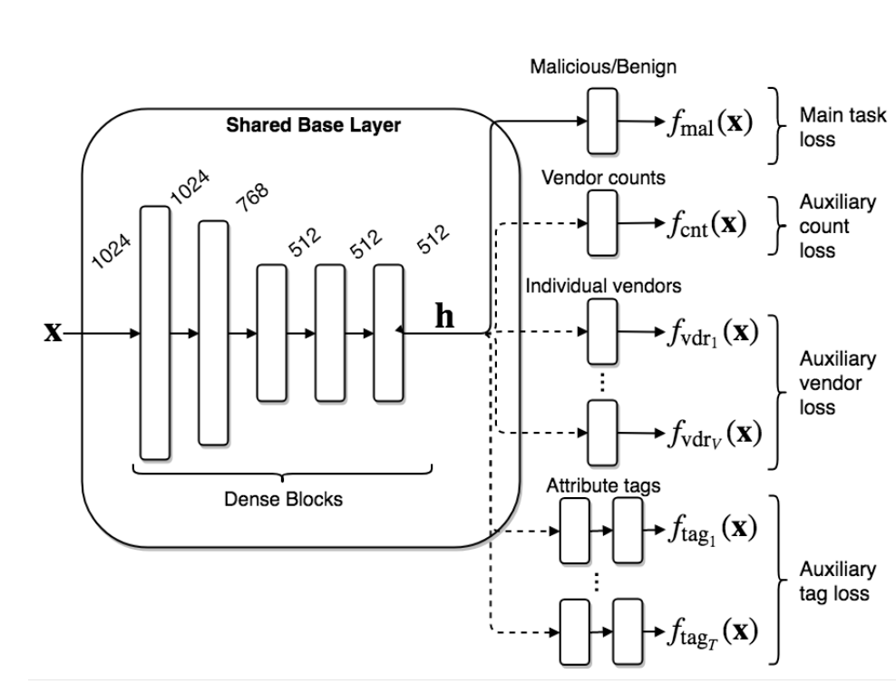

## Table of Contents

## What is auxiliary loss in machine learning?

Auxiliary loss in machine learning is an additional loss function used during training to help the model learn better. It's like giving the model extra tasks to focus on, which can improve its performance on the main task. For example, if the main task is to recognize objects in images, an auxiliary task could be to predict the color of the objects. By training the model to do both, it can learn more useful features and become better at the main task.

Using auxiliary loss can be especially helpful when the main task is difficult or when there's not enough data. It helps the model by providing more signals to learn from, making the training process more stable and efficient. For instance, in deep learning, a common technique is to add an auxiliary loss to intermediate layers of a neural network. This encourages the network to learn meaningful representations at different levels, which can lead to better overall performance.

## How does auxiliary loss differ from primary loss?

The primary loss, also known as the main loss, is the core objective that a machine learning model aims to minimize during training. It directly relates to the main task the model is designed to perform, like predicting a class label or a numerical value. For example, in a classification problem, the primary loss could be the cross-entropy loss, which measures how well the model's predictions match the true labels.

Auxiliary loss, on the other hand, is an additional loss function introduced to help the model learn better by focusing on secondary tasks. These tasks are not the main goal but can provide extra information that aids the model in improving its performance on the primary task. For instance, in a neural network, an auxiliary loss might be applied to the outputs of intermediate layers to encourage the network to learn useful features at different stages of processing. By optimizing both the primary and auxiliary losses, the model can achieve better results than if it only focused on the primary loss alone.

## Why is auxiliary loss used in neural networks?

Auxiliary loss is used in neural networks to help them learn better. Imagine you're trying to teach a kid to read. The main goal (primary loss) is for them to understand the words, but you might also ask them to sound out letters (auxiliary task). By doing both, the kid gets better at reading. In neural networks, the auxiliary loss works the same way. It gives the network extra tasks to focus on, which can make it better at the main job.

For example, in a deep [neural network](/wiki/neural-network), you might add an auxiliary loss to the outputs of some middle layers. This encourages the network to learn useful features early on, which can help it perform better overall. By training the network to do well on both the main task and the extra tasks, it can learn more effectively and reach better results. This is especially helpful when the main task is hard or when there's not a lot of data to learn from.

## Can you provide an example of a model that uses auxiliary loss?

One example of a model that uses auxiliary loss is the GoogLeNet (Inception v1) architecture. GoogLeNet was designed to improve the efficiency and accuracy of image classification tasks. It does this by adding auxiliary classifiers to intermediate layers of the network. These auxiliary classifiers help the network learn useful features early on, which can make the final classification more accurate. The auxiliary loss is added to the total loss during training, but with a smaller weight. This means the network focuses mainly on the primary task but also pays attention to the auxiliary tasks.

In GoogLeNet, the primary loss comes from the final layer of the network, where the main classification happens. The auxiliary losses come from two additional classifiers added to the middle layers. These classifiers help the network by giving it more signals to learn from. The total loss for training GoogLeNet can be written as:

$$ L_{\text{total}} = L_{\text{primary}} + \lambda_1 L_{\text{aux1}} + \lambda_2 L_{\text{aux2}} $$

where $$ L_{\text{primary}} $$ is the loss from the final layer, $$ L_{\text{aux1}} $$ and $$ L_{\text{aux2}} $$ are the losses from the auxiliary classifiers, and $$ \lambda_1 $$ and $$ \lambda_2 $$ are small weights (usually set to 0.3) that control how much the auxiliary losses contribute to the total loss. By using this approach, GoogLeNet can train more effectively and achieve better performance on image classification tasks.

## What are the benefits of using auxiliary loss in training models?

Using auxiliary loss in training models can help them learn better. Imagine you're trying to learn a new language. The main goal is to understand and speak the language, but if you also practice reading and writing, you'll get better at understanding it. In the same way, auxiliary loss gives the model extra tasks to focus on, which can help it do the main job better. For example, in a deep neural network, you might add an auxiliary loss to the middle layers. This encourages the network to learn useful features early on, which can make the final result more accurate.

Another benefit of using auxiliary loss is that it can make training more stable and efficient. When the main task is hard or when there's not a lot of data to learn from, the model can get confused. But by adding auxiliary loss, the model gets more signals to learn from, which can help it stay on track. In GoogLeNet, for example, they use auxiliary classifiers in the middle layers to help the network learn better. The total loss for training GoogLeNet can be written as $$ L_{\text{total}} = L_{\text{primary}} + \lambda_1 L_{\text{aux1}} + \lambda_2 L_{\text{aux2}} $$, where the auxiliary losses help guide the learning process. By doing this, the model can train more effectively and reach better results.

## How does auxiliary loss help in preventing overfitting?

Auxiliary loss helps prevent overfitting by giving the model extra tasks to focus on during training. When a model only focuses on the main task, it might learn to do well on the training data but not on new data. This is overfitting. But if the model also tries to do well on the extra tasks, it has to learn more general features that work for both the main and the extra tasks. This makes the model less likely to memorize the training data and more likely to learn useful patterns that apply to new data.

For example, in a deep neural network, you might add an auxiliary loss to the middle layers. This encourages the network to learn useful features early on, which can help it do better on new data. In GoogLeNet, they use auxiliary classifiers in the middle layers to help the network learn better. The total loss for training GoogLeNet can be written as $$ L_{\text{total}} = L_{\text{primary}} + \lambda_1 L_{\text{aux1}} + \lambda_2 L_{\text{aux2}} $$. By optimizing both the main and the extra tasks, the model can become more robust and less likely to overfit.

## What are the common challenges faced when implementing auxiliary loss?

Implementing auxiliary loss can be tricky because it's not always clear what extra tasks will help the model learn better. You need to pick tasks that are related to the main goal but not too hard or too easy. If the extra tasks are too hard, the model might struggle to learn them and end up doing worse on the main task. If they're too easy, they might not help the model learn anything new. It's like trying to find the right balance when teaching a kid – you want to give them challenges that are just right, not too tough or too simple.

Another challenge is figuring out how much weight to give to the auxiliary loss compared to the primary loss. If you give too much weight to the extra tasks, the model might focus too much on them and not enough on the main goal. If you give too little weight, the extra tasks might not help much. In GoogLeNet, for example, they use a formula like $$ L_{\text{total}} = L_{\text{primary}} + \lambda_1 L_{\text{aux1}} + \lambda_2 L_{\text{aux2}} $$ where the weights $$ \lambda_1 $$ and $$ \lambda_2 $$ control how much the auxiliary losses matter. Finding the right weights can take a lot of trial and error, but it's important for making the most of auxiliary loss.

## How can one choose the right auxiliary tasks for a given model?

Choosing the right auxiliary tasks for a model can be tricky. You want to pick tasks that are related to the main goal but not too hard or too easy. If the tasks are too hard, the model might struggle to learn them and end up doing worse on the main task. If they're too easy, they might not help the model learn anything new. It's like trying to find the right balance when teaching a kid – you want to give them challenges that are just right, not too tough or too simple. For example, if your main task is to recognize objects in images, a good auxiliary task could be to predict the color of the objects. This task is related to the main goal but simpler, which can help the model learn useful features.

Another thing to think about is how much weight to give to the auxiliary loss compared to the primary loss. If you give too much weight to the extra tasks, the model might focus too much on them and not enough on the main goal. If you give too little weight, the extra tasks might not help much. In GoogLeNet, for example, they use a formula like $$ L_{\text{total}} = L_{\text{primary}} + \lambda_1 L_{\text{aux1}} + \lambda_2 L_{\text{aux2}} $$ where the weights $$ \lambda_1 $$ and $$ \lambda_2 $$ control how much the auxiliary losses matter. Finding the right weights can take a lot of trial and error, but it's important for making the most of auxiliary loss. By experimenting with different tasks and weights, you can figure out what works best for your model.

## What impact does the weighting of auxiliary loss have on model performance?

The weighting of auxiliary loss can really change how well a model does its job. If you give too much weight to the auxiliary loss, the model might focus too much on the extra tasks and not enough on the main goal. This could make the model worse at the main task. For example, in GoogLeNet, they use a formula like $$ L_{\text{total}} = L_{\text{primary}} + \lambda_1 L_{\text{aux1}} + \lambda_2 L_{\text{aux2}} $$ where the weights $$ \lambda_1 $$ and $$ \lambda_2 $$ control how much the auxiliary losses matter. If these weights are too high, the model might do well on the extra tasks but not on the main one.

On the other hand, if you give too little weight to the auxiliary loss, the extra tasks might not help the model learn anything new. The model might still do okay on the main task, but it won't get the full benefit of the extra tasks. Finding the right balance is important. It's like trying to find the right amount of practice for a kid learning a new skill – you want to give them enough to help them learn, but not so much that they get overwhelmed. By experimenting with different weights, you can figure out what works best for your model.

## How do you evaluate the effectiveness of auxiliary loss in a model?

To evaluate the effectiveness of auxiliary loss in a model, you need to look at how well the model performs on the main task compared to a model trained without auxiliary loss. You can do this by comparing the primary loss or any other performance metrics like accuracy or error rate on a validation or test dataset. For example, if you're using GoogLeNet, you would compare the $$ L_{\text{primary}} $$ of the model with auxiliary loss to a model trained without it. If the model with auxiliary loss has a lower primary loss or higher accuracy, it means the auxiliary loss is helping the model learn better.

Another way to evaluate the effectiveness is to see how the model performs on the auxiliary tasks themselves. If the model does well on these extra tasks, it can be a sign that the auxiliary loss is helping the model learn useful features. However, the most important thing is that the auxiliary loss should help the model do better on the main task. If the model's performance on the main task doesn't improve or even gets worse, then the auxiliary loss might not be the right choice, or the weights given to the auxiliary loss might need to be adjusted. For example, in GoogLeNet, you might need to tweak the weights $$ \lambda_1 $$ and $$ \lambda_2 $$ in the formula $$ L_{\text{total}} = L_{\text{primary}} + \lambda_1 L_{\text{aux1}} + \lambda_2 L_{\text{aux2}} $$ to find the right balance.

## Can auxiliary loss be applied to any type of neural network architecture?

Auxiliary loss can be applied to many types of neural network architectures, but it's not a one-size-fits-all solution. It works well with deep networks like convolutional neural networks (CNNs) and recurrent neural networks (RNNs) because these networks have multiple layers where you can add auxiliary tasks. For example, in GoogLeNet, they use auxiliary classifiers in the middle layers to help the network learn better. The total loss for training GoogLeNet can be written as $$ L_{\text{total}} = L_{\text{primary}} + \lambda_1 L_{\text{aux1}} + \lambda_2 L_{\text{aux2}} $$. By adding these extra tasks, the network can learn more useful features and do better on the main job.

However, not all architectures will benefit from auxiliary loss. It's important to choose the right extra tasks that are related to the main goal but not too hard or too easy. If the extra tasks are too hard, the model might struggle and do worse on the main task. If they're too easy, they might not help the model learn anything new. It's like trying to find the right balance when teaching a kid – you want to give them challenges that are just right, not too tough or too simple. By experimenting with different tasks and weights, you can figure out if auxiliary loss is a good fit for your specific neural network architecture.

## What are some advanced techniques for optimizing auxiliary loss in deep learning?

One advanced technique for optimizing auxiliary loss in [deep learning](/wiki/deep-learning) is to use adaptive weighting. This means the model can change how much it focuses on the extra tasks during training. For example, you might start with a small weight for the auxiliary loss and increase it if the model is doing well on the main task. This can help the model learn the right balance between the main and extra tasks. In GoogLeNet, they use a formula like $$ L_{\text{total}} = L_{\text{primary}} + \lambda_1 L_{\text{aux1}} + \lambda_2 L_{\text{aux2}} $$ where the weights $$ \lambda_1 $$ and $$ \lambda_2 $$ can be adjusted over time to find the best balance.

Another technique is to use curriculum learning, where you introduce the auxiliary tasks gradually. At first, the model might only focus on the main task, and then you slowly add the extra tasks. This can help the model learn in a more structured way, similar to how a kid learns new skills step by step. By carefully choosing when to add the auxiliary loss, you can make sure the model doesn't get overwhelmed and can learn effectively. Both of these techniques can help make the most of auxiliary loss and improve the model's performance on the main task.