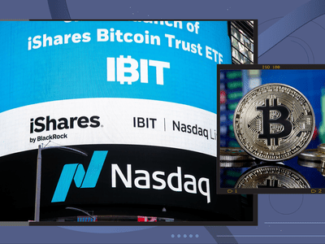

## Table of Contents

## What is a Spot Bitcoin ETF?

A Spot Bitcoin ETF, or Exchange-Traded Fund, is a type of investment fund that tracks the price of Bitcoin directly. Instead of buying Bitcoin itself, investors can buy shares in the ETF, which are traded on traditional stock exchanges. This makes it easier and more convenient for people to invest in Bitcoin without dealing with the complexities of managing digital wallets and cryptocurrency exchanges.

These ETFs hold actual Bitcoin in their portfolios, meaning their value goes up or down based on the current market price of Bitcoin. This is different from Bitcoin futures ETFs, which track Bitcoin's price through futures contracts. Spot Bitcoin ETFs provide a more direct exposure to Bitcoin's price movements, making them a popular choice for investors looking to gain exposure to the cryptocurrency market without the need to directly handle the cryptocurrency.

## Why are Spot Bitcoin ETFs important for investors?

Spot Bitcoin ETFs are important for investors because they make it easier to invest in Bitcoin. Instead of having to buy Bitcoin directly, which can be complicated and risky, investors can simply buy shares in the ETF. These shares are traded on regular stock exchanges, just like stocks. This means that anyone with a regular brokerage account can invest in Bitcoin without needing to understand how to use cryptocurrency exchanges or how to keep their Bitcoin safe in digital wallets.

Another reason Spot Bitcoin ETFs are important is that they allow investors to get direct exposure to Bitcoin's price. This is different from other types of Bitcoin investments, like futures ETFs, which track Bitcoin's price through contracts. With a Spot Bitcoin [ETF](/wiki/etf-trading-strategies), the value of the ETF goes up and down with the actual price of Bitcoin. This can be a big advantage for investors who believe in Bitcoin's long-term value and want a straightforward way to invest in it.

## Which countries have approved Spot Bitcoin ETFs by 2024?

By 2024, several countries have approved Spot Bitcoin ETFs. These countries see the value in making it easier for people to invest in Bitcoin without needing to buy the [cryptocurrency](/wiki/cryptocurrency) directly. Some of the countries that have approved these ETFs include Canada, which was one of the first to do so back in 2021, and Brazil, which followed suit in 2023. These approvals show that these countries are open to new ways of investing in cryptocurrencies.

In Europe, Germany and Switzerland have also approved Spot Bitcoin ETFs. This means that people in these countries can buy shares in these ETFs through regular stock exchanges. The United States has been slower to approve these ETFs, but there has been a lot of interest and some progress towards approval by 2024. Each country's approval helps make Bitcoin more accessible to regular investors and shows a growing acceptance of cryptocurrencies in traditional finance.

## What are the key differences between Spot Bitcoin ETFs and Bitcoin Futures ETFs?

Spot Bitcoin ETFs and Bitcoin Futures ETFs are two different ways to invest in Bitcoin, but they work differently. A Spot Bitcoin ETF holds actual Bitcoin in its portfolio. This means that the value of the ETF goes up or down with the real price of Bitcoin. If you want a direct way to invest in Bitcoin without buying it yourself, a Spot Bitcoin ETF is a good choice. It's like owning a piece of Bitcoin without having to deal with digital wallets or cryptocurrency exchanges.

On the other hand, a Bitcoin Futures ETF does not hold actual Bitcoin. Instead, it invests in futures contracts that are based on Bitcoin's price. Futures contracts are agreements to buy or sell Bitcoin at a future date at a set price. This means that the value of the ETF depends on the price of these contracts, not the actual price of Bitcoin. Bitcoin Futures ETFs can be more complicated because they involve understanding how futures markets work, and they might not track Bitcoin's price as closely as a Spot Bitcoin ETF.

In simple terms, if you want a straightforward investment that mirrors Bitcoin's price, a Spot Bitcoin ETF is the way to go. If you're interested in a more complex investment that involves futures markets, then a Bitcoin Futures ETF might be what you're looking for. Both types of ETFs have their own advantages and risks, so it's important to understand them before deciding which one to invest in.

## How can someone invest in a Spot Bitcoin ETF?

To invest in a Spot Bitcoin ETF, you first need a regular brokerage account. This is the same type of account you would use to buy stocks. Once you have your account set up, you can search for the Spot Bitcoin ETF you want to invest in. Each ETF will have a specific name and ticker symbol, so make sure you know which one you're looking for. After you find it, you can place an order to buy shares in the ETF just like you would with any other stock.

Once you've bought the shares, they will appear in your brokerage account. The value of your investment will go up or down based on the price of Bitcoin. You can hold onto the shares for as long as you want, or you can sell them whenever you decide it's time to cash out. It's important to keep an eye on how the ETF is doing and think about your own investment goals before making any decisions.

## What are the risks associated with investing in Spot Bitcoin ETFs?

Investing in Spot Bitcoin ETFs comes with some risks that you should know about. One big risk is that the price of Bitcoin can go up and down a lot. This means that the value of your ETF shares can change quickly, and you might lose money if the price of Bitcoin goes down. Bitcoin is also a new type of investment, and it can be hard to predict what will happen to its price in the future. This makes it riskier than investing in things like stocks or bonds, which have been around for a long time and are easier to understand.

Another risk is that the rules and laws about Bitcoin can change. Governments around the world are still figuring out how to handle cryptocurrencies, and new rules could affect the price of Bitcoin and the ETFs that invest in it. If a country decides to make new laws that make it harder to use or invest in Bitcoin, the value of your ETF shares could go down. It's also important to remember that even though you're buying shares in an ETF, you're still investing in a cryptocurrency, which can be more complicated and risky than other types of investments.

## What fees should investors expect when buying Spot Bitcoin ETFs?

When you buy shares in a Spot Bitcoin ETF, you will have to pay some fees. One fee is called the expense ratio, which is a yearly fee that the ETF charges to cover its costs. This fee is usually a small percentage of the money you have invested in the ETF. For example, if the expense ratio is 0.5%, you will pay $5 every year for every $1,000 you have invested. Different ETFs can have different expense ratios, so it's a good idea to check this before you invest.

Another fee you might have to pay is a brokerage fee. This is a fee that your brokerage charges every time you buy or sell shares in the ETF. The amount of this fee can be different depending on which brokerage you use. Some brokerages might charge a flat fee for each trade, while others might charge a percentage of the total amount you're buying or selling. It's important to know about these fees because they can add up over time and affect how much money you make from your investment.

## How have Spot Bitcoin ETFs performed since their introduction?

Since Spot Bitcoin ETFs were first introduced, they have been a popular way for people to invest in Bitcoin. The performance of these ETFs has gone up and down along with the price of Bitcoin. For example, when Bitcoin's price goes up, the value of the ETF shares goes up too. This means that investors who bought shares in these ETFs when Bitcoin was doing well have made money. On the other hand, when Bitcoin's price goes down, the value of the ETF shares goes down as well. This has been a big reason why some investors have lost money when they invested in Spot Bitcoin ETFs at the wrong time.

Over time, Spot Bitcoin ETFs have shown that they can be a good way to get into the Bitcoin market without having to buy the cryptocurrency directly. But they also show how risky Bitcoin can be. The price of Bitcoin can change a lot in a short amount of time, and this makes the value of the ETF shares change a lot too. Because of this, some people have made a lot of money, but others have lost money. It's important for anyone thinking about investing in these ETFs to understand how risky they can be and to think about their own goals before they decide to invest.

## What regulatory challenges have Spot Bitcoin ETFs faced in different jurisdictions?

Spot Bitcoin ETFs have faced different regulatory challenges in different countries. In the United States, for example, the Securities and Exchange Commission (SEC) has been very careful about approving these ETFs. The SEC has worried about things like fraud and making sure the market is fair. They have turned down many applications for Spot Bitcoin ETFs because they want to make sure everything is safe for investors. This has made it hard for companies to get their ETFs approved in the U.S.

In other countries, like Canada and Brazil, the rules have been easier. Canada was one of the first countries to approve a Spot Bitcoin ETF in 2021. They saw the value in letting people invest in Bitcoin without having to buy it directly. Brazil followed in 2023. These countries have been more open to new ways of investing in cryptocurrencies. But even in these places, regulators still keep a close eye on things to make sure investors are protected. Each country has its own way of handling these ETFs, and this can make it tricky for companies that want to offer them around the world.

## How do Spot Bitcoin ETFs impact the overall cryptocurrency market?

Spot Bitcoin ETFs have made it easier for regular people to invest in Bitcoin. Before these ETFs, if you wanted to invest in Bitcoin, you had to buy it directly from a cryptocurrency exchange and keep it in a digital wallet. This could be complicated and risky. But with Spot Bitcoin ETFs, you can buy shares in the ETF through a regular stock exchange, just like you would buy stocks. This means more people can invest in Bitcoin without having to learn about all the technical stuff. As more people start buying these ETFs, it can push up the demand for Bitcoin and affect its price.

The introduction of Spot Bitcoin ETFs has also brought more attention to the cryptocurrency market. When big financial companies start offering these ETFs, it shows that they think cryptocurrencies are worth investing in. This can make more people trust Bitcoin and other cryptocurrencies. But it can also make the market more up and down. Because these ETFs make it easier for people to buy and sell Bitcoin, the price can change more quickly. This can be good for the market because it brings in more investors, but it can also make it more risky for everyone involved.

## What are the tax implications of investing in Spot Bitcoin ETFs?

When you invest in Spot Bitcoin ETFs, you need to think about taxes. If you make money from selling your ETF shares, you will have to pay capital gains tax. This tax depends on how long you held the shares before selling them. If you held them for less than a year, it's called a short-term capital gain, and you'll pay tax at your regular income tax rate. If you held them for more than a year, it's a long-term capital gain, and the tax rate is usually lower. It's important to keep track of when you buy and sell your shares to figure out what kind of tax you'll owe.

Another thing to think about is that some countries treat Bitcoin and other cryptocurrencies differently for tax purposes. In the United States, for example, the IRS sees Bitcoin as property, not as currency. This means that every time you sell your ETF shares, it's like selling a piece of property, and you might have to pay taxes on any gains. If you're not sure about the tax rules in your country, it's a good idea to talk to a tax advisor. They can help you understand what you need to do to stay on the right side of the law and make sure you're not paying more tax than you need to.

## What future developments can we expect for Spot Bitcoin ETFs beyond 2024?

Beyond 2024, we can expect more countries to approve Spot Bitcoin ETFs. As more people learn about Bitcoin and want to invest in it, governments might see that these ETFs can help. They make it easier for regular people to invest without having to deal with the complicated stuff like digital wallets. This could mean more countries like the United States might finally approve these ETFs. If that happens, it could bring a lot more money into the Bitcoin market and make the price go up.

We might also see new types of ETFs that are connected to Bitcoin. For example, some ETFs might mix Bitcoin with other investments like stocks or gold. This could give people more choices and help them spread out their risk. As the rules about Bitcoin get clearer in different countries, companies might come up with new and better ways to invest in it through ETFs. This could make the whole cryptocurrency market grow and become more stable over time.

## References & Further Reading

[1]: Nakamoto, S. (2008). ["Bitcoin: A Peer-to-Peer Electronic Cash System."](https://nakamotoinstitute.org/library/bitcoin/) Bitcoin.org.

[2]: Lopez de Prado, M. (2018). ["Advances in Financial Machine Learning."](https://www.amazon.com/Advances-Financial-Machine-Learning-Marcos/dp/1119482089) Wiley.

[3]: Chan, E. P. (2009). ["Quantitative Trading: How to Build Your Own Algorithmic Trading Business."](https://github.com/ftvision/quant_trading_echan_book) Wiley.

[4]: Jansen, S. (2020). ["Machine Learning for Algorithmic Trading."](https://github.com/stefan-jansen/machine-learning-for-trading) Packt Publishing.

[5]: Aronson, D. R. (2006). ["Evidence-Based Technical Analysis: Applying the Scientific Method and Statistical Inference to Trading Signals."](https://onlinelibrary.wiley.com/doi/book/10.1002/9781118268315) Wiley.