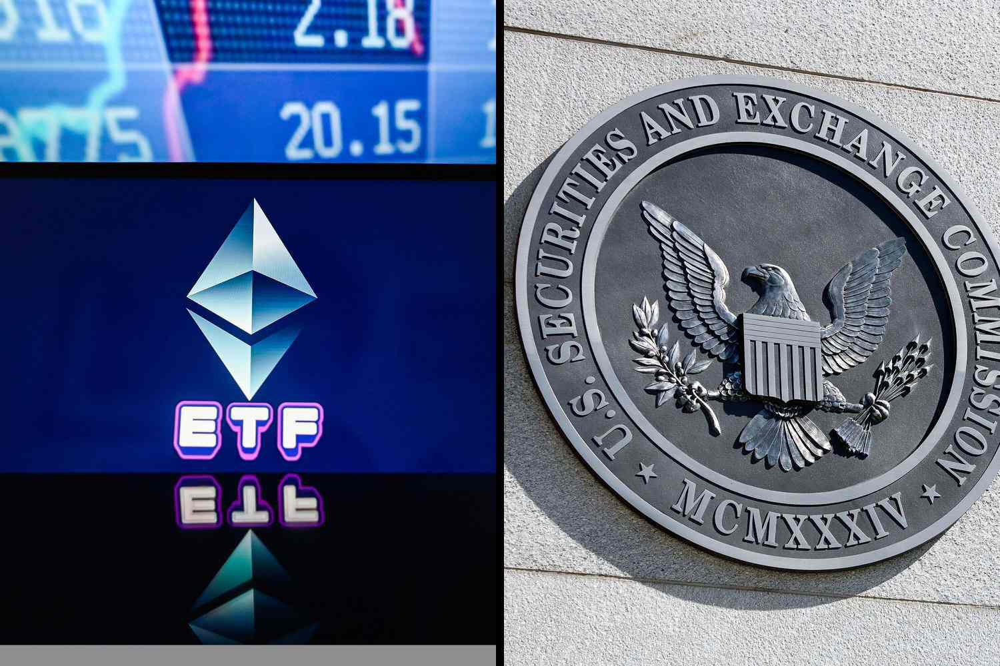

The cryptocurrency market has witnessed significant evolution over recent years, characterized by the continuous introduction of innovative financial products designed to cater to diverse investor needs. As of 2024, a notable advancement in this sector is the emergence of Spot Ether ETFs, which offer investors a modern way to engage with Ethereum—a leading cryptocurrency. Unlike more traditional methods of investing in cryptocurrencies, Spot Ether ETFs provide a novel mechanism that allows individuals direct exposure to Ethereum’s price movements without the necessity of holding the underlying digital asset.

Spot Ether ETFs present a blend of opportunities and challenges to investors. On the one hand, they offer an accessible entry point into Ethereum investment, often accompanied by potential benefits like simplified trading, reduced custody risks, and tax efficiencies. On the other hand, they demand a comprehensive understanding of the associated risks, including market volatility and regulatory uncertainty. Algorithmic trading plays a vital role in optimizing trading strategies within this landscape. By leveraging technology, investors can enhance trading efficiency and mitigate emotional biases in decision-making.



This article will explore the key aspects of cryptocurrency investment through Spot Ether ETFs, providing insights into how these instruments shape the future of crypto markets. By integrating current market trends with expert analyses, this guide aims to equip investors with a comprehensive understanding of investing in Spot Ether ETFs, emphasizing the importance of staying informed and strategically navigating the evolving cryptocurrency domain.

## Table of Contents

## Understanding Spot Ether ETFs

Spot Ether ETFs provide investors with direct exposure to Ethereum's price movements without the need to directly purchase and store the cryptocurrency. Unlike traditional cryptocurrency investments where investors hold digital assets in wallets, Spot Ether ETFs are financial products that track the price of Ethereum, allowing market participants to invest in its price trajectory on regulated exchanges.

**Mechanism and Advantages over Futures ETFs**

Spot Ether ETFs function similarly to stocks, representing a fractional claim on Ethereum held by the fund. This allows investors to trade Ether-related assets seamlessly through brokerage accounts without the complexity and risk of managing digital wallets and private keys. In contrast, Futures ETFs involve contracts that speculate on the future price of Ether, which may lead to discrepancies between the ETF price and the actual market price due to contango or backwardation in futures markets. Spot ETFs typically provide a more straightforward and direct reflection of Ethereum's market price, without the influence of future price speculation.

**Regulatory Landscape and SEC Approvals**

The regulatory environment for Spot Ether ETFs has evolved with key approvals from financial authorities such as the U.S. Securities and Exchange Commission (SEC). Recent SEC endorsements have been pivotal for granting legitimacy and fostering investor confidence in these financial products. Approval is contingent on the adherence to strict regulatory standards aimed at protecting investors, ensuring that the ETFs maintain transparency, [liquidity](/wiki/liquidity-risk-premium), and efficient price discovery.

**Benefits: Ease of Trading, Custody Risks, and Tax**

Spot Ether ETFs simplify the trading process. Investors can enter and [exit](/wiki/exit-strategy) positions with the ease of trading traditional equities, bolstering the accessibility of [cryptocurrency](/wiki/cryptocurrency) investments to a broader audience. Additionally, the custody risks associated with holding direct cryptocurrency are mitigated, as these ETFs are managed by institutions responsible for asset security. From a tax perspective, Spot Ether ETFs might offer more definitive tax treatments compared to direct cryptocurrency investments, which can be subject to varying interpretations and potential complications with tax authorities.

**Considerations for Investors**

When selecting Spot Ether ETFs, investors should consider factors such as fees, which can affect long-term returns, as well as the liquidity of the [ETF](/wiki/etf-trading-strategies), which influences how easily it can be traded. Additionally, the credibility of the issuer is crucial; reputable issuers can provide better security, compliance, and overall fund management. Therefore, thorough due diligence on the part of the investor is recommended to understand the ETF's underlying assets, fee structures, and the issuer's track record.

## The Role of Algo Trading in Cryptocurrency Investment

Algorithmic trading, often referred to as algo trading, has become a pivotal element in cryptocurrency investment. With the rise of digital assets, algo trading continues to gain traction for its ability to execute orders based on pre-defined criteria, providing precise and efficient trading strategies. This automated approach is rapidly transforming how investors engage with Spot Ether ETFs, adapting to the volatile nature of cryptocurrencies.

Algo trading enhances trading strategies for Spot Ether ETFs by automating the process of buying and selling according to a set algorithm, thus optimizing execution speed and efficiency. This is crucial in a market where prices fluctuate rapidly, as it enables traders to capitalize on favorable conditions without delays caused by human intervention. 

Several algorithmic strategies are employed across crypto ETFs. Market-making, for example, involves placing buy and sell orders to capture the spread between them, providing liquidity while benefiting from small price differences. Arbitrage opportunities are also exploited through algorithms, which identify and act upon discrepancies in asset pricing across different exchanges. These strategies help maintain efficient market behavior while offering profit opportunities for participating traders. Trend-following is another approach whereby algorithms track market [momentum](/wiki/momentum) and execute trades aligned with these patterns, helping investors profit from predictable price movements.

The benefits of algo trading are manifold. It increases trading efficiency by executing high-frequency trades that humans cannot perform manually. Furthermore, it reduces emotional biases, allowing decisions to be made based strictly on data-driven strategies rather than subjective judgment. This systematic approach enables the simultaneous execution of a large number of trades, broadening the scope for managing diversified portfolios.

However, algo trading is not without its risks. Technical failures, such as software bugs or connectivity issues, can lead to substantial losses if not addressed promptly. Additionally, market [volatility](/wiki/volatility-trading-strategies) remains a significant concern, as rapid price changes can undermine even the most sophisticated algorithms. To mitigate these risks, traders should implement thorough testing and risk management protocols, such as setting stop-loss limits and ensuring robust network infrastructure to minimize downtime. 

In summary, [algorithmic trading](/wiki/algorithmic-trading) presents a compelling method for engaging with Spot Ether ETFs, providing enhanced efficiency and rigor in a complex and fast-moving market. Nonetheless, careful risk management remains essential to safeguarding investments against the intrinsic uncertainties of the cryptocurrency sector.

## Pros and Cons of Trading Spot Ether ETFs

**Pros and Cons of Trading Spot Ether ETFs**

Spot Ether ETFs have become a focal point for investors seeking exposure to Ethereum markets without directly owning the digital currency. These financial products offer a fusion of benefits and challenges that require careful evaluation.

**Advantages**

One of the primary advantages of trading Spot Ether ETFs is their accessibility. Unlike direct cryptocurrency purchases which necessitate setting up digital wallets and securing private keys, ETFs can be traded through traditional brokerage accounts. This ease of access simplifies the investment process for both novice and seasoned investors, removing technical barriers associated with cryptocurrency exchanges.

Portfolio diversification is another significant benefit. Spot Ether ETFs allow investors to allocate capital to Ethereum alongside a range of other asset classes. This diversification can potentially reduce overall portfolio risk by spreading exposure across different sectors and geographic regions.

Regulatory protection plays a crucial role in the appeal of Spot Ether ETFs. As they are subject to oversight by financial regulatory bodies such as the Securities and Exchange Commission (SEC) in the United States, these ETFs offer a level of transparency and investor protection not typically available in the largely unregulated cryptocurrency space. This regulatory environment includes stringent reporting standards and ensures adherence to ethical trading practices.

Moreover, Spot Ether ETFs facilitate an easier entry and exit strategy compared to holding physical ether. The traditional market structures of these ETFs provide liquidity and allow investors to trade shares within standard trading hours. Furthermore, ETFs may present simpler tax implications. For instance, they are often treated under capital gains tax laws which can offer potential savings compared to the taxation of individual cryptocurrency holdings.

**Challenges**

Despite these advantages, there are notable challenges. Market volatility is a persistent risk in the cryptocurrency sector, and Spot Ether ETFs are not immune. The price of Ethereum can fluctuate significantly, impacting the value of the ETF and making it a high-risk investment option.

Potential regulatory changes are another concern. As the regulatory landscape evolves, new rules and regulations can affect the operation and viability of these ETFs. This uncertainty can lead to shifts in investor sentiment and market dynamics.

Management fees associated with ETFs also warrant consideration. Although they are typically less than those of mutual funds, these fees can accumulate over time, thereby diminishing net returns.

Investors miss certain benefits when they choose Spot Ether ETFs over direct Ether ownership. Holding Ethereum directly enables participation in network activities like staking and receiving airdrops, which can provide additional financial rewards. These benefits are not accessible through ETFs, which simply provide exposure to Ethereum's price movements.

In conclusion, understanding both the pros and cons of Spot Ether ETFs is crucial for making informed investment decisions. While they offer accessibility, diversification, and regulatory oversight, they also come with challenges such as market volatility, regulatory risks, and missed economic benefits inherent to Ethereum's network activities. Investors must weigh these factors carefully to align their investment strategy with their financial goals.

## Steps to Investing in Spot Ether ETFs

### Step 1: Opening a Brokerage Account

To begin investing in Spot Ether ETFs, the first essential step is to open a brokerage account that offers these specific trading options. Investors should ensure that the brokerage they select is reputable, regulated, and provides access to the cryptocurrency market. It's important to research the brokerage firm's security measures, customer service, and fee structure to ensure a good fit for your investment strategy.

### Step 2: Funding the Account

Once a suitable brokerage account is established, the next step involves funding this account. Investors need to consider the initial investment costs, which can include transaction fees and potential brokerage account maintenance fees. Setting a budget that aligns with one's investment goals can help manage costs effectively. This budget should account for both entry and exit strategies, ensuring there is adequate capital to seize market opportunities.

### Step 3: Researching Available ETFs

Conducting thorough research is critical for informed investment decisions. Investors should evaluate the different Spot Ether ETFs offered by their brokerage, examining factors such as historical performance, volatility, and market capitalization. Performance metrics can be assessed using various financial indicators, such as Sharpe ratio and expense ratio, to compare ETF options effectively. This step ensures that the chosen ETF aligns with your investment objectives and risk tolerance.

### Step 4: Selection Based on Goals and Fees

Selecting the right Spot Ether ETF requires balancing investment goals with associated costs. Investors should consider their financial objectives, whether they are focused on long-term growth, income generation, or short-term gains. Additionally, the fee structure should be scrutinized, as high management or transaction fees can erode profits. Choosing an ETF issuer with a solid track record and lower fees can be advantageous.

### Step 5: Placing Orders and Strategies for Market Entry

Once the ETF is selected, investors must strategize their market entry. This involves placing buy orders through the brokerage platform. Investors can choose between market orders, allowing immediate execution at current prices, or limit orders, where purchase happens only at a specified price. Employing strategies such as dollar-cost averaging can further optimize entry by minimizing the influence of market volatility.

```python
# Example of a basic dollar-cost averaging strategy using Python

def dca_investment(total_investment, num_periods):
    # Assuming equal investment over a number of periods
    return total_investment / num_periods

# Example of usage
total_investment = 10000  # Total amount to invest
num_periods = 5  # Number of periods to spread the investment over
investment_per_period = dca_investment(total_investment, num_periods)
print(f"Invest {investment_per_period} per period as per DCA strategy.")
```

### Step 6: Monitoring Investments and Market Developments

The final step in investing in Spot Ether ETFs involves continuous monitoring of your investments and staying informed about market changes. Investors should track the performance of their ETFs regularly, adjusting their strategies as needed based on market trends and developments. Utilizing alerts and news updates from reliable financial platforms can aid in making timely decisions to optimize returns. This proactive approach ensures that investments remain aligned with personal financial goals and market conditions.

## Alternatives to Spot Ether ETFs

Direct cryptocurrency purchases involve buying Ethereum on exchanges, providing investors control over their assets. This option is attractive to active traders due to the potential for [arbitrage](/wiki/arbitrage) and short-term price speculation. Unlike Spot Ether ETFs, owning Ethereum directly allows investors to engage in staking and benefit from network airdrops. Staking involves participating in Ethereum's proof-of-stake protocol to earn rewards, while airdrops offer free tokens from various blockchain projects.

Futures Ether ETFs differ from Spot Ether ETFs as they are based on the price of Ethereum futures contracts rather than the cryptocurrency's current market price. These ETFs allow investors to speculate on Ethereum's future price without owning the asset. Futures ETFs can experience contango or backwardation due to the difference between futures and spot prices, which can impact returns. Additionally, these ETFs may [carry](/wiki/carry-trading) higher costs, as futures contracts often need frequent rolling over.

Investing in blockchain-related equities provides indirect exposure to Ethereum. These equities include technology companies involved in blockchain development, mining companies, and firms offering blockchain services. While they offer potential growth through blockchain adoption, the risks include business-specific factors that may not correlate with Ethereum's price movements.

Ethereum trusts and funds present another alternative, exemplified by products like the Grayscale Ethereum Trust (ETHE). These investment vehicles hold Ethereum and offer shares to investors. Benefits include liquidation ease and avoiding self-custody challenges. However, limitations arise from potential premiums over net asset value (NAV) and management fees that may erode returns.

Geographical and regulatory constraints significantly influence alternative Ethereum investments. Some regions impose stringent regulations on cryptocurrency trading and investment products, impacting availability and accessibility. For instance, certain jurisdictions restrict futures trading, while others may impose taxes or buy-sell limitations on cryptocurrency transactions. Therefore, investors must navigate these constraints when considering alternatives to Spot Ether ETFs.

## The Future of Cryptocurrency Investment and Spot Ether ETFs

The advent of Spot Ether ETFs in 2024 marks a significant milestone within the broader cryptocurrency investment landscape. These ETFs provide an accessible and regulated way for investors to gain exposure to Ethereum, potentially reshaping market dynamics and investment strategies.

### Growth Trajectory of Spot Ether ETFs

The projected growth of Spot Ether ETFs is driven by increasing institutional interest and mainstream adoption of cryptocurrency investments. With Ethereum's substantial role in decentralized finance (DeFi) and smart contracts, Spot Ether ETFs are likely to attract a diverse range of investors seeking exposure to blockchain innovation without directly managing digital assets. As of now, the demand for such investment vehicles is anticipated to rise alongside the continuing evolution of the Ethereum network.

### Technological Advancements and Market Trends

Several technological advancements and market trends are poised to influence ether investments. The Ethereum network itself is undergoing significant upgrades, such as the transition to Ethereum 2.0, which aims to enhance scalability and reduce energy consumption through a proof-of-stake consensus mechanism. These improvements may boost investor confidence and increase demand for Spot Ether ETFs by providing a more environmentally sustainable framework for blockchain operations.

Market trends also point towards heightened interest in decentralized applications (dApps) and the metaverse, both heavily reliant on Ethereum's infrastructure. As these sectors expand, the value associated with Ethereum and correlated investment products like Spot Ether ETFs may see considerable appreciation.

### Regulatory Frameworks and Investor Confidence

The evolution of regulatory frameworks is a critical [factor](/wiki/factor-investing) influencing Spot Ether ETFs and investor sentiment. Approval of these ETFs by financial regulators such as the U.S. Securities and Exchange Commission (SEC) lends a layer of legitimacy and security, which can bolster investor confidence and encourage broader participation. Nonetheless, regulatory environments remain fluid, and future changes could impact ETF operations, such as tax regulations or compliance requirements, necessitating constant vigilance from investors and issuers alike.

### Innovation and Algorithmic Trading

The integration of algorithmic trading within the context of crypto ETFs opens avenues for increased efficiency and strategy optimization. Algorithmic strategies, including market-making, arbitrage, and trend-following, offer the potential for enhanced returns and more precise positioning within volatile crypto markets. The continuing refinement of these algorithms could make them an indispensable tool for managing Spot Ether ETFs, allowing for the reduction of human biases and the execution of trades at a speed and frequency unattainable by manual methods.

### Strategic Importance of Staying Informed

Remaining informed about technological, regulatory, and market developments is crucial for successful investment strategies involving Spot Ether ETFs. Investors must proactively seek knowledge about Ethereum upgrades, regulatory changes, and shifts in market sentiment to make informed decisions. This ongoing education and adaptability will be vital in navigating the complexities of cryptocurrency investment and capitalizing on new opportunities as they emerge.

Spot Ether ETFs represent a dynamic and evolving asset class, requiring investors to adapt continually. The fusion of technological innovation, regulatory evolution, and strategic investment methodologies will shape the future of cryptocurrency investments, presenting both opportunities and challenges to those engaged in the market.

## Conclusion

Spot Ether ETFs represent a significant addition to cryptocurrency investment options, offering unique advantages such as ease of trading and reduced custody risks without the need to directly hold Ethereum. These ETFs allow investors to integrate Ethereum into their portfolios more seamlessly while potentially benefiting from tax efficiencies. Algorithmic trading further complements this investment vehicle by optimizing trading efficiencies and strategies, though it also introduces its own set of challenges, including potential technical failures and market volatility.

Investors are urged to remain abreast of trends and innovations in cryptocurrency markets. The dynamic nature of this landscape, characterized by rapid technological advancement and evolving regulatory frameworks, necessitates ongoing education and strategic adaptation. This vigilance not only helps in capitalizing on investment opportunities but also in navigating the inherent risks that accompany Ether-related investments, such as market volatility and regulatory changes.

Cryptocurrency markets are in constant flux, and participating successfully requires a blend of informed decision-making and strategic foresight. The introduction of Spot Ether ETFs exemplifies the ongoing evolution within these markets, offering both novel opportunities and challenges. As such, investors should maintain a balanced approach, weighing potential returns against risks while continuously seeking insights into emerging developments to guide their investment strategies effectively.

## Frequently Asked Questions (FAQs)

### What is a Spot Ether ETF and how does it differ from other Ethereum investment options?

A Spot Ether ETF (Exchange-Traded Fund) is a financial instrument that provides investors with direct exposure to Ethereum (ETH) via traditional financial markets. Unlike traditional methods that involve purchasing and holding Ethereum in a digital wallet, a Spot Ether ETF holds the cryptocurrency directly. This allows investors to gain Ethereum price exposure without needing to manage a digital wallet or worry about custody.

In contrast, other Ethereum investment options include Futures Ether ETFs, which track the price of Ethereum futures contracts rather than holding the asset directly. Additionally, owning Ethereum directly through a cryptocurrency exchange gives investors the ability to participate in activities such as staking or receiving airdrops – benefits not available with ETFs. 

### How does algorithmic trading benefit ETF investors?

Algorithmic trading, or algo trading, uses computer algorithms to execute trades based on pre-set criteria such as timing, price, or [volume](/wiki/volume-trading-strategy). For ETF investors, especially in volatile markets like cryptocurrencies, algo trading can optimize trading strategies in several ways:

1. **Efficiency**: It can automatically execute trades faster than human traders, capturing price opportunities that might be missed manually.

2. **Reduced Bias**: Algo trading removes emotional bias from trading decisions, relying solely on data-driven strategies.

3. **Scalability**: It allows for executing multiple trades simultaneously across different ETFs, enhancing portfolio diversification.

Algorithmic trading can be employed in various strategies such as trend-following, arbitrage, and mean reversion, providing ETF investors with tools to potentially enhance returns.

### Are Spot Ether ETFs suitable for long-term or short-term investment strategies?

Spot Ether ETFs can cater to both long-term and short-term investment strategies depending on investor goals and market conditions. For long-term investors, these ETFs offer exposure to Ethereum's growth without the complexities of managing a cryptocurrency wallet, potentially benefiting from regulatory protections and tax efficiencies associated with traditional ETFs.

Short-term investors or traders may capitalize on market volatility and intra-day price movements through Spot Ether ETFs, using them to quickly enter and exit positions without the delays associated with digital asset transfers.

### What are the tax implications of investing in Spot Ether ETFs?

The tax implications for Spot Ether ETF investors can vary significantly based on jurisdiction. Typically, these ETFs are treated like traditional securities for tax purposes. In the United States, this may mean capital gains taxes apply when shares are sold at a profit, with short-term gains (for assets held less than a year) often taxed at a higher rate than long-term gains. Importantly, the investor does not directly interact with the underlying cryptocurrency, potentially avoiding some of the complexities associated with cryptocurrency tax reporting.

Investors should consult tax professionals to understand specific implications based on their location and personal circumstances.

### How can investors stay protected against regulatory uncertainties in the crypto market?

Crypto markets are subject to evolving regulatory landscapes, which can impact the stability and value of investments like Spot Ether ETFs. Investors can protect themselves by:

1. **Diversification**: By spreading investments across different asset classes and sectors, investors reduce the risk associated with regulatory changes affecting one particular area.

2. **Staying Informed**: Regularly updating themselves on legal and regulatory developments in the crypto space can help investors anticipate changes and adapt their strategies accordingly.

3. **Consulting Professionals**: Engaging with financial and legal advisors knowledgeable about cryptocurrency regulations can provide tailored advice and strategies to mitigate risks.

These measures can help investors navigate uncertainties and make informed decisions in the dynamic cryptocurrency market.

## References & Further Reading

[1]: Balch, T., Kapoor, A., & Nichols, P. (2020). ["Machine Learning for Asset Managers."](https://www.tandfonline.com/doi/full/10.1080/14697688.2020.1817534) Cambridge University Press.

[2]: Dune Analytics. ["Ethereum Spot and Futures ETF Overview."](https://dune.com/home) (Accessed Date: October 2023)

[3]: Malkiel, B. G. (2019). ["A Random Walk Down Wall Street: The Time-Tested Strategy for Successful Investing."](https://www.amazon.com/Random-Walk-Down-Wall-Street/dp/0393358380) W. W. Norton & Company.

[4]: Securities and Exchange Commission (SEC). ["SEC Public Statement on Digital Asset Securities."](https://www.sec.gov/newsroom/speeches-statements/digital-asset-securities-issuance-trading) (Accessed Date: October 2023)

[5]: Gandal, N., & Halaburda, H. (2014). ["Competition in the Cryptocurrency Market."](https://papers.ssrn.com/sol3/papers.cfm?abstract_id=2501640) Palgrave Macmillan.