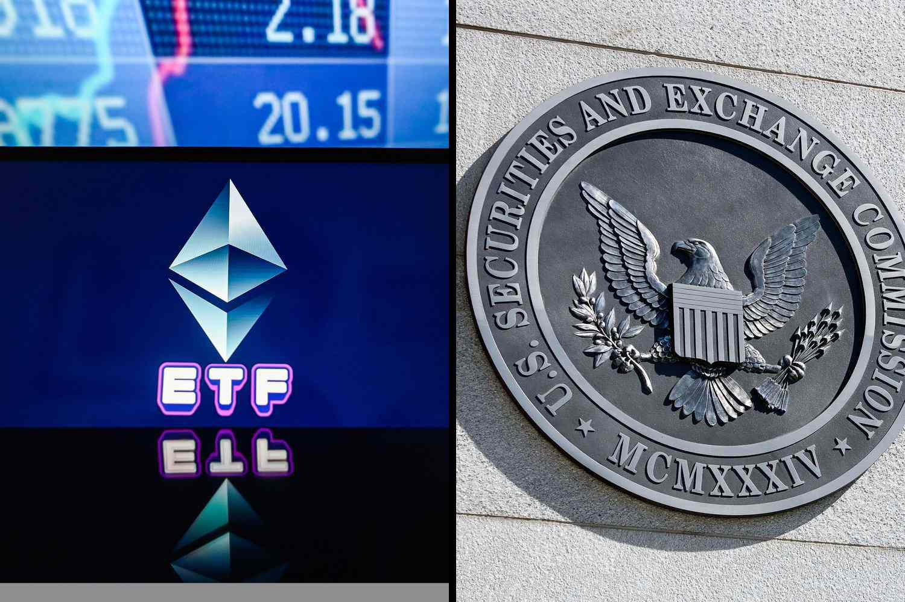

## Table of Contents

## What is a Spot Ether ETF?

A Spot Ether ETF, or Exchange-Traded Fund, is a type of investment fund that tracks the price of Ethereum, a popular cryptocurrency. It allows investors to buy shares in the fund, which in turn holds Ethereum directly, rather than through futures contracts or other derivatives. This means that the value of the ETF goes up and down with the actual price of Ethereum on the market.

Investing in a Spot Ether ETF can be easier and less risky than buying Ethereum directly. It's easier because you can buy and sell shares of the ETF through a regular brokerage account, just like you would with stocks. It's less risky because the ETF is managed by professionals who handle the buying and storing of the Ethereum, reducing the chance of losing your investment due to mistakes or security issues.

## How does a Spot Ether ETF differ from other types of ETFs?

A Spot Ether ETF is different from other ETFs because it directly holds Ethereum, the cryptocurrency. Most ETFs track things like stocks, bonds, or commodities, but a Spot Ether ETF tracks the price of Ethereum itself. This means that when you buy shares in a Spot Ether ETF, you're getting exposure to the actual price movements of Ethereum, not just a fund that tries to mimic its performance.

Other types of ETFs, like futures-based ETFs, don't hold the actual asset. For example, a Bitcoin futures [ETF](/wiki/etf-trading-strategies) would hold contracts that bet on the future price of Bitcoin, not Bitcoin itself. This can lead to differences in how the ETF performs compared to the actual [cryptocurrency](/wiki/cryptocurrency). A Spot Ether ETF, on the other hand, gives investors a more direct and immediate connection to Ethereum's price, making it simpler and potentially more accurate for tracking the cryptocurrency's value.

## Why might someone be interested in investing in a Spot Ether ETF?

Someone might want to invest in a Spot Ether ETF because it's an easier way to get into the world of cryptocurrencies. Instead of dealing with the complexities of buying and storing Ethereum directly, you can simply buy shares in the ETF through your regular investment account. This makes it less scary and more convenient for people who are new to crypto or who just want a simpler way to invest.

Another reason is that a Spot Ether ETF lets you invest in Ethereum without the risks that come with owning the actual cryptocurrency. When you buy Ethereum directly, you have to worry about keeping it safe from hackers and making sure you don't lose your access to it. With a Spot Ether ETF, the professionals who manage the fund take care of all that for you. This can make investing in Ethereum feel a lot safer and more secure.

## What are the potential risks associated with investing in a Spot Ether ETF?

Investing in a Spot Ether ETF can be risky because the price of Ethereum can go up and down a lot. If Ethereum's price drops, the value of your investment in the ETF will also drop. This can be a big problem if you need to sell your shares when the price is low. Also, the ETF might not perfectly track the price of Ethereum because of fees and other costs that the fund has to pay. This means that even if Ethereum goes up, your investment might not go up as much.

Another risk is that the ETF is still new and not many people know about it. This can make it hard to buy and sell shares when you want to. If lots of people want to sell their shares at the same time, it could be hard to find buyers, and the price of the ETF could drop more than the price of Ethereum itself. Plus, the rules and laws about cryptocurrencies are still changing, and that could affect how the ETF works or even if it can keep going.

## Are Spot Ether ETFs currently available in 2024?

As of 2024, Spot Ether ETFs are not widely available yet. Some countries are still working on the rules and laws to allow them. This means that if you want to invest in Ethereum through an ETF, you might have to wait a bit longer.

Even though Spot Ether ETFs are not common, some financial companies are trying to start them. They need to get approval from the government first. So, keep an eye out for news about this if you're interested in investing in Ethereum without buying it directly.

## Which financial institutions offer Spot Ether ETFs in 2024?

As of 2024, no financial institutions offer Spot Ether ETFs because they are still waiting for approval from the government. Companies like BlackRock and Fidelity have shown interest in starting Spot Ether ETFs, but they need to get the go-ahead first. So, if you're looking to invest in Ethereum through an ETF, you'll have to wait until the rules are sorted out.

The reason it's taking time is that governments want to make sure everything is safe and fair for investors. They are looking at how these ETFs would work and what rules need to be in place. Once they finish this process, we might see Spot Ether ETFs become available, but for now, they're not an option.

## What are the regulatory considerations for Spot Ether ETFs in different countries?

In the United States, the Securities and Exchange Commission (SEC) is in charge of deciding if Spot Ether ETFs can be offered. They want to make sure these ETFs are safe for people to invest in. The SEC looks at things like how the ETF will be managed, how it will keep the Ethereum safe, and if it will be easy for people to buy and sell shares. They are taking their time because they want to get it right and make sure investors are protected. Right now, no Spot Ether ETFs are approved, but some big companies like BlackRock and Fidelity have applied, so there might be news soon.

In Europe, different countries have their own rules about Spot Ether ETFs. Some countries, like Germany and Switzerland, are more open to new types of investments and might allow these ETFs sooner. They are working on making sure the rules are clear and fair for everyone. Other countries in Europe might be slower because they want to see how things go in the U.S. or other places first. Overall, Europe is trying to find a balance between letting people invest in new ways and keeping them safe from risks.

In Asia, places like Singapore and Hong Kong are also thinking about allowing Spot Ether ETFs. They are looking at how to fit these new investments into their existing rules. Singapore, for example, has strict rules to make sure investments are safe and that people understand the risks. Hong Kong is trying to become a big place for crypto, so they might be quicker to allow these ETFs. But like everywhere else, they want to take their time to make sure everything is done right.

## How has the performance of Spot Ether ETFs been in 2024 compared to previous years?

In 2024, Spot Ether ETFs are not available yet, so we can't talk about their performance. They are still waiting for approval from the government. This means we can't compare how they did this year to how they might have done in the past because they don't exist yet. If you want to invest in Ethereum through an ETF, you'll need to wait until they are allowed.

Even though we can't look at the performance of Spot Ether ETFs in 2024, we can see how Ethereum itself has been doing. Ethereum's price can go up and down a lot, which would affect any ETF that tracks it. In the past, Ethereum has had some big changes in price, so if Spot Ether ETFs were around, they would have gone through the same ups and downs. For now, people interested in these ETFs need to keep an eye on the news to see when they might become available.

## What are the tax implications of investing in a Spot Ether ETF?

When you invest in a Spot Ether ETF, you need to think about taxes. If you make money from selling your shares in the ETF, you might have to pay capital gains tax. This is like when you sell something for more than you paid for it. The tax rate can be different depending on how long you held the shares. If you held them for less than a year, it's called a short-term capital gain, and you'll pay more tax. If you held them for more than a year, it's a long-term capital gain, and the tax rate is usually lower.

Another thing to know is that if the ETF gives you any dividends or interest, you might have to pay taxes on that too. Dividends are when the ETF shares some of its profits with you. The tax on dividends can also depend on how long you've held the shares. It's a good idea to talk to a tax advisor to understand all the rules because they can be complicated. They can help you figure out how much you might owe and how to report it on your taxes.

## How do Spot Ether ETFs impact the broader cryptocurrency market?

Spot Ether ETFs can make a big difference in the world of cryptocurrencies. When these ETFs start, more people might want to invest in Ethereum because it's easier to buy shares in an ETF than to buy Ethereum directly. This could make the price of Ethereum go up because more people are buying it. Also, if big financial companies like BlackRock and Fidelity start offering these ETFs, it might make people trust cryptocurrencies more. They might think, "If big companies are doing it, it must be okay," and this could bring more money into the crypto market.

But there could also be some downsides. If lots of people start buying and selling shares in Spot Ether ETFs, it might make Ethereum's price go up and down even more. This is because the ETF's buying and selling could affect the price of Ethereum directly. Also, if something goes wrong with the ETF, like a big drop in price or a problem with the rules, it could make people worried about cryptocurrencies in general. This might make them sell their crypto and make the market go down. So, while Spot Ether ETFs could bring more people and money into the market, they could also make things more unpredictable.

## What advanced strategies can be used when trading Spot Ether ETFs?

When trading Spot Ether ETFs, one advanced strategy is called dollar-cost averaging. This means you buy a set amount of the ETF at regular times, no matter what the price is. This can help you avoid buying all your shares at a high price. Over time, you'll buy some shares when the price is low and some when it's high, which can make your average cost lower. This strategy is good if you think Ethereum's price will go up in the long run but you're not sure when.

Another strategy is to use stop-loss orders. This is like setting a safety net for your investment. If the price of the ETF starts to drop a lot, a stop-loss order will automatically sell your shares before the price goes too low. This can help you limit how much money you lose if the price suddenly drops. It's a good idea if you're worried about big drops in Ethereum's price but you want to keep your investment safe.

You can also try to time the market, but this is tricky and risky. It means trying to buy the ETF when you think the price is about to go up and sell it when you think it's about to go down. To do this, you need to watch the news and trends in the cryptocurrency market closely. It's hard to get it right, and you might lose money if you guess wrong. But if you're good at it, you could make more money than just holding onto the ETF.

## What future developments might affect the availability and performance of Spot Ether ETFs?

In the future, the rules and laws about cryptocurrencies might change, and this could affect Spot Ether ETFs. If the government makes it easier for these ETFs to start, more people might be able to buy them. This could make the price of Ethereum go up because more people would be investing in it. But if the rules get stricter, it might be harder for these ETFs to exist, and fewer people might want to invest in them. Also, if other countries start allowing Spot Ether ETFs, it could make them more popular around the world.

Another thing that could affect Spot Ether ETFs is how Ethereum itself does. If Ethereum becomes more popular or gets used for more things, its price might go up. This would make the ETF more valuable too. But if people start to like other cryptocurrencies more, or if there are problems with Ethereum, its price could go down. This would make the ETF less valuable. So, the future of Spot Ether ETFs depends a lot on what happens with Ethereum and the rules about it.

## References & Further Reading

[1]: Balch, T., Kapoor, A., & Nichols, P. (2020). ["Machine Learning for Asset Managers."](https://www.tandfonline.com/doi/full/10.1080/14697688.2020.1817534) Cambridge University Press.

[2]: Dune Analytics. ["Ethereum Spot and Futures ETF Overview."](https://dune.com/home) (Accessed Date: October 2023)

[3]: Malkiel, B. G. (2019). ["A Random Walk Down Wall Street: The Time-Tested Strategy for Successful Investing."](https://www.amazon.com/Random-Walk-Down-Wall-Street/dp/0393358380) W. W. Norton & Company.

[4]: Securities and Exchange Commission (SEC). ["SEC Public Statement on Digital Asset Securities."](https://www.sec.gov/newsroom/speeches-statements/digital-asset-securities-issuance-trading) (Accessed Date: October 2023)

[5]: Gandal, N., & Halaburda, H. (2014). ["Competition in the Cryptocurrency Market."](https://papers.ssrn.com/sol3/papers.cfm?abstract_id=2501640) Palgrave Macmillan.