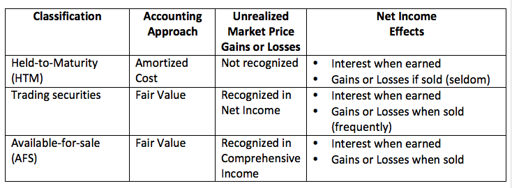

## Table of Contents

## What are available-for-sale securities?

Available-for-sale securities are investments that a company plans to hold for a certain period but may sell before they mature. These can include stocks, bonds, or other financial assets. Companies classify these securities as available-for-sale when they don't intend to keep them until maturity, but also don't plan to trade them actively in the short term.

When a company owns available-for-sale securities, any changes in their value are recorded in a part of the company's equity called "other comprehensive income." This means that the gains or losses from these securities don't affect the company's net income until the securities are sold. This approach helps provide a clearer picture of the company's regular operating performance, separate from the ups and downs of its investment portfolio.

## What are held-for-trading securities?

Held-for-trading securities are investments that a company plans to buy and sell frequently to make quick profits. These can be stocks, bonds, or other financial assets that the company actively trades. The main goal is to take advantage of short-term price changes in the market.

When a company has held-for-trading securities, any changes in their value are recorded right away in the company's net income. This means if the securities go up in value, it's good news for the company's profits, but if they go down, it can hurt the profits. This approach shows how well the company is doing with its short-term trading activities.

## How are available-for-sale securities classified on the balance sheet?

Available-for-sale securities are shown on a company's balance sheet under the section called "Investments" or "Non-current Assets." They are listed at their fair value, which means the price they would sell for in the market right now. This value can go up or down depending on the market, but the company doesn't have to sell them right away.

Any changes in the value of available-for-sale securities are not added to the company's profit or loss right away. Instead, they are recorded in a special part of the company's equity called "other comprehensive income." This way, the ups and downs of these investments don't mess with the company's regular earnings until the securities are actually sold.

## How are held-for-trading securities classified on the balance sheet?

Held-for-trading securities are shown on a company's balance sheet under the section called "Current Assets." They are listed at their fair value, which is the price they would sell for in the market right now. Since these securities are meant to be bought and sold quickly, they are considered part of the company's short-term assets.

Any changes in the value of held-for-trading securities are recorded right away in the company's net income. This means if the value of these securities goes up, it increases the company's profit for that period. If the value goes down, it decreases the profit. This approach helps show how well the company is doing with its short-term trading activities.

## What is the main difference in accounting treatment between available-for-sale and held-for-trading securities?

The main difference in accounting treatment between available-for-sale and held-for-trading securities lies in how changes in their value are recorded. For available-for-sale securities, any changes in value are not immediately added to the company's profit or loss. Instead, these changes are recorded in a special part of the company's equity called "other comprehensive income." This means that the ups and downs of these investments don't affect the company's regular earnings until the securities are actually sold.

On the other hand, held-for-trading securities have their value changes recorded right away in the company's net income. If the value of these securities goes up, it increases the company's profit for that period. If the value goes down, it decreases the profit. This immediate impact on net income reflects the company's short-term trading activities and shows how well they are doing in the market.

In summary, available-for-sale securities help keep the company's regular earnings stable by not counting value changes until they are sold, while held-for-trading securities show the immediate impact of market changes on the company's profits.

## How are unrealized gains and losses treated for available-for-sale securities?

When a company has available-for-sale securities, any changes in their value that haven't been sold yet are called unrealized gains or losses. These changes in value don't affect the company's profit or loss right away. Instead, they are recorded in a special part of the company's equity called "other comprehensive income." This means that if the value of the securities goes up, the company shows an unrealized gain in other comprehensive income. If the value goes down, it shows an unrealized loss there.

When the company actually sells the available-for-sale securities, the unrealized gains or losses that were in other comprehensive income move to the company's profit or loss. This is when they become realized gains or losses. So, the company's regular earnings stay stable until the securities are sold, and then the impact of the gains or losses is felt. This way, the company can show how well it's doing without the ups and downs of its investments affecting its regular business performance.

## How are unrealized gains and losses treated for held-for-trading securities?

When a company has held-for-trading securities, any changes in their value that haven't been sold yet are called unrealized gains or losses. These changes in value are recorded right away in the company's profit or loss. So, if the value of the securities goes up, the company shows an unrealized gain in its profit for that period. If the value goes down, it shows an unrealized loss, which means the company's profit goes down too.

This immediate impact on the company's profit or loss shows how well the company is doing with its short-term trading activities. Unlike available-for-sale securities, where unrealized gains and losses are kept separate until the securities are sold, held-for-trading securities affect the company's earnings right away. This helps investors see how the company is doing in the market, even before the securities are actually sold.

## What are the criteria for classifying a security as available-for-sale?

A security is classified as available-for-sale when a company does not plan to keep it until it matures, but also doesn't plan to trade it actively in the short term. This means the company might sell the security before it reaches its maturity date, but it's not something they're buying and selling all the time. These securities can be things like stocks, bonds, or other financial assets.

The main reason for this classification is to show the company's regular earnings without the ups and downs of the investment's value affecting them right away. When the value of an available-for-sale security changes, the company records that change in a part of its equity called "other comprehensive income." This way, the company's profit or loss stays stable until they actually sell the security, and then the gain or loss is counted.

## What are the criteria for classifying a security as held-for-trading?

A security is classified as held-for-trading when a company plans to buy and sell it quickly to make short-term profits. This means the company is actively trading the security, looking to take advantage of price changes in the market. These securities can be stocks, bonds, or other financial assets that the company is not holding onto for the long term.

When a company has held-for-trading securities, any changes in their value are recorded right away in the company's profit or loss. If the value goes up, it's good news for the company's profits, but if it goes down, it can hurt the profits. This way, the company's earnings show how well they are doing with their short-term trading activities, giving investors a clear picture of their performance in the market.

## How does the intent of management affect the classification of securities?

The way a company plans to use its securities really matters when it comes to deciding how to classify them. If the company wants to buy and sell the securities quickly to make money from short-term price changes, they call these held-for-trading securities. This means they're always looking at the market, ready to trade whenever they see a chance to profit. These securities go right into the company's profit or loss as soon as their value changes, showing everyone how the company is doing with its short-term trading.

On the other hand, if the company isn't planning to trade the securities all the time but might sell them before they reach their maturity date, they classify them as available-for-sale securities. This means the company might hold onto them for a while but doesn't plan to keep them forever. Changes in the value of these securities don't go straight into the company's profit or loss. Instead, they get recorded in a special part of the company's equity called "other comprehensive income," keeping the company's regular earnings stable until the securities are actually sold.

## What are the implications of reclassifying securities from available-for-sale to held-for-trading?

When a company decides to change a security from available-for-sale to held-for-trading, it means they now plan to trade it more often to make quick profits. This change affects how the company's money is shown on their financial reports. Before, any changes in the value of the security were kept in a special part of the company's equity called "other comprehensive income." But now, as soon as the value of the security goes up or down, it will be added to or taken away from the company's profit or loss right away. This can make the company's earnings look more up and down because they're now showing the short-term changes in the security's value.

This reclassification can also change how investors see the company. If the company starts showing more ups and downs in its profits because of these securities, it might look riskier to some investors. On the other hand, if the company is good at trading and making money from these quick changes, it could look more exciting and profitable. The key thing is that this change shows the company is now more focused on making money from short-term trading, which can affect how people think about the company's overall strategy and performance.

## How do changes in fair value of these securities impact financial statements differently?

When a company has available-for-sale securities, any changes in their value don't go straight into the company's profit or loss. Instead, these changes are put into a special part of the company's equity called "other comprehensive income." This means if the value of the securities goes up, the company shows a gain in other comprehensive income, but it doesn't affect their regular earnings right away. If the value goes down, it shows a loss there, but again, it doesn't change the company's profit or loss until they actually sell the securities. This way, the company's regular earnings stay stable, and the ups and downs of the investments are kept separate until they're sold.

On the other hand, if a company has held-for-trading securities, any changes in their value go right into the company's profit or loss. So, if the value of these securities goes up, the company's profit for that period goes up too. If the value goes down, the profit goes down. This immediate impact on the company's earnings shows how well they're doing with their short-term trading. It can make the company's profits look more up and down because they're showing the quick changes in the value of these securities. This way, investors can see how the company is doing in the market right away.

## What are Available-for-Sale Securities and how can they be explored?

Available-for-Sale (AFS) securities are unique financial instruments that provide investors with the flexibility of selling them before maturity if market conditions warrant but also allow for the possibility of holding them for an extended duration. These securities are distinct from Held-for-Trading ([HFT](/wiki/high-frequency-trading-strategies)) securities, which are primarily intended for short-term trading gains. 

Accounting for AFS securities involves recognition at fair value on the balance sheet. Unlike HFT securities, where changes in fair value are recorded immediately in the income statement, AFS securities' unrealized gains and losses are recorded in the equity section, specifically under accumulated other comprehensive income (OCI). This accounting treatment ensures that these fluctuations do not affect reported net income until the securities are actually sold, thereby providing a buffer against [volatility](/wiki/volatility-trading-strategies) in reported earnings. 

This accounting approach offers tactical flexibility in investment strategies, allowing entities to adjust holdings according to market dynamics without immediate impact on net income figures. For example, if a company anticipates market recovery after a decline, it might retain AFS securities until they recover their value, thereby avoiding the crystallization of losses in the income statement.

The impact of AFS securities on a firm's equity is primarily through the accumulated OCI account:

$$
\text{Equity}_{\text{end}} = \text{Equity}_{\text{beginning}} + \text{Net Income} + \Delta \text{OCI} + \text{Other changes}
$$

Where $\Delta \text{OCI}$ includes unrealized gains and losses of AFS securities. 

This mechanism can provide a more stable outlook in financial reporting compared to HFT securities, which are marked to market through the income statement and can introduce earnings volatility. By decoupling market fluctuations from immediate earnings reports, AFS securities can support more strategic long-term financial planning.

This characteristic of AFS securities is pivotal for firms aiming for a stable presentation of financial health, minimizing short-term market noise. Understanding and leveraging this classification enables businesses to align investment strategies with their financial stability goals while maintaining agility to capitalize on favorable market movements.

## References & Further Reading

[1]: ["International Financial Reporting Standards (IFRS)."](https://www.ifrs.org/content/dam/ifrs/publications/pdf-standards/english/2021/issued/part-a/ifrs-1-first-time-adoption-of-international-financial-reporting-standards.pdf)

[2]: ["Generally Accepted Accounting Principles (GAAP)."](https://www.investopedia.com/terms/g/gaap.asp)

[3]: Lopez de Prado, M. (2018). ["Advances in Financial Machine Learning."](https://www.amazon.com/Advances-Financial-Machine-Learning-Marcos/dp/1119482089) Wiley.

[4]: Chan, E. P. (2009). ["Quantitative Trading: How to Build Your Own Algorithmic Trading Business."](https://github.com/ftvision/quant_trading_echan_book) Wiley.

[5]: Jansen, S. (2020). ["Machine Learning for Algorithmic Trading."](https://github.com/stefan-jansen/machine-learning-for-trading) Packt Publishing.

[6]: Aronson, D. (2007). ["Evidence-Based Technical Analysis: Applying the Scientific Method and Statistical Inference to Trading Signals."](https://www.amazon.com/Evidence-Based-Technical-Analysis-Scientific-Statistical/dp/0470008741) Wiley.

[7]: Hull, J. C. (2015). ["Options, Futures, and Other Derivatives."](https://www.semanticscholar.org/paper/Options%2C-Futures%2C-and-Other-Derivatives-Hull/89bdee500c8623864fc9eb7a471546aa713acc44) Pearson.