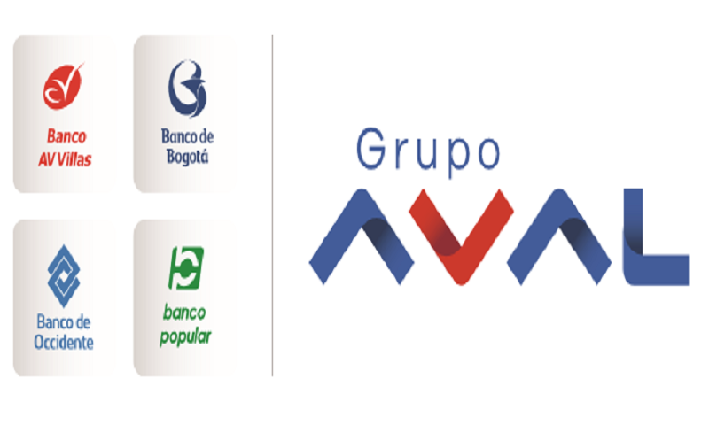

In the complex world of finance and trading, understanding key concepts such as endorsements, aval guarantees, and algorithmic trading is essential. These concepts play a significant role in shaping the financial ecosystem, each contributing uniquely to the mechanics of trading and risk management.

Endorsements in trading typically involve the backing or approval of financial products, strategies, or instruments by credible entities such as banks, industry experts, or credit rating agencies. This validation is crucial as it enhances trust and transparency, serving as a measure of reliability for investors and traders. 



Aval guarantees, on the other hand, represent a financial commitment by a third party, often a bank, to satisfy the obligations of a debtor should they default. Common in European banking practice, these guarantees enhance the creditworthiness of financial transactions by offering a security net for involved parties.

Algorithmic trading, also known as algo trading, leverages computer algorithms to automate trading activities. These algorithms analyze market data and execute trades based on predefined criteria, thereby increasing efficiency, speed, and accuracy. This method minimizes human error and emotional bias, making it an attractive option for executing large volumes of trades swiftly.

Understanding these interconnected components can significantly improve trading strategies and risk management approaches for investors, traders, and financial professionals alike. By defining and appreciating their fundamental roles, it's possible to build more robust and effective systems for navigating today's advanced financial landscapes.

## Table of Contents

## Understanding Endorsements in Trading

Endorsements in trading are critical components that represent approvals or guarantees provided by financial institutions or individuals. These endorsements are significant in enhancing the credibility and trustworthiness of trading strategies and financial instruments. By providing an added layer of assurance, endorsements play a vital role in financial markets, where credibility is a key driver of investor confidence and market stability.

There are various sources from which endorsements can be derived. Banks, for example, are trusted entities that can offer endorsements, contributing significant weight to the credibility of financial instruments. Similarly, credit rating agencies provide endorsements through ratings that reflect the creditworthiness and underlying risk of financial securities. Industry experts, through their endorsements, lend credibility to financial products and strategies due to their specialized knowledge and experience.

Endorsements can be categorized into several types, each serving its own purpose:

1. **Personal Endorsement**: This type of endorsement occurs when an individual, often with significant knowledge or expertise, supports or approves a particular trading strategy or financial instrument. Personal endorsements are particularly influential when the individual has a recognized reputation in the financial industry.

2. **Financial Endorsement**: These endorsements are typically made by financial institutions, such as banks or investment firms, to vouch for the credibility and reliability of a financial product, instrument, or strategy. Financial endorsements leverage the trust and stability associated with these institutions to enhance market confidence.

3. **Insurance Endorsement**: Insurance endorsements involve the use of insurance products to provide additional guarantees or coverage for financial transactions. They function by insuring certain aspects of a financial instrument or strategy, thereby reducing risk and enhancing trust among investors or counterparties.

The primary function of endorsements in trading is to ensure transparency and validate trading strategies. By adding layers of trust and scrutiny, endorsements help maintain market integrity and protect investor interests. They serve not only as a mechanism for reducing information asymmetry between parties but also as a measure to enhance investor confidence.

Endorsements also contribute to market efficiency by facilitating the smooth functioning of financial markets. They help investors make informed decisions based on enhanced transparency and reduced risk, ultimately promoting more robust trading strategies and contributing to the stability of the financial system.

 to Aval Guarantee

An aval is a form of financial guarantee provided by a third party, typically a bank, which ensures the payment of a debt in the event that the original debtor defaults. This guarantee is often used in financial agreements to provide an extra layer of security and assurance to the parties involved. 

Avals are particularly prevalent in Europe, where the practice of avalizing is well-established. Avalizing is commonly used to secure financial obligations across various purchase agreements. This is especially important in international trade, where credit risk and payment default concerns are more pronounced. By employing an aval, the risk associated with a transaction is minimized, providing a safeguard for both the buyer and the seller.

The key advantage of avals is their ability to enhance the creditworthiness of a transaction. This is critical for businesses seeking to establish or maintain strong financial relationships. By having a bank or other financial institution back a transaction, the parties involved gain peace of mind, knowing there is a safety net in place should the primary party fail to meet their obligations.

Understanding how aval guarantees operate is advantageous for businesses and investors looking to effectively manage financial risk. By utilizing avals, companies can foster trust in their transactions and minimize potential financial losses due to default. As such, avals play a vital role in modern financial markets, offering a reliable mechanism for securing transactions and ensuring business continuity.

## The Role of Algorithmic Trading

Algorithmic trading, often referred to as algo trading, involves the use of computer algorithms to facilitate trading decisions and execute trades automatically at high volumes and speeds. This sophisticated approach incorporates mathematical models and statistical analysis to evaluate vast amounts of market data in real-time, identifying and exploiting short-lived market inefficiencies with precision.

One of the primary advantages of [algorithmic trading](/wiki/algorithmic-trading) is its ability to execute trades at exponentially greater speeds and volumes than human traders. This efficiency is crucial in fast-paced markets where opportunities can be transient and competition is fierce. Algorithmic trading systems are designed to operate without the emotional influences that can affect human decision-making, such as fear and greed. By relying on predefined criteria to analyze data and execute trades, these systems maintain a consistent and objective approach, thus eliminating emotional biases that can otherwise lead to suboptimal trading outcomes.

The cost-effectiveness of algorithmic trading is another major benefit. By automating processes, traders can significantly reduce transaction costs, including brokerage fees and errors associated with manual trading. This cost reduction is one reason algo trading has become the preferred choice for institutional investors and major trading firms.

The basic mechanism of an algorithmic trading system involves three main components: the strategy, the execution system, and the risk management system. The strategy component defines the logic conditions that trigger trades, utilizing various market indicators and data analytics tools. For instance, a simple moving average crossover strategy might signal a buy or sell action when a short-term moving average crosses a long-term moving average. Python is frequently used to implement such trading strategies due to its robust libraries for data manipulation and analysis, such as Pandas and NumPy.

```python
import pandas as pd
import numpy as np

# Sample code for a moving average crossover strategy
def moving_average_crossover(data, short_window=40, long_window=100):
    signals = pd.DataFrame(index=data.index)
    signals['price'] = data['price']
    signals['short_mavg'] = data['price'].rolling(window=short_window, min_periods=1, center=False).mean()
    signals['long_mavg'] = data['price'].rolling(window=long_window, min_periods=1, center=False).mean()
    signals['signal'] = 0.0
    signals['signal'][short_window:] = np.where(signals['short_mavg'][short_window:] 
                                                > signals['long_mavg'][short_window:], 1.0, 0.0)   
    signals['positions'] = signals['signal'].diff()
    return signals
```

The execution system ensures that the signals generated by the strategy are carried out in the market efficiently. This involves choosing the right trading venues and optimizing the order execution to minimize market impact and other trading costs.

Finally, the risk management system continuously monitors the market and the positions held by the strategy, applying limits to control exposure and mitigate potential losses. By understanding and implementing a systematic approach such as algorithmic trading, traders can realize substantial strategic advantages, boosting their performance and outcomes in dynamic financial markets.

## Interconnection of Endorsements, Avals, and Algo Trading

The integration of endorsements, aval guarantees, and algorithmic trading represents a sophisticated approach to enhancing the efficiency and security of modern financial transactions. Endorsements and avals are critical in establishing trust and security within trading frameworks. An endorsed trading strategy, particularly when further reinforced by a robust aval guarantee, gains significant reliability. Such arrangements help mitigate risks associated with defaults and bolster the credibility of trades, which is especially pertinent in high-stakes financial environments.

Algorithmic trading, characterized by the rapid execution of trades based on predefined criteria, complements the security offered by endorsements and avals. The primary advantage of algorithmic trading lies in its ability to process vast amounts of data quickly and execute precise trades devoid of human error or emotional bias. These algorithms can efficiently assess market conditions and generate optimum trading strategies, operating autonomously with increased accuracy and speed.

The amalgamation of these elements can produce trading systems that are not only efficient and rapid due to algorithmic processes but are also trustworthy and secure owing to endorsements and avals. For instance, an algorithm that has been validated or endorsed by a reputable financial institution offers comfort to investors, who may be more inclined to adopt such technology. Similarly, when these algorithms are coupled with aval guarantees, the transactions become even more protected against credit risks, thus providing a comprehensive and reliable trading ecosystem.

In today's increasingly digitized and globalized markets, the integration of endorsements, aval guarantees, and algorithmic trading is essential. Digitalization has led to heightened connectivity and competition, necessitating advanced strategies that can manage complex variables with assurance. Understanding how these components interact enables traders and financial professionals to construct trading systems that maximize efficiency and security, ultimately enhancing their competitive edge.

## Conclusion

Endorsements, aval guarantees, and algorithmic trading are essential components in modern finance. Their combined impact enhances trust, security, and efficiency within the trading domain. By integrating these elements, traders and financial institutions can refine their strategies and manage risks more effectively, aligning with the dynamic nature of today's markets. Endorsements contribute to credibility by providing verifiable affirmations from reliable sources, whereas aval guarantees add a layer of security by ensuring that financial commitments are met, even in cases of default. Algorithmic trading offers unparalleled speed and precision, allowing market participants to swiftly execute trades based on sophisticated data analysis.

Leveraging these tools requires continuous learning and adaptation, as technological advancements and market dynamics evolve. Staying informed about changes and updates in these areas is crucial for maintaining competitiveness in the financial sector. For instance, as algorithmic trading strategies become more advanced, incorporating elements such as [machine learning](/wiki/machine-learning) and [artificial intelligence](/wiki/ai-artificial-intelligence), understanding their implications and applications can lead to significant improvements in trading performance and decision-making efficiency.

In conclusion, the strategic use of endorsements, aval guarantees, and algorithmic trading can significantly enhance the robustness of financial operations. Embracing these advancements will allow financial professionals to remain at the forefront, navigating the complexities of an increasingly interconnected and fast-paced trading environment.

## References & Further Reading

[1]: Bergstra, J., Bardenet, R., Bengio, Y., & Kégl, B. (2011). ["Algorithms for Hyper-Parameter Optimization."](https://dl.acm.org/doi/10.5555/2986459.2986743) Advances in Neural Information Processing Systems 24.

[2]: ["Advances in Financial Machine Learning"](https://www.amazon.com/Advances-Financial-Machine-Learning-Marcos/dp/1119482089) by Marcos Lopez de Prado

[3]: ["Evidence-Based Technical Analysis: Applying the Scientific Method and Statistical Inference to Trading Signals"](https://www.amazon.com/Evidence-Based-Technical-Analysis-Scientific-Statistical/dp/0470008741) by David Aronson

[4]: ["Machine Learning for Algorithmic Trading"](https://github.com/stefan-jansen/machine-learning-for-trading) by Stefan Jansen

[5]: ["Quantitative Trading: How to Build Your Own Algorithmic Trading Business"](https://www.amazon.com/Quantitative-Trading-Build-Algorithmic-Business/dp/1119800064) by Ernest P. Chan