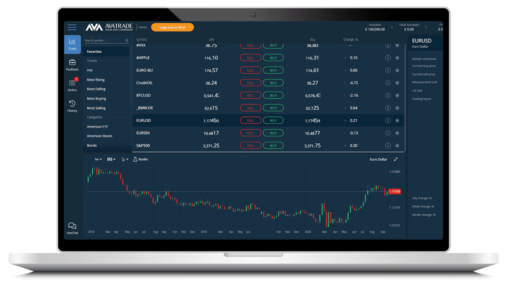

AvaTrade has established itself as a prominent player in the competitive forex and contract for difference (CFD) brokerage industry. It provides traders with the opportunity to engage in diverse financial markets through a user-friendly platform designed to meet the needs of both novice and seasoned investors. Selecting the right trading platform is crucial, as it can significantly impact the trading experience and potential success. AvaTrade is committed to offering comprehensive trading services that cater to a wide range of needs, highlighting its dedication to being a versatile choice for many traders.

AvaTrade's platforms offer various features that appeal to traders with varying levels of expertise. These include state-of-the-art trading tools designed to enhance user efficiency and effectiveness. For beginners, AvaTrade offers intuitive platforms with educational resources to help them understand the intricacies of trading, while experienced traders benefit from advanced analytical tools and sophisticated trading options. This blend of simplicity and complexity allows AvaTrade to serve as a valuable trading partner for a broad spectrum of users.

Despite the multiple benefits of trading with AvaTrade, it is crucial to acknowledge the risks associated with CFD trading. CFDs are complex instruments and come with a high risk of losing money rapidly due to leverage. It is the responsibility of the user to understand these risks and trade responsibly, ensuring that they fully grasp the potential financial implications before engaging in trading activities. AvaTrade emphasizes the importance of informed decision-making and risk management as part of its trading philosophy.

## Table of Contents

## Background and Company Information

AvaTrade was established in 2006, marking its presence as a key player in the forex and CFD trading landscape. The company was founded by Emanuel Kronitz, Negev Nosatzki, and Clal Finance Ltd., who aimed to create a service-oriented brokerage that provides traders with a tailored and refined trading experience. AvaTrade is headquartered in Dublin, Ireland, but has established a broad operational network across various regions, ensuring a truly global reach. This includes registered offices in locales such as Sydney, Milan, Tokyo, and Johannesburg, allowing the firm to cater to a diverse international clientele.

From its inception, AvaTrade has been committed to rigorous regulatory compliance. The broker operates under the regulation of several prominent financial authorities, including the Central Bank of Ireland, the Australian Securities and Investments Commission (ASIC), the Financial Services Authority (FSA) in Japan, the Financial Sector Conduct Authority (FSCA) in South Africa, and the British Virgin Islands Financial Services Commission (BVIFSC). This regulatory framework underscores AvaTrade's commitment to transparency and client protection, fostering a secure trading environment.

Innovation and education stand at the core of AvaTrade's operational philosophy. The broker continuously invests in advanced technological tools and educational resources to equip traders with the necessary skills and knowledge for successful trading. AvaTrade has pioneered several trading products and services that are designed to enhance user experience and facilitate seamless trading operations. The introduction of platforms like AvaOptions and AvaTradeGO exemplify its focus on catering to both novice and experienced traders. Furthermore, AvaTrade's educational initiative, AvaAcademy, provides extensive resources ranging from tutorials and webinars to comprehensive trading guides, underscoring its dedication to trader education.

AvaTrade's market reputation is robust, having amassed numerous industry accolades over the years. These include awards for 'Best Broker' and 'Best Trading Experience' at various global financial events. Such recognition attests to the company's steadfast focus on providing reliable and innovative trading solutions. By prioritizing customer satisfaction and technological advancement, AvaTrade has cemented its standing as a reputable and trustworthy broker in the competitive world of online trading.

## Platform Usability and Customer Experience

AvaTrade offers a diverse range of trading platforms designed to meet the needs of both novice and experienced traders. Key among these are the WebTrader, AvaTradeGO, and the popular MetaTrader platforms, MT4 and MT5. Each platform is crafted to provide a seamless trading experience, balancing functionality with user-friendliness.

The WebTrader platform is accessible directly through an internet browser, eliminating the need for downloads or installations. This platform is known for its intuitive interface, allowing traders to execute trades swiftly and efficiently. The WebTrader's layout is user-friendly, designed for both beginners who need simplicity and expert traders seeking advanced functionalities. With features such as real-time market data, advanced charting tools, and easy access to a wide array of tradable instruments, WebTrader provides a comprehensive trading environment.

AvaTradeGO is AvaTrade’s mobile trading application, offering the flexibility to trade on-the-go. Compatible with both iOS and Android devices, AvaTradeGO caters to traders who demand comprehensive market access from their mobiles. The app’s interface is designed to be intuitive, providing a streamlined trading experience whether on a smartphone or tablet. Features such as notifications on significant market movements and access to customizable watchlists make it a preferred choice for mobile traders. Additionally, the integration with AvaProtect allows users to manage their trades efficiently from anywhere.

MetaTrader 4 (MT4) and MetaTrader 5 (MT5) are beloved platforms in the trading community, known for their robust features and customizability. MT4 is particularly favored for [forex](/wiki/forex-system) trading, providing advanced charting tools, numerous indicators, and support for automated trading through Expert Advisors (EAs). MT5, being a more recent iteration, expands beyond forex, offering access to a broader range of financial instruments and an upgraded environmental interface with enhanced analytical tools. Both platforms can be accessed on both desktop and mobile devices, ensuring consistent user experiences across platforms.

From a usability standpoint, AvaTrade’s platforms are designed with trader accessibility in mind. The interfaces are generally regarded as intuitive, featuring clean design aesthetics that facilitate easy navigation. This is crucial for novice traders who require straightforward access to trading features without feeling overwhelmed. At the same time, advanced traders benefit from the rich array of tools that support comprehensive market analysis.

Customer feedback on platforms such as Trustpilot provides insights into the user experience. AvaTrade scores favorably, with users often highlighting the reliability of the platforms and the efficiency of trade execution. Common points of praise include the ease of use of AvaTradeGO and the analytical capabilities of the MT4 and MT5 platforms. However, feedback also hints at areas for improvement, such as customer support response times and occasional technical issues, which are common in the industry and not unique to AvaTrade.

Overall, AvaTrade’s platforms are positioned to cater to a wide spectrum of trading needs, with a focus on user experience and platform reliability.

## Trading Tools and Features

AvaTrade provides a robust suite of trading tools designed to enhance the user experience for both new and seasoned traders. A standout feature is AvaProtect, which offers a unique risk management tool that allows traders to protect their positions against potential losses over a specified period. This service is particularly beneficial for managing risk in volatile market conditions.

Copy trading is another integral tool provided by AvaTrade, enabling traders to replicate the trades of successful investors. This feature is instrumental for beginners or those looking to diversify their strategies without extensive market analysis. AvaTrade's platform offers seamless integration for copy trading, providing a user-friendly interface that allows easy tracking and management of copied strategies.

Algorithmic trading capabilities are supported through the integration of MetaTrader 4 (MT4) and MetaTrader 5 (MT5) platforms. These platforms allow traders to implement automated trading strategies using Expert Advisors (EAs), which are scripts written in a specialized language (MQL4/MQL5) that can execute trades based on pre-defined parameters without user intervention. This automation enables traders to react swiftly to market changes, optimize trade execution, and maintain discipline by removing emotional decision-making.

To support traders' educational development, AvaTrade offers AvaAcademy, an educational hub that provides extensive resources, including webinars, tutorials, and in-depth articles on trading strategies, market analysis, and platform navigation. This educational initiative underscores AvaTrade's commitment to empowering its clients with the knowledge and skills necessary for successful trading.

AvaTrade also focuses on providing advanced trading technology to support innovative strategies. The integration with Trading Central offers access to technical analysis reports and real-time trading signals, enhancing traders' ability to make informed decisions. Additionally, the platforms include a range of technical indicators and charting tools, allowing for comprehensive market analysis.

Risk management tools are a critical component of any trading platform, and AvaTrade delivers with features such as stop-loss, take-profit orders, and negative balance protection. These tools are designed to cater to various trading styles, offering the flexibility needed to implement effective risk management strategies. By providing such measures, AvaTrade ensures that traders can manage their exposure efficiently and mitigate potential losses.

Overall, AvaTrade's trading tools and features are strategically designed to provide comprehensive support for both novice traders seeking guidance and experienced professionals looking for sophisticated trading solutions.

## Cost and Fee Structure

AvaTrade's cost and fee structure is designed to offer competitive rates while maintaining transparency in trading costs. Central to AvaTrade’s pricing strategy are the spreads, which serve as a primary cost for traders engaging with various asset classes. The broker provides floating spreads that can vary based on market conditions and the specific financial instrument being traded. 

For instance, major currency pairs like EUR/USD typically feature tighter spreads, often starting from as low as 0.9 pips. In contrast, minor or exotic currency pairs may experience wider spreads due to less [liquidity](/wiki/liquidity-risk-premium) and higher market [volatility](/wiki/volatility-trading-strategies). It is crucial for traders to monitor these spreads as they directly influence trading costs.

Moreover, AvaTrade implements inactivity fees for accounts that remain dormant over extended periods. The inactivity fee is generally levied monthly after the account has been inactive for three consecutive months. This fee is designed to encourage active trading and optimize the broker's operational efficiency.

Comparing AvaTrade's fees with those of other brokers reveals a competitive edge, particularly concerning its commission-free trading model. While some brokers may offer lower spreads, they often compensate by charging commissions on trades. AvaTrade's model eliminates such commissions, simplifying transaction costs and allowing traders to focus solely on the spread differences.

When examining costs for various asset classes, traders need to consider both the spreads and any additional expenses such as overnight financing fees (swap rates) that apply to positions held open beyond a single trading day. These swap rates can depend on the specific asset and its respective market conditions.

The concept of commission-free trading is appealing, but it is imperative to be aware of any conditions that may apply. For example, certain promotional offers or specific account types might come with unique terms that affect commission-free trading eligibility. Traders are advised to review these conditions closely to ensure clear understanding and to avoid unexpected charges.

In conclusion, AvaTrade's cost structure provides a balanced approach to trading expenses by offering competitive spreads, commission-free trading, and transparent fee disclosures. This pricing strategy enables traders to manage costs effectively while participating in diverse financial markets.

## Range of Tradable Instruments

AvaTrade offers a comprehensive range of tradable instruments designed to cater to the diverse preferences and strategies of traders. Among the primary markets available are forex, commodities, indices, stocks, and cryptocurrencies, each providing unique opportunities for traders with varying risk tolerances and investment objectives.

### Forex Market

AvaTrade provides access to a wide selection of currency pairs, including major, minor, and exotic pairs, allowing traders to diversify their portfolios. Forex trading on AvaTrade is facilitated through contracts for difference (CFDs), enabling traders to speculate on currency price movements without owning the actual currencies. Traders can leverage their positions, with leverage levels varying across different accounts and regulatory regions, potentially amplifying profits or losses.

### Commodities and Indices

The platform also offers CFDs on a range of commodities such as gold, silver, [crude oil](/wiki/crude-oil), and agricultural products. These instruments allow traders to hedge against inflation or economic volatility. Additionally, AvaTrade provides exposure to major global indices, including NASDAQ, S&P 500, and FTSE 100, among others, enabling traders to speculate on the performance of leading equity markets.

### Stocks and Cryptocurrencies

AvaTrade enables CFD trading on numerous international stocks, allowing traders to invest in shares of prominent companies without the need to directly purchase the underlying assets. Moreover, as cryptocurrencies have grown in popularity, AvaTrade has expanded its offerings to include popular digital assets like Bitcoin, Ethereum, and Litecoin. This allows traders to engage in the highly volatile [cryptocurrency](/wiki/cryptocurrency) market with leverage, though it involves significant risk.

### Trading Leverage and CFD Offerings

CFD trading is central to AvaTrade's instrument offerings, providing flexibility across various asset classes. Leverage ratios depend on the asset and regulatory restrictions, with forex pairs often having higher leverage compared to other assets. While leverage can magnify returns, it equally amplifies potential losses, highlighting the importance of risk management strategies in trading.

### Specialized Trading Instruments

In addition to standard CFDs, AvaTrade offers specialized instruments such as vanilla options, which provide traders with fixed risk and profit potential. Vanilla options on AvaTrade enable investors to trade forex options with flexibility in terms of expiration dates and strike prices. Furthermore, the broker offers futures trading, allowing traders to engage in longer-term market speculation based on expected price movements.

### Comparison with Competing Brokers

When compared to other brokerage firms, AvaTrade's extensive range of instruments, coupled with competitive leverage and diverse asset categories, places it among the top choices for traders. While some competitors may offer lower spreads or additional asset classes, AvaTrade’s comprehensive offerings and innovative tools make it a robust platform for accessing global financial markets.

In summary, AvaTrade's diverse range of tradable instruments, combined with its leveraged CFD offerings and specialized trading vehicles, provides a versatile platform for both novice and experienced traders seeking to explore various market opportunities.

## Security and Regulation

AvaTrade, a reputable broker in the financial sector, operates under strict regulatory oversight across multiple jurisdictions. The broker is regulated by several prominent financial authorities, ensuring compliance with international standards. These include the Central Bank of Ireland, the Australian Securities and Investments Commission (ASIC), the Financial Sector Conduct Authority (FSCA) of South Africa, the Financial Futures Association of Japan (FFAJ), and the Abu Dhabi Global Markets (ADGM) Financial Regulatory Services Authority, among others. This diverse regulatory framework underscores AvaTrade's commitment to providing a secure trading environment for its clients.

AvaTrade employs robust security measures to protect client information and funds. Data encryption is a fundamental component, utilizing advanced SSL (Secure Socket Layer) technology to ensure the safe transmission of information between clients and the broker's servers. Furthermore, AvaTrade follows stringent protocols for client fund segregation, which involves keeping client funds in separate accounts from the company's operational funds. This practice not only ensures transparency but also safeguards client assets in case of financial instability within the company.

Compliance with regulatory mandates is a critical aspect of AvaTrade's operations. The broker adheres to the guidelines set forth by regulatory bodies in all its operating regions, undergoing regular audits and reviews to maintain its licenses. These audits evaluate AvaTrade's financial operations, risk management practices, and adherence to anti-money laundering (AML) and know-your-customer (KYC) regulations. Such compliance ensures that the firm maintains high ethical standards and operational integrity.

For traders, these regulatory and security measures offer significant peace of mind. AvaTrade's approach to security includes providing compensation mechanisms aligned with regional regulations, such as the Investor Compensation Fund (ICF) for clients under the jurisdiction of the Central Bank of Ireland. This fund provides a degree of financial protection to clients should the broker face insolvency. By adhering to these strict regulatory and security measures, AvaTrade ensures a safe trading experience, upholding trust and reliability as cornerstones of its business model.

## Conclusion and Recommendations

AvaTrade stands out as a widely recognized forex and CFD broker, characterized by its user-friendly platforms and strong regulatory compliance. The broker has developed platforms like WebTrader, AvaTradeGO, MT4, and MT5, which cater to both novice and experienced traders, emphasizing intuitive design and ease of use. Such attributes make it an appealing choice for those new to trading as well as seasoned professionals.

One of AvaTrade's primary strengths is its regulatory compliance. The company operates under stringent regulations across multiple jurisdictions, ensuring trust and reliability for its clients. This regulatory framework provides traders with assurance regarding the safety and security of their funds and trading activities.

Despite its strengths, AvaTrade is not without its drawbacks. One notable point of concern is the imposition of inactivity fees, which can affect traders who do not frequently engage in trading. Additionally, the broker's services are currently unavailable to U.S. clients, which is a significant limitation given the size of the American trading market. Potential clients in the U.S. may need to look at alternative brokers as a result.

For traders across the spectrum, AvaTrade offers comprehensive tools and resources that accommodate a wide range of trading strategies and educational needs. Beginners can benefit from AvaAcademy, which provides valuable educational resources, while experienced traders can leverage advanced trading tools and features like AvaProtect and [algorithmic trading](/wiki/algorithmic-trading).

In conclusion, AvaTrade presents itself as a solid choice for traders due to its user-friendly platforms and robust regulatory compliance. It is recommended for both beginners who need educational support and professional traders seeking advanced trading functionalities. However, traders should be mindful of the inactivity fees and the availability limitations for U.S. clients when considering AvaTrade as their trading partner. Overall, AvaTrade remains a competitive player within the global trading market, offering diverse trading instruments and a reliable trading environment.

## References & Further Reading

[1]: ["Advances in Financial Machine Learning"](https://www.amazon.com/Advances-Financial-Machine-Learning-Marcos/dp/1119482089) by Marcos Lopez de Prado

[2]: ["Evidence-Based Technical Analysis: Applying the Scientific Method and Statistical Inference to Trading Signals"](https://www.amazon.com/Evidence-Based-Technical-Analysis-Scientific-Statistical/dp/0470008741) by David Aronson

[3]: ["Machine Learning for Algorithmic Trading"](https://github.com/PacktPublishing/Machine-Learning-for-Algorithmic-Trading-Second-Edition) by Stefan Jansen

[4]: ["Quantitative Trading: How to Build Your Own Algorithmic Trading Business"](https://www.amazon.com/Quantitative-Trading-Build-Algorithmic-Business/dp/1119800064) by Ernest P. Chan

[5]: Hyder, A. (2020). ["MetaTrader 4 and MetaTrader 5 Programming: An Introduction to Developing Automated Trading Systems."](https://www.mql5.com/en/blogs/post/719372)