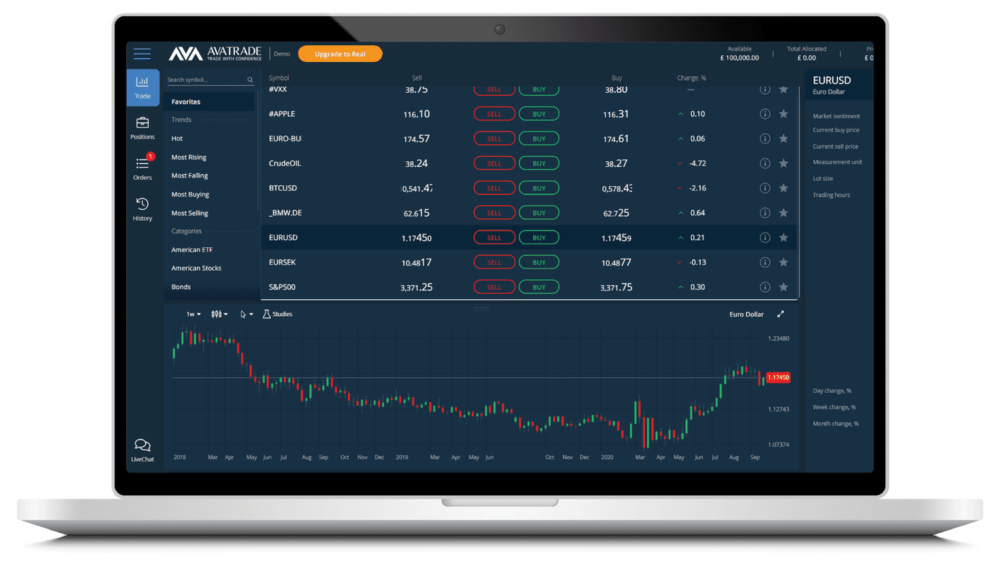

## Table of Contents

## What is AvaTrade and what services does it offer?

AvaTrade is a company that helps people trade in financial markets. They let you buy and sell things like stocks, forex, and cryptocurrencies. They have been around since 2006 and are known for being easy to use, even if you are new to trading.

AvaTrade offers different tools to help you trade better. They have things like educational materials to teach you about trading, and they also have customer support that can help you if you have questions. They also let you use something called "leverage," which can make your trades bigger but also riskier, so you need to be careful with it.

## How can beginners start trading with AvaTrade in 2024?

To start trading with AvaTrade in 2024, beginners should first visit the AvaTrade website and sign up for an account. The process is straightforward: you'll need to provide some personal information, like your name and email address, and choose a secure password. Once your account is created, you'll need to verify your identity, which usually involves uploading a copy of your ID and a proof of address. This step is important for security and to comply with regulations.

After your account is set up and verified, you can fund your account. AvaTrade accepts various payment methods, such as credit cards, bank transfers, and e-wallets. Once your account is funded, you can start trading. AvaTrade offers a user-friendly platform with educational resources to help you learn. They have demo accounts where you can practice trading without risking real money, which is a great way for beginners to get comfortable with the platform and trading in general.

## What are the key features of AvaTrade's trading platform for 2024?

AvaTrade's trading platform for 2024 is designed to be easy to use and packed with helpful features. It has a clear and simple layout, so even if you're new to trading, you can find your way around easily. The platform works on different devices like computers, tablets, and smartphones, so you can trade wherever you are. It also has tools like charts and indicators that help you make smart trading choices by showing you important information about the markets.

Another great thing about AvaTrade's platform is that it offers lots of learning materials. You can find videos, articles, and webinars that teach you about trading. They also have a demo account where you can practice trading without using real money. This is really helpful for beginners to learn without risking anything. Plus, AvaTrade has customer support available 24/7, so if you ever have questions or need help, someone is always there to assist you.

## How does AvaTrade's fee structure work in 2024?

In 2024, AvaTrade's fee structure is easy to understand. They don't charge you a fee every time you make a trade. Instead, they make money from something called the "spread," which is the difference between the price to buy and the price to sell a trading product. The spread can change depending on what you're trading and how the market is doing. AvaTrade also offers something called leverage, which lets you trade with more money than you actually have, but they charge a fee for using leverage, called the "overnight financing fee" if you keep your trade open overnight.

Another thing to know about AvaTrade's fees is that there are no fees for opening or closing your account. But, there might be some small fees when you deposit or withdraw money, depending on how you choose to do it. For example, using a credit card might have a fee, but using a bank transfer might not. It's good to check these details on their website before you start trading so you know exactly what to expect.

## What types of accounts does AvaTrade offer and which one is best for different trader levels?

AvaTrade offers different types of accounts to fit different trader levels. They have a basic account called the "Retail Account" which is good for beginners. It's easy to use and comes with all the basic tools you need to start trading. For people who trade more often and need more advanced features, there's the "Professional Account." This account gives you more control over your trades and better pricing, but you need to meet certain requirements to get it. There's also a "Demo Account" which is perfect for anyone new to trading because it lets you practice without using real money.

Choosing the right account depends on your experience and what you need. If you're just starting out, the Retail Account or the Demo Account is the best choice. They help you learn the ropes without too much risk. If you're more experienced and trade a lot, the Professional Account might be better for you because it offers more tools and better pricing. No matter which account you choose, AvaTrade makes sure you have the support and resources you need to trade well.

## How does AvaTrade ensure the security of its users' funds and data in 2024?

AvaTrade takes the security of its users' funds and data very seriously in 2024. They use strong encryption to protect your information when you're trading on their platform. This means your personal details and trading data are kept safe from hackers. AvaTrade also follows strict rules set by financial regulators around the world, which means they have to keep your money safe and separate from their own funds. This is called "segregation of funds," and it makes sure that even if something goes wrong with AvaTrade, your money is still protected.

In addition to these measures, AvaTrade has a strong system to check who you are when you log in. This is called two-[factor](/wiki/factor-investing) authentication, and it adds an extra layer of security to make sure only you can access your account. They also keep an eye on their systems all the time to spot and stop any unusual activity. By doing all these things, AvaTrade works hard to make sure your funds and data are secure so you can trade with peace of mind.

## What are the latest regulatory changes affecting AvaTrade in 2024?

In 2024, AvaTrade has had to make some changes because of new rules from financial regulators around the world. These rules are there to make sure trading is fair and safe for everyone. One big change is about how much money you can use to trade with leverage. Now, there are stricter limits on leverage to protect traders from losing too much money too quickly. Also, AvaTrade has to give more clear information about the risks of trading, so you know what you're getting into.

Another change is about how AvaTrade handles your personal information. New privacy laws mean they have to be even more careful with your data. They need to tell you exactly how they use your information and make sure it's kept safe. These changes are good because they make trading more transparent and secure, but AvaTrade has to work a bit harder to follow all the new rules.

## How has AvaTrade's performance compared to its competitors in the past year?

In the past year, AvaTrade has done pretty well compared to other trading platforms. They have kept their platform easy to use and added new tools that help traders make better choices. This has made a lot of people happy, and AvaTrade has seen more people signing up to use their services. They also focus a lot on teaching people about trading, which is something that sets them apart from some of their competitors who might not offer as many learning resources.

On the other hand, some competitors have been working on making their fees lower, which can attract traders who want to save money. For example, some other platforms have smaller spreads or no fees for certain types of trades. AvaTrade still charges for things like overnight financing, which can add up over time. But, AvaTrade makes up for it by having great customer support and a wide range of trading options, so people feel taken care of and have lots of choices.

## What advanced trading tools does AvaTrade provide for expert traders in 2024?

AvaTrade offers several advanced trading tools in 2024 that are perfect for expert traders. One of the key tools is the MetaTrader 4 and MetaTrader 5 platforms, which are popular among experienced traders. These platforms come with advanced charting tools, a wide range of technical indicators, and the ability to use Expert Advisors (EAs) for automated trading. This means expert traders can set up their own trading strategies and let the computer do the work for them, which can save time and help them trade more efficiently.

Another useful tool is AvaTrade's AvaProtect, which lets expert traders protect their trades from losses for a certain period. This can be really helpful if you think the market might go against you but you still want to keep your trade open. AvaTrade also offers advanced risk management features like stop-loss and take-profit orders, which are essential for managing risk and locking in profits. These tools together give expert traders the flexibility and control they need to make the most of their trading strategies.

## How can traders use AvaTrade's market analysis tools to improve their trading strategies?

Traders can use AvaTrade's market analysis tools to get a better understanding of the market and make smarter trading choices. AvaTrade offers tools like real-time charts and technical indicators that help you see what's happening in the market right now. By looking at these charts, you can spot trends and patterns that can tell you when might be a good time to buy or sell. AvaTrade also provides economic calendars and market news updates, so you know about important events that could affect the markets. This information helps you plan your trades better and be ready for big changes.

Another way AvaTrade's tools can help is by letting you test your trading strategies before you use real money. You can use the demo account to practice with the same tools and see how your strategies work without any risk. This is really useful for trying out different ideas and seeing what works best. Plus, AvaTrade has educational resources like webinars and articles that explain how to use these tools effectively. By learning from these resources, you can get better at using the market analysis tools and improve your overall trading strategy.

## What are the upcoming technological innovations AvaTrade is planning for 2024?

AvaTrade is working on some cool new things for 2024 that will make trading easier and better. One big change is that they are going to use more [artificial intelligence](/wiki/ai-artificial-intelligence) (AI) to help traders. This means the platform will be able to give you tips and predictions based on what's happening in the market. It's like having a smart friend who knows a lot about trading and can help you make better choices. They are also planning to make their mobile app even better, so you can trade on your phone or tablet more easily. This way, you can keep an eye on the markets and make trades no matter where you are.

Another thing AvaTrade is focusing on is making their platform work faster and smoother. They are going to use new technology to make sure the platform doesn't slow down, even when a lot of people are using it at the same time. This is important because when you're trading, every second counts. They are also looking into using blockchain technology to make sure your trades and money are even safer. By doing all these things, AvaTrade wants to keep being a top choice for people who want to trade in a simple and safe way.

## How can expert traders leverage AvaTrade's API for automated trading strategies?

Expert traders can use AvaTrade's API to make their trading easier and more automatic. The API lets them connect their own computer programs to AvaTrade's platform. This means they can set up rules for buying and selling without having to do it by hand every time. For example, if they want to buy a certain stock when its price goes down to a specific number, they can tell their program to do that automatically. This saves a lot of time and can help them make trades faster than if they did it themselves.

Using the API also lets expert traders test their trading ideas without risking real money. They can write programs to try out different strategies and see how they would work in the past or in a pretend market. This is really helpful because they can find out what works best before they use real money. Plus, the API can give them quick access to important market information, so they can make smart choices based on the latest data. By using AvaTrade's API, expert traders can make their trading more efficient and possibly more successful.

## References & Further Reading

[1]: ["Advances in Financial Machine Learning"](https://www.amazon.com/Advances-Financial-Machine-Learning-Marcos/dp/1119482089) by Marcos Lopez de Prado

[2]: ["Evidence-Based Technical Analysis: Applying the Scientific Method and Statistical Inference to Trading Signals"](https://www.amazon.com/Evidence-Based-Technical-Analysis-Scientific-Statistical/dp/0470008741) by David Aronson

[3]: ["Machine Learning for Algorithmic Trading"](https://github.com/PacktPublishing/Machine-Learning-for-Algorithmic-Trading-Second-Edition) by Stefan Jansen

[4]: ["Quantitative Trading: How to Build Your Own Algorithmic Trading Business"](https://www.amazon.com/Quantitative-Trading-Build-Algorithmic-Business/dp/1119800064) by Ernest P. Chan

[5]: Hyder, A. (2020). ["MetaTrader 4 and MetaTrader 5 Programming: An Introduction to Developing Automated Trading Systems."](https://www.mql5.com/en/blogs/post/719372)