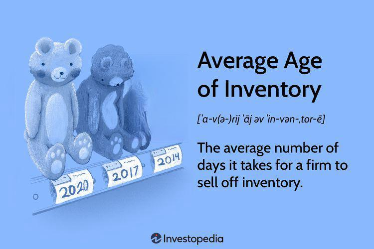

In the modern business landscape, efficient inventory management is crucial for both operational excellence and profit maximization. As companies strive to meet customer demands and maintain profitability, the management of inventory becomes an integral component of their operational strategy. Key metrics like inventory turnover and average age calculations serve as vital indicators of how effectively a business handles its inventory stock. Inventory turnover measures how frequently a company sells and replaces its inventory within a given timeframe, offering insights into sales performance and inventory efficiency.

Simultaneously, the average age of inventory or days' sales in inventory (DSI) gives businesses an understanding of how long products remain unsold, highlighting areas for improvement in inventory management and sales processes. By optimizing these metrics, companies can better align their inventory levels with customer demand and working capital requirements, thereby improving cash flow and operational effectiveness.



Moreover, the advent of algorithmic trading is revolutionizing the way businesses make data-driven decisions. This technological advancement extends into inventory-related strategies, as businesses leverage sophisticated algorithms to enhance decision-making processes. Algorithmic trading facilitates more accurate demand prediction and efficient inventory management by analyzing vast datasets to identify patterns and trends.

This article will explore how the interplay between efficient inventory management practices, inventory turnover, average age calculations, and algorithmic trading mechanisms can lead to business excellence and profitability. Understanding these concepts enables businesses to optimize their inventory strategies, improve cash flow management, and enhance overall efficiency in a competitive marketplace. By employing advanced metrics and leveraging technology, businesses can stay ahead of the curve, ensuring a robust inventory strategy that supports both growth and sustainability.

## Table of Contents

## Understanding Inventory Turnover

Inventory turnover is a crucial metric that quantifies the number of times a company sells and replenishes its inventory within a given period. Calculating inventory turnover can help businesses improve operational efficiency and financial performance. The calculation is typically expressed as: 

$$
\text{Inventory Turnover} = \frac{\text{Cost of Goods Sold (COGS)}}{\text{Average Inventory}}
$$

A higher inventory turnover rate signifies that a company is effectively managing its inventory, aligning production closely with sales demand. This generally results in reduced holding costs, minimized obsolescence, and improved cash flow. Businesses with high turnover rates can rapidly respond to market changes and consumer preferences, ensuring they have the right products available at the right time.

Conversely, a lower turnover rate may suggest potential issues such as overstocking or reduced demand for certain products. Excess inventory ties up capital in unsold goods and can lead to increased storage costs and potential losses from stock obsolescence or price reductions. Evaluating and understanding inventory turnover enables businesses to identify slow-moving products and adjust stocking levels and production schedules accordingly. By optimizing inventory turnover, businesses can enhance their ability to meet customer demands while maintaining cost-efficient operations.

## The Importance of Average Age of Inventory

The average age of inventory, also known as days' sales in inventory (DSI), is a crucial metric for assessing the efficiency of sales and inventory management within a company. This measurement indicates the average number of days a company requires to sell its inventory. Consequently, it serves as an indicator of how well a business is managing its stock relative to sales.

A lower average age of inventory generally signifies positive business performance, reflecting that products move quickly through the sales process. This rapid turnover can enhance cash flow, as funds are not tied up in unsold goods for prolonged periods. Efficient cash flow allows businesses to reinvest in operations, settle liabilities, or allocate capital towards growth opportunities, thereby maintaining an agile financial stance.

Conversely, a higher average age of inventory often highlights potential inefficiencies. It can indicate that a company is facing challenges such as overstocking, which may arise from inaccurate demand forecasting or slower-than-anticipated sales. Excess inventory not only ties up capital but may also lead to increased storage and holding costs, diminishing overall profitability. Items may become obsolete or depreciate in value, further impacting financial outcomes.

Assessing the average age of inventory helps businesses pinpoint issues within their inventory management strategies and guides them in making informed decisions to improve operational efficiency. By maintaining an optimal inventory age, companies can align stock levels more closely with actual sales patterns, enhance cash flow, and reduce the risks associated with unsold inventory.

## Calculating Average Age of Inventory

The average age of inventory is a key metric for assessing inventory management efficiency. It measures the average time a company’s inventory sits unsold and is typically expressed in days. This metric can be calculated using the formula:

$$
\text{Average Age of Inventory} = \left( \frac{\text{Average Inventory}}{\text{Cost of Goods Sold}} \right) \times 365
$$

In this formula, the average inventory represents the mean stock value over a period, while the cost of goods sold (COGS) refers to the direct costs attributable to the production of the goods sold by the company. By examining the average age of inventory, businesses can identify potential bottlenecks in their sales processes and improve cash flow management.

Consider the following example: A company maintains an average inventory of $250,000, and its COGS over the same period is $2,000,000. Applying the calculation:

$$
\text{Average Age of Inventory} = \left( \frac{250,000}{2,000,000} \right) \times 365
$$

This results in an average age of 45.625 days. This means, on average, the company's inventory remains unsold for approximately 46 days before it is either sold or replaced. This information is crucial for inventory management, allowing businesses to make informed decisions on purchasing and sales strategies to reduce excess stock and enhance [liquidity](/wiki/liquidity-risk-premium).

## Algorithmic Trading in Inventory Management

Algorithmic trading employs sophisticated algorithms to automate trading decisions, mainly based on prevailing data inputs. In the context of inventory management, similar principles can be applied to optimize the purchase and sale of products. By leveraging historical sales data, market conditions, and predictive analytics, businesses can better forecast demand, improve stocking levels, and ultimately enhance inventory efficiency.

The core advantage of employing algorithmic strategies in inventory management stems from their ability to process vast amounts of data swiftly, providing actionable insights that manual analyses may overlook. Algorithms can predict when demand is likely to increase or decrease, enabling businesses to adjust their inventory levels preemptively. This not only helps in minimizing excess inventory but also reduces the risk of stockouts, ensuring that the right products are available at the right time.

Consider the application of algorithms in predicting market trends. By analyzing historical sales data, algorithms can identify patterns and seasonal fluctuations which inform demand forecasting models. Here is an example of how such an algorithm might be implemented in Python:

```python
import pandas as pd
from sklearn.model_selection import train_test_split
from sklearn.ensemble import RandomForestRegressor
from sklearn.metrics import mean_squared_error

# Assume 'data' is a pandas DataFrame containing sales history with relevant features
data = pd.read_csv('sales_data.csv')

# Define features and target variable
features = data.drop('sales', axis=1)
target = data['sales']

# Split the data into training and test sets
X_train, X_test, y_train, y_test = train_test_split(features, target, test_size=0.2, random_state=42)

# Initialize and fit the Random Forest model
model = RandomForestRegressor(n_estimators=100, random_state=42)
model.fit(X_train, y_train)

# Predict and evaluate the model
predictions = model.predict(X_test)
print("Mean Squared Error:", mean_squared_error(y_test, predictions))
```

This code snippet demonstrates a basic framework for using a [machine learning](/wiki/machine-learning) model to predict sales, which could be integral in informing inventory decisions. A low mean squared error indicates that the model is accurately predicting sales trends, potentially leading to improved stocking strategies.

The use of [algorithmic trading](/wiki/algorithmic-trading) in inventory management translates to tangible business benefits. Businesses can achieve reduced holding costs by maintaining more accurate inventory levels, as unnecessary stock is minimized. Additionally, the improved prediction accuracy reduces the average age of inventory, enhancing overall cash flow and operational efficiency.

In summary, applying algorithmic trading principles to inventory management systems provides an advanced, data-driven approach that optimizes inventory practices, aligning stock levels closely with market demand and minimizing unnecessary expenditures.

## Strategies for Optimizing Inventory Age

Implementing Just-In-Time (JIT) inventory management is a pivotal strategy for reducing the average age of inventory. By receiving goods only as they are needed in the production process, companies can minimize stock levels and decrease storage costs. This method requires precise coordination with suppliers and demands accurate demand forecasts to avoid stockouts and maintain production flow. By reducing excess inventory, businesses can enhance their cash flow and decrease the time inventory sits unsold.

Technological advancements, particularly in [artificial intelligence](/wiki/ai-artificial-intelligence) (AI) and machine learning, significantly enhance demand forecasting capabilities. By analyzing historical sales data, market trends, and consumer behavior, AI algorithms can predict future product demand with high accuracy. This predictive capability allows businesses to adjust their inventory levels in real-time, aligning them closely with anticipated sales and thus reducing the average age of unsold inventory.

Regular inventory audits are essential in identifying slow-moving stock and making informed decisions to improve turnover rates. These audits involve reviewing inventory records and physical counts to ensure accuracy and identify discrepancies. By conducting audits, businesses can pinpoint obsolete or excess items and take steps, such as discounts or promotions, to move these products quickly. This not only helps in clearing stock but also provides actionable insights into purchasing and sales strategies.

Through the integration of JIT inventory systems, leveraging AI-driven demand forecasts, and maintaining rigorous audit routines, businesses can optimize their inventory age. Such strategies lead to improved operational efficiency, reduced holding costs, and enhanced overall profitability.

## Real-World Examples

Companies such as Zara and Toyota showcase exemplary inventory management techniques that effectively maintain low average ages of inventory, therefore increasing their sales efficiency and profitability. Zara, a leading name in the fast fashion industry, is renowned for its nimble and responsive inventory system. Zara's strategy revolves around rapid product turnover and limited production batches. By keeping inventory quantities low and frequently introducing new designs, Zara minimizes the risk of excess stock and obsolescence. This approach allows the company to quickly respond to fashion trends and customer demands, maintaining a high inventory turnover rate and ensuring products spend minimal time in storage.

Toyota, on the other hand, is a pioneer in implementing the Just-In-Time (JIT) inventory system. This methodology focuses on reducing waste by receiving goods only as they are needed in the production process. By doing so, Toyota minimizes the holding costs and the average age of inventory. Key to this strategy is the synchronization of production schedules with demand forecasts, ensuring that every component of a vehicle is available precisely when it is required. This not only reduces excess inventory but also ensures a seamless production process. Both Zara and Toyota use data-driven insights to refine their inventory management strategies, underscoring the importance of precise forecasting and real-time adjustments in maintaining efficient and profitable operations.

## Conclusion

Effectively managing inventory with an understanding of turnover rates and average age calculations is critical in today's competitive business environment. These metrics provide vital insights into a company's operational efficiency, guiding decision-makers in adjusting stock levels and optimizing sales processes. By leveraging such information, businesses can ensure that their inventory is aligned with actual market demand, reducing excess stock and minimizing holding costs.

In addition to these traditional approaches, algorithmic trading offers advanced tools for enhancing inventory strategies. By utilizing algorithms to predict market conditions and demand, businesses can automate their procuring and selling decisions, leading to more precise inventory control. This data-driven approach allows companies to capitalize on new insights, reducing the average age of inventory and improving liquidity.

Adopting proven strategies such as Just-In-Time (JIT) inventory management, AI-driven demand forecasting, and regular inventory audits can further optimize inventory processes. These practices enable businesses to enhance cash flow, ensuring stocks are replenished in alignment with sales, thus preventing overstock and stockouts. With such an optimized inventory management strategy, companies are better positioned for market success, achieving higher profitability and a competitive edge.

## References & Further Reading

[1]: ["Lean Thinking: Banish Waste and Create Wealth in Your Corporation"](https://www.researchgate.net/publication/200657172_Lean_Thinking_Banish_Waste_and_Create_Wealth_in_Your_Corporation) by James P. Womack and Daniel T. Jones

[2]: ["Operations Management: Processes and Supply Chains"](https://www.amazon.com/Operations-Management-Processes-Supply-Chains/dp/0134741064) by Lee J. Krajewski, Manoj K. Malhotra, and Larry P. Ritzman

[3]: ["Supply Chain Management: Strategy, Planning, and Operation"](https://www.pearson.com/en-us/subject-catalog/p/supply-chain-management-strategy-planning-and-operation/P200000005863/9780137502844) by Sunil Chopra and Peter Meindl

[4]: ["Advances in Financial Machine Learning"](https://www.amazon.com/Advances-Financial-Machine-Learning-Marcos/dp/1119482089) by Marcos Lopez de Prado

[5]: ["Inventory Management and Production Planning and Scheduling"](https://archive.org/details/inventorymanagem00silv) by Edward A. Silver, David F. Pyke, and Rein Peterson