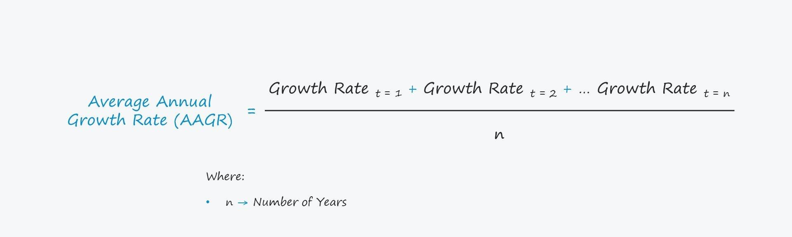

## Table of Contents

## What is the Average Annual Growth Rate (AAGR)?

The Average Annual Growth Rate (AAGR) is a way to measure how much something grows each year over a certain period of time. It's often used to understand how businesses, investments, or even populations are growing. To find the AAGR, you take the total growth over the entire period and divide it by the number of years. This gives you an average yearly growth rate, which can help you see the growth trend more clearly.

For example, if a company's revenue was $100,000 at the start of a 5-year period and grew to $150,000 by the end, you could calculate the AAGR to see the average yearly growth. This simple measure helps people make decisions about future investments or planning. It's important to remember that AAGR gives an average, so some years might have higher or lower growth, but it smooths these out to give a general idea of growth over time.

## How is AAGR different from CAGR (Compound Annual Growth Rate)?

AAGR and CAGR are both ways to measure how something grows over time, but they do it differently. AAGR, or Average Annual Growth Rate, looks at the total growth over a period and divides it by the number of years. It's like taking the total increase and spreading it evenly across each year. This method is simple and gives you a straightforward average of how much growth happened each year. It's useful when you want a quick, easy-to-understand picture of growth.

On the other hand, CAGR, or Compound Annual Growth Rate, takes into account the effect of compounding. This means it considers that growth in one year can lead to more growth in the next year, and so on. To calculate CAGR, you use a formula that looks at the starting value, the ending value, and the number of years, and it gives you a rate that shows the steady growth needed each year to get from the start to the end. This method is more complex but can be more accurate for things like investments where growth builds on itself over time.

In simple terms, AAGR gives you a basic average of yearly growth, while CAGR gives you a more precise rate that accounts for the compounding effect. If you're looking at something like a business's revenue or a population's growth, AAGR might be easier to use and understand. But if you're dealing with investments or anything where growth compounds, CAGR will give you a better picture of what's really happening.

## Why is AAGR important in financial analysis?

AAGR is important in financial analysis because it helps people understand how much something grows each year on average. When you're looking at a company's revenue, for example, AAGR can show you if the business is getting bigger over time. It's a simple way to see if things are going well without getting into too much detail. If you're thinking about investing in a company, knowing its AAGR can help you decide if it's growing fast enough for your goals.

Also, AAGR is easy to calculate and understand. You don't need a fancy formula or a calculator that does special math. You just take the total growth over a few years and divide it by how many years you looked at. This makes it a good tool for anyone, even if they're not experts in finance. It's like a quick check to see if something is growing steadily, which can be really helpful when you're making plans or decisions about money.

## What is the formula to calculate AAGR?

To calculate the Average Annual Growth Rate (AAGR), you start by finding the total growth over the period you're looking at. This means you take the ending value and subtract the starting value. Once you have the total growth, you divide it by the number of years in the period. This gives you the average amount of growth each year. The formula is: AAGR = (Ending Value - Starting Value) / Number of Years.

For example, if a business started with $100,000 and grew to $150,000 over 5 years, you would first find the total growth: $150,000 - $100,000 = $50,000. Then, you divide that by the number of years: $50,000 / 5 = $10,000. So, the AAGR would be $10,000 per year. This simple calculation helps you see the average yearly growth without getting into complicated math.

## Can you provide a simple example of how to calculate AAGR?

Let's say you want to know how much a small bakery's sales grew over three years. At the start, the bakery made $50,000 in a year. By the end of the third year, their sales had grown to $70,000. To find the Average Annual Growth Rate (AAGR), you first figure out the total growth. You do this by subtracting the starting sales from the ending sales: $70,000 - $50,000 = $20,000.

Next, you divide that total growth by the number of years, which is three in this case. So, you take $20,000 and divide it by 3: $20,000 / 3 = about $6,667. This means the bakery's sales grew by an average of $6,667 each year over those three years. It's a simple way to see how much the bakery grew on average every year.

## What types of data are required to compute AAGR?

To calculate the Average Annual Growth Rate (AAGR), you need just two main pieces of data: the starting value and the ending value of whatever you're measuring. The starting value is what you had at the beginning of the period you're looking at. The ending value is what you have at the end of that period. For example, if you're looking at a company's revenue, the starting value would be the revenue at the start of the time period, and the ending value would be the revenue at the end.

You also need to know how many years are in the period you're studying. This is important because you'll divide the total growth by the number of years to find the average growth each year. So, if you're looking at a business's growth over five years, you'll need to know the revenue at the start and end of those five years, and then you can figure out the AAGR.

## How can AAGR be used to compare the performance of different investments?

AAGR can help you compare how different investments are doing over time. Let's say you have money in two different places, like a savings account and a stock. You can use AAGR to see which one is growing more each year on average. If the savings account started with $1,000 and grew to $1,100 over two years, the AAGR would be $50 per year. If the stock started at $1,000 and grew to $1,200 over the same time, the AAGR would be $100 per year. This shows that, on average, the stock grew more each year than the savings account.

Using AAGR to compare investments can help you decide where to put your money. It's a simple way to see which investment is doing better without getting into complicated math. But remember, AAGR is just an average, so some years might be better or worse. Still, it gives you a good idea of how each investment is growing over time, helping you make smarter choices about where to invest your money.

## What are the limitations of using AAGR for long-term growth analysis?

AAGR is a simple way to look at how something grows each year on average, but it has some limits when you use it for a long time. One big problem is that it doesn't show how growth can change from year to year. If a company has a really good year followed by a few bad ones, the AAGR might make it look like the growth was steady, but it wasn't. This can be misleading if you're trying to understand what's really going on over many years.

Another issue with AAGR is that it doesn't take into account the effect of compounding. When things grow, they can build on themselves, like how interest in a savings account can earn more interest over time. AAGR just looks at the total growth and divides it by the number of years, so it misses this important part of how growth works over the long term. If you're looking at investments or anything where growth can compound, AAGR might not give you the full picture of how well things are doing.

## How does the choice of time period affect the AAGR calculation?

The time period you choose to calculate the Average Annual Growth Rate (AAGR) can make a big difference in what you see. If you pick a short time, like just one or two years, the AAGR might show a lot of growth or not much at all, depending on what happened in those years. For example, if a business had a really good year, the AAGR over a short time might make it look like it's growing fast all the time. But if you look at a longer time, like five or ten years, the AAGR will smooth out those ups and downs, giving you a better idea of the average growth over time.

On the other hand, if you choose a longer time period, the AAGR might hide big changes that happened along the way. Let's say a company had a few years of slow growth followed by a few years of fast growth. The AAGR over the whole time might make it look like the growth was steady, but it wasn't. So, when you're using AAGR, it's important to think about how the time period you choose can change what the numbers tell you. It's like looking at a picture from far away versus up close; you see different things depending on your view.

## In what scenarios might AAGR be more appropriate than CAGR?

AAGR might be more appropriate than CAGR when you want a simple and quick way to understand how something grows each year on average. If you're looking at a business's revenue or a population's growth, AAGR is easy to calculate and understand. You just take the total growth over a few years and divide it by how many years you looked at. This makes it a good tool for anyone, even if they're not experts in finance. It's like a quick check to see if something is growing steadily, which can be really helpful when you're making plans or decisions about money.

Another scenario where AAGR might be better is when you're dealing with data that doesn't have a lot of ups and downs. If the growth is pretty steady from year to year, AAGR will give you a good picture of what's happening. It's also useful when you want to compare different things, like the growth of different businesses or investments, without getting into the details of how growth compounds over time. AAGR gives you a straightforward average that's easy to compare, making it a handy tool for simple growth analysis.

## How can AAGR be applied in different industries like real estate or technology?

In the real estate industry, AAGR can help people understand how property values are growing over time. If you own a house and want to know how much its value has gone up each year on average, you can use AAGR. Let's say you bought a house for $200,000 and five years later it's worth $250,000. By calculating the AAGR, you find out that the house's value grew by an average of $10,000 each year. This can help you decide if it's a good time to sell or if you should keep holding onto the property. Real estate investors also use AAGR to compare how different properties are doing, helping them choose where to invest their money.

In the technology industry, AAGR can show how fast a company's sales or user base is growing. For example, if a tech startup had 10,000 users at the start of the year and grew to 15,000 users by the end of the year, the AAGR would tell you that the user base grew by an average of 2,500 users each year. This is important for tech companies because they often need to show investors that they're growing quickly. AAGR helps them do that in a simple way. It also helps tech companies plan for the future, like deciding how much to spend on marketing or new product development based on how fast they're growing.

## What advanced techniques can be used to adjust AAGR for inflation or other economic factors?

To adjust AAGR for inflation, you can use what's called real growth rate. This means you take the AAGR you calculated and then subtract the average inflation rate over the same time period. For example, if your AAGR was 5% and the average inflation rate was 2%, the real growth rate would be 3%. This gives you a better idea of how much something grew in terms of actual buying power, not just numbers on paper. It's like looking at how much more you can buy with the money you made, not just how much more money you have.

Another way to adjust AAGR is by considering other economic factors like interest rates or changes in the market. You can do this by using what's called a regression analysis. This is a bit more complicated, but it helps you see how different things affect growth. For example, if interest rates went up and that slowed down your business's growth, you could use regression analysis to figure out how much of the change in AAGR was because of the interest rates. This helps you understand what's really driving the growth or slowdown in your business, so you can make better plans for the future.

## What is AAGR and what is its role in finance?

The Average Annual Growth Rate (AAGR) serves as a fundamental metric in financial analysis, providing a straightforward calculation of how investments have performed annually on average. This metric is calculated by taking the arithmetic mean of a series of annual growth rates over a specified period. The formula for AAGR is expressed as:

$$
\text{AAGR} = \frac{(R_1 + R_2 + \ldots + R_n)}{n}
$$

where $R_1, R_2, \ldots, R_n$ represent the annual growth rates for each year and $n$ is the total number of years. The simplicity of AAGR makes it an attractive choice for quick insights into investment performance, especially when compounding effects are negligible.

AAGR's primary application is in environments with relatively stable growth patterns. Since it calculates the average annual growth without considering the effects of compounding, AAGR may be less effective in markets or investments with significant variations in annual returns or those where compounding significantly alters growth trajectories over time. However, in stable investment environments where changes in annual growth are minor, AAGR can be instrumental in discerning broader growth patterns.

An example of AAGR in practice could involve an investment with annual returns of 5%, 6%, and 7% over three consecutive years. Here, the AAGR would be calculated as:

$$
\text{AAGR} = \frac{(5\% + 6\% + 7\%)}{3} = 6\%
$$

While AAGR provides a clear and concise measure of average growth, it is essential to recognize its limitations. Particularly, it does not adjust for [volatility](/wiki/volatility-trading-strategies) or the time value of money, which might be significant factors in more dynamic or less predictable markets. This positions AAGR as a reliable tool for evaluating performance in stable settings but also underscores the importance of considering additional metrics, such as Compound Annual Growth Rate (CAGR), for a more comprehensive analysis in varying market conditions.

## What is Understanding Algorithmic Trading?

Algorithmic trading, often referred to as algo trading, involves the use of computer algorithms to automate the process of executing trades. These algorithms are predefined sets of rules or instructions based on specific criteria such as timing, price, [volume](/wiki/volume-trading-strategy), or complex mathematical models. The primary objective of algo trading is to increase efficiency and improve the speed at which trades are made by minimizing human intervention and emotional involvement.

One of the key characteristics of [algorithmic trading](/wiki/algorithmic-trading) is its capacity to handle high-frequency and data-driven scenarios, making the trading process much faster and more efficient compared to traditional manual trading. This type of trading is particularly suited to dealing with large volumes of data and can execute multiple trades simultaneously, thereby optimizing the execution strategy and reducing transaction costs.

In this data-intensive environment, growth rate metrics, particularly the Compound Annual Growth Rate (CAGR), are often prioritized. CAGR offers a more nuanced understanding of growth over time by accounting for the compounding effect, which is crucial for evaluating the performance of trading strategies that might involve reinvestment over multiple periods. Unlike the Average Annual Growth Rate (AAGR), which simply provides an arithmetic mean of past growth rates without considering compounding, CAGR provides a geometric mean, allowing a more accurate picture of investment performance over time.

The focus on CAGR in algo trading is driven by its ability to convey a constant return rate over a specified period, a metric that aligns well with the objectives of algorithm-based strategies that seek to optimize growth capital over time. The formula for calculating CAGR is given by:

$$
\text{CAGR} = \left( \frac{\text{Ending Value}}{\text{Beginning Value}} \right)^{\frac{1}{n}} - 1
$$

where $n$ is the number of years.

For practical implementation, Python can be utilized effectively to compute CAGR. Here's a simple example:

```python
def calculate_cagr(beginning_value, ending_value, years):
    return (ending_value / beginning_value) ** (1 / years) - 1

# Example usage
beginning_value = 1000
ending_value = 2000
years = 3
cagr = calculate_cagr(beginning_value, ending_value, years)
print(f"CAGR: {cagr:.2%}")
```

In summary, the deployment of algorithmic trading systems leverages sophisticated quantitative models to optimize trading performance. Metrics like CAGR become invaluable in this context, offering insights into the compounded growth which are essential for aligning trading strategies with long-term financial goals.

## What is the difference between AAGR and CAGR in algo trading?

In algorithmic trading, the choice between Average Annual Growth Rate (AAGR) and Compound Annual Growth Rate (CAGR) can significantly impact the assessment and development of trading strategies. AAGR, by definition, is a simple arithmetic mean of annual returns over a designated period. Its straightforward calculation makes it an accessible tool, but it lacks the ability to reflect the effects of compounding. This can be a crucial drawback in scenarios with fluctuating annual returns, as it may misrepresent the actual performance.

In contrast, CAGR offers an advantage over AAGR by incorporating the principle of compounding. It provides a smoothed annual growth rate that reflects the consistent rate at which an investment needs to grow annually to reach a specific end value, considering the effects of compounding. The formula for calculating CAGR is:

$$
\text{CAGR} = \left( \frac{\text{Ending Value}}{\text{Beginning Value}} \right)^{\frac{1}{n}} - 1
$$

where $n$ is the number of years. This formula reduces the noise caused by annual fluctuations, offering a clearer picture of true investment growth.

In algorithmic trading, CAGR's ability to account for compounded returns makes it more suitable for evaluating strategies that involve reinvestment of gains. This is particularly important in trading strategies where volatility is a significant [factor](/wiki/factor-investing), and returns are not consistent across time periods. Unlike AAGR, CAGR considers these variations, allowing traders to effectively assess performance and risk-adjusted returns over time.

Therefore, while AAGR can provide a quick insight into average performance, its potential to mislead due to overlooking compounding and volatility is a critical limitation. Algorithmic traders favor CAGR for its precision in reflecting compounded growth, ultimately enabling more reliable strategy analysis and optimization in volatile and dynamic financial markets.

## How do you calculate AAGR and CAGR?

The Average Annual Growth Rate (AAGR) and the Compound Annual Growth Rate (CAGR) are two common metrics used to evaluate the performance of an investment over time. Each serves a unique purpose, with their calculations providing insights into different aspects of investment growth.

### Calculating AAGR

AAGR is a straightforward calculation representing the arithmetic mean of annual growth rates over a specified period. It is calculated by adding together the individual annual growth rates and then dividing by the number of years. The formula is expressed as:

$$
\text{AAGR} = \frac{\sum \text{Growth Rate}_i}{n}
$$

where $\text{Growth Rate}_i$ represents the growth rate for each year, and $n$ is the total number of years.

**Example:**

Consider an investment with annual end values over four years: $1000, $1100, $1210, and $1331. The growth rates for each year are as follows:

- Year 1: $\frac{1100 - 1000}{1000} = 0.10$ or 10%
- Year 2: $\frac{1210 - 1100}{1100} = 0.10$ or 10%
- Year 3: $\frac{1331 - 1210}{1210} = 0.10$ or 10%

Thus, the AAGR is:

$$
\text{AAGR} = \frac{10\% + 10\% + 10\%}{3} = 10\%
$$

As seen, AAGR offers a simple average but does not account for the compounding effect that occurs over multiple periods.

### Calculating CAGR

CAGR provides a smoothed annual return rate by incorporating the impact of compounding. It is an indication of the geometric progression ratio that presents a constant rate of return over the time period. The formula for CAGR is:

$$
\text{CAGR} = \left( \frac{\text{End Value}}{\text{Starting Value}} \right)^{\frac{1}{n}} - 1
$$

where $\text{End Value}$ is the final value, $\text{Starting Value}$ is the initial value, and $n$ is the number of years.

**Example:**

Using the same investment example, with starting value $1000 and end value $1331 over three years, the CAGR is calculated as:

$$
\text{CAGR} = \left( \frac{1331}{1000} \right)^{\frac{1}{3}} - 1
$$
$$
\text{CAGR} = (1.331)^{0.333} - 1 \approx 0.10 \text{ or } 10\%
$$

The CAGR over the same period matches the constant growth rate computed as AAGR because the returns were consistent. However, the power of CAGR truly shines when handling fluctuating annual returns, as it smooths volatility and provides a clearer picture of growth. 

In automated or algorithmic trading environments, CAGR’s consideration of compounding makes it a valuable metric for evaluating long-term strategy performance, unlike AAGR which might misrepresent fluctuating returns. For example, in Python, calculating CAGR can be coded as follows:

```python
def calculate_cagr(start_value, end_value, years):
    return (end_value / start_value) ** (1/years) - 1

start_value = 1000
end_value = 1331
years = 3

cagr = calculate_cagr(start_value, end_value, years)
print(f"CAGR: {cagr:.2%}")
```

This code snippet efficiently models how CAGR considers compounding, thereby showcasing longer-term insights over the simpler calculation of AAGR.

## What are the real-world applications and limitations?

Average Annual Growth Rate (AAGR) serves as a simple tool for evaluating investment performance over consecutive years, yet its limitations are notable, particularly in volatile environments. AAGR calculates the arithmetic mean of annual growth rates, overlooking the effects of compounding and annual fluctuations. This lack of sensitivity to variations means AAGR may not accurately reflect the risk associated with an investment. In volatile markets, where returns can significantly fluctuate, relying solely on AAGR could mislead investors due to its inability to incorporate the nuances of varying annual returns.

In contrast, the Compound Annual Growth Rate (CAGR) provides a more comprehensive view by accounting for the effects of compounding. The formula for CAGR is:

$$
\text{CAGR} = \left( \frac{\text{Ending Value}}{\text{Beginning Value}} \right)^{\frac{1}{n}} - 1
$$

where $n$ is the number of years. By considering the cumulative impact of year-over-year growth, CAGR delivers a smoothed average, making it particularly effective for assessing performance in algorithmic trading. This compounding aspect is crucial in algorithmic strategies, where nuanced analysis of growth and potential volatility is necessary for precise decision-making.

Both metrics, AAGR and CAGR, possess inherent practical applications, yet neither should be used in isolation. AAGR might serve as a preliminary indicator of performance, but to gain a fuller understanding of an investment's trajectory, incorporating CAGR is advised. For instance, comparing AAGR and CAGR can help identify discrepancies in perceived versus real growth. Additionally, integrating other financial indicators—such as standard deviation to assess volatility or risk-adjusted performance measures like the Sharpe Ratio—provides a more holistic evaluation. This comprehensive approach allows for informed strategy development and risk management, essential in today’s fast-paced trading environments.

## What is the conclusion?

Understanding and selecting the right growth metric is central to evaluating and optimizing trading strategies in financial markets. The Average Annual Growth Rate (AAGR) provides a foundational overview of growth trends, making it a useful tool for quickly assessing average performance over time. AAGR's calculation is straightforward, involving the arithmetic mean of annual growth rates, which makes it accessible. However, its simplicity limits its application in situations where annual returns experience significant volatility, as AAGR does not account for compounding effects.

In contrast, the Compound Annual Growth Rate (CAGR) serves as a more sophisticated tool that is highly beneficial for in-depth financial analysis, particularly in algorithmic trading. By considering the compounding effect over multiple periods, CAGR delivers a smoothed rate of return. This metric, thus, offers a more accurate reflection of an investment’s growth trajectory, effectively neutralizing the impacts of interim volatility. The calculation of CAGR is given by the formula:

$$
\text{CAGR} = \left( \frac{\text{Ending Value}}{\text{Beginning Value}} \right)^{\frac{1}{n}} - 1
$$

where $n$ represents the number of years. This precise measurement allows traders to better gauge the efficiency of their strategies and make informed adjustments aligned with long-term objectives.

Traders must apply these growth metrics thoughtfully, ensuring they are in alignment with their strategic objectives and the prevailing market conditions. While AAGR offers a quick snapshot of average growth, the nuanced insights provided by CAGR make it indispensable for comprehensive strategy evaluation and optimization in high-frequency trading environments. The choice between these metrics should be guided by the specific requirements of the trading strategy and the nature of the market in which it is deployed.

## References & Further Reading

[1]: Bergstra, J., Bardenet, R., Bengio, Y., & Kégl, B. (2011). ["Algorithms for Hyper-Parameter Optimization."](https://dl.acm.org/doi/10.5555/2986459.2986743) Advances in Neural Information Processing Systems 24.

[2]: ["Advances in Financial Machine Learning"](https://www.amazon.com/Advances-Financial-Machine-Learning-Marcos/dp/1119482089) by Marcos Lopez de Prado

[3]: ["Evidence-Based Technical Analysis: Applying the Scientific Method and Statistical Inference to Trading Signals"](https://www.semanticscholar.org/paper/Evidence-Based-Technical-Analysis%3A-Applying-the-and-Aronson/3b33df8737f1772e9e14d66a08c9696f140a2ee1) by David Aronson

[4]: ["Machine Learning for Algorithmic Trading"](https://github.com/PacktPublishing/Machine-Learning-for-Algorithmic-Trading-Second-Edition) by Stefan Jansen

[5]: ["Quantitative Trading: How to Build Your Own Algorithmic Trading Business"](https://books.google.com/books/about/Quantitative_Trading.html?id=j70yEAAAQBAJ) by Ernest P. Chan