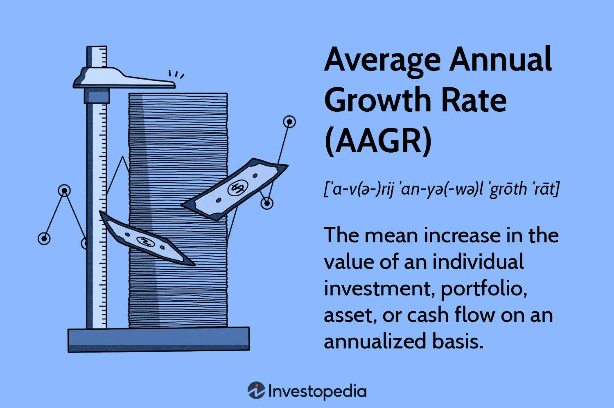

Understanding growth rates is essential in financial and investment decision-making, especially in automated and algorithmic trading. These growth rates help investors and traders evaluate the performance of investments and devise effective trading strategies. Among these metrics, the Average Annual Growth Rate (AAGR) is fundamental, offering a straightforward method to comprehend growth trends over time. AAGR is calculated as the arithmetic mean of a series of annual growth rates, providing a clear picture of how investments grow annually. However, it does not account for compounding effects, which can significantly impact the total returns of an investment.

Algorithmic trading, characterized by the use of automated systems and algorithms to execute trades, often requires more in-depth analysis than AAGR offers. In this context, the Compound Annual Growth Rate (CAGR) becomes particularly useful. Unlike AAGR, CAGR considers the compounding effect, providing a more nuanced view of how investments grow over multiple periods. This makes CAGR a favored metric in algorithmic trading for its ability to smooth out volatility and present a more accurate representation of an investment's performance over time. 



This article examines the significance of AAGR and CAGR in algorithmic trading and how their calculations and applications can influence trading strategies. By understanding these growth rates, traders can make informed decisions, optimize their trading algorithms, and better anticipate market movements.

## Table of Contents

## What is AAGR and Its Role in Finance

The Average Annual Growth Rate (AAGR) serves as a fundamental metric in financial analysis, providing a straightforward calculation of how investments have performed annually on average. This metric is calculated by taking the arithmetic mean of a series of annual growth rates over a specified period. The formula for AAGR is expressed as:

$$
\text{AAGR} = \frac{(R_1 + R_2 + \ldots + R_n)}{n}
$$

where $R_1, R_2, \ldots, R_n$ represent the annual growth rates for each year and $n$ is the total number of years. The simplicity of AAGR makes it an attractive choice for quick insights into investment performance, especially when compounding effects are negligible.

AAGR's primary application is in environments with relatively stable growth patterns. Since it calculates the average annual growth without considering the effects of compounding, AAGR may be less effective in markets or investments with significant variations in annual returns or those where compounding significantly alters growth trajectories over time. However, in stable investment environments where changes in annual growth are minor, AAGR can be instrumental in discerning broader growth patterns.

An example of AAGR in practice could involve an investment with annual returns of 5%, 6%, and 7% over three consecutive years. Here, the AAGR would be calculated as:

$$
\text{AAGR} = \frac{(5\% + 6\% + 7\%)}{3} = 6\%
$$

While AAGR provides a clear and concise measure of average growth, it is essential to recognize its limitations. Particularly, it does not adjust for [volatility](/wiki/volatility-trading-strategies) or the time value of money, which might be significant factors in more dynamic or less predictable markets. This positions AAGR as a reliable tool for evaluating performance in stable settings but also underscores the importance of considering additional metrics, such as Compound Annual Growth Rate (CAGR), for a more comprehensive analysis in varying market conditions.

## Understanding Algorithmic Trading

Algorithmic trading, often referred to as algo trading, involves the use of computer algorithms to automate the process of executing trades. These algorithms are predefined sets of rules or instructions based on specific criteria such as timing, price, [volume](/wiki/volume-trading-strategy), or complex mathematical models. The primary objective of algo trading is to increase efficiency and improve the speed at which trades are made by minimizing human intervention and emotional involvement.

One of the key characteristics of [algorithmic trading](/wiki/algorithmic-trading) is its capacity to handle high-frequency and data-driven scenarios, making the trading process much faster and more efficient compared to traditional manual trading. This type of trading is particularly suited to dealing with large volumes of data and can execute multiple trades simultaneously, thereby optimizing the execution strategy and reducing transaction costs.

In this data-intensive environment, growth rate metrics, particularly the Compound Annual Growth Rate (CAGR), are often prioritized. CAGR offers a more nuanced understanding of growth over time by accounting for the compounding effect, which is crucial for evaluating the performance of trading strategies that might involve reinvestment over multiple periods. Unlike the Average Annual Growth Rate (AAGR), which simply provides an arithmetic mean of past growth rates without considering compounding, CAGR provides a geometric mean, allowing a more accurate picture of investment performance over time.

The focus on CAGR in algo trading is driven by its ability to convey a constant return rate over a specified period, a metric that aligns well with the objectives of algorithm-based strategies that seek to optimize growth capital over time. The formula for calculating CAGR is given by:

$$
\text{CAGR} = \left( \frac{\text{Ending Value}}{\text{Beginning Value}} \right)^{\frac{1}{n}} - 1
$$

where $n$ is the number of years.

For practical implementation, Python can be utilized effectively to compute CAGR. Here's a simple example:

```python
def calculate_cagr(beginning_value, ending_value, years):
    return (ending_value / beginning_value) ** (1 / years) - 1

# Example usage
beginning_value = 1000
ending_value = 2000
years = 3
cagr = calculate_cagr(beginning_value, ending_value, years)
print(f"CAGR: {cagr:.2%}")
```

In summary, the deployment of algorithmic trading systems leverages sophisticated quantitative models to optimize trading performance. Metrics like CAGR become invaluable in this context, offering insights into the compounded growth which are essential for aligning trading strategies with long-term financial goals.

## AAGR vs. CAGR in Algo Trading

In algorithmic trading, the choice between Average Annual Growth Rate (AAGR) and Compound Annual Growth Rate (CAGR) can significantly impact the assessment and development of trading strategies. AAGR, by definition, is a simple arithmetic mean of annual returns over a designated period. Its straightforward calculation makes it an accessible tool, but it lacks the ability to reflect the effects of compounding. This can be a crucial drawback in scenarios with fluctuating annual returns, as it may misrepresent the actual performance.

In contrast, CAGR offers an advantage over AAGR by incorporating the principle of compounding. It provides a smoothed annual growth rate that reflects the consistent rate at which an investment needs to grow annually to reach a specific end value, considering the effects of compounding. The formula for calculating CAGR is:

$$
\text{CAGR} = \left( \frac{\text{Ending Value}}{\text{Beginning Value}} \right)^{\frac{1}{n}} - 1
$$

where $n$ is the number of years. This formula reduces the noise caused by annual fluctuations, offering a clearer picture of true investment growth.

In algorithmic trading, CAGR's ability to account for compounded returns makes it more suitable for evaluating strategies that involve reinvestment of gains. This is particularly important in trading strategies where volatility is a significant [factor](/wiki/factor-investing), and returns are not consistent across time periods. Unlike AAGR, CAGR considers these variations, allowing traders to effectively assess performance and risk-adjusted returns over time.

Therefore, while AAGR can provide a quick insight into average performance, its potential to mislead due to overlooking compounding and volatility is a critical limitation. Algorithmic traders favor CAGR for its precision in reflecting compounded growth, ultimately enabling more reliable strategy analysis and optimization in volatile and dynamic financial markets.

## Calculating AAGR and CAGR

The Average Annual Growth Rate (AAGR) and the Compound Annual Growth Rate (CAGR) are two common metrics used to evaluate the performance of an investment over time. Each serves a unique purpose, with their calculations providing insights into different aspects of investment growth.

### Calculating AAGR

AAGR is a straightforward calculation representing the arithmetic mean of annual growth rates over a specified period. It is calculated by adding together the individual annual growth rates and then dividing by the number of years. The formula is expressed as:

$$
\text{AAGR} = \frac{\sum \text{Growth Rate}_i}{n}
$$

where $\text{Growth Rate}_i$ represents the growth rate for each year, and $n$ is the total number of years.

**Example:**

Consider an investment with annual end values over four years: $1000, $1100, $1210, and $1331. The growth rates for each year are as follows:

- Year 1: $\frac{1100 - 1000}{1000} = 0.10$ or 10%
- Year 2: $\frac{1210 - 1100}{1100} = 0.10$ or 10%
- Year 3: $\frac{1331 - 1210}{1210} = 0.10$ or 10%

Thus, the AAGR is:

$$
\text{AAGR} = \frac{10\% + 10\% + 10\%}{3} = 10\%
$$

As seen, AAGR offers a simple average but does not account for the compounding effect that occurs over multiple periods.

### Calculating CAGR

CAGR provides a smoothed annual return rate by incorporating the impact of compounding. It is an indication of the geometric progression ratio that presents a constant rate of return over the time period. The formula for CAGR is:

$$
\text{CAGR} = \left( \frac{\text{End Value}}{\text{Starting Value}} \right)^{\frac{1}{n}} - 1
$$

where $\text{End Value}$ is the final value, $\text{Starting Value}$ is the initial value, and $n$ is the number of years.

**Example:**

Using the same investment example, with starting value $1000 and end value $1331 over three years, the CAGR is calculated as:

$$
\text{CAGR} = \left( \frac{1331}{1000} \right)^{\frac{1}{3}} - 1
$$
$$
\text{CAGR} = (1.331)^{0.333} - 1 \approx 0.10 \text{ or } 10\%
$$

The CAGR over the same period matches the constant growth rate computed as AAGR because the returns were consistent. However, the power of CAGR truly shines when handling fluctuating annual returns, as it smooths volatility and provides a clearer picture of growth. 

In automated or algorithmic trading environments, CAGR’s consideration of compounding makes it a valuable metric for evaluating long-term strategy performance, unlike AAGR which might misrepresent fluctuating returns. For example, in Python, calculating CAGR can be coded as follows:

```python
def calculate_cagr(start_value, end_value, years):
    return (end_value / start_value) ** (1/years) - 1

start_value = 1000
end_value = 1331
years = 3

cagr = calculate_cagr(start_value, end_value, years)
print(f"CAGR: {cagr:.2%}")
```

This code snippet efficiently models how CAGR considers compounding, thereby showcasing longer-term insights over the simpler calculation of AAGR.

## Real-World Applications and Limitations

Average Annual Growth Rate (AAGR) serves as a simple tool for evaluating investment performance over consecutive years, yet its limitations are notable, particularly in volatile environments. AAGR calculates the arithmetic mean of annual growth rates, overlooking the effects of compounding and annual fluctuations. This lack of sensitivity to variations means AAGR may not accurately reflect the risk associated with an investment. In volatile markets, where returns can significantly fluctuate, relying solely on AAGR could mislead investors due to its inability to incorporate the nuances of varying annual returns.

In contrast, the Compound Annual Growth Rate (CAGR) provides a more comprehensive view by accounting for the effects of compounding. The formula for CAGR is:

$$
\text{CAGR} = \left( \frac{\text{Ending Value}}{\text{Beginning Value}} \right)^{\frac{1}{n}} - 1
$$

where $n$ is the number of years. By considering the cumulative impact of year-over-year growth, CAGR delivers a smoothed average, making it particularly effective for assessing performance in algorithmic trading. This compounding aspect is crucial in algorithmic strategies, where nuanced analysis of growth and potential volatility is necessary for precise decision-making.

Both metrics, AAGR and CAGR, possess inherent practical applications, yet neither should be used in isolation. AAGR might serve as a preliminary indicator of performance, but to gain a fuller understanding of an investment's trajectory, incorporating CAGR is advised. For instance, comparing AAGR and CAGR can help identify discrepancies in perceived versus real growth. Additionally, integrating other financial indicators—such as standard deviation to assess volatility or risk-adjusted performance measures like the Sharpe Ratio—provides a more holistic evaluation. This comprehensive approach allows for informed strategy development and risk management, essential in today’s fast-paced trading environments.

## Conclusion

Understanding and selecting the right growth metric is central to evaluating and optimizing trading strategies in financial markets. The Average Annual Growth Rate (AAGR) provides a foundational overview of growth trends, making it a useful tool for quickly assessing average performance over time. AAGR's calculation is straightforward, involving the arithmetic mean of annual growth rates, which makes it accessible. However, its simplicity limits its application in situations where annual returns experience significant volatility, as AAGR does not account for compounding effects.

In contrast, the Compound Annual Growth Rate (CAGR) serves as a more sophisticated tool that is highly beneficial for in-depth financial analysis, particularly in algorithmic trading. By considering the compounding effect over multiple periods, CAGR delivers a smoothed rate of return. This metric, thus, offers a more accurate reflection of an investment’s growth trajectory, effectively neutralizing the impacts of interim volatility. The calculation of CAGR is given by the formula:

$$
\text{CAGR} = \left( \frac{\text{Ending Value}}{\text{Beginning Value}} \right)^{\frac{1}{n}} - 1
$$

where $n$ represents the number of years. This precise measurement allows traders to better gauge the efficiency of their strategies and make informed adjustments aligned with long-term objectives.

Traders must apply these growth metrics thoughtfully, ensuring they are in alignment with their strategic objectives and the prevailing market conditions. While AAGR offers a quick snapshot of average growth, the nuanced insights provided by CAGR make it indispensable for comprehensive strategy evaluation and optimization in high-frequency trading environments. The choice between these metrics should be guided by the specific requirements of the trading strategy and the nature of the market in which it is deployed.

## References & Further Reading

[1]: Bergstra, J., Bardenet, R., Bengio, Y., & Kégl, B. (2011). ["Algorithms for Hyper-Parameter Optimization."](https://dl.acm.org/doi/10.5555/2986459.2986743) Advances in Neural Information Processing Systems 24.

[2]: ["Advances in Financial Machine Learning"](https://www.amazon.com/Advances-Financial-Machine-Learning-Marcos/dp/1119482089) by Marcos Lopez de Prado

[3]: ["Evidence-Based Technical Analysis: Applying the Scientific Method and Statistical Inference to Trading Signals"](https://www.semanticscholar.org/paper/Evidence-Based-Technical-Analysis%3A-Applying-the-and-Aronson/3b33df8737f1772e9e14d66a08c9696f140a2ee1) by David Aronson

[4]: ["Machine Learning for Algorithmic Trading"](https://github.com/PacktPublishing/Machine-Learning-for-Algorithmic-Trading-Second-Edition) by Stefan Jansen

[5]: ["Quantitative Trading: How to Build Your Own Algorithmic Trading Business"](https://books.google.com/books/about/Quantitative_Trading.html?id=j70yEAAAQBAJ) by Ernest P. Chan