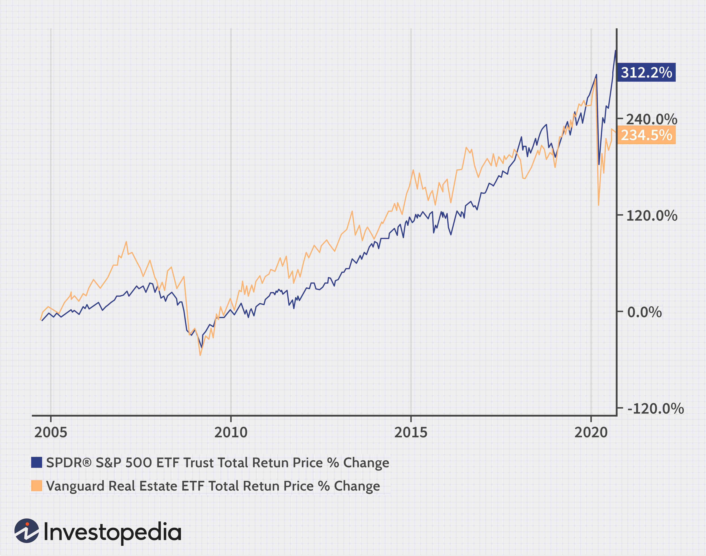

Investing in real estate and algorithmic trading are recognized as robust strategies for achieving substantial long-term financial returns. This article examines the complex association between real estate investment returns and algorithmic trading, while highlighting potential strategies and benefits. We will discuss the core principles of real estate investments, compare their historical performance against other asset classes, and demonstrate how algorithmic trading can enhance decision-making processes and the execution of investments in real estate. A significant focus will be placed on the integration of technology and data analytics within the real estate industry to enhance investment outcomes. Finally, we will propose several strategies that investors can employ by leveraging algorithmic trading to optimize their real estate investment portfolios.

Algorithmic trading, traditionally associated with financial markets, utilizes advanced algorithms to automate trading decisions, thereby enhancing the efficiency and effectiveness of investment strategies. Within the context of real estate, technology and data analytics play a transformative role, allowing investors to process vast amounts of data quickly and accurately. This increased capacity for information enables the identification of trends, risk assessment, and optimization of investment strategies based on real-time data.



The integration of algorithmic trading with real estate investment represents a significant advancement in the field, offering the potential for increased precision in market predictions and more effective portfolio management. By harnessing the power of algorithmic trading, investors gain access to a range of tools that provide deeper insights into market dynamics, improve asset allocation, and mitigate risks associated with market volatility. Through the strategic application of these tools, investors can achieve greater efficiency in both the execution of trades and the overall management of their real estate investments.

## Table of Contents

## Understanding Long-Term Investments in Real Estate

Real estate has traditionally been a key component of diversified investment portfolios, largely due to its ability to provide steady returns and potential for capital appreciation. Investments in real estate can be broadly classified into three main categories: residential, commercial, and industrial properties, each exhibiting distinct risk-return characteristics. Residential properties often present lower risk levels but correspondingly lower returns, whereas commercial and industrial properties have the potential for higher returns, albeit with increased risk.

Over the years, the performance of real estate has shown favorable comparisons to other asset classes such as stocks. Historical data indicates that real estate has offered annualized returns similar to those of the S&P 500. This is particularly evident in private commercial properties, which have demonstrated resilience and stability even in the face of economic downturns. During periods of market volatility, these investments have often provided a hedge against inflation and market turbulence.

One of the widely adopted strategies for achieving diversification within real estate is through Real Estate Investment Trusts (REITs). REITs pool capital from multiple investors to purchase a portfolio of real estate assets, offering individual investors exposure to real estate with the [liquidity](/wiki/liquidity-risk-premium) and diversification benefits akin to that of stocks. By investing in REITs, investors can gain access to real estate markets without needing to directly own properties, reducing entry barriers and allowing for a more diversified portfolio.

Designing a successful real estate portfolio requires an in-depth understanding of the subtleties of various property types and prevailing market dynamics. Knowledge of local real estate trends, economic indicators, and demographic shifts is crucial for making informed investment decisions. Additionally, evaluating macroeconomic factors such as interest rates and regulatory changes plays a significant role in shaping the landscape of real estate investments. This analytical approach helps investors to identify opportunities and risks, enabling them to optimize their portfolios for long-term growth and stability.

In summary, long-term investments in real estate are driven by their potential for stable income generation, opportunities for capital appreciation, and the ability to provide diversification. By carefully considering the characteristics of different property types and understanding the broader market context, investors can strategically position their portfolios to achieve enduring success in the real estate sector.

## Algorithmic Trading: A New Frontier in Real Estate Investment

Algorithmic trading employs advanced algorithms and data analysis to facilitate trading decisions, primarily utilized in stock markets. However, its application in real estate is expanding rapidly, given its capability to process large datasets and accurately forecast market trends. This method provides real estate investors with a structured approach to decision-making by automating critical tasks, thus minimizing human errors and enhancing the speed of execution.

At the heart of [algorithmic trading](/wiki/algorithmic-trading) in real estate is the ability to handle complex data inputs to yield actionable insights. This involves leveraging computational tools to sift through varied data sources, including property prices, rental yields, geographic developments, and economic indicators. Algorithms can assess these data points to identify patterns, predict future market conditions, and evaluate investment risks, thereby enabling more precise strategic decisions.

Machine learning, a subset of [artificial intelligence](/wiki/ai-artificial-intelligence), significantly boosts the effectiveness of algorithmic trading by enabling the continuous adaptation and refinement of these algorithms. Machine learning models can be trained using historical real estate data to predict price trends, demand cycles, and investment opportunities. For example, a supervised learning model could be trained on a dataset containing historical property prices and relevant market variables to predict future price movements. Python, with libraries such as TensorFlow or scikit-learn, is often used to develop and implement these models. Below is a simple example of a [machine learning](/wiki/machine-learning) model using Python to predict real estate pricing trends:

```python
import pandas as pd
from sklearn.model_selection import train_test_split
from sklearn.linear_model import LinearRegression
from sklearn.metrics import mean_squared_error

# Load dataset
data = pd.read_csv('real_estate_data.csv')
X = data[['feature1', 'feature2', 'feature3']]  # Example features
y = data['price']

# Split data into training and testing sets
X_train, X_test, y_train, y_test = train_test_split(X, y, test_size=0.2, random_state=42)

# Train the model
model = LinearRegression()
model.fit(X_train, y_train)

# Predictions
predictions = model.predict(X_test)

# Evaluate the model
mse = mean_squared_error(y_test, predictions)
print(f'Mean Squared Error: {mse}')
```

The integration of algorithmic trading in real estate introduces an era of deeper insight and heightened responsiveness to market shifts. This approach allows investors to quickly react to market changes and capitalize on opportunities, potentially leading to enhanced returns. With these tools, investors are better equipped to anticipate market fluctuations, optimize investment portfolios, and sustain competitive advantages in the dynamic real estate landscape.

## Integrating Algorithmic Trading with Real Estate Investment

The integration of algorithmic trading with real estate investment represents a significant advancement in strategic decision-making and portfolio management. By leveraging algorithmic tools, investors achieve a more comprehensive analysis of market trends, which allows them to automate transactional processes and refine their strategies for buying and selling properties. This automation is driven by predefined criteria that can efficiently optimize investment decisions based on current market dynamics.

Algorithms, particularly when enhanced by machine learning, are capable of performing scenario analysis to evaluate multiple market conditions. This capability is crucial in risk management, especially in volatile markets where traditional methods may fall short. Assessing the potential outcomes of various scenarios allows investors to make informed decisions with a deeper understanding of potential risks and rewards.

Developing effective algorithms necessitates an intricate understanding of both the real estate market and technological tools. The process involves utilizing programming skills and data science principles to design algorithms that can process large datasets, adapt to changing market environments, and deliver actionable insights. Python is often the preferred programming language for these endeavors due to its extensive libraries and frameworks suited for data analysis and machine learning, such as NumPy, pandas, and scikit-learn.

Here is an example of how Python can be used to analyze real estate data:

```python
import pandas as pd
from sklearn.linear_model import LinearRegression

# Load real estate data
data = pd.read_csv('real_estate_data.csv')

# Assume data contains 'Price', 'Location', 'Size', among other features
X = data[['Location', 'Size']]
y = data['Price']

# Create a model
model = LinearRegression()
model.fit(X, y)

# Predict prices based on the model
predicted_prices = model.predict(X)

# Output predictions
data['Predicted_Price'] = predicted_prices
print(data.head())
```
This script utilizes linear regression to predict property prices based on location and size. While simplistic, it demonstrates the foundational role of data analysis in algorithmic trading related to real estate.

Successful integration of algorithmic trading and real estate investment, consequently, ensures the optimization of portfolios. This is achieved by harmonizing cutting-edge technology with traditional investment principles, fostering enhanced strategies that adapt to the evolving market landscape. By optimizing the decision-making process and incorporating advanced technological tools, investors can substantially boost the performance of their real estate investments.

## Benefits and Challenges of Algorithmic Trading in Real Estate

Algorithmic trading in real estate provides the ability to analyze large amounts of data rapidly, allowing investors to take advantage of brief market opportunities. By processing real-time information, these automated systems can identify trends and execute transactions faster than traditional methods. This speed is crucial in a market where timing can significantly affect profitability.

A key benefit of algorithmic trading is the reduction in transaction costs. Automated systems minimize human intervention, which reduces errors and operational costs. Additionally, the continuous analysis of market data facilitates better decision-making, enabling the identification of optimal entry and [exit](/wiki/exit-strategy) points for investments.

However, algorithmic trading is not without its challenges. One primary risk is the over-reliance on technology. While algorithms can process vast data sets efficiently, they can only act on their predefined parameters and historical data. Unexpected market [volatility](/wiki/volatility-trading-strategies) may lead to unfavorable outcomes if these conditions are not adequately anticipated in the algorithm's logic.

Moreover, technical failures such as system errors or connectivity issues can result in significant financial loss. The failure of a trading algorithm to execute a critical transaction at the desired time due to such errors can negate the benefits of its speed and precision.

As a result, effective risk management in algorithmic trading requires a balanced approach. Human judgment should complement algorithmic insights. While the algorithm can process and execute data at high speeds, human oversight is necessary to interpret the broader implications of data trends and market conditions.

Continuous education in technological tools and an understanding of market dynamics are essential for safely leveraging algorithmic trading in real estate. Tools like machine learning models trained on diverse datasets can enhance prediction accuracy. For instance, data preprocessing steps such as normalization ensure that inputs are on a similar scale, which improves model performance.

```python
import pandas as pd
from sklearn.preprocessing import MinMaxScaler

# Example Python code to normalize data for machine learning models
data = {'price': [120000, 150000, 130000, 145000, 155000],
        'growth_rate': [0.05, 0.07, 0.03, 0.06, 0.08]}

df = pd.DataFrame(data)
scaler = MinMaxScaler()
normalized_data = scaler.fit_transform(df)
```

Ultimately, combining sophisticated algorithms with expert human oversight marks the most effective strategy in harnessing the potential of algorithmic trading within real estate.

## Implementing Algorithmic Strategies in Real Estate Investment

Setting clear investment goals and understanding risk tolerance are fundamental steps when incorporating algorithmic trading into real estate investment strategies. These goals help determine the type of properties to target, the duration of investment, and the acceptable levels of risk. Defining these parameters clarifies the scope of the algorithm's operation and ensures alignment with investors' objectives. 

Choosing the appropriate software or platforms that cater to real estate's unique demands is crucial. Platforms should offer capabilities specifically tailored for real estate data analysis, including integration with external data sources and advanced modeling tools. For instance, platforms like Bloomberg Terminal or specialized real estate analytics software, such as CoreLogic, provide essential features for analyzing market trends and property metrics.

Gathering and analyzing comprehensive real estate data sets using tools like Python libraries is important for informed decision-making. Python, due to its robust ecosystem of libraries like Pandas, NumPy, and Scikit-learn, is ideal for handling large data sets, performing statistical analysis, and implementing machine learning algorithms. Access to reliable data sources such as public records, real estate listings, and economic indicators is crucial. Here's an example script using Python to load, manipulate, and visualize real estate data:

```python
import pandas as pd
import matplotlib.pyplot as plt

# Load real estate data from a CSV file
data = pd.read_csv('real_estate_data.csv')

# Display basic data information
print(data.head())

# Visualize property prices over time
plt.plot(data['Date'], data['Price'])
plt.title('Real Estate Prices Over Time')
plt.xlabel('Date')
plt.ylabel('Price')
plt.show()
```

Developing and continually refining custom algorithms, often with expert assistance, is vital for effectiveness in practical application. Algorithms should be designed to identify pricing trends, optimize buying/selling points, and manage risks effectively. Machine learning models, such as regression models, decision trees, or neural networks, can enhance these algorithms by learning from past data to predict future market behaviors.

Monitoring and adjusting algorithms is crucial to ensure alignment with market trends and investment objectives. Continuous monitoring involves [backtesting](/wiki/backtesting) algorithms against historical data to validate their performance and adjusting parameters or strategies in response to market changes. Real estate markets are dynamic; thus, algorithms must be adaptable to new data and emerging trends to maintain their effectiveness. Regular performance reviews and updates based on feedback will help optimize the algorithms' output, ensuring they continue to meet the strategic goals set forth by investors.

## Conclusion

The fusion of real estate investment and algorithmic trading is revolutionizing investment strategies, offering investors new tools to optimize returns. This integration empowers investors with sophisticated technologies that refine strategies, enhance decision-making, and ultimately boost returns. Algorithms provide real estate investors access to complex data analysis, enabling them to identify profitable opportunities quickly and accurately. They allow for dynamic adjustments to investment strategies, tailored to the specific demands of the real estate market.

To fully harness the benefits of this integration, continuous learning and adaptation are crucial. The rapidly evolving landscape of technology and market conditions necessitates staying informed and agile. Skills such as data analysis, machine learning, and real estate market comprehension become invaluable assets in this context. Investors who actively engage in learning will be better equipped to adapt their strategies and leverage the latest advancements.

By embracing these advanced techniques, investors can secure competitive advantages that translate into significant returns. Algorithmic trading provides tools to reduce transaction costs and enhance efficiency, offering a substantial edge over traditional methods. The ability to swiftly process and react to real-time market data gives investors the upper hand in capturing fleeting opportunities and managing risks effectively.

As algorithmic tools become increasingly integrated within the real estate sector, they mark a new era characterized by innovative investment strategies. This trend is not just about keeping pace with technological innovations; it represents a fundamental shift in how investment decisions are made and executed. Investors who align their practices with these advanced techniques position themselves at the forefront of an ever-evolving investment landscape.

## References & Further Reading

Explore more on the National Council of Real Estate Investment Fiduciaries (NCREIF) reports for valuable insights on real estate return [statistics](/wiki/bayesian-statistics). These reports offer comprehensive data on different types of real estate investments, aiding in understanding trends and performance benchmarks.

Consider "Advances in Financial Machine Learning" by Marcos Lopez de Prado, which offers insights on the role of machine learning in finance. This book provides advanced methodologies applicable to enhancing real estate investment strategies through sophisticated data analysis.

Review Investopedia's resources on Real Estate Investment Trusts (REITs) and Algorithmic Trading for foundational knowledge. These resources cover the principles of REITs, their benefits, and how algorithmic trading can be effectively utilized in trading strategies.

Further industry reports and academic studies can provide additional context and strategies for integrating real estate investments with advanced algorithmic tools. These readings help in developing a holistic understanding and practical approaches for using technology to optimize real estate portfolios.

