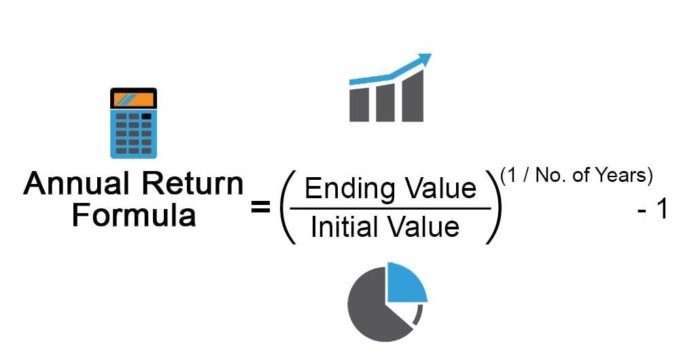

## Table of Contents

## What is the average annual return?

The average annual return is a way to measure how much money an investment makes each year, on average, over a certain period of time. It's like figuring out the yearly growth rate of your money. For example, if you invest $100 and it grows to $110 in a year, your annual return for that year is 10%. If you want to know the average over several years, you take all the yearly returns and find their average.

This number is really useful because it helps you compare different investments. If one investment has an average annual return of 5% and another has 7%, you might choose the one with 7% because it grows your money faster. But remember, past returns don't guarantee future results. So, while the average annual return is a helpful guide, it's not a promise of what will happen next.

## Why is the average annual return important for investors?

The average annual return is important for investors because it helps them understand how well their investments are doing over time. It's like a report card for your money. By looking at the average annual return, investors can see if their investments are growing at a good pace or if they need to make changes. It's a simple way to measure if you're making more money than you're losing, which is what investing is all about.

Another reason why the average annual return is important is that it allows investors to compare different investment options. If you're trying to decide where to put your money, knowing the average annual return of each option can help you pick the one that might grow your money the fastest. This comparison can guide you to make smarter choices about where to invest, helping you reach your financial goals more effectively.

## How is the average annual return calculated?

To calculate the average annual return, you start by finding the yearly returns for the period you're looking at. Let's say you want to know the average annual return over 5 years. You would first calculate the return for each of those 5 years. For example, if you invested $100 and it grew to $110 in the first year, your return for that year is 10%. You do this for all 5 years.

Once you have the yearly returns, you add them up and divide by the number of years. So, if your returns over 5 years were 10%, 5%, -3%, 8%, and 7%, you would add these together to get 27%. Then, you divide 27% by 5 (the number of years) to get an average annual return of 5.4%. This tells you that, on average, your investment grew by 5.4% each year over those 5 years.

## What is the difference between simple and compound average annual return?

Simple average annual return is easy to calculate. You just add up all the yearly returns and then divide by the number of years. It's like finding the average score of a bunch of tests. This method treats each year's return the same, no matter if the money grows slowly or quickly. But it doesn't show how your money actually grows over time because it doesn't consider that the money you earn each year can also earn more money in the future.

Compound average annual return, often called the Compound Annual Growth Rate (CAGR), is a bit trickier but gives a better picture of how your investment grows over time. It takes into account that the money you make each year can keep [earning](/wiki/earning-announcement) more money. To find the CAGR, you start with how much money you had at the beginning and how much you have at the end, then figure out the rate that would make your money grow from the start to the end over those years. This way, it shows the real growth of your money, considering that your earnings can earn more earnings.

## Can you provide an example of how to calculate the average annual return?

Let's say you invested $1,000 and you want to find out the average annual return over 3 years. In the first year, your investment grew to $1,100, so your return for that year was 10% because $100 is 10% of $1,000. In the second year, it grew from $1,100 to $1,155, which is a 5% return because $55 is 5% of $1,100. In the third year, it went from $1,155 to $1,212.75, a 5% return again because $57.75 is 5% of $1,155.

To find the average annual return, you add up all the yearly returns and divide by the number of years. So, you add 10% (from the first year) + 5% (from the second year) + 5% (from the third year) to get 20%. Then, you divide 20% by 3 years to get an average annual return of about 6.67%. This means, on average, your investment grew by 6.67% each year over those 3 years.

## What factors can affect the average annual return of an investment?

Many things can change how much money you make each year from an investment. One big thing is the type of investment you choose. Stocks might go up and down a lot, so they can have big returns or big losses. Bonds are usually safer but don't grow as fast. Another thing is the economy. If the economy is doing well, companies make more money, and their stocks might go up. But if the economy is bad, stocks might go down. Also, things like interest rates can affect your returns. If interest rates go up, borrowing money gets more expensive, which can slow down the economy and affect your investments.

Another factor is how long you keep your money invested. The longer you leave it in, the more time it has to grow, but it also means you're taking a risk for a longer time. And don't forget about fees and taxes. If you have to pay a lot in fees or taxes, it can eat into your returns. Finally, how much you know about investing and the choices you make can make a big difference. If you pick good investments and manage them well, you might see higher returns. But if you make bad choices, your returns could be lower.

## How does the average annual return relate to risk?

The average annual return of an investment is closely tied to the risk you take. If you want to make more money, you usually have to take on more risk. For example, stocks can go up and down a lot, which means they can give you big returns but also big losses. On the other hand, things like savings accounts or government bonds are safer but they don't grow your money as fast. So, when you see a high average annual return, it often means the investment is riskier.

Understanding the relationship between risk and return can help you make smarter choices about where to put your money. If you're okay with taking more risk, you might go for investments with higher average annual returns, like stocks. But if you want to keep your money safe, you might choose investments with lower returns, like bonds. It's all about finding the right balance that fits your comfort level and financial goals.

## What are some common benchmarks used to compare average annual returns?

People often use benchmarks to see how well their investments are doing. One common benchmark is the S&P 500, which is a big list of 500 important companies in the United States. If your investment does better than the S&P 500, that's usually a good sign. Another benchmark is the Dow Jones Industrial Average, which looks at 30 big companies. It's another way to see if your investment is keeping up with the market.

There are also benchmarks for different types of investments. For example, if you're looking at bonds, you might compare your returns to the Bloomberg Barclays US Aggregate Bond Index. This index shows how well a bunch of different bonds are doing. For international investments, you might use the MSCI EAFE Index, which tracks stocks in Europe, Australia, and the Far East. Using these benchmarks helps you see if your investments are doing well compared to similar investments.

## How can the average annual return be used to evaluate investment performance over time?

The average annual return is a great way to see how well your investments are doing over time. It tells you how much money you made each year, on average, which helps you understand if your investments are growing at a good pace. For example, if you invested in a stock that had an average annual return of 8% over 10 years, it means your money grew by about 8% each year during that time. This can help you decide if you want to keep your money in that investment or if you should look for something better.

You can also use the average annual return to compare your investments to other options or to the market as a whole. If your investment's average annual return is higher than a benchmark like the S&P 500, it means your investment did better than the market. This can give you confidence that you're making smart choices with your money. But remember, past returns don't promise future results, so it's important to keep an eye on how your investments are doing and be ready to make changes if needed.

## What are the limitations of using average annual return as a performance metric?

Using the average annual return to measure how well an investment is doing has some problems. One big issue is that it doesn't show the ups and downs of the investment. If your investment goes up a lot one year and down a lot the next, the average might look okay, but you might have been really worried about losing money. Also, the average annual return doesn't tell you about the risk you're taking. An investment with a high average return might be really risky, and you might lose a lot of money.

Another problem is that the average annual return can be tricky if you're looking at a short time. If you only look at a few years, the average might not show what usually happens over a longer time. And if you're comparing different investments, the average annual return might not be fair if they started at different times or if one had a really good or bad year. So, while the average annual return is helpful, it's not the only thing you should look at when deciding if an investment is good or not.

## How do inflation and taxes impact the real average annual return?

Inflation and taxes can make the average annual return you see on paper look better than it really is. Inflation means the cost of things goes up over time, so the money you make from your investment might not buy as much as it used to. If your investment grows by 5% in a year, but inflation is also 5%, you're not really making more money because everything costs more. So, you need to look at the real return, which is the average annual return minus inflation, to see how much your money is really growing.

Taxes also take a bite out of your returns. When you make money from an investment, you often have to pay taxes on it. If you make $100 from your investment but have to pay $20 in taxes, your real return is only $80. So, after you take out inflation and taxes, the real average annual return is what's left, and that's what really matters for growing your money over time. It's important to think about both inflation and taxes when you're looking at how well your investments are doing.

## What advanced statistical methods can be used to analyze and predict average annual returns?

To get a better understanding of average annual returns, people often use advanced statistical methods like regression analysis. This method helps you see how different things, like the economy or interest rates, affect your investment's returns. By looking at past data, regression analysis can show you patterns and help you guess what might happen in the future. It's like trying to predict the weather by looking at past weather patterns. This can be really helpful for making smart choices about where to put your money.

Another method is time series analysis, which looks at how returns change over time. This can help you see if there are any regular patterns or cycles in your investment's performance. For example, maybe your investment does better in certain months or years. By understanding these patterns, you can make better guesses about what might happen next. Both regression analysis and time series analysis are powerful tools that can give you a deeper look into how your investments might perform in the future, but remember, they're not perfect and can't predict everything.

## What is Understanding Average Annual Return (AAR)?

Average Annual Return (AAR) is a key financial metric that calculates the arithmetic mean of a series of annual returns over a specified period. It provides investors and analysts with an indication of average yearly return rates, eliminating the impact of short-term [volatility](/wiki/volatility-trading-strategies). The formula for calculating AAR can be expressed as:

$$
AAR = \frac{R_1 + R_2 + \ldots + R_n}{n}
$$

where $R_1, R_2, \ldots, R_n$ represent the annual returns over $n$ years.

Crucially, AAR is frequently employed to present historical returns for investment portfolios, such as mutual funds. By condensing multiple years of performance into a single, average figure, AAR offers a useful, though simplified, snapshot of past performance. This characteristic makes it instrumental in benchmarking and comparing a variety of investment vehicles, enabling investors to identify underperforming or outperforming options relative to expectations or market indices.

The AAR calculation incorporates several fundamental components, each representing a different aspect of the investment return. These include:

- **Share Price Appreciation**: This component captures the unrealized gains or losses originating from changes in the price of the shares held in a portfolio. Shifts in share prices directly affect the overall return on investment, making this an essential aspect of the AAR.

- **Capital Gains Distributions**: When an investment fund realizes profits from the sale of its financial assets, these gains contribute to the AAR. Capital gains can be significant in determining overall performance, particularly in actively managed portfolios.

- **Dividends**: Dividends are periodic payments made by companies to their shareholders from their earnings. These contribute substantially to the overall returns of mutual funds and other income-focused portfolios, thereby influencing the AAR. Regular dividend income can enhance returns over time and offer a measure of stability.

AAR, while effective in summarizing annual performance, does not account for compounding effects, a [factor](/wiki/factor-investing) addressed by the Compound Annual Growth Rate (CAGR). Nevertheless, AAR's ease of calculation and clear representation of average annual performance ensure its continued relevance in financial analysis and reporting.

## What are the components of AAR?

Average Annual Return (AAR) provides a means to evaluate the performance of an investment by accounting for various components that contribute to its overall return. Understanding these components is essential for accurately calculating the AAR and assessing the financial health of a portfolio. The primary components include share price appreciation, capital gains distributions, and dividends.

**Share Price Appreciation**

Share price appreciation represents the unrealized gains or losses resulting from fluctuations in the share prices of securities within an investment portfolio. It reflects the change in the market value of the shares and is critical for determining the return provided by the appreciation in asset values. This element is crucial because it influences the total return calculation, affecting how an investor perceives the performance of their investment. Although share price appreciation does not contribute directly to cash flow until actualized, it forms a vital part of the valuation process. The appreciation can be expressed as:

$$
\text{Share Price Appreciation} = \frac{(P_{\text{end}} - P_{\text{begin}})}{P_{\text{begin}}} \times 100\%
$$

where $P_{\text{end}}$ is the ending price of the share, and $P_{\text{begin}}$ is the beginning price.

**Capital Gains Distributions**

Capital gains distributions refer to the income realized from the sale of assets within a mutual fund. When fund managers sell securities at a profit, the gains generated are distributed to shareholders, typically at the end of the year. These distributions directly impact the AAR calculation as they provide tangible income realized from investment decisions. Capturing these gains accurately is critical for evaluating a fund's performance and informing stakeholders of its profitability. The realized capital gains are often influenced by market conditions, the timing of asset sales, and fund management strategies.

**Dividends**

Dividends constitute another significant component of AAR, representing regular income obtained from a company's earnings distributed to shareholders. They are often paid out quarterly and contribute to the cash flow of an investment portfolio. Dividends provide a steady income stream and can significantly influence the total return of a mutual fund, especially for investments in dividend-yielding stocks. The inclusion of dividends in AAR calculations ensures a comprehensive understanding of the overall investment performance. The impact of dividends can be reflected as:

$$
\text{Dividend Yield} = \frac{\text{Annual Dividends per Share}}{P_{\text{begin}}} \times 100\%
$$

In conclusion, the components of AAR, including share price appreciation, capital gains distributions, and dividends, collectively contribute to understanding the performance dynamics of an investment. Each plays a pivotal role in conveying both the realized and unrealized aspects of returns, enabling investors and analysts to develop a clear and accurate picture of investment efficacy.

## What is AAR in Algorithmic Trading?

Algorithmic trading, often referred to as algo trading, has revolutionized financial markets by using computer algorithms to automate trading decisions. A key component in assessing these strategies is the Average Annual Return (AAR), a metric that provides an overview of a strategy's average annual performance over a specified period. For algorithmic traders, AAR is an essential tool in evaluating the historical performance of algorithms during [backtesting](/wiki/backtesting).

Backtesting, the process of testing a trading strategy on historical data, enables traders to simulate how a strategy would have performed in the past. Calculating AAR during backtesting helps determine the average profit or loss a strategy could have yielded yearly if it had been implemented. This evaluation assists in assessing the potential viability of trading strategies before they are deployed in real-time markets. For example, consider an algorithmic strategy tested over four years with annual returns of 10%, 15%, 5%, and 20%. The AAR for this strategy can be calculated as follows:

$$
AAR = \frac{(10\% + 15\% + 5\% + 20\%)}{4} = 12.5\%
$$

AAR is also instrumental in identifying underperforming strategies. Traders use AAR to compare different strategies or variations of the same strategy. If a particular trading model consistently shows a lower AAR compared to others, it may be a candidate for modification or abandonment. Conversely, strategies with a high AAR are more likely to be optimized and potentially scaled up for broader trading operations.

Furthermore, algorithmic traders rely on AAR to optimize their models. Calculating AAR allows traders to tweak their algorithms by adjusting parameters, such as entry and [exit](/wiki/exit-strategy) criteria or risk management rules, to enhance performance. By integrating AAR with other performance metrics, such as the Sharpe ratio and maximum drawdown, traders can build a comprehensive understanding of a strategy's risk-adjusted returns, leading to more informed optimization decisions.

While AAR remains a valuable metric within [algorithmic trading](/wiki/algorithmic-trading), its limitations necessitate careful interpretation. AAR does not account for compounding effects, meaning that understanding its role alongside other metrics, like Compound Annual Growth Rate (CAGR), is crucial for accurately assessing strategy effectiveness. Additionally, since AAR reflects historical performance, traders should be cautious about solely relying on it for future predictions, integrating it with other forecasting tools and risk assessments to develop robust, adaptive trading models.

## What are the limitations of AAR?

Average Annual Return (AAR) is a commonly used performance metric in finance due to its simplicity in calculating and interpreting average returns over a specified period. However, this straightforwardness also leads to several limitations that can impact the accuracy and reliability of investment evaluations.

A key limitation of AAR is its failure to account for the compounding effects of returns, which can lead to misinterpretation of an investment's growth potential. Compounding refers to the process where the value of an investment increases because of the earnings on both the initial principal and the accumulated interest from previous periods. The formula for AAR is generally represented as:

$$
\text{AAR} = \frac{R_1 + R_2 + \cdots + R_n}{n}
$$

where $R_1, R_2, \ldots, R_n$ are the annual returns over $n$ years. This arithmetic mean approach does not consider the impact of compounding, which is essential for understanding the true growth trajectory of investments. As such, AAR might overestimate or underestimate the actual performance when compared to metrics that account for compounding, like the Compound Annual Growth Rate (CAGR).

Furthermore, AAR does not directly include measures of volatility and risk, which are crucial aspects of investment performance. Volatility refers to the degree of variation in the price of an investment over time, which is typically measured using the standard deviation of returns. Without factoring in volatility, AAR might present a skewed perspective by only considering average returns and leaving out the risk profile of the investment. For more comprehensive risk assessment, supplementary metrics like standard deviation or the Sharpe ratio should be considered alongside AAR.

Another critical consideration is that AAR is based on historical data and reflects past performance, which does not necessarily guarantee future results. Market conditions and investment dynamics can change, making it essential for investors to not solely rely on past average returns for future investment decisions. The assumption that past performance seamlessly translates to future success can lead to misguided strategies, emphasizing the need for a cautious analysis that integrates forward-looking assessments and scenario analyses.

In summary, while AAR offers a useful perspective on historical performance, its inability to account for compounding effects, disregard for volatility and risk, and reliance on historical data limit its effectiveness as a solitary metric. Investors should augment AAR with additional analytical tools to cultivate a well-rounded understanding of an investment's potential and associated risks.

## What is the comparison with Compound Annual Growth Rate (CAGR)?

Unlike the Average Annual Return (AAR), the Compound Annual Growth Rate (CAGR) accounts for the effects of compounding over time, providing a more accurate reflection of investment growth. CAGR is particularly useful in demonstrating how an investment grows from its beginning balance to its ending balance, assuming the investment has been steadily accumulating at that rate across the specified period.

The formula for CAGR is as follows:

$$
\text{CAGR} = \left( \frac{\text{Ending Value}}{\text{Beginning Value}} \right)^{\frac{1}{n}} - 1
$$

where $n$ is the number of years.

One of the main advantages of using CAGR is its ability to smooth out the volatility inherent in the annual returns of an investment. This smoothing effect makes CAGR a preferable metric for analyzing the growth trajectory over long periods, as it mitigates short-term fluctuations that can distort understanding when solely relying on AAR. While AAR represents the arithmetic mean of annual returns and might suggest consistent performance, it fails to demonstrate the actual compounding effect. In contrast, CAGR reflects a more comprehensive trajectory by incorporating compounding, which can significantly impact investment value over time.

The differences between AAR and CAGR are vital for accurately interpreting long-term investment performance. AAR offers a simple average, which can be misleading in cases where returns are variable. For example, an investment with alternating returns of +20% and -10% over two years results in an AAR of 5%, yet the actual growth over the period is less due to the negative impact of compounding losses. Therefore, CAGR can reveal the true growth rate in such scenarios, presenting a clearer view of the investment's effectiveness.

In practical applications, investors often use both AAR and CAGR in conjunction. AAR provides a quick snapshot of annual performance, while CAGR offers deeper insight into the compound growth rate, turning it into an essential metric for long-term investment analysis and planning.

## References & Further Reading

[1]: ["The Intelligent Investor: The Definitive Book on Value Investing"](https://www.amazon.com/Intelligent-Investor-Definitive-Investing-Essentials/dp/0060555661) by Benjamin Graham

[2]: ["A Random Walk Down Wall Street: The Time-Tested Strategy for Successful Investing"](https://www.amazon.com/Random-Walk-Down-Wall-Street/dp/0393358380) by Burton G. Malkiel

[3]: ["Quantitative Finance: A Simulation-Based Introduction Using Excel"](https://www.taylorfrancis.com/books/mono/10.1201/b16039/quantitative-finance-matt-davison) by Matt Davison

[4]: Sharpe, W. F. (1966). ["Mutual Fund Performance."](https://www.scirp.org/reference/ReferencesPapers?ReferenceID=1451307) The Journal of Business, Vol. 39, No. 1, Part 2: Supplement on Security Prices.

[5]: Bodie, Z., Kane, A., & Marcus, A. J. (2014). ["Investments"](https://books.google.com/books/about/EBOOK_Investments_Global_edition.html?id=BMsvEAAAQBAJ). McGraw-Hill Education.