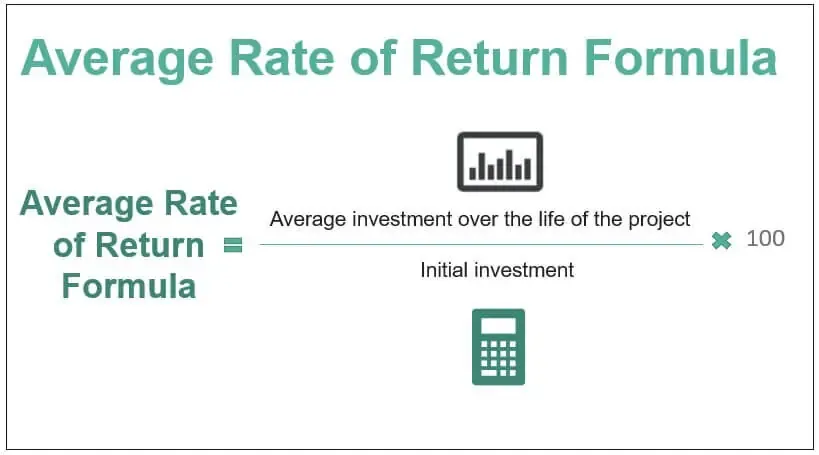

In the dynamic world of finance, the Average Annual Return (AAR) serves as an essential metric for both investors and analysts. AAR provides a mechanism for assessing the performance of various investment vehicles, including mutual funds, stocks, and algorithmic trading strategies. By offering a consistent measure of past performance, AAR aids in comparing and benchmarking different investment options, helping investors make informed decisions. This article explores the nuances of AAR, examining its calculation, significance in investment strategies, and its role in algorithmic trading. Understanding AAR is crucial for making informed investment choices and evaluating the success of trading algorithms, enabling individuals and organizations to adapt effectively to changing market conditions. Through this comprehension, investors can enhance their ability to develop and execute robust investment strategies that align with their financial goals.

## Table of Contents

## Understanding Average Annual Return (AAR)

Average Annual Return (AAR) is a key financial metric that calculates the arithmetic mean of a series of annual returns over a specified period. It provides investors and analysts with an indication of average yearly return rates, eliminating the impact of short-term volatility. The formula for calculating AAR can be expressed as:

$$
AAR = \frac{R_1 + R_2 + \ldots + R_n}{n}
$$

where $R_1, R_2, \ldots, R_n$ represent the annual returns over $n$ years.

Crucially, AAR is frequently employed to present historical returns for investment portfolios, such as mutual funds. By condensing multiple years of performance into a single, average figure, AAR offers a useful, though simplified, snapshot of past performance. This characteristic makes it instrumental in benchmarking and comparing a variety of investment vehicles, enabling investors to identify underperforming or outperforming options relative to expectations or market indices.

The AAR calculation incorporates several fundamental components, each representing a different aspect of the investment return. These include:

- **Share Price Appreciation**: This component captures the unrealized gains or losses originating from changes in the price of the shares held in a portfolio. Shifts in share prices directly affect the overall return on investment, making this an essential aspect of the AAR.

- **Capital Gains Distributions**: When an investment fund realizes profits from the sale of its financial assets, these gains contribute to the AAR. Capital gains can be significant in determining overall performance, particularly in actively managed portfolios.

- **Dividends**: Dividends are periodic payments made by companies to their shareholders from their earnings. These contribute substantially to the overall returns of mutual funds and other income-focused portfolios, thereby influencing the AAR. Regular dividend income can enhance returns over time and offer a measure of stability.

AAR, while effective in summarizing annual performance, does not account for compounding effects, a [factor](/wiki/factor-investing) addressed by the Compound Annual Growth Rate (CAGR). Nevertheless, AAR's ease of calculation and clear representation of average annual performance ensure its continued relevance in financial analysis and reporting.

## Components of AAR

Average Annual Return (AAR) provides a means to evaluate the performance of an investment by accounting for various components that contribute to its overall return. Understanding these components is essential for accurately calculating the AAR and assessing the financial health of a portfolio. The primary components include share price appreciation, capital gains distributions, and dividends.

**Share Price Appreciation**

Share price appreciation represents the unrealized gains or losses resulting from fluctuations in the share prices of securities within an investment portfolio. It reflects the change in the market value of the shares and is critical for determining the return provided by the appreciation in asset values. This element is crucial because it influences the total return calculation, affecting how an investor perceives the performance of their investment. Although share price appreciation does not contribute directly to cash flow until actualized, it forms a vital part of the valuation process. The appreciation can be expressed as:

$$
\text{Share Price Appreciation} = \frac{(P_{\text{end}} - P_{\text{begin}})}{P_{\text{begin}}} \times 100\%
$$

where $P_{\text{end}}$ is the ending price of the share, and $P_{\text{begin}}$ is the beginning price.

**Capital Gains Distributions**

Capital gains distributions refer to the income realized from the sale of assets within a mutual fund. When fund managers sell securities at a profit, the gains generated are distributed to shareholders, typically at the end of the year. These distributions directly impact the AAR calculation as they provide tangible income realized from investment decisions. Capturing these gains accurately is critical for evaluating a fund's performance and informing stakeholders of its profitability. The realized capital gains are often influenced by market conditions, the timing of asset sales, and fund management strategies.

**Dividends**

Dividends constitute another significant component of AAR, representing regular income obtained from a company's earnings distributed to shareholders. They are often paid out quarterly and contribute to the cash flow of an investment portfolio. Dividends provide a steady income stream and can significantly influence the total return of a mutual fund, especially for investments in dividend-yielding stocks. The inclusion of dividends in AAR calculations ensures a comprehensive understanding of the overall investment performance. The impact of dividends can be reflected as:

$$
\text{Dividend Yield} = \frac{\text{Annual Dividends per Share}}{P_{\text{begin}}} \times 100\%
$$

In conclusion, the components of AAR, including share price appreciation, capital gains distributions, and dividends, collectively contribute to understanding the performance dynamics of an investment. Each plays a pivotal role in conveying both the realized and unrealized aspects of returns, enabling investors and analysts to develop a clear and accurate picture of investment efficacy.

## Importance of AAR in Investment Strategies

Average Annual Return (AAR) is a critical performance metric for investors as it evaluates the long-term viability of investments by providing a clear view of past returns. By calculating the arithmetic mean of annual returns over a specified period, AAR allows investors to assess how well their portfolios have performed against set benchmarks. This metric is particularly instrumental when comparing multiple investment options or benchmarking against indices like the S&P 500.

Market benchmarks are essential tools in investment strategies, offering references that convey the potential or expectations for specific investments. When AAR is compared with these benchmarks, investors can determine whether their investment choices have outperformed or underperformed market standards. An investment portfolio with a consistently higher AAR compared to its benchmark might be deemed more successful, offering a tangible basis for strategic decision-making.

While AAR alone provides valuable insights, its true power emerges when combined with other metrics. For instance, the evaluation of the risk-return profile of an investment often requires considering [volatility](/wiki/volatility-trading-strategies) metrics such as standard deviation alongside AAR. This combination allows investors to gauge not only the return potential but also the associated risk level. Evaluating risk through additional metrics helps investors understand whether higher returns justify the incurred risk, enabling more nuanced investment decisions.

In summary, AAR's role in investment strategies is pivotal due to its straightforward computation and ability to present past performance in a comparable manner. Its integration with complementary metrics paints a clearer picture of an investment's potential, ensuring that strategies are robust and aligned with an investor's financial goals.

## AAR in Algorithmic Trading

Algorithmic trading, often referred to as algo trading, has revolutionized financial markets by using computer algorithms to automate trading decisions. A key component in assessing these strategies is the Average Annual Return (AAR), a metric that provides an overview of a strategy's average annual performance over a specified period. For algorithmic traders, AAR is an essential tool in evaluating the historical performance of algorithms during [backtesting](/wiki/backtesting).

Backtesting, the process of testing a trading strategy on historical data, enables traders to simulate how a strategy would have performed in the past. Calculating AAR during backtesting helps determine the average profit or loss a strategy could have yielded yearly if it had been implemented. This evaluation assists in assessing the potential viability of trading strategies before they are deployed in real-time markets. For example, consider an algorithmic strategy tested over four years with annual returns of 10%, 15%, 5%, and 20%. The AAR for this strategy can be calculated as follows:

$$
AAR = \frac{(10\% + 15\% + 5\% + 20\%)}{4} = 12.5\%
$$

AAR is also instrumental in identifying underperforming strategies. Traders use AAR to compare different strategies or variations of the same strategy. If a particular trading model consistently shows a lower AAR compared to others, it may be a candidate for modification or abandonment. Conversely, strategies with a high AAR are more likely to be optimized and potentially scaled up for broader trading operations.

Furthermore, algorithmic traders rely on AAR to optimize their models. Calculating AAR allows traders to tweak their algorithms by adjusting parameters, such as entry and [exit](/wiki/exit-strategy) criteria or risk management rules, to enhance performance. By integrating AAR with other performance metrics, such as the Sharpe ratio and maximum drawdown, traders can build a comprehensive understanding of a strategy's risk-adjusted returns, leading to more informed optimization decisions.

While AAR remains a valuable metric within [algorithmic trading](/wiki/algorithmic-trading), its limitations necessitate careful interpretation. AAR does not account for compounding effects, meaning that understanding its role alongside other metrics, like Compound Annual Growth Rate (CAGR), is crucial for accurately assessing strategy effectiveness. Additionally, since AAR reflects historical performance, traders should be cautious about solely relying on it for future predictions, integrating it with other forecasting tools and risk assessments to develop robust, adaptive trading models.

## Limitations of AAR

Average Annual Return (AAR) is a commonly used performance metric in finance due to its simplicity in calculating and interpreting average returns over a specified period. However, this straightforwardness also leads to several limitations that can impact the accuracy and reliability of investment evaluations.

A key limitation of AAR is its failure to account for the compounding effects of returns, which can lead to misinterpretation of an investment's growth potential. Compounding refers to the process where the value of an investment increases because of the earnings on both the initial principal and the accumulated interest from previous periods. The formula for AAR is generally represented as:

$$
\text{AAR} = \frac{R_1 + R_2 + \cdots + R_n}{n}
$$

where $R_1, R_2, \ldots, R_n$ are the annual returns over $n$ years. This arithmetic mean approach does not consider the impact of compounding, which is essential for understanding the true growth trajectory of investments. As such, AAR might overestimate or underestimate the actual performance when compared to metrics that account for compounding, like the Compound Annual Growth Rate (CAGR).

Furthermore, AAR does not directly include measures of volatility and risk, which are crucial aspects of investment performance. Volatility refers to the degree of variation in the price of an investment over time, which is typically measured using the standard deviation of returns. Without factoring in volatility, AAR might present a skewed perspective by only considering average returns and leaving out the risk profile of the investment. For more comprehensive risk assessment, supplementary metrics like standard deviation or the Sharpe ratio should be considered alongside AAR.

Another critical consideration is that AAR is based on historical data and reflects past performance, which does not necessarily guarantee future results. Market conditions and investment dynamics can change, making it essential for investors to not solely rely on past average returns for future investment decisions. The assumption that past performance seamlessly translates to future success can lead to misguided strategies, emphasizing the need for a cautious analysis that integrates forward-looking assessments and scenario analyses.

In summary, while AAR offers a useful perspective on historical performance, its inability to account for compounding effects, disregard for volatility and risk, and reliance on historical data limit its effectiveness as a solitary metric. Investors should augment AAR with additional analytical tools to cultivate a well-rounded understanding of an investment's potential and associated risks.

## Comparison with Compound Annual Growth Rate (CAGR)

Unlike the Average Annual Return (AAR), the Compound Annual Growth Rate (CAGR) accounts for the effects of compounding over time, providing a more accurate reflection of investment growth. CAGR is particularly useful in demonstrating how an investment grows from its beginning balance to its ending balance, assuming the investment has been steadily accumulating at that rate across the specified period.

The formula for CAGR is as follows:

$$
\text{CAGR} = \left( \frac{\text{Ending Value}}{\text{Beginning Value}} \right)^{\frac{1}{n}} - 1
$$

where $n$ is the number of years.

One of the main advantages of using CAGR is its ability to smooth out the volatility inherent in the annual returns of an investment. This smoothing effect makes CAGR a preferable metric for analyzing the growth trajectory over long periods, as it mitigates short-term fluctuations that can distort understanding when solely relying on AAR. While AAR represents the arithmetic mean of annual returns and might suggest consistent performance, it fails to demonstrate the actual compounding effect. In contrast, CAGR reflects a more comprehensive trajectory by incorporating compounding, which can significantly impact investment value over time.

The differences between AAR and CAGR are vital for accurately interpreting long-term investment performance. AAR offers a simple average, which can be misleading in cases where returns are variable. For example, an investment with alternating returns of +20% and -10% over two years results in an AAR of 5%, yet the actual growth over the period is less due to the negative impact of compounding losses. Therefore, CAGR can reveal the true growth rate in such scenarios, presenting a clearer view of the investment's effectiveness.

In practical applications, investors often use both AAR and CAGR in conjunction. AAR provides a quick snapshot of annual performance, while CAGR offers deeper insight into the compound growth rate, turning it into an essential metric for long-term investment analysis and planning.

## Conclusion

Average Annual Return (AAR) remains a foundational metric within the finance industry, serving as a cornerstone for both traditional investment analyses and sophisticated algorithmic trading strategies. Its significance lies in its ability to provide a clear, straightforward measure of an investment's historical performance, making it an essential tool for financial professionals and investors alike. 

By understanding how AAR is calculated and what its components entail, investors can develop more robust investment strategies. The arithmetic mean of a series of annual returns gives a simplified, yet informative look at how an investment vehicle has performed over time. This insight allows investors to benchmark their returns against market averages and assess the long-term viability of their portfolios.

Despite its utility, AAR is not without limitations. It doesn't account for the effects of compounding, which can lead to an incomplete picture of growth over time. Moreover, inherent risks such as volatility are not directly reflected in AAR values, which can result in potential misinterpretations if used in isolation. Therefore, it is crucial to complement AAR with other performance metrics, like the Compound Annual Growth Rate (CAGR) and standard deviation, to gain a more holistic understanding of an investment's performance. This multifaceted approach helps in accurately evaluating the risk-return profile and overall effectiveness of an investment strategy.

In conclusion, while AAR is limited in some respects, its role in providing a snapshot of past performance is invaluable. By integrating AAR with additional metrics, investors and analysts can achieve a comprehensive view of their investment's potential and strategically adjust their approaches to optimize returns.

## References & Further Reading

[1]: ["The Intelligent Investor: The Definitive Book on Value Investing"](https://www.amazon.com/Intelligent-Investor-Definitive-Investing-Essentials/dp/0060555661) by Benjamin Graham

[2]: ["A Random Walk Down Wall Street: The Time-Tested Strategy for Successful Investing"](https://www.amazon.com/Random-Walk-Down-Wall-Street/dp/0393358380) by Burton G. Malkiel

[3]: ["Quantitative Finance: A Simulation-Based Introduction Using Excel"](https://www.taylorfrancis.com/books/mono/10.1201/b16039/quantitative-finance-matt-davison) by Matt Davison

[4]: Sharpe, W. F. (1966). ["Mutual Fund Performance."](https://www.scirp.org/reference/ReferencesPapers?ReferenceID=1451307) The Journal of Business, Vol. 39, No. 1, Part 2: Supplement on Security Prices.

[5]: Bodie, Z., Kane, A., & Marcus, A. J. (2014). ["Investments"](https://books.google.com/books/about/EBOOK_Investments_Global_edition.html?id=BMsvEAAAQBAJ). McGraw-Hill Education.