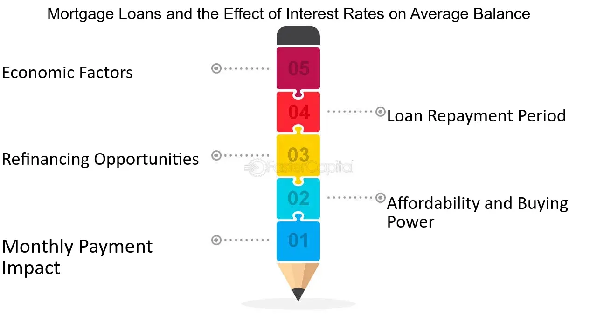

## Table of Contents

## What is an average balance?

An average balance is a way to figure out how much money is usually in a bank account over a certain time. It's like finding the middle amount of money that's in the account. Banks often use this to see how much money people keep in their accounts. They might look at the balance every day for a month and then add up all those daily balances and divide by the number of days to get the average.

This is helpful for banks and customers. Banks can use the average balance to decide things like how much interest to give or what fees to charge. For customers, knowing their average balance can help them understand their spending habits better. If the average balance is low, it might mean they're spending a lot or not putting much money into the account. If it's high, it could mean they're saving well or not using their money much.

## How is the average balance calculated?

To find the average balance, you add up the balance of the account every day over a certain time, like a month. Then, you divide that total by the number of days in that time. For example, if you have $100 in your account on the first day, $150 on the second day, and $200 on the third day, you add those numbers together to get $450. If you're looking at a 3-day period, you divide $450 by 3 to get an average balance of $150.

This method helps to smooth out any big changes in the account. If someone puts a lot of money in one day and takes it out the next, the average balance won't jump around as much as the daily balance. It gives a better idea of what the account usually looks like over time. Banks often use this to figure out things like interest rates or fees, and it can help people see how they're doing with their money over time.

## Why is average balance important in banking?

Average balance is important in banking because it helps banks understand how much money people usually keep in their accounts. Banks look at the average balance to decide things like how much interest to give on savings accounts or what fees to charge. If someone keeps a lot of money in their account on average, the bank might give them a better interest rate or lower fees. This is because the bank can use that money for other things, like loans, and they want to reward people for keeping their money there.

For people who have bank accounts, knowing their average balance can help them see how they are doing with their money. If their average balance is high, it might mean they are saving well or not spending much. If it's low, it could mean they are spending a lot or not putting much money into the account. This information can help people make better choices about saving and spending, and it can also help them avoid fees that might come with having a low balance.

In short, average balance is a useful number for both banks and their customers. It helps banks make decisions about interest and fees, and it helps people understand their own money habits. By keeping an eye on their average balance, people can work towards having healthier finances.

## How does average balance affect interest calculations?

Average balance is important for figuring out how much interest a bank will give you. Banks often use the average balance to decide the interest rate on savings accounts. If your average balance is high, the bank might give you a better interest rate because they can use your money for other things, like giving loans to other people. This means you can earn more money from your savings.

On the other hand, if your average balance is low, the bank might not give you as much interest. They might even charge you fees if your balance stays too low for too long. So, keeping an eye on your average balance can help you earn more interest and avoid fees. It's a good idea to try to keep your average balance as high as you can if you want to get the most out of your savings account.

## What are the different methods of calculating interest based on average balance?

Banks use different ways to calculate interest based on the average balance in your account. One common way is the daily average balance method. With this method, the bank looks at how much money you have in your account every day. They add up all these daily balances and divide by the number of days to find the average. Then, they use this average to figure out how much interest to give you. This method is good because it takes into account any changes in your balance throughout the month.

Another method is the minimum balance method. In this case, the bank looks at the lowest balance in your account during a certain time, like a month. They use this lowest balance to calculate the interest. If your balance goes up and down a lot, this method might not be as good for you because it only looks at the lowest point. Some banks might also use a combination of methods, like looking at both the average and the minimum balance, to decide on the interest rate. Knowing which method your bank uses can help you manage your money better and earn more interest.

## Can average balance impact my savings account interest?

Yes, the average balance in your savings account can affect how much interest you earn. Banks often use the average balance to decide the interest rate they give you. If your average balance is high, the bank might give you a better interest rate. This is because they can use your money for other things, like giving loans to other people. So, keeping a high average balance can help you earn more money from your savings.

On the other hand, if your average balance is low, the bank might not give you as much interest. They might even charge you fees if your balance stays too low for too long. So, it's a good idea to try to keep your average balance as high as you can if you want to get the most out of your savings account. By watching your average balance, you can make better choices about saving and spending, and earn more interest over time.

## How does maintaining a higher average balance benefit me?

Keeping a higher average balance in your savings account can help you earn more interest. Banks often give better interest rates to people who keep more money in their accounts. This is because the bank can use your money to give loans to other people and make money from those loans. So, if you have a high average balance, the bank will reward you with more interest. This means your savings can grow faster over time.

Also, a higher average balance can help you avoid fees. Some banks charge fees if your balance stays too low for too long. By keeping your average balance high, you can stay above the minimum needed to avoid these fees. This saves you money and helps your savings grow even more. So, trying to keep a higher average balance is a good way to make the most of your savings account.

## What are the potential drawbacks of focusing on average balance?

Focusing too much on keeping a high average balance can make you worry too much about money. You might be scared to spend money even when you need to, because you want to keep your balance high. This can make life less fun and more stressful. It's important to find a balance between saving money and enjoying life. If you only think about your average balance, you might miss out on things that make you happy.

Another problem is that some banks might trick you into thinking a high average balance is always good. They might not tell you about other ways to save money or earn interest. For example, some banks have special accounts that give you good interest rates even if your balance isn't very high. If you only focus on your average balance, you might not look for these other options. It's good to know all your choices so you can make the best decision for your money.

## How do banks use average balance to determine account fees?

Banks look at the average balance in your account to decide if they should charge you fees. If your average balance is low, the bank might charge you a fee because they want people to keep more money in their accounts. This is called a maintenance fee or a minimum balance fee. The bank thinks that if you keep more money with them, they can use it to give loans to other people and make more money. So, if your average balance stays below a certain amount for too long, the bank might take some money from your account as a fee.

It's important to know what your bank's rules are about average balance and fees. Some banks might not charge you any fees if your average balance is above a certain amount. This can help you save money because you won't have to pay extra fees. If you know how your bank uses your average balance to decide on fees, you can try to keep your balance high enough to avoid them. This way, you can keep more of your money in your account and use it for other things you need or want.

## What strategies can be used to optimize average balance for better interest rates?

To get better interest rates by keeping a higher average balance, you can try to save more money regularly. Put some money into your savings account every time you get paid. This will help keep your balance high over time. You can also move money from other accounts into your savings account if you have extra money. This way, your average balance will go up, and the bank might give you a better interest rate.

Another way to optimize your average balance is to spend less money. Try to cut down on things you don't really need, like eating out or buying new clothes often. If you spend less, you'll have more money to keep in your savings account. This will make your average balance higher, and you might get a better interest rate from the bank. By saving more and spending less, you can keep your average balance high and earn more interest on your savings.

## How does average balance influence credit card interest charges?

Average balance can affect how much interest you pay on your credit card. If you keep a balance on your credit card, the bank charges you interest on that balance. Some banks use the average daily balance method to figure out how much interest to charge. They look at how much you owe every day and then find the average. The higher your average balance, the more interest you'll have to pay. So, if you want to pay less interest, try to keep your average balance as low as you can.

One way to keep your average balance low is to pay off your credit card often. If you pay your bill in full every month, your average balance will be zero, and you won't have to pay any interest. But if you can't pay the whole bill, try to pay as much as you can. This will help lower your average balance and the amount of interest you have to pay. Keeping track of your average balance can help you save money on interest charges.

## What are advanced techniques for managing average balance to minimize interest payments?

To manage your average balance and minimize interest payments, you can use a strategy called "timing your payments." This means paying your credit card bill right before the end of your billing cycle. By doing this, you lower the average balance that the bank uses to calculate interest. For example, if your billing cycle ends on the 15th of each month, try to pay off as much of your balance as you can on the 14th. This way, your balance will be lower for most of the cycle, and you'll pay less interest.

Another technique is to make multiple payments throughout the month. Instead of waiting until the end of your billing cycle to pay your bill, you can pay smaller amounts more often. This keeps your average balance lower because the bank sees a smaller balance more days out of the month. For example, if you usually pay $500 at the end of the month, try paying $100 every week. This way, your average balance will be lower, and you'll save money on interest. By using these strategies, you can keep your average balance down and pay less in interest over time.

## How is interest calculated in banking?

Interest calculation is a fundamental aspect of the financial services offered by banks. It typically involves computing either the cost associated with borrowing funds or the rewards associated with saving money. This is usually expressed as an interest rate over time. In banking, interest can be calculated through several methods, primarily simple interest and compound interest, each serving different financial products and objectives.

**Simple Interest**

Simple interest is the most straightforward form of interest calculation. It is determined by multiplying the principal amount (P), the [interest rate](/wiki/interest-rate-trading-strategies) (r), and the time period (t) during which the money is deposited or borrowed. The formula is expressed as follows:

$$
\text{Simple Interest (SI)} = P \times r \times t
$$

In this formula:
- P stands for the principal, or the initial amount of money borrowed or invested.
- r is the annual interest rate (expressed as a decimal).
- t represents the time the money is borrowed or invested in years.

Simple interest is often used for short-term loans or investments where the compounding effect is minimal or nonexistent, making it easier for borrowers and lenders to understand the precise cost or return.

**Compound Interest**

Unlike simple interest, compound interest factors in prior interest accrual when calculating future interest. It applies interest on both the initial principal and the accumulated interest from previous periods, enhancing the potential for growth exponentially over time. The formula for compound interest is:

$$
\text{Compound Interest (CI)} = P \times \left(1 + \frac{r}{n}\right)^{n \times t} - P
$$

Where:
- n is the number of compounding periods per year.
- All other variables are as defined for simple interest.

Compound interest is more advantageous for savers and investors and is commonly used in savings accounts and fixed deposits. The frequency of compounding—whether annually, semi-annually, quarterly, or monthly—significantly influences the amount of compound interest accrued.

**Implications for Financial Decisions**

Understanding these interest calculation methods is vital for consumers to make informed decisions about their finances. For example, borrowers can distinguish which loan products are more cost-effective by comparing interest costs. Similarly, savers can optimize their returns by choosing products that compound interest frequently. Furthermore, banks might offer products with promotional interest rates or bonus interest for maintaining certain account conditions, emphasizing the necessity of understanding these calculations for maximizing potential savings.

In conclusion, mastering how interest is calculated allows individuals to evaluate the financial implications of borrowing and saving, ultimately leading to more effective financial management and planning.

## What is Understanding Average Balance?

The average balance in a bank account is a useful measure for evaluating the amount of funds held over a specified period. It serves as an essential metric for various financial calculations, particularly in the banking sector. 

### Calculating Average Balance

1. **Average Daily Balance**: This method involves summing the closing balances of each day within a billing cycle and dividing by the number of days in that cycle. It is frequently utilized in credit card interest calculations and can be represented with the formula:
$$
   \text{Average Daily Balance} = \frac{\sum \text{Daily Balances}}{\text{Number of Days in Billing Cycle}}

$$

   For example, if a credit card has the following daily balances over a 30-day period: \$100, \$200, and \$300, the average daily balance would be:
$$
   \frac{100 + 200 + 300}{3} = \frac{600}{3} = \$200

$$

2. **Average Monthly Balance**: Banks might use this method to determine whether a customer maintains the required minimum balance to qualify for certain benefits. The average monthly balance is calculated by summing the closing balances of each day in a month and dividing by the total days in that month.

### Implications on Interest and Banking Services

Average balance calculations play a critical role in assessing customer's financial behavior and account stability. For instance, maintaining an average balance above a specific threshold in a current account might entitle the customer to lower fees or better interest rates on savings accounts. Conversely, failing to maintain a requisite average balance can lead to penalties, fees, or loss of account perks.

### Importance for Consumers

Understanding how financial institutions calculate average balances can empower consumers to manage their accounts effectively. By keeping an adequate average balance, individuals can avoid unnecessary service fees and take advantage of perks like preferential interest rates. Additionally, average balance calculations provide insights into personal financial health, enabling better budget management and planning.

This understanding is particularly beneficial for avoiding interest charges on credit cards, ensuring compliance with terms of account agreements, and making informed decisions about account usage and management.

## What is the Role of Average Balance in Interest Calculation?

Average balance is a key component in determining the interest accrued or charged on various financial products. Its role is markedly evident in savings accounts, loans, and credit cards where calculations of interest are critical to both banks and consumers. Understanding how average balance is utilized in these calculations provides valuable insight into optimizing financial decisions.

In savings accounts, interest is frequently computed based on the average monthly balance maintained. This approach ensures that account holders are compensated for maintaining a consistent level of funds, rather than just being rewarded for peak balance periods. The typical formula for calculating interest in this context involves determining the daily balance for each day of the month, computing the sum of these daily balances, and then dividing by the number of days in the month:

$$
\text{Average Monthly Balance} = \frac{\text{Sum of Daily Balances}}{\text{Number of Days in the Month}}
$$

This average balance is then used to calculate interest:

$$
\text{Interest Earned} = \text{Average Monthly Balance} \times \left(\frac{\text{Annual Interest Rate}}{12}\right)
$$

For loans and credit cards, the average daily balance method is instrumental in calculating interest charges. This technique is advantageous for both lenders and borrowers as it accurately reflects the borrowing pattern over a billing cycle. The process involves summing the daily unpaid loan or credit card balances over the billing cycle and then dividing by the number of days in the cycle to obtain the average daily balance:

$$
\text{Average Daily Balance} = \frac{\text{Sum of Daily Outstanding Balances}}{\text{Number of Days in Billing Cycle}}
$$

Subsequently, the interest charge is determined using the average daily balance:

$$
\text{Interest Charged} = \text{Average Daily Balance} \times \left(\frac{\text{Annual Interest Rate}}{365} \right) \times \text{Days in Billing Cycle}
$$

The strategic application of average balance in these calculations enables banks to offer more equitable financial products and allows consumers to effectively manage their interest-related expenses. For individuals with savings accounts, maintaining a higher average balance can result in increased interest earnings, while for credit card holders, understanding how balances affect interest charges can facilitate better cost management.

By grasping the influence of average balance on interest computation, consumers are empowered to make informed decisions that can maximize their savings on interest-bearing products and minimize costs associated with borrowing. Whether the goal is to earn more through savings or to manage debt efficiently, the concept of average balance is an invaluable tool in navigating the financial landscape.

## What are some applications and examples?

To illustrate the impact and practicality of concepts such as interest calculation, average balance, and algorithmic trading, real-world examples and applications are crucial. These examples not only provide clarity but also empower individuals and businesses to effectively manage their finances and investments.

One common example involves calculating credit card interest using the average daily balance method. This method is frequently used by credit card companies to compute the interest amount a borrower owes on their outstanding balance. The formula for the average daily balance method is:

$$
\text{Interest} = \left(\frac{\text{Sum of daily balances for the billing period}}{\text{Number of days in the billing period}}\right) \times \text{Daily interest rate}
$$

This calculation encourages cardholders to pay off their balance sooner rather than later, as interest is continuously accruing based on the average daily balance throughout the billing period.

In terms of algorithmic trading, simple trading models are designed using financial principles like those involving interest rates and average balances. For example, an algorithm that buys or sells a security can be based on moving averages to identify price trends. Here is a basic Python snippet demonstrating a simple moving average crossover strategy:

```python
import pandas as pd

# Assume 'data' is a DataFrame with a 'Price' column

# Calculate short-term and long-term moving averages
data['Short_MA'] = data['Price'].rolling(window=20).mean()
data['Long_MA'] = data['Price'].rolling(window=50).mean()

# Generate trading signals
data['Signal'] = 0
data['Signal'][20:] = np.where(data['Short_MA'][20:] > data['Long_MA'][20:], 1, -1)

# Calculate positions by taking the difference of signals
data['Position'] = data['Signal'].diff()

print(data[['Price', 'Short_MA', 'Long_MA', 'Signal', 'Position']])
```

This script illustrates a strategy where a buy signal is generated when the short-term moving average crosses above the long-term moving average, and a sell signal is generated when it crosses below.

Case studies in banking products further highlight the application of interest calculation and average balance methods. For instance, savings accounts may offer interest based on the average monthly balance maintained by the account holder. This incentivizes depositors to keep higher balances.

Through these applications and examples, the financial mechanisms of interest calculation and average balances, along with algorithmic trading, become more accessible. Such practical understanding ensures better financial management and strategic decision-making for both individuals and businesses.

## References & Further Reading

[1]: Bergstra, J., Bardenet, R., Bengio, Y., & Kégl, B. (2011). ["Algorithms for Hyper-Parameter Optimization."](https://papers.nips.cc/paper/4443-algorithms-for-hyper-parameter-optimization) Advances in Neural Information Processing Systems 24.

[2]: ["Advances in Financial Machine Learning"](https://www.amazon.com/Advances-Financial-Machine-Learning-Marcos/dp/1119482089) by Marcos Lopez de Prado

[3]: ["Evidence-Based Technical Analysis: Applying the Scientific Method and Statistical Inference to Trading Signals"](https://www.amazon.com/Evidence-Based-Technical-Analysis-Scientific-Statistical/dp/0470008741) by David Aronson

[4]: ["Machine Learning for Algorithmic Trading"](https://github.com/stefan-jansen/machine-learning-for-trading) by Stefan Jansen

[5]: ["Quantitative Trading: How to Build Your Own Algorithmic Trading Business"](https://www.amazon.com/Quantitative-Trading-Build-Algorithmic-Business/dp/1119800064) by Ernest P. Chan