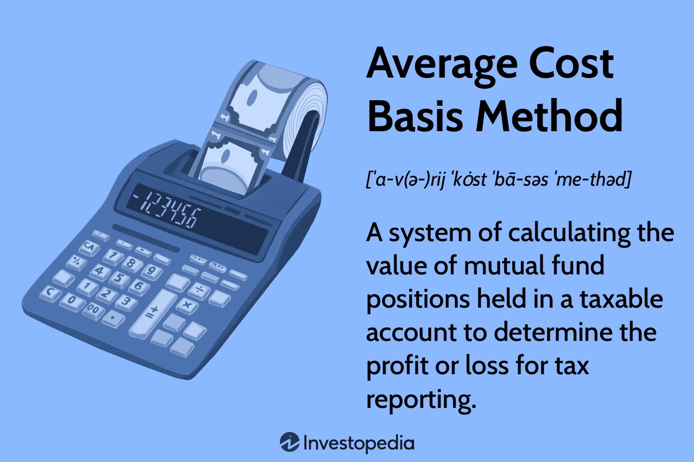

## Table of Contents

## What is the Average Cost Basis Method?

The Average Cost Basis Method is a way to figure out the cost of shares you own in a mutual fund or stock. When you buy more shares over time, the price you paid for each share might be different. Instead of keeping track of each price, you can use the average cost method. This method adds up the total amount you spent and divides it by the total number of shares you own. This gives you one average price per share.

This method is helpful because it simplifies things. It's easier to calculate your gains or losses when you sell your shares. For example, if you want to sell some shares, you don't need to decide which specific shares to sell. You just use the average price for all your shares. This can save time and reduce confusion, especially if you've been buying shares at different times and prices.

## Why is the Average Cost Basis Method important for investors?

The Average Cost Basis Method is important for investors because it makes managing their investments easier. When investors buy shares at different times and prices, keeping track of each purchase can be complicated. By using the average cost method, they can simplify this process. Instead of remembering the price of each share bought, they can calculate one average price for all their shares. This makes it easier to figure out how much they've gained or lost when they decide to sell some shares.

This method also helps investors when they need to report their taxes. When selling shares, investors need to know their cost basis to calculate capital gains or losses. Using the average cost method, they can quickly find this information without having to go through each transaction. This can save time and reduce the chance of making mistakes on tax returns. Overall, the Average Cost Basis Method is a useful tool that simplifies investment management and tax reporting for investors.

## How does the Average Cost Basis Method differ from other cost basis methods?

The Average Cost Basis Method is different from other methods because it calculates the cost of shares by averaging the price of all shares bought. For example, if you bought shares at different times and prices, this method adds up the total amount spent and divides it by the total number of shares. This gives you one average price per share. Other methods, like the First In, First Out (FIFO) method, treat each purchase separately. With FIFO, when you sell shares, you sell the oldest ones first, using their original purchase price to calculate gains or losses.

Another method is the Specific Identification method, where you choose which shares to sell. This can be useful if you want to minimize taxes by selling shares with a specific cost basis. For example, if you want to sell shares that have a lower cost basis to reduce your taxable gain, you can do that with the Specific Identification method. The Average Cost Basis Method doesn't let you pick and choose; it uses the same average price for all shares, which can be simpler but less flexible for tax planning.

In summary, the Average Cost Basis Method simplifies things by using one average price for all shares, making it easier to manage and report taxes. However, it lacks the flexibility of methods like FIFO and Specific Identification, which allow you to choose which shares to sell based on their individual purchase prices. Each method has its own advantages, and the best choice depends on an investor's specific needs and goals.

## What are the steps to calculate the average cost basis of an investment?

To calculate the average cost basis of an investment, start by adding up the total amount of money you spent on buying the shares. This includes every purchase you made, no matter when or how much you paid for each share. Next, count up the total number of shares you own from all those purchases. Once you have these two numbers, you can find the average cost basis by dividing the total amount spent by the total number of shares.

For example, imagine you bought 10 shares at $10 each and later bought another 20 shares at $15 each. The total amount spent would be $100 (10 shares x $10) plus $300 (20 shares x $15), which equals $400. The total number of shares you own is 30 (10 + 20). So, the average cost basis would be $400 divided by 30 shares, which comes out to about $13.33 per share. This average price helps you figure out your gains or losses if you decide to sell some of your shares.

## Can you provide an example of calculating the average cost basis for a stock?

Let's say you bought shares of a company called ABC Corp. First, you bought 50 shares at $20 each. A few months later, you bought another 30 shares at $25 each. To find the average cost basis, you need to add up the total amount you spent and then divide by the total number of shares you own. The total amount spent is $1,000 for the first purchase (50 shares x $20) plus $750 for the second purchase (30 shares x $25), which comes to $1,750. The total number of shares you own is 80 (50 + 30).

Now, to calculate the average cost basis, you divide the total amount spent by the total number of shares. So, $1,750 divided by 80 shares gives you an average cost basis of about $21.88 per share. This means that when you want to figure out how much you've gained or lost if you sell some of your ABC Corp shares, you can use this average price of $21.88 per share.

## What are the tax implications of using the Average Cost Basis Method?

When you use the Average Cost Basis Method, it can make your taxes easier to figure out. This method gives you one average price for all your shares, so when you sell some, you use this price to find out if you made a profit or a loss. This can save time because you don't have to look at each purchase separately. It's especially helpful if you've been buying shares at different times and prices. The IRS allows you to use this method for mutual funds and some stocks, which can make your tax reporting simpler.

However, using the Average Cost Basis Method might not always be the best choice for saving on taxes. Other methods, like the Specific Identification method, let you pick which shares to sell. This can help you lower your taxes by selling shares that have a lower cost basis, which means you pay less in capital gains tax. With the Average Cost Basis Method, you can't choose which shares to sell, so you might end up paying more in taxes than you would with other methods. It's a good idea to talk to a tax advisor to see which method works best for your situation.

## How does the Average Cost Basis Method affect dividend reinvestment plans (DRIPs)?

The Average Cost Basis Method is really helpful when you're using a Dividend Reinvestment Plan (DRIP). With a DRIP, you get dividends from your investment and use them to buy more shares. These new shares might have different prices each time you reinvest. Instead of keeping track of all these different prices, the Average Cost Basis Method lets you add up all the money you've spent and divide it by the total number of shares you own. This gives you one average price for all your shares, making it much easier to know how much you've paid for your investment.

This method is especially useful for DRIPs because you might be buying small amounts of shares often. If you're not using the Average Cost Basis Method, you'd need to remember the price of each little purchase, which can be a lot of work. With the Average Cost Basis Method, you just keep adding to your total cost and total shares. This way, when you want to sell some shares, you can quickly figure out your gains or losses using the average price. It's a simple way to handle the complexity of reinvesting dividends over time.

## Are there any specific regulations or guidelines for using the Average Cost Basis Method?

The Average Cost Basis Method is allowed by the IRS for calculating the cost of shares in mutual funds and certain dividend reinvestment plans (DRIPs). To use this method, you need to report it on your tax return when you sell shares. The IRS has rules about how you can switch between different cost basis methods. If you want to change from using the Average Cost Basis Method to another method, you have to do it for all your shares in that fund, not just some of them. Also, once you switch away from the Average Cost Basis Method, you can't go back to using it for that specific investment.

It's important to keep good records if you're using the Average Cost Basis Method. You need to track the total amount of money you've spent and the total number of shares you own. This helps you figure out the average cost per share correctly. If you're not sure about how to use this method or if it's the best choice for you, talking to a tax advisor can be really helpful. They can explain the rules and help you make the best decision for your taxes and investments.

## How does the Average Cost Basis Method apply to mutual funds and ETFs?

The Average Cost Basis Method is really helpful when you invest in mutual funds and ETFs. When you buy more shares of a mutual fund or ETF over time, the price you pay for each share might be different. Instead of keeping track of each price, you can use the Average Cost Basis Method. This method adds up all the money you spent and divides it by the total number of shares you own. This gives you one average price for all your shares, which makes it easier to figure out how much you've paid for your investment.

Using the Average Cost Basis Method with mutual funds and ETFs can simplify things, especially if you're buying shares regularly. For example, if you're investing in a mutual fund through a monthly plan, you might be buying shares at different prices each month. By using the average cost method, you don't have to remember each price. You just keep a running total of what you've spent and how many shares you have. This makes it easier to calculate your gains or losses when you sell some of your shares.

## What are the advantages and disadvantages of using the Average Cost Basis Method?

The Average Cost Basis Method has several advantages that make it a popular choice for investors. It simplifies the process of tracking investments because it gives you one average price for all your shares. This means you don't have to remember the price of each share you bought, which can be a lot of work if you're buying shares at different times and prices. It's especially helpful for mutual funds and dividend reinvestment plans where you might be buying small amounts of shares often. Using this method can also make your taxes easier to figure out because you use the same average price when you sell shares, which saves time and reduces the chance of making mistakes on your tax return.

However, the Average Cost Basis Method also has some disadvantages. One big downside is that it's less flexible when it comes to tax planning. Other methods, like the Specific Identification method, let you choose which shares to sell, which can help you save on taxes by picking shares with a lower cost basis. With the Average Cost Basis Method, you can't pick and choose; you have to use the average price for all shares, which might mean you pay more in taxes than you would with other methods. Also, if you decide to switch from the Average Cost Basis Method to another method, you have to do it for all your shares in that investment, not just some of them, and you can't switch back. This lack of flexibility can be a problem for some investors.

## How can investors track and manage their average cost basis over time?

Investors can track and manage their average cost basis over time by keeping good records of every purchase they make. Each time they buy shares, they should write down how many shares they bought and how much they paid for them. They can use a spreadsheet or a special app to keep track of this information. By adding up the total amount of money spent and dividing it by the total number of shares, they can find their average cost basis. It's important to update this information every time they buy more shares or reinvest dividends, so their average cost stays accurate.

Over time, managing the average cost basis can become easier with the right tools. Some investment platforms and brokerage accounts offer features that automatically calculate the average cost basis for you. This can save a lot of time and reduce the chance of making mistakes. If investors are using a dividend reinvestment plan, they need to make sure to include those reinvested dividends in their calculations. By staying organized and using the right tools, investors can keep a clear picture of their average cost basis, which helps them make smart decisions about when to sell their shares and how to handle their taxes.

## In what scenarios would the Average Cost Basis Method be most beneficial or least beneficial for an investor?

The Average Cost Basis Method is most beneficial for investors who buy shares often, like in a monthly investment plan or through a dividend reinvestment plan (DRIP). It's really helpful because it makes things simpler. Instead of remembering the price of each share you bought, you just need to keep track of the total amount you spent and the total number of shares you own. This gives you one average price for all your shares, which makes it easier to figure out if you've made money or lost money when you sell some shares. It's also good for people who want to save time on their taxes because using the average price can make tax reporting less complicated.

On the other hand, the Average Cost Basis Method might not be the best choice for investors who want more control over their taxes. If you're trying to save on taxes, other methods like the Specific Identification method let you pick which shares to sell. This can help you lower your taxes by choosing to sell shares that have a lower cost basis, which means you pay less in capital gains tax. With the Average Cost Basis Method, you can't pick and choose; you have to use the average price for all your shares, which might mean you pay more in taxes. So, if you're focused on tax planning and want to be flexible, this method might not be the best fit for you.

## What is Understanding Average Cost Basis?

Average cost basis is a straightforward method used to calculate the value of assets within an investment portfolio. It simplifies the determination of the cost of assets by averaging the purchase prices over time, rather than tracking each asset's purchase price individually. This approach is particularly useful in situations where multiple transactions involve identical securities and when calculating capital gains or losses. The average cost basis is a recognized method for tax reporting and is widely employed to comply with the tax laws in various jurisdictions.

### Calculation Process

To calculate the average cost basis, one would sum up the total cost of all purchased shares and then divide this by the total number of shares held. The formula can be expressed as:

$$
\text{Average Cost Basis} = \frac{\text{Total Purchase Cost of Shares}}{\text{Total Number of Shares Purchased}}
$$

For example, if an investor buys 100 shares of a stock at $20 each and later buys another 100 shares at $25 each, the average cost basis would be calculated as follows:

- Total cost for the first purchase: $100 \times 20 = 2000$
- Total cost for the second purchase: $100 \times 25 = 2500$
- Sum of all costs: $2000 + 2500 = 4500$
- Total shares purchased: $100 + 100 = 200$

Thus, the average cost per share would be:

$$
\text{Average Cost Basis} = \frac{4500}{200} = 22.50
$$

### Scenarios for Use

The average cost basis method is particularly beneficial when dealing with mutual funds, Exchange Traded Funds (ETFs), or stocks with frequent purchase transactions. It simplifies the process of determining profits or losses by maintaining a single cost basis figure rather than tracking each transaction individually. This eliminates the complexity and potential errors associated with reconciliating multiple purchase transactions.

Additionally, this method proves advantageous for tax reporting purposes, primarily when identifying the cost basis for capital gains tax calculations. When securities are sold, the difference between the sale price and the average cost basis determines the capital gain or loss. For example, if in the earlier scenario the investor sells 100 shares at $30, the capital gain would be calculated as:

- Sale revenue: $100 \times 30 = 3000$
- Cost of sold shares: $100 \times 22.50 = 2250$
- Capital Gain: $3000 - 2250 = 750$

Using the average cost basis can greatly facilitate compliance with tax regulations by streamlining the calculation of these gains or losses.

In summary, the average cost basis method offers simplicity and efficiency, making it a favored choice for many investors. However, it is crucial to recognize the acceptable use cases, such as in mutual funds and stocks with frequent transaction histories, to guarantee accurate tax reporting and strategic financial decisions.

## What are some examples and case studies?

The application of different cost basis methods can significantly impact investment outcomes, particularly in terms of tax implications and strategic decision-making. To illustrate these effects, consider a scenario where an investor purchases 100 shares of a company's stock on three separate occasions: 100 shares at $10 each, 100 shares at $15 each, and 100 shares at $20 each. The investor later decides to sell 150 shares when the market price reaches $25 per share.

### First-In, First-Out (FIFO) Method
Using the FIFO method, the first shares purchased are considered the first sold. In this case, the cost basis for the shares sold would be calculated as follows:  

- **Cost of first 100 shares:** $100 \times 10 = 1000$
- **Cost of next 50 shares:** $50 \times 15 = 750$

Thus, the total cost basis for the 150 shares sold would be $1,750. The capital gain realized from this transaction would be:

$$
(150 \times 25) - 1750 = 3750 - 1750 = 2000
$$

### Last-In, First-Out (LIFO) Method
Alternatively, under the LIFO method, the last shares purchased are assumed to be the first sold. In this scenario, the cost basis would be:  

- **Cost of last 100 shares:** $100 \times 20 = 2000$
- **Cost of remaining 50 shares from the previous lot:** $50 \times 15 = 750$

The total cost basis would amount to $2,750, leading to a capital gain of:

$$
(150 \times 25) - 2750 = 3750 - 2750 = 1000
$$

### Average Cost Basis Method
The average cost per share can also be used to determine the cost of the 150 shares sold. The average purchase price per share is calculated as:  

$$
\text{Average cost per share} = \frac{(100 \times 10 + 100 \times 15 + 100 \times 20)}{300} = \frac{4500}{300} = 15
$$

Therefore, the cost basis for the 150 shares is:

$$
150 \times 15 = 2250
$$

Resulting in a capital gain of:

$$
(150 \times 25) - 2250 = 3750 - 2250 = 1500
$$

### Tax Optimization and Strategic Decision-Making
The choice of cost basis method can, therefore, influence the capital gains reported and subsequent tax liabilities. The FIFO method, in this example, results in the highest capital gain and possibly a higher tax burden, whereas the LIFO and average cost methods reduce this liability. Strategic decision-making involves selecting the method best suited to minimize tax burdens or align with specific investment strategies, such as holding older stocks for longer to benefit from long-term capital gains tax rates.

### Real-World Implications
In practice, investors often select methods based on short-term vs. long-term benefits. For example, adopting the LIFO method might be advantageous in scenarios involving decreasing stock prices, as it helps minimize taxable gains. Conversely, FIFO may be preferred if an investor expects to hold a core position while trading around the edges.

These case studies underscore the importance of understanding different cost basis strategies. Their prudent application can lead to substantial tax savings and inform broader strategic decisions, contributing to optimized investment portfolios.

## References & Further Reading

[1]: Bergstra, J., Bardenet, R., Bengio, Y., & Kégl, B. (2011). ["Algorithms for Hyper-Parameter Optimization."](https://dl.acm.org/doi/10.5555/2986459.2986743) Advances in Neural Information Processing Systems 24.

[2]: ["Advances in Financial Machine Learning"](https://www.amazon.com/Advances-Financial-Machine-Learning-Marcos/dp/1119482089) by Marcos Lopez de Prado

[3]: ["Evidence-Based Technical Analysis: Applying the Scientific Method and Statistical Inference to Trading Signals"](https://www.amazon.com/Evidence-Based-Technical-Analysis-Scientific-Statistical/dp/0470008741) by David Aronson

[4]: ["Machine Learning for Algorithmic Trading"](https://github.com/PacktPublishing/Machine-Learning-for-Algorithmic-Trading-Second-Edition) by Stefan Jansen

[5]: ["Quantitative Trading: How to Build Your Own Algorithmic Trading Business"](https://books.google.com/books/about/Quantitative_Trading.html?id=j70yEAAAQBAJ) by Ernest P. Chan