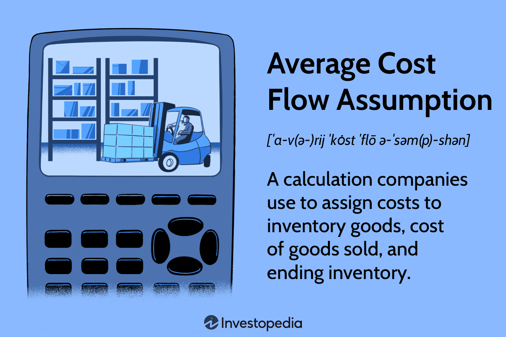

## Table of Contents

## What is the Average Cost Flow Assumption?

The Average Cost Flow Assumption is a way businesses figure out the cost of their inventory and the cost of goods they sell. It's like taking the average price of all the items they buy. When a business buys new items at different prices, they mix all these prices together and use the average to decide how much each item costs. This method helps smooth out the ups and downs in prices over time.

Using the Average Cost Flow Assumption can make things simpler for a business. It's easier to keep track of inventory costs because you don't have to worry about which items were bought first or last. This method is especially useful when prices are always changing. It gives a steady view of costs, which can help with planning and making decisions about buying more inventory or setting prices for customers.

## How does the Average Cost Flow Assumption differ from other inventory valuation methods?

The Average Cost Flow Assumption is different from other inventory valuation methods because it calculates the cost of inventory and goods sold by using an average price. This means it takes all the different prices a business pays for items and mixes them together to find a middle price. This average is then used for all inventory, no matter when it was bought. Other methods, like First-In, First-Out (FIFO) and Last-In, First-Out (LIFO), focus on the order in which items are bought and sold. FIFO assumes the first items bought are the first ones sold, while LIFO assumes the last items bought are the first ones sold. This can lead to different costs for inventory and goods sold, depending on how prices change over time.

Another key difference is how these methods handle price changes. With the Average Cost Flow Assumption, the impact of price changes is spread out over time, making the cost of inventory and goods sold more stable. This can be helpful for businesses that want a smoother view of their costs. On the other hand, FIFO and LIFO can show bigger swings in costs because they directly tie the cost of goods sold to the timing of purchases. If prices are going up, FIFO might show lower costs of goods sold because it uses older, lower prices, while LIFO might show higher costs because it uses newer, higher prices. This can affect a business's profits and taxes in different ways, depending on which method they use.

## What are the basic steps to calculate the average cost of inventory using this method?

To calculate the average cost of inventory using the Average Cost Flow Assumption, you start by adding up the total cost of all the items you have bought. This means you take the cost of each purchase and add them all together. Then, you count the total number of items you have bought. This gives you the total quantity of inventory.

Next, you divide the total cost by the total quantity to find the average cost per item. For example, if you bought 10 items for $100 and then another 10 items for $150, your total cost would be $250 and your total quantity would be 20 items. Dividing $250 by 20 gives you an average cost of $12.50 per item. You use this average cost for all your inventory, no matter when you bought the items.

## Can you provide a simple example of how to apply the Average Cost Flow Assumption?

Imagine you run a small store that sells hats. At the start of the month, you buy 50 hats for $10 each, so you spend $500. Later in the month, you buy another 50 hats, but this time they cost $12 each, so you spend $600. To find the average cost of your hats using the Average Cost Flow Assumption, you first add up the total cost of all the hats you bought. That's $500 from the first batch plus $600 from the second batch, which comes to $1100. Then, you count the total number of hats you bought, which is 50 from the first batch plus 50 from the second batch, making a total of 100 hats.

Now, you divide the total cost by the total number of hats to find the average cost per hat. So, $1100 divided by 100 hats gives you an average cost of $11 per hat. This means that no matter which hats you sell, you will use $11 as the cost for each hat in your inventory. If you sell 20 hats, you would count the cost of goods sold as 20 hats times $11 per hat, which equals $220. This method helps smooth out the different prices you paid for the hats and gives you a steady cost to work with.

## What are the advantages of using the Average Cost Flow Assumption for inventory valuation?

Using the Average Cost Flow Assumption for inventory valuation makes things simpler for a business. It's easy to figure out the cost of inventory because you just mix all the prices you paid for items and use the average. This means you don't have to keep track of which items you bought first or last. It's like taking all your costs, putting them in a blender, and using the smooth result for everything. This can save time and make your bookkeeping easier, especially if you're dealing with lots of items bought at different times and prices.

Another big advantage is that it helps smooth out the ups and downs in prices over time. If the price of what you're buying goes up and down a lot, using the average cost can give you a more steady view of your costs. This can be really helpful for planning and making decisions. When you know your costs are more stable, it's easier to decide how much to charge for your products or when to buy more inventory. This method can make your business run smoother and help you make better choices about money.

## What are the potential disadvantages or limitations of this method?

One downside of using the Average Cost Flow Assumption is that it might not show the real cost of your inventory as clearly as other methods. If prices are going up a lot, this method can make your costs look lower than they really are because it mixes old and new prices together. This can make your profits look bigger than they really are, which might not be good if you need to know the exact cost for making decisions or reporting to others.

Another limitation is that this method might not be allowed in some places. For example, in the United States, some businesses can't use this method for tax purposes because the government wants them to use different methods like LIFO. This can make things more complicated if you have to use one method for your own records and another for your taxes. It's important to check the rules in your area before deciding to use this method for your business.

## How does the Average Cost Flow Assumption affect financial statements?

The Average Cost Flow Assumption can make the cost of goods sold and the value of inventory on your financial statements look smoother over time. When you use this method, you mix all the different prices you paid for items together and use the average cost. This means that if the price of what you're buying goes up and down a lot, your costs won't jump around as much. This can make your profits look more steady, which might be good for planning and making decisions. It's like taking all your costs, putting them in a blender, and using the smooth result for everything on your financial statements.

However, this method can also hide the real ups and downs in your costs. If prices are going up, the Average Cost Flow Assumption might make your costs look lower than they really are because it includes older, lower prices in the mix. This can make your profits look bigger than they really are, which might not be good if you need to know the exact cost for making decisions or reporting to others. Also, in some places, you might not be allowed to use this method for tax purposes, which can make things more complicated if you have to use one method for your own records and another for your taxes.

## In what types of businesses is the Average Cost Flow Assumption most commonly used?

The Average Cost Flow Assumption is often used by businesses that sell lots of the same kind of item, like retail stores that sell things like clothes or electronics. These businesses might buy the same product at different times and at different prices. Using the average cost helps them keep things simple because they don't have to keep track of which items were bought first or last. It's like mixing all the costs together and using the middle price for everything.

This method is also popular with businesses that deal with items whose prices change a lot over time. For example, a company that sells fuel or commodities might find the Average Cost Flow Assumption helpful because it smooths out the ups and downs in prices. By using an average cost, these businesses can get a steadier view of their costs, which can help with planning and making decisions about buying more inventory or setting prices for customers.

## How does the Average Cost Flow Assumption comply with Generally Accepted Accounting Principles (GAAP)?

The Average Cost Flow Assumption is allowed under Generally Accepted Accounting Principles (GAAP) as one of the methods for valuing inventory. GAAP gives businesses a few choices for how to figure out the cost of their inventory, and the Average Cost Flow Assumption is one of them. This means that if a business decides to use this method, it's okay as long as they use it the same way all the time and follow the other rules that GAAP sets out.

However, it's important to know that not all countries or situations allow the Average Cost Flow Assumption. For example, in the United States, some businesses can't use this method for tax purposes and have to use other methods like LIFO. So, while GAAP says it's okay to use the Average Cost Flow Assumption for financial reporting, businesses need to check the rules in their area and for their specific situation to make sure they're doing things right.

## What are the tax implications of using the Average Cost Flow Assumption?

Using the Average Cost Flow Assumption can affect how much tax a business has to pay. This method mixes all the different prices a business pays for items and uses the average cost. If prices are going up, this can make the cost of goods sold look lower than if you used a method like LIFO, which uses the newest, highest prices. Lower costs of goods sold can mean higher profits on paper, and that means more taxes. So, a business might end up paying more in taxes if they use the Average Cost Flow Assumption when prices are rising.

However, not all places allow businesses to use the Average Cost Flow Assumption for tax purposes. In the United States, for example, some businesses have to use LIFO for tax reporting, even if they use the Average Cost Flow Assumption for their own financial statements. This can make things more complicated because a business might need to keep two sets of books: one for their own records and another for tax purposes. It's important for businesses to check the tax rules in their area before deciding to use the Average Cost Flow Assumption, to make sure they're doing things the right way and not paying more taxes than they need to.

## How does the Average Cost Flow Assumption handle price fluctuations and inventory turnover?

The Average Cost Flow Assumption helps businesses deal with price changes by mixing all the different prices they pay for items and using the average cost. This means if the price of what they're buying goes up and down a lot, the cost of their inventory won't jump around as much. It's like taking all the costs, putting them in a blender, and using the smooth result for everything. This can make things easier for a business because they don't have to worry about which items they bought first or last. It's especially helpful for businesses that sell lots of the same kind of item, like a store that sells clothes or electronics.

When it comes to inventory turnover, the Average Cost Flow Assumption treats all items the same, no matter when they were bought. This means that if a business sells some of their inventory, they use the average cost for the cost of goods sold. This can make the cost of goods sold look more steady over time, even if the business is buying and selling items at different prices. It's good for businesses that want a smooth view of their costs, but it might not show the real ups and downs in prices as clearly as other methods.

## What advanced considerations should be taken into account when implementing the Average Cost Flow Assumption in a large-scale operation?

When using the Average Cost Flow Assumption in a big business, it's important to think about how well your computer systems can handle it. You'll need good software that can keep track of all the different prices you pay for items and then figure out the average cost. This can be a lot of work, especially if you have lots of different kinds of inventory. You also need to make sure everyone in your business understands how to use this method and why it's helpful. Training your team and making sure they know how to use the software is a big part of getting it right.

Another thing to think about is how this method might affect your taxes and financial reports. In some places, you might not be able to use the Average Cost Flow Assumption for taxes, so you'll need to keep two sets of books: one for your own records and another for tax purposes. This can make things more complicated, but it's important to follow the rules. Also, if prices are going up, using the average cost can make your profits look bigger than they really are, which can affect how you plan for the future and make decisions about buying more inventory or setting prices for customers.

## What are Average Cost Flow Assumptions and how do we understand them?

Average cost flow assumption is a critical principle in accounting, particularly relevant to inventory management and financial reporting. This method is an inventory valuation technique where the cost of goods sold (COGS) and ending inventory are calculated based on the average cost of all similar goods available during a specific period. The significance of this method lies in its ability to smooth out price fluctuations over time, providing a more consistent and manageable approach for valuing inventory. This consistency is important for businesses that require stable financial reports without significant variances due to market price changes.

To calculate the average cost, one must divide the total cost of available goods by the total number of units available. The formula is as follows:

$$
\text{Average Cost} = \frac{\text{Total Cost of Available Goods}}{\text{Total Units Available}}
$$

For example, if a company has three batches of inventory purchased at different costs, the average cost would be calculated by summing the total cost of these purchases and then dividing by the total number of units.

The implications of using the average cost flow assumption are profound in both inventory management and financial reporting. In inventory management, this method simplifies decision-making processes by providing a standard cost per unit that can be applied across all inventory items, thus facilitating pricing strategies, budgeting, and cost control measures. It helps businesses manage large volumes of inventory without having to track the cost of individual items, which can be particularly beneficial in industries where goods are homogeneous, such as manufacturing or retail.

In financial reporting, adopting the average cost flow approach ensures that financial statements reflect a more realistic view of a company's profitability and cost structure by mitigating the effects of volatile price changes. This can be especially advantageous during periods of inflation or deflation, where large discrepancies in inventory costs can lead to significant variations in reported earnings. Furthermore, the consistency and simplicity of this method align well with generally accepted accounting principles (GAAP) and International Financial Reporting Standards (IFRS), ensuring compliance and comparability across reporting periods.

In conclusion, the average cost flow assumption plays a pivotal role in stabilizing inventory valuation and financial reporting by providing a uniform cost metric, which aids in decision-making while ensuring compliance and consistency across financial documents.

## What is the role in inventory management?

The average cost method is widely used across various industries, including retail, manufacturing, and logistics, due to its straightforward approach to inventory management and cost calculation. This method provides a consistent valuation of inventory by averaging out the cost of goods available for sale, which can be particularly advantageous in environments dealing with a large [volume](/wiki/volume-trading-strategy) of similar goods.

In retail, the average cost method simplifies inventory management when handling large quantities of similar products, such as clothing or electronics. By calculating the average cost per item, retailers can standardize their pricing strategy more efficiently, ensuring that their pricing reflects a consistent profit margin across all similar goods. This uniformity helps in maintaining competitive pricing while minimizing the risk of price fluctuations influencing inventory valuation.

For example, if a retailer purchases 100 units of a product at $10 each and another 150 units at $12 each, the average cost per unit is calculated as follows:

$$
\text{Average Cost} = \frac{(100 \times 10) + (150 \times 12)}{100 + 150} = \frac{1000 + 1800}{250} =  $11.20
$$

This average cost ensures that the retailer can price each unit in the inventory at a stable rate, thereby simplifying the sales process and financial reporting.

In the manufacturing sector, the average cost method assists in managing inventory costs associated with raw materials and finished goods. Manufacturers dealing with fungible input materials, such as chemicals or metals, benefit from the average cost approach as it mitigates the impact of price volatilities and supply chain disruptions. This cost averaging enables manufacturers to develop more reliable pricing strategies for their products, thus enhancing their competitive position.

When applied to logistics, the average cost method aids in the valuation of inventory stored across various warehouses. For logistics companies that deal with vast quantities of interchangeable inventory items, such as packaging supplies, the average cost method simplifies inventory tracking and financial documentation. It fosters better coordination in supply chain management by providing a unified cost reference that supports decision-making in ordering and inventory replenishment.

Overall, the use of the average cost method in inventory management has profound implications for pricing strategies and supply chain decision-making. By allowing industries to stabilize inventory costs and simplify financial reporting, businesses can enhance their operational efficiency and strategic planning capabilities.

## References & Further Reading

[1]: ["Inventory Management: Principles and Strategies for the Efficient Flow of Inventory across the Supply Chain"](https://www.pearson.com/en-us/subject-catalog/p/definitive-guide-to-inventory-management-the-principles-and-strategies-for-the-efficient-flow-of-inventory-across-the-supply-chain/P200000008968/9780133448825) by Edward A. Silver, David F. Pyke, and Rein Peterson

[2]: ["Cost Accounting: A Managerial Emphasis"](https://www.amazon.com/Cost-Accounting-Managerial-Charles-Horngren/dp/0131495380) by Charles T. Horngren, Srikant M. Datar, and Madhav V. Rajan

[3]: ["Accounting Standards and COGS: A Comprehensive Guide to Inventory Valuation"](https://cashflowinventory.com/blog/inventory-valuation/) by International Financial Reporting Standards (IFRS)

[4]: ["Advanced Algorithmic Trading: Learn How to Build Robust and Scalable Trading Programs"](https://www.quantifiedstrategies.com/how-to-build-an-algorithmic-trading-strategy/) by Sourav Ghosh

[5]: ["Algorithmic Trading & DMA: An Introduction to Direct Access Trading Strategies"](https://www.amazon.com/Algorithmic-Trading-DMA-introduction-strategies/dp/0956399207) by Barry Johnson