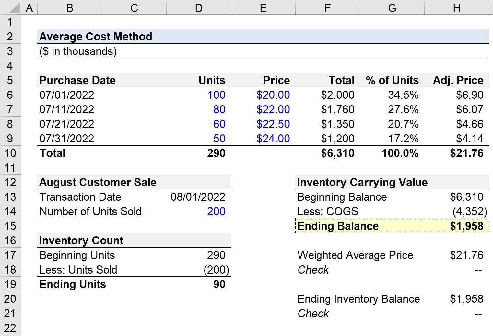

## Table of Contents

## What is the Average Cost Method?

The Average Cost Method is a way to figure out the cost of items that you buy and sell over time. It's often used for things like stocks or inventory in a business. Instead of keeping track of the exact price you paid for each item, you take the total cost of all the items and divide it by the total number of items. This gives you an average cost per item, which you can use when you sell something.

This method is helpful because it's simple and doesn't require you to keep detailed records of every single purchase. It smooths out the ups and downs in prices, so it's easier to manage. For example, if you bought some shares at different prices, you wouldn't need to remember which shares you're selling. You just use the average cost of all the shares you own. This can save time and make your accounting easier.

## How does the Average Cost Method differ from other inventory valuation methods?

The Average Cost Method is different from other inventory valuation methods like First-In, First-Out (FIFO) and Last-In, First-Out (LIFO) because it calculates the cost of goods sold and ending inventory based on an average cost of all units available for sale during the period. With the Average Cost Method, you add up the total cost of all the items you bought and divide it by the total number of items. This gives you an average cost per item, which you use for both the cost of goods sold and the value of the ending inventory. This method is simpler because you don't need to keep track of which items were bought first or last.

In contrast, FIFO assumes that the first items you bought are the first ones you sell. So, if prices are going up, the cost of goods sold will be lower because you're selling the older, cheaper items first. The ending inventory will be valued at the newer, higher prices. LIFO, on the other hand, assumes that the last items you bought are the first ones you sell. If prices are rising, the cost of goods sold will be higher because you're selling the newer, more expensive items first, and the ending inventory will be valued at the older, lower prices. Both FIFO and LIFO require you to keep detailed records of when you bought each item, which can be more complicated than using the Average Cost Method.

## What is the formula used in the Average Cost Method?

The formula for the Average Cost Method is pretty simple. You take the total cost of all the items you have and divide it by the total number of items. This gives you the average cost per item. For example, if you bought 10 items for $100 and then another 10 items for $150, the total cost would be $250 for 20 items. The average cost per item would be $250 divided by 20, which equals $12.50.

When you sell an item, you use this average cost to figure out the cost of goods sold. So, if you sold one of those items for $20, the cost of goods sold would be $12.50, and your profit would be $20 minus $12.50, which is $7.50. The remaining items in your inventory would still be valued at $12.50 each. This method makes things easier because you don't need to keep track of which items you bought first or last.

## Can you provide a simple example of how to calculate the average cost?

Let's say you bought 5 apples for $10 and then bought another 5 apples for $15. To find the average cost of an apple, you add up the total cost of all the apples, which is $10 plus $15, giving you $25. Then, you divide that total cost by the total number of apples, which is 10 apples. So, $25 divided by 10 equals $2.50. That means the average cost of each apple is $2.50.

Now, if you sell one of those apples for $3, you use the average cost to figure out your profit. The cost of the apple you sold is $2.50, so your profit is $3 minus $2.50, which is $0.50. The remaining 9 apples in your inventory are still valued at $2.50 each. This way, you don't need to remember which apples you bought first or last; you just use the average cost for all of them.

## How is the Average Cost Method applied in accounting?

In accounting, the Average Cost Method is used to figure out the cost of goods sold and the value of the inventory left at the end of a period. It's a way to make things simpler because you don't need to keep track of the exact price you paid for each item. Instead, you add up the total cost of all the items you bought and divide it by the total number of items. This gives you an average cost per item, which you use when you sell something. For example, if you bought some inventory at different prices over time, you wouldn't need to remember which items you're selling. You just use the average cost of all the items in your inventory.

This method is helpful for businesses because it smooths out the ups and downs in prices, making it easier to manage accounting records. When you sell an item, you use the average cost to calculate the cost of goods sold, which affects your profit. For instance, if your average cost for an item is $10 and you sell it for $15, your profit is $5. The remaining items in your inventory are still valued at the average cost until you buy more items or sell more. This approach is especially useful for businesses that deal with large volumes of similar items, like retail stores or companies that manage stock portfolios.

## What are the advantages of using the Average Cost Method?

The Average Cost Method is easy to use because it doesn't require you to keep track of every single purchase. Instead, you just add up the total cost of all the items and divide it by the total number of items. This gives you one average cost that you can use for all your items. It's simpler than other methods like FIFO or LIFO, where you need to remember which items you bought first or last. This makes it a good choice for businesses that don't want to spend a lot of time on detailed record-keeping.

Another advantage of the Average Cost Method is that it smooths out the ups and downs in prices. If you buy items at different times and the prices change, using the average cost means you don't have big swings in the cost of goods sold. This can make your financial reports look more stable and easier to understand. It's especially helpful for businesses that deal with a lot of similar items, like stores selling many of the same product, because it makes managing inventory and calculating profits much simpler.

## What are the disadvantages of using the Average Cost Method?

One disadvantage of the Average Cost Method is that it might not give you the most accurate picture of your costs. If prices are going up or down a lot, using an average cost can hide these changes. For example, if you bought some items at a low price and then the price went up, the average cost might make it look like you're making less profit than you really are. This can be a problem if you need to know exactly how much you're making on each item.

Another issue is that the Average Cost Method might not work well with some tax rules. In some countries, tax laws might require you to use a different method like FIFO or LIFO. If you use the Average Cost Method and then need to switch to another method for tax purposes, it can be confusing and might cost you more money. So, it's important to check what the tax rules are in your area before deciding to use this method.

## How does the Average Cost Method affect financial statements?

The Average Cost Method can make your financial statements look smoother because it uses an average cost for all your items. Instead of showing big changes in the cost of goods sold when prices go up or down, this method spreads out the costs over time. This can make your profits look more stable from one period to the next. For example, if you bought some items at a low price and then the price went up, using the average cost would make it seem like your costs didn't change as much.

However, this method can also hide important details about your costs. If prices are changing a lot, the Average Cost Method might not show you the real profit you're making on each item. This can be a problem if you need to know exactly how much you're making to make good business decisions. Also, if tax laws in your area require you to use a different method like FIFO or LIFO, using the Average Cost Method might cause problems when you're doing your taxes.

## In what scenarios is the Average Cost Method most beneficial?

The Average Cost Method is really helpful when you have a lot of the same kind of items and you don't want to keep track of every single purchase. It's great for businesses like retail stores that buy and sell lots of similar products. Instead of remembering which items you bought first or last, you just use one average cost for all of them. This makes it easier to manage your inventory and figure out how much you're making on each sale.

This method also works well when prices are going up and down a lot. Using the average cost smooths out these price changes, so your financial reports look more stable. It's easier to see how your business is doing over time without big swings in the numbers. But remember, this method might not be the best if you need to know the exact profit on each item or if tax laws in your area require a different way of calculating costs.

## How do changes in inventory levels impact the Average Cost Method?

When you use the Average Cost Method, changes in your inventory levels can affect how you calculate the cost of goods sold and the value of your remaining inventory. If you buy more items, you add the cost of those new items to the total cost and then divide by the new total number of items. This gives you a new average cost per item. For example, if you had 10 items at an average cost of $10 each and then bought 5 more items for $75, your new total cost would be $175 for 15 items, making the new average cost $11.67 per item.

When you sell items, the number of items in your inventory goes down, but the average cost per item stays the same until you buy more items. So, if you sell one of those items at the new average cost of $11.67, the cost of goods sold for that item would be $11.67. The remaining 14 items would still be valued at $11.67 each. This method keeps things simple because you don't need to keep track of which items you bought first or last, but it can make your costs look different if you're buying and selling a lot of items at different prices.

## Can you explain how to adjust the Average Cost Method for returns and discounts?

When you have returns or get discounts on items you bought, you need to adjust the total cost and the total number of items in your inventory to keep using the Average Cost Method. If you return some items, you take the cost of those returned items away from your total cost and subtract the number of returned items from your total number of items. This gives you a new total cost and a new total number of items, which you then use to find a new average cost. For example, if you had 20 items at a total cost of $200 and you returned 5 items that cost $50, your new total cost would be $150 for 15 items, making the new average cost $10 per item.

If you get a discount on items you already bought, you also need to adjust the total cost. You subtract the amount of the discount from the total cost you paid for those items. The number of items stays the same, but the total cost goes down, so the average cost per item changes. For instance, if you bought 10 items for $100 and then got a $20 discount, your new total cost would be $80 for 10 items, making the new average cost $8 per item. This way, you keep your average cost up to date with any returns or discounts, which helps you figure out the cost of goods sold and the value of your inventory accurately.

## What are the tax implications of using the Average Cost Method?

Using the Average Cost Method can affect your taxes because it changes how you figure out the cost of goods sold and the value of your inventory. If you use this method, you might end up with different numbers for your profits and taxes compared to other methods like FIFO or LIFO. Some countries have specific tax rules that might not allow you to use the Average Cost Method, or they might require you to use a different method for tax purposes. So, it's important to check with a tax professional to make sure you're following the right rules for your area.

If you're allowed to use the Average Cost Method for taxes, it can make your tax calculations simpler. Since you're using an average cost for all your items, you don't need to keep detailed records of when you bought each item. This can save time and make it easier to figure out your taxes. But remember, if prices are going up or down a lot, the Average Cost Method might not show the real profit you're making on each item, which could affect how much tax you owe.

## What is the Understanding of the Average Cost Method?

The Average Cost Method, also referred to as the weighted-average method, is a technique employed in inventory valuation that simplifies the process by averaging the costs of goods. This method determines the cost allocated to inventory items by dividing the total cost of goods purchased or produced by the total number of units available. This approach proves particularly beneficial in businesses where inventory items are indistinguishable from one another, such as in industries dealing with bulk commodities or homogenous product lines.

The main advantage of the Average Cost Method lies in its straightforwardness. By averaging costs, it eliminates the need to track each item individually, reducing the complexity involved in inventory management. This simplicity aids in calculating both the Cost of Goods Sold (COGS) and the ending inventory value. The formula used for calculating the average cost per unit is as follows:

$$
\text{Average Cost Per Unit} = \frac{\text{Total Cost of Goods Available for Sale}}{\text{Total Units Available for Sale}}
$$

Once the average cost per unit is determined, it is utilized to ascertain the value of COGS and the ending inventory, crucial metrics for financial statements. This uniform cost allocation method allows businesses to streamline their accounting processes and focus on operational efficiency.

## How does the Average Cost Method work?

When applying the Average Cost Method, businesses calculate the cost per unit of inventory by summing the total cost of goods available for sale and dividing this by the total number of units. This calculation can be expressed mathematically as:

$$

\text{Average Cost Per Unit} = \frac{\text{Total Cost of Goods Available for Sale}}{\text{Total Number of Units Available}} 
$$

This method is instrumental in determining both the cost of goods sold (COGS) and the value of ending inventory. By applying the average cost per unit to the number of units sold during a given period, businesses can calculate COGS. Similarly, the value of the ending inventory is derived by applying the average cost per unit to the remaining units in stock at the end of the period.

The Average Cost Method is compatible with both perpetual and periodic inventory systems. In a perpetual inventory system, inventory records are updated continuously. This allows businesses to recalculate the average cost per unit as additional inventory is purchased, providing real-time inventory valuation. Conversely, in a periodic inventory system, the inventory records are updated at specific intervals, typically at the end of an accounting period. The average cost is computed during these intervals, and adjustments to COGS and ending inventory are made accordingly.

The choice between perpetual and periodic systems hinges on a business's operational needs. Companies engaged in high-[volume](/wiki/volume-trading-strategy) transactions may benefit from the real-time tracking inherent in perpetual systems, while businesses with lower transaction frequencies may find periodic systems sufficient and cost-effective. Nonetheless, regardless of the chosen system, the Average Cost Method remains a straightforward and efficient approach to inventory valuation.

## What is an Example Calculation Using the Average Cost Method?

Consider a scenario where a company purchases inventory in sequential batches at different costs. The Average Cost Method provides a systematic approach to assign costs to both the Cost of Goods Sold (COGS) and the ending inventory, which is essential for maintaining accurate financial records.

To illustrate, let's assume a company made the following inventory purchases:
- 100 units at $1,000
- 200 units at $1,020
- 150 units at $1,050

First, calculate the total cost and total number of units:
$$
\text{Total Cost} = (100 \times 1,000) + (200 \times 1,020) + (150 \times 1,050)
$$
$$
\text{Total Cost} = 100,000 + 204,000 + 157,500 = 461,500
$$

$$
\text{Total Units} = 100 + 200 + 150 = 450
$$

Next, calculate the average cost per unit using the formula:
$$
\text{Average Cost per Unit} = \frac{\text{Total Cost}}{\text{Total Units}}
$$
$$
\text{Average Cost per Unit} = \frac{461,500}{450} \approx 1,025.56
$$

This average cost of $1,025.56 per unit is then used to determine the cost of goods sold and the value of the ending inventory. For example, if the company sells 300 units, the COGS would be calculated as follows:
$$
\text{COGS} = 300 \times 1,025.56 \approx 307,668
$$

The ending inventory, comprising 150 unsold units, would be calculated as:
$$
\text{Ending Inventory} = 150 \times 1,025.56 \approx 153,834
$$

This method is particularly useful for companies with homogeneous products, as it simplifies the accounting process by avoiding the need to track individual costs for each unit. Employing the Average Cost Method helps ensure an efficient and reliable approach to inventory valuation, providing clarity and consistency in financial reporting.

## References & Further Reading

[1]: ["Financial Accounting Standards Board (FASB)"](https://fasb.org/standards) - A key resource for understanding Generally Accepted Accounting Principles (GAAP) and how they relate to inventory valuation.

[2]: ["International Financial Reporting Standards (IFRS)"](https://www.investopedia.com/terms/i/ifrs.asp) - Provides guidelines on how inventory should be valued and reported under international accounting standards.

[3]: ["Cost Accounting: A Managerial Emphasis"](https://archive.org/details/20240317_20240317_0811) by Charles T. Horngren, Srikant M. Datar, and Madhav V. Rajan - A comprehensive textbook covering various inventory valuation methods, including the Average Cost Method.

[4]: ["Algorithmic Trading: Winning Strategies and Their Rationale"](https://www.amazon.com/Algorithmic-Trading-Winning-Strategies-Rationale-ebook/dp/B00CY5HC0U) by Ernest P. Chan - Offers insights into algorithmic trading strategies and their impact on financial markets.

[5]: ["Inventory and Production Management in Supply Chains"](https://www.taylorfrancis.com/books/mono/10.1201/9781315374406/inventory-production-management-supply-chains-edward-silver-david-pyke-douglas-thomas) by Edward A. Silver, David F. Pyke, and Rein Peterson - Discusses inventory management strategies and techniques, including the Average Cost Method.