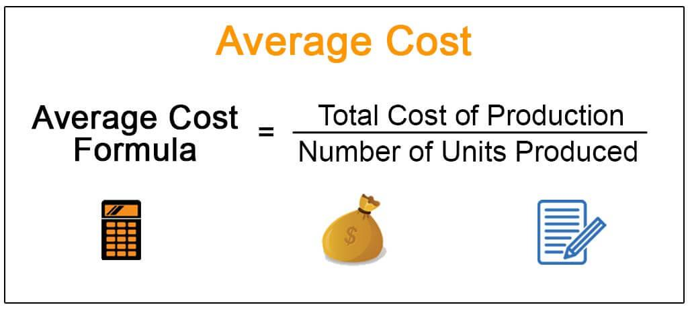

Average cost pricing is a foundational concept in economics, particularly relevant in contexts where natural monopolies and industry regulation are involved. It serves as a regulatory mechanism to ensure that monopolistic firms, especially in utilities, charge prices that reflect their average costs rather than exploiting their market position to secure excessive profits. This rule is crucial in preventing consumer exploitation while enabling firms to cover their operational costs and gain a reasonable return on their investments.

In the global financial markets, a profound understanding of how average cost pricing intersects with economic theory is vital. This knowledge is not only relevant for economists but also for traders and analysts who engage in algorithmic trading (algo trading). Algorithmic trading relies heavily on sophisticated statistical models and real-time data analysis to optimize trading decisions effectively. As average cost pricing influences the pricing strategies of regulated monopolies, traders can anticipate regulatory price adjustments, which, in turn, impacts trading strategies.

This article investigates into the intricacies of the average cost pricing rule, examining its significance in economic theory and its practical applications in today's trading ecosystem. The aim is to offer a comprehensive overview, synthesizing economic principles with practical investment strategies. By exploring the dynamics between average cost pricing and algo trading, the article sheds light on how understanding this pricing strategy can enhance decision-making in volatile financial environments.

Additionally, the discussion will cover the benefits and potential challenges associated with the implementation of average cost pricing for both businesses and regulators. While this pricing strategy promotes fairness and market stability, it also presents challenges in competitive and dynamic markets where pricing adaptability is crucial. This exploration seeks to provide readers with insights into the role of average cost pricing in modern economics and its potential future trajectory amidst technological advancements and evolving market conditions.

## Table of Contents

## What Is Average Cost Pricing?

Average cost pricing is a widely used pricing strategy in which a company sets its product prices at a level that is close to the average cost of production. This approach ensures that the business can cover its production costs while achieving normal profit margins. The practice of average cost pricing is particularly relevant in regulated monopolies, such as public utilities, where the prevention of excessive pricing and profits is a significant regulatory concern. By setting prices based on average costs, these monopolies are discouraged from exploiting their market position to the detriment of consumers.

The fundamental rationale behind average cost pricing is the balance between enabling businesses to sustain their operations and providing consumers with fair prices. Companies calculate their average cost by taking the total cost of production and dividing it by the total output, illustrated by the formula:

$$
\text{Average Cost (AC)} = \frac{\text{Total Cost (TC)}}{\text{Quantity (Q)}}
$$

In this context, "total cost" includes both fixed costs, which do not vary with output, and variable costs, which do. Average cost pricing thus allows firms to recover these combined costs through their pricing strategies. For regulated monopolies, setting prices at or near this average cost level aligns with regulatory goals to protect consumers from excessive pricing while providing the businesses with a reasonable return on their investments.

Regulators often employ this method to ensure that essential services remain accessible to the general public without overburdening them with high costs. By doing so, regulators can encourage efficiency and fairness in pricing, fostering a market environment that benefits both the service providers and the consumers.

## Economic Theory Behind Average Cost Pricing

The economic foundations of average cost pricing were significantly explored by economists Paul S. Hall and Charles J. Hitch in the context of oligopolistic markets. Their study revealed that many firms, when operating under oligopoly, tend to set their prices based on average costs rather than marginal costs. This behavior suggests a practical shift from the theoretical model of marginal-cost pricing, which posits that firms maximize profits by setting prices equal to the marginal cost of producing an additional unit.

Average cost pricing aligns with the principle of fairness in competitive practices, particularly in scenarios where conventional demand and supply analysis falls short. Under oligopoly, where a few large firms dominate the market, firms often face uncertainties regarding competitor responses and future demand. Hall and Hitch's analysis demonstrates that firms respond by pricing their products to cover the average total cost, which includes both fixed and variable costs, ensuring that they can maintain operations and achieve normal profits without significant risk exposure.

Mathematically, the average cost $AC$ can be expressed as:

$$
AC = \frac{TC}{Q}
$$

Where:
- $TC$ is the total cost, comprising fixed costs $FC$ and variable costs $VC$.
- $Q$ is the output quantity.

This pricing strategy provides a sustainable operational model, especially for firms unable to predict market dynamics or subject to non-price competition. As a counterpoint to marginal-cost pricing, which arguably optimizes resource allocation and maximizes efficiency, average cost pricing provides a buffer by focusing on long-term viability and avoiding the pitfalls of undercutting that could potentially lead to financial instability.

In summary, the transition to average cost pricing from marginal cost considerations illustrates a pragmatic approach within economic theory, accommodating for real-world complexities such as imperfect information and oligopolistic interdependence. This methodological shift highlights the need for companies to sustain operations over the long term while ensuring that their pricing strategies do not distort market equity or consumer welfare.

## Application of Average Cost Pricing in Algorithmic Trading

Algorithmic trading, also known as algo trading, leverages advanced computational methods to execute trades at exceptional speeds and volumes. A critical component of this approach is the integration of cost data, such as average cost pricing, which plays a significant role in optimizing trading strategies and managing risk.

In the context of natural monopolies, where average cost pricing is often applied, understanding these regulatory price adjustments can provide traders with a strategic advantage. By anticipating changes in pricing due to regulatory interventions, algo trading algorithms can adjust their trading patterns, improving profitability while adhering to compliance requirements. For instance, if a natural monopoly adjusts its prices based on average costs, traders who have incorporated this data into their algorithms can quickly adapt their strategies, reducing the potential for unexpected losses.

Algo trading platforms utilize real-time data analytics, incorporating various cost metrics, such as the average cost, to enhance decision-making processes. This real-time approach minimizes the risks associated with market price [volatility](/wiki/volatility-trading-strategies) by ensuring that trading actions are based on the most current and accurate financial data available. The integration of average cost pricing into these systems allows for better forecasting and risk management, contributing to more stable and resilient trading operations.

The mathematical models used in [algorithmic trading](/wiki/algorithmic-trading) often include cost functions where the average cost data is integral. For example, if $C$ represents the total cost and $Q$ the quantity of goods, the average cost $AC$ is given by the formula:

$$
AC = \frac{C}{Q}
$$

Trading algorithms might employ such formulas to evaluate different pricing strategies under varying market conditions. As markets become more automated, the emphasis on accurate cost integration only increases, enhancing the overall efficacy of algorithmic trading systems. This technical synergy enables traders not only to execute efficient trades but also to navigate the complexities of regulated markets with precision.

## Comparison: Average-Cost vs. Marginal-Cost Pricing

Marginal-cost pricing and average-cost pricing represent distinct approaches to setting prices within economic frameworks. Each has its own implications for efficiency, sustainability, and market regulation.

### Marginal-Cost Pricing

Marginal-cost pricing sets prices equal to the marginal cost, which is the cost of producing one additional unit of a good or service. This pricing strategy theoretically leads to allocative efficiency, as it results in a price that reflects the incremental cost of production. Mathematically, if $MC$ represents marginal cost, then the price $P$ is set such that $P = MC$.

Marginal-cost pricing is advantageous in scenarios where maximizing efficiency and consumer surplus is the priority. It signals producers to adjust supply according to consumer demand, thus ensuring resources are allocated optimally. However, this approach can be impractical in environments with high fixed costs, like utilities, where the marginal cost may be significantly lower than average total costs, potentially leading to financial losses for producers.

### Average Cost Pricing

Average-cost pricing, on the other hand, involves setting prices based on the average total cost, calculated by dividing total costs by the quantity produced. This ensures that all costs, including fixed and variable, are covered. The formula can be expressed as $AC = \frac{TC}{Q}$, where $TC$ represents total cost and $Q$ the quantity produced.

This approach is often favored in regulated industries where stability is crucial, such as public utilities or other natural monopolies where the infrastructure cost is high and the allocation of resources does not align neatly with marginal adjustments. Average cost pricing helps prevent monopolies from charging excessively high prices while ensuring they recover their total costs, including a fair return on investment.

### Scenarios and Applications

**Marginal-Cost Pricing:**
- Ideal in competitive markets where the focus is on maximizing efficiency and consumer welfare.
- Suitable for industries with low fixed costs and high variable costs, or where products are homogenous, and competition is fierce.

**Average-Cost Pricing:**
- Appropriate in natural monopolies and industries requiring extensive infrastructure investments, such as electricity or water services.
- Provides a more stable pricing strategy in markets with significant fixed costs, enabling firms to sustain operations.

In conclusion, while marginal-cost pricing offers efficiency, average-cost pricing provides a pragmatic solution in regulated contexts, particularly where long-term sustainability and consumer protection are priorities. Understanding when to apply each strategy is crucial for balancing economic efficiency with practical business considerations.

## Challenges and Criticisms of Average Cost Pricing

Average cost pricing is often subject to criticism primarily because it can conflict with the goals of profit maximization, which is a fundamental principle in many business operations. In competitive markets, firms generally aim to maximize profits by setting prices where marginal cost equals marginal revenue. However, under average cost pricing, prices are set to cover the average cost of production and provide a normal profit, which might not necessarily coincide with the profit-maximizing point. This divergence can lead businesses to operate below their potential efficiency, resulting in lost opportunities for profit enhancement.

One of the primary concerns with average cost pricing is its potential to cause resource misallocation, especially in dynamic markets where demand and production costs can fluctuate rapidly. In such scenarios, sticking to a pricing structure based on average costs might lead firms to misjudge the allocation of resources, such as labor and capital. This misalignment often results from the inherent inflexibility of average cost pricing, which does not promptly adapt to market changes. Consequently, firms may either overproduce or underproduce relative to market needs, fostering inefficiencies in the market.

The rigidity of average cost pricing raises significant debate regarding its effect on market competition. Critics argue that it can inhibit competitive dynamics by imposing a standard price level that does not reflect real-time market conditions. For instance, in markets characterized by high volatility, average cost pricing tends to dampen the price signals that are critical for driving competition and innovation. This pricing approach may also deter entry by new competitors who find it challenging to compete against established firms that adhere to regulatory average cost pricing models, thereby strengthening monopolistic tendencies.

Moreover, the use of average cost pricing can lead to the maintenance of inefficient production practices. Firms might lack the incentive to innovate or reduce costs if their pricing structures are predetermined to cover existing average costs. This lack of incentive can stifle technological advancements and cost-saving improvements, slowing the overall growth and dynamism of industries subject to such pricing regulation.

In conclusion, while average cost pricing serves as a tool for controlling prices in monopolistic and regulated industries to prevent excessive profiteering, it has inherent drawbacks that can undermine market efficiency and competition. As such, its application should be carefully calibrated to balance the protection of consumer interests with the encouragement of innovation and efficiency in the marketplace.

## Future Outlook: Average Cost Pricing in Modern Economics

As markets embrace automation and data-driven mechanisms, the application of average cost pricing is evolving in modern economics. The integration of vast datasets enables more precise calculations, enhancing the accuracy of pricing structures that align with average cost models. This evolution is becoming crucial as digital monopolies, characterized by platforms such as large tech companies, rise to prominence. These monopolies pose unique challenges for regulators aiming to ensure competitive markets and prevent consumers from being disadvantaged.

The growing presence of digital monopolies necessitates stringent regulatory measures. These can benefit from average cost pricing models, as they provide a transparent framework for setting prices that cover costs without resulting in excessive profits. By monitoring the average costs of digital services, regulators can set price caps that protect consumers while allowing tech firms to innovate and maintain profitability. Moreover, this method helps in curbing anti-competitive practices by ensuring that monopoly services do not leverage pricing to eliminate potential competitors unjustly.

Future economic policies may incorporate average cost pricing as a vital tool within broader regulatory strategies. Policymakers aim to strike a balance between market fairness and innovation, ensuring that while businesses can thrive sustainably, consumers are not exploited. As part of these strategies, average cost pricing could play a role similar to cost-plus pricing in regulated industries, acting as a safeguard against predatory pricing.

Furthermore, average cost pricing could potentially align with algorithms designed to optimize resource allocation in markets that are increasingly automated. By leveraging real-time cost and production data, corporations could streamline operations and pricing strategies more effectively. This flexibility can prove beneficial in addressing economic disruptions caused by rapidly changing market conditions.

As the economic landscape transforms, the relevance of average cost pricing is likely to persist. Its incorporation into policy-making frameworks will require continuous adaptation to new market realities while maintaining its foundational principles of fairness and transparency.

## Conclusion

Average cost pricing remains a critical pillar in the domain of economic regulation, playing an essential role in managing monopolistic markets and ensuring consumer protection. By setting prices that align more closely with the average cost of production, this strategy aims to balance the needs of businesses to cover operational expenses and earn a reasonable return without imposing excessive costs on consumers. This approach is especially relevant in the regulation of natural monopolies, such as utility companies, ensuring that these entities cannot exploit their market positions to garner unreasonable profits at the expense of consumers.

In the dynamic field of algorithmic trading, an in-depth understanding of average cost pricing can significantly enhance strategic decision-making, especially in volatile financial markets. Algorithmic trading platforms, which operate on real-time data and advanced computational models, can leverage insights from average cost pricing to anticipate regulatory adjustments and their potential impact on market conditions. By integrating cost data analysis within trading strategies, algorithmic systems can devise optimal trade execution plans, mitigate risks associated with price volatility, and potentially gain competitive advantages in rapidly shifting market landscapes.

Examining the past applications and ongoing debates surrounding average cost pricing provides valuable insights into its potential trajectory in a continuously evolving global market. This pricing strategy's adaptability and relevance are likely to remain pertinent as markets face automation, digitalization, and the emergence of new monopolistic entities, often within the technology sector. As economic policies evolve, average cost pricing may form an integral part of broader strategic frameworks aimed at promoting market equity while fostering innovation and sustainable growth. Through its continued application, both traditional and novel industries can benefit from its principles, maintaining a delicate balance between profitability and consumer fairness.

## References & Further Reading

[1]: Bergman, M. A., & Johansson, P. (2000). ["Economic Efficiency, Average Cost Pricing and Market Structure in the Swedish District Heating Sector."](https://pmc.ncbi.nlm.nih.gov/articles/PMC2374476/) *Energy Policy, 28*(1), 35-54.

[2]: Prado, M. L. de. (2018). ["Advances in Financial Machine Learning."](https://www.amazon.com/Advances-Financial-Machine-Learning-Marcos/dp/1119482089) John Wiley & Sons.

[3]: Hall, R. L., & Hitch, C. J. (1939). ["Price Theory and Business Behaviour."](https://www.jstor.org/stable/2663449) *Oxford Economic Papers*, *2*(May), 12-45.

[4]: Chan, E. (2009). ["Quantitative Trading: How to Build Your Own Algorithmic Trading Business."](https://github.com/ftvision/quant_trading_echan_book) John Wiley & Sons.

[5]: Posner, R. A. (1969). ["Natural Monopoly and Its Regulation."](https://archive.org/details/naturalmonopolyi0000posn) *Stanford Law Review*, *21*(4), 548-643.