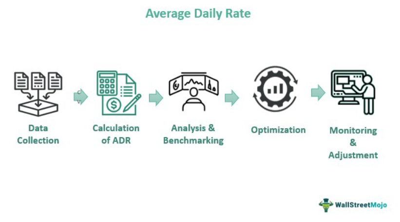

The hotel industry is consistently evolving, necessitating the adoption and understanding of various performance metrics to maintain competitiveness and ensure operational success. Among these metrics, the Average Daily Rate (ADR) stands out as a crucial measure within the hospitality sector. ADR provides insight into a hotel's pricing strategies and financial health by quantifying the average revenue earned per occupied room per day. Calculated by dividing the total room revenue by the number of rooms sold, ADR serves as a vital indicator of a hotel's market positioning and efficiency in revenue management.

In recent years, the integration of advanced analytical methods from fields such as algorithmic trading has opened new avenues for optimizing hotel performance metrics like ADR. Algorithmic trading, historically utilized in financial markets to execute trades based on complex algorithms and data analysis, has proven its potential to transform strategic decision-making in pricing and revenue management. By applying such sophisticated data analytics and dynamic pricing models, hotels can adjust room prices in response to fluctuating market conditions and consumer demand, offering a modern approach to maximizing their ADR and overall profitability.



This article will focus on ADR as a key performance indicator within the hotel industry, exploring its calculation, implications, and strategies for enhancement. Additionally, the discussion will extend to the intersection of ADR with algorithmic trading concepts, highlighting how these technological advancements can offer a competitive edge in pricing strategy and market adaptation for hoteliers.

## Table of Contents

## Understanding Average Daily Rate (ADR)

Average Daily Rate (ADR) is a critical tool in the hotel industry's financial analysis. It serves as a measure of the average rental income earned per occupied room over a specific period. Simply put, ADR helps hoteliers gauge their pricing effectiveness and revenue strength.

To calculate ADR, one must take the total room revenue and divide it by the number of rooms sold, excluding complimentary and staff-occupied rooms. Mathematically, ADR can be expressed with the formula:

$$
\text{ADR} = \frac{\text{Total Room Revenue}}{\text{Number of Rooms Sold}}
$$

For instance, if a hotel's room revenue amounts to $100,000 from selling 800 rooms, the ADR would be:

$$
\text{ADR} = \frac{100,000}{800} = 125
$$

This calculation reveals that, on average, the hotel earns $125 per occupied room each day.

The significance of ADR extends beyond a simple calculation. It provides key insights into a hotel's financial health. By evaluating ADR, hoteliers can determine whether their pricing strategies are effective. A stable or rising ADR, when analyzed alongside occupancy rates, signals robust pricing strategies and operational efficiency. Conversely, while a high ADR generally reflects positively on a hotel's revenue-generating capability, it should be considered alongside occupancy levels to mitigate the risk of pricing too high, which could lead to lower occupancy.

ADR is indispensable in revenue management. It guides pricing decisions and aids in benchmarking against competitors and industry standards. As such, it is essential for hoteliers to regularly monitor and evaluate their ADR to ensure competitive positioning in the market.

## Importance of ADR in the Hotel Industry

Average Daily Rate (ADR) is an essential metric for evaluating a hotel's financial performance in comparison to its competitors and prevailing market standards. ADR serves as a cornerstone in revenue management by steering the development and implementation of pricing strategies aimed at optimizing income. By focusing on ADR, management can effectively analyze and compare the hotel's historical performance across various periods, facilitating the assessment of trends and the impacts of factors such as seasonal fluctuations and promotional activities.

A higher ADR is often indicative of a robust financial position, as it suggests that a hotel is successfully attracting guests who are willing to pay higher rates. However, it is crucial to recognize that ADR alone does not provide a complete picture of a hotel's financial health. A comprehensive assessment requires balancing ADR with occupancy rates. Simply raising room rates to enhance ADR could potentially backfire if it leads to diminished occupancy rates. Thus, achieving optimal financial health involves finding a delicate equilibrium where both ADR and occupancy rates are maximized.

ADR enables hotels to benchmark their pricing strategies against competitors and market norms. By doing so, managers can identify areas where they are outperforming or need improvement. It allows for strategic adjustments to be made swiftly in response to changing market dynamics, ensuring that a hotel remains competitive. Additionally, ADR assists in determining the effectiveness of marketing campaigns and promotional offers by linking these activities to tangible financial outcomes.

In summary, ADR is a critical measure for assessing and refining a hotel's pricing strategies to maximize revenue. Its effectiveness in reflecting a hotel's financial performance makes it indispensable for all hotel managers seeking to operate profitably within a competitive market environment.

## Calculating ADR: A Step-by-Step Guide

To calculate the Average Daily Rate (ADR), start by determining your total room revenue during the period you wish to analyze. This includes all income derived from room sales, excluding any revenue from other services or facilities the hotel might offer.

Next, accurately count the number of rooms sold during the same period. It is essential to exclude rooms given as complimentary or occupied by staff, as these do not generate revenue. These figures should be purely based on paying guests to ensure the ADR calculation precisely reflects the revenue-generating potential of the hotel rooms.

Apply the formula to calculate ADR:

$$
\text{ADR} = \frac{\text{Total Room Revenue}}{\text{Number of Rooms Sold}}
$$

For instance, if your hotel's total room revenue for a given time frame is $50,000 from the sale of 500 rooms, the ADR would be calculated as follows:

```python
total_room_revenue = 50000
number_of_rooms_sold = 500

ADR = total_room_revenue / number_of_rooms_sold
print("The ADR is $", ADR)
```

This code would output an ADR of $100. This calculation is crucial as it allows hotel managers to assess how well their pricing strategies are performing in generating room revenue. By regularly calculating ADR, hotels can make informed decisions about pricing and marketing strategies to optimize revenue.

## Strategies to Enhance ADR

Enhancing the Average Daily Rate (ADR) is a strategic goal for hoteliers aiming to maximize revenue. To achieve this, several strategies can be effectively deployed. 

**1. Upselling Techniques:** One of the most straightforward methods to enhance ADR is through upselling. This involves offering guests enhanced services or room upgrades at a higher price point during the booking process or upon arrival. For instance, guests who initially book a standard room can be offered a deluxe room or package that includes additional services such as breakfast, spa access, or airport transfers. Training staff to recognize upselling opportunities and implement persuasive techniques can significantly increase ADR.

**2. Dynamic Pricing with Data Analytics:** The use of data analytics to implement dynamic pricing strategies is crucial in adjusting room rates based on real-time demand trends. By analyzing historical data, booking patterns, and market conditions, hotels can optimize pricing to reflect current demand. For example, during high-demand periods, prices can be increased to match the willingness to pay of potential guests. Conversely, in low-demand times, prices can be adjusted competitively to attract more bookings without sacrificing ADR. The employment of sophisticated yield management software can automate these adjustments, ensuring optimal pricing at all times.

Here is a simple Python example that illustrates how dynamic pricing can be modeled using demand forecasting:

```python
import numpy as np

def adjust_price(base_rate, demand_factor):
    """
    Adjust room rate based on demand [factor](/wiki/factor-investing)
    """
    return base_rate * (1 + demand_factor)

# Example: base rate for a room
base_rate = 100 

# Demand factor calculated from analytics (e.g., demand increase by 20%)
demand_factor = 0.20 

new_rate = adjust_price(base_rate, demand_factor)
print(f"New adjusted room rate: ${new_rate:.2f}")
```

**3. Marketing Investments:** A strong marketing strategy can enhance a hotel's online presence and attract a higher-paying clientele. Investing in Search Engine Optimization (SEO), targeted social media campaigns, and collaborations with online travel agencies can boost visibility and highlight the hotel's unique offerings. Additionally, refining the property's brand to appeal to specific market segments, such as luxury travelers or eco-conscious guests, can position the hotel as a premier choice, justifying higher room rates and thereby increasing ADR.

**4. Guest Experience Enhancement:** The guest experience has a direct impact on perceived value and can encourage returning customers willing to pay premium rates. Offering unique amenities and tailored services can differentiate a hotel from its competitors. For example, incorporating personalized guest services, local experiences such as curated tours, or exclusive in-house entertainment can improve guest satisfaction and willingness to pay more during subsequent visits. 

Focusing on these strategies can yield significant improvements in ADR, enhancing not only immediate financial performance but also long-term market positioning and guest loyalty.

## Algorithmic Trading in the Context of ADR

Algorithmic trading, traditionally associated with financial markets, incorporates complex data analytics and advanced algorithms to make swift, evidence-based trading decisions. Though the hotel industry operates in a starkly different domain, the principles of [algorithmic trading](/wiki/algorithmic-trading) can be adapted to enhance revenue management strategies, specifically in optimizing the Average Daily Rate (ADR).

### Dynamic Pricing Strategies

In the hotel sector, where demand and supply conditions can fluctuate dramatically due to factors like seasonality, events, and economic shifts, pricing strategies must be responsive and adaptive. Algorithmic trading techniques can empower hotels to implement dynamic pricing by analyzing vast datasets—such as historical booking data, competitor rates, and market demand indicators—to identify optimal pricing points that maximize revenue.

### Data-Driven Decision Making

By utilizing algorithms, hotels can process large volumes of data in real-time to identify patterns and trends that might not be discernible manually. This data-driven approach allows hoteliers to adjust room rates in response to predicted changes in demand. For example, a [machine learning](/wiki/machine-learning) model can be developed to predict future booking trends based on historical data, special events, and local market conditions. This model can then be integrated into a system that automatically adjusts prices to maximize ADR.

```python
from sklearn.model_selection import train_test_split
from sklearn.linear_model import LinearRegression
import pandas as pd

# Example: Simple prediction model for dynamic pricing
# Load your dataset
data = pd.read_csv('hotel_booking_data.csv')
features = data[['historical_occupancy', 'competing_prices', 'event_index']]
target = data['next_day_demand']

# Split data into training and testing sets
X_train, X_test, y_train, y_test = train_test_split(features, target, test_size=0.2, random_state=42)

# Train a linear regression model
model = LinearRegression().fit(X_train, y_train)

# Predict demand
prediction = model.predict(X_test)

# Dynamic pricing adjustment logic
base_rate = 100  # Example base room rate
adjusted_rates = base_rate * (1 + prediction/100)  # Adjust rate based on predicted demand
```

### Real-Time Adjustments

Real-time data analytics allow hotels to make immediate adjustments to room rates, aligning prices with current market conditions. This capability is akin to high-frequency trading algorithms that execute trades within milliseconds based on live market data. By monitoring competitor pricing and accommodation trends, hotels can maintain competitive pricing strategies that reflect the perceived value to guests.

### Benefits of Integration

Integrating algorithmic trading concepts into ADR strategies offers substantial benefits. It enables more precise forecasting and pricing, leading to improved revenue management and increased profitability. Additionally, this approach can enhance customer satisfaction by offering prices that are perceived as fair and reflective of market conditions. Ultimately, leveraging these techniques in the hotel industry can provide a distinct competitive advantage by facilitating a sophisticated, responsive pricing strategy that aligns with business objectives.

## Conclusion

Average Daily Rate (ADR) remains an essential metric in the hotel industry due to its significant influence on revenue management strategies. By understanding and accurately calculating ADR, hoteliers can assess their pricing strategies and benchmark their performance against competitors. This analysis enables them to adjust their approach, thereby improving their market positioning and profitability.

To further enhance ADR, hoteliers can adopt advanced techniques akin to those used in algorithmic trading. This approach involves leveraging data analytics to adjust room pricing dynamically. By employing algorithms that analyze market trends, demand fluctuations, and consumer behavior, hotels can align their pricing strategies with anticipated changes in demand. This alignment not only optimizes ADR but also maximizes revenue by ensuring that room rates reflect guest value perception.

Ultimately, focusing on enhancing ADR contributes to a more successful and financially robust hotel operation. A higher ADR, in conjunction with optimal occupancy rates, signals a healthy financial position, allowing hotels to reinvest in improving guest experiences and expanding service offerings. As the hotel industry evolves, integrating sophisticated analytic techniques promises a competitive advantage, fostering growth and sustainability.

## References & Further Reading

[1]: Talluri, K. T., & Van Ryzin, G. J. (2005). ["The Theory and Practice of Revenue Management."](https://link.springer.com/book/10.1007/b139000) Springer-Verlag.

[2]: Phillips, R. (2005). ["Pricing and Revenue Optimization."](https://archive.org/details/pricingrevenueop0000phil) Stanford University Press.

[3]: Tretyakova, Z., Tretyakova, O., Golubkov, A., & Bakaev, H. (2020). ["Application of Machine Learning Techniques in Revenue Management for Hotel Industry."](https://ieeexplore.ieee.org/document/9297127) IEEE Xplore.

[4]: Makridakis, S. G., & Wheelwright, S. C. (1989). ["Forecasting Methods for Management."](https://www.researchgate.net/publication/52008212_Forecasting_Methods_and_Applications) Wiley.

[5]: Cross, Robert G. (1997). ["Revenue Management: Hard-Core Tactics for Market Domination."](https://archive.org/details/revenuemanagemen0000cros) Broadway Books.