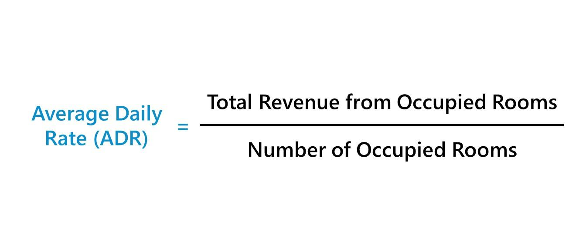

## Table of Contents

## What is the Average Daily Rate (ADR)?

The Average Daily Rate (ADR) is a measure used in the hotel industry to show the average rental income per paid occupied room in a given time period. It is calculated by taking the total room revenue and dividing it by the total number of rooms sold. This number helps hotel managers understand how much money they are making from each room on average.

ADR is important because it helps hotels set their prices and see how well they are doing compared to other hotels. If a hotel's ADR is higher than others in the same area, it might mean the hotel is seen as more luxurious or popular. On the other hand, a lower ADR might suggest the hotel needs to improve its services or lower its prices to attract more guests.

## Why is ADR important in the hospitality industry?

ADR is really important in the hospitality industry because it tells hotel managers how much money they are making from each room every day. This helps them know if they are charging the right amount for their rooms. If the ADR is high, it means guests are willing to pay more, which could be because the hotel is nice or in a good location. If the ADR is low, it might mean the hotel needs to make some changes to attract more guests or charge more.

Hotel managers also use ADR to compare their hotel with others nearby. If their ADR is higher than other hotels, it shows that their hotel might be seen as better or more popular. This can help them decide if they should keep their prices the same or maybe even raise them. On the other hand, if their ADR is lower, they might need to look at what other hotels are doing better and try to improve their own services or lower their prices to stay competitive.

## How is ADR calculated?

ADR, or Average Daily Rate, is calculated by taking the total room revenue and dividing it by the total number of rooms sold. For example, if a hotel made $10,000 from room sales in one day and sold 50 rooms, the ADR would be $200. This simple calculation helps hotel managers understand how much money they are making from each room on average.

This number is important because it helps hotels set their prices and see how well they are doing compared to other hotels. If a hotel's ADR is higher than others in the same area, it might mean the hotel is seen as more luxurious or popular. On the other hand, a lower ADR might suggest the hotel needs to improve its services or lower its prices to attract more guests.

## What data is needed to calculate ADR?

To calculate the Average Daily Rate (ADR), you need two pieces of information: the total room revenue and the total number of rooms sold. The total room revenue is the amount of money the hotel made from selling rooms in a specific time period, like a day or a month. The total number of rooms sold is how many rooms were actually rented out during that same time period.

Once you have these two numbers, you can find the ADR by dividing the total room revenue by the total number of rooms sold. For example, if a hotel made $5,000 from room sales in one day and sold 25 rooms, the ADR would be $200. This calculation helps hotel managers understand how much money they are making from each room on average, which is useful for setting prices and comparing with other hotels.

## Can ADR be used for different types of accommodations?

Yes, ADR can be used for different types of accommodations, not just hotels. This includes places like motels, bed and breakfasts, and even vacation rentals like Airbnb. As long as the place has rooms or spaces that are rented out, you can use ADR to figure out how much money is being made from each room on average.

The way you calculate ADR stays the same no matter the type of accommodation. You just need to know the total money made from renting out the rooms and the total number of rooms that were rented. For example, if a bed and breakfast made $1,000 from room sales in one day and rented out 4 rooms, the ADR would be $250. This helps owners and managers see how well they are doing and if they need to change their prices.

## How does ADR differ from Revenue Per Available Room (RevPAR)?

ADR, or Average Daily Rate, and RevPAR, or Revenue Per Available Room, are both important numbers in the hotel business, but they tell us different things. ADR is all about how much money a hotel makes from each room that is actually rented out. It's calculated by taking the total room revenue and dividing it by the total number of rooms sold. So, ADR only looks at the rooms that were used and how much money they brought in.

RevPAR, on the other hand, looks at how much money a hotel makes from all its rooms, even the ones that weren't rented out. It's calculated by multiplying the ADR by the occupancy rate, which is the percentage of rooms that were actually used. This means RevPAR gives a bigger picture of how well a hotel is doing because it includes both the money made and how full the hotel was. So, while ADR focuses on the price of the rooms that were sold, RevPAR shows how well the hotel used all its rooms to make money.

## What factors can influence ADR?

ADR can be influenced by many things. One big factor is the location of the hotel. If a hotel is in a busy city or near popular spots like beaches or parks, it can charge more for its rooms, which makes the ADR higher. The time of year also matters. During busy times like holidays or big events, hotels can raise their prices because more people want to stay there, which also increases ADR.

Another factor is how nice the hotel is. If a hotel has fancy rooms, good service, and lots of amenities like pools or spas, it can charge more and have a higher ADR. Competition from other hotels in the area can also affect ADR. If there are many hotels nearby, they might all lower their prices to attract more guests, which can bring down the ADR. 

Lastly, the overall economy can play a role. When people have more money to spend, they might be willing to pay more for a hotel room, pushing up the ADR. But if the economy is bad, people might look for cheaper places to stay, which can lower the ADR. So, ADR can change based on where the hotel is, what it offers, what other hotels are doing, and how much money people have to spend.

## How can a hotel increase its ADR?

A hotel can increase its ADR by making its rooms more attractive to guests. This can be done by adding nice things like better beds, fancy bathrooms, or cool amenities like a pool or a gym. If the hotel is in a good spot, like near a beach or a city center, it can charge more because people want to stay there. Also, if the hotel offers great service, like friendly staff and good food, guests might be willing to pay more for their stay. All these things can make the hotel seem more valuable, so it can raise its prices and increase its ADR.

Another way to boost ADR is by using smart pricing strategies. Hotels can change their prices based on the time of year or special events happening nearby. For example, during busy times like holidays or big events, hotels can charge more because more people want to stay there. They can also offer different types of rooms at different prices, like suites or rooms with a view, which can bring in more money. By keeping an eye on what other hotels are doing and adjusting prices to stay competitive, a hotel can find the right balance to increase its ADR.

## What are the limitations of using ADR as a performance metric?

ADR, or Average Daily Rate, is a good way to see how much money a hotel makes from each room, but it has some limits. One big problem is that ADR only looks at the rooms that were actually rented out. It doesn't tell you anything about the rooms that were empty. So, a hotel could have a high ADR but still not be making a lot of money if many rooms are empty. This means ADR doesn't give the full picture of how well a hotel is doing.

Another limit of ADR is that it doesn't take into account other ways a hotel makes money, like from food, drinks, or other services. A hotel might have a low ADR but make a lot of money from other things. Also, ADR can be affected by things the hotel can't control, like the economy or big events happening nearby. So, while ADR is useful, it's not the only thing hotels should look at to see how they're doing.

## How does seasonality affect ADR?

Seasonality can have a big impact on a hotel's ADR. During busy times like summer or holidays, more people want to stay at hotels, so hotels can charge more for their rooms. This makes the ADR go up because the hotel is making more money from each room. For example, if a hotel is near a beach, it might see its ADR go up a lot during the summer when lots of people want to go to the beach.

On the other hand, during slow times like winter or off-peak seasons, fewer people want to stay at hotels. This means hotels might have to lower their prices to attract guests, which can make the ADR go down. For instance, a ski resort might have a high ADR during the winter when people want to ski, but a lower ADR in the summer when fewer people visit. So, seasonality can make ADR go up and down depending on when people want to travel.

## What advanced strategies can be used to optimize ADR?

One advanced strategy to optimize ADR is called dynamic pricing. This means changing the price of rooms based on how many people want to stay at the hotel at different times. For example, if a big event is happening nearby, the hotel can raise its prices because more people will want to stay there. This can help the hotel make more money from each room and increase its ADR. Another part of dynamic pricing is using data to predict when demand will be high or low, so the hotel can set its prices just right to get the most money.

Another strategy is to use revenue management systems. These systems use a lot of data to help hotels decide the best prices for their rooms. They look at things like how full the hotel is, what other hotels are charging, and what's happening in the area. By using this data, the hotel can set prices that will attract guests but also make the most money. This can help the hotel keep its ADR high even when things change, like during different seasons or when there are special events.

A third way to optimize ADR is by offering different types of rooms at different prices. For example, a hotel might have regular rooms, suites, and rooms with special views. By charging more for the fancier rooms, the hotel can increase its overall ADR. It's also important to market these different room types well, so guests know about them and are willing to pay more. This way, the hotel can make more money from each room and keep its ADR high.

## How can data analytics improve ADR management?

Data analytics can help hotels manage their ADR better by looking at a lot of information to find out the best prices for rooms. Hotels can use data to see when more people want to stay, like during holidays or big events, and then raise their prices to make more money. They can also see when fewer people want to stay, like in the off-season, and lower their prices to attract more guests. By using data to set prices, hotels can make sure they are charging the right amount at the right time, which helps keep their ADR high.

Another way data analytics helps is by looking at what other hotels are doing. Hotels can use data to see what prices other hotels are charging and how full they are. This helps them decide if they should change their own prices to stay competitive. Data analytics can also show hotels which types of rooms are most popular and how much people are willing to pay for them. By understanding this, hotels can offer different room types at different prices to make more money from each room and improve their ADR.

## What is the Understanding of Average Daily Rate (ADR)?

Average Daily Rate (ADR) is a critical tool in the hotel industry's financial analysis. It serves as a measure of the average rental income earned per occupied room over a specific period. Simply put, ADR helps hoteliers gauge their pricing effectiveness and revenue strength.

To calculate ADR, one must take the total room revenue and divide it by the number of rooms sold, excluding complimentary and staff-occupied rooms. Mathematically, ADR can be expressed with the formula:

$$
\text{ADR} = \frac{\text{Total Room Revenue}}{\text{Number of Rooms Sold}}
$$

For instance, if a hotel's room revenue amounts to $100,000 from selling 800 rooms, the ADR would be:

$$
\text{ADR} = \frac{100,000}{800} = 125
$$

This calculation reveals that, on average, the hotel earns $125 per occupied room each day.

The significance of ADR extends beyond a simple calculation. It provides key insights into a hotel's financial health. By evaluating ADR, hoteliers can determine whether their pricing strategies are effective. A stable or rising ADR, when analyzed alongside occupancy rates, signals robust pricing strategies and operational efficiency. Conversely, while a high ADR generally reflects positively on a hotel's revenue-generating capability, it should be considered alongside occupancy levels to mitigate the risk of pricing too high, which could lead to lower occupancy.

ADR is indispensable in revenue management. It guides pricing decisions and aids in benchmarking against competitors and industry standards. As such, it is essential for hoteliers to regularly monitor and evaluate their ADR to ensure competitive positioning in the market.

## How do you calculate ADR: A Step-by-Step Guide?

To calculate the Average Daily Rate (ADR), start by determining your total room revenue during the period you wish to analyze. This includes all income derived from room sales, excluding any revenue from other services or facilities the hotel might offer.

Next, accurately count the number of rooms sold during the same period. It is essential to exclude rooms given as complimentary or occupied by staff, as these do not generate revenue. These figures should be purely based on paying guests to ensure the ADR calculation precisely reflects the revenue-generating potential of the hotel rooms.

Apply the formula to calculate ADR:

$$
\text{ADR} = \frac{\text{Total Room Revenue}}{\text{Number of Rooms Sold}}
$$

For instance, if your hotel's total room revenue for a given time frame is $50,000 from the sale of 500 rooms, the ADR would be calculated as follows:

```python
total_room_revenue = 50000
number_of_rooms_sold = 500

ADR = total_room_revenue / number_of_rooms_sold
print("The ADR is $", ADR)
```

This code would output an ADR of $100. This calculation is crucial as it allows hotel managers to assess how well their pricing strategies are performing in generating room revenue. By regularly calculating ADR, hotels can make informed decisions about pricing and marketing strategies to optimize revenue.

## References & Further Reading

[1]: Talluri, K. T., & Van Ryzin, G. J. (2005). ["The Theory and Practice of Revenue Management."](https://link.springer.com/book/10.1007/b139000) Springer-Verlag.

[2]: Phillips, R. (2005). ["Pricing and Revenue Optimization."](https://archive.org/details/pricingrevenueop0000phil) Stanford University Press.

[3]: Tretyakova, Z., Tretyakova, O., Golubkov, A., & Bakaev, H. (2020). ["Application of Machine Learning Techniques in Revenue Management for Hotel Industry."](https://ieeexplore.ieee.org/document/9297127) IEEE Xplore.

[4]: Makridakis, S. G., & Wheelwright, S. C. (1989). ["Forecasting Methods for Management."](https://www.researchgate.net/publication/52008212_Forecasting_Methods_and_Applications) Wiley.

[5]: Cross, Robert G. (1997). ["Revenue Management: Hard-Core Tactics for Market Domination."](https://archive.org/details/revenuemanagemen0000cros) Broadway Books.