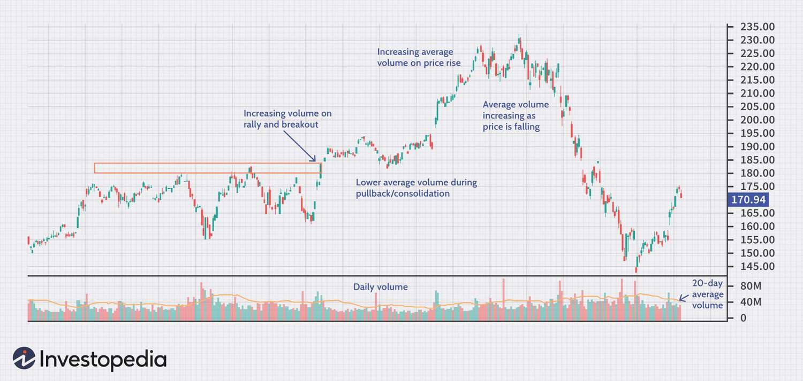

## Table of Contents

## What is Average Daily Trading Volume (ADTV)?

Average Daily Trading Volume (ADTV) is a measure that shows how many shares of a stock are traded on average each day over a certain period, usually a month or three months. It helps investors understand how active a stock is. If a stock has a high ADTV, it means a lot of people are buying and selling it every day. This can make it easier to buy or sell the stock quickly without affecting its price too much.

ADTV is important for investors because it can help them make better decisions. For example, if an investor wants to buy a lot of shares, they might choose a stock with a high ADTV to make sure they can buy the shares they need without causing the price to go up too much. On the other hand, a stock with a low ADTV might be harder to buy or sell quickly, which could be a problem if an investor needs to act fast.

## How is ADTV calculated?

To calculate the Average Daily Trading Volume (ADTV), you first need to pick a time period, like a month or three months. Then, you add up the total number of shares traded each day during that time. For example, if you're looking at a month, you would add up the trading volume for each of the 30 days.

Next, you divide the total number of shares traded by the number of days in your chosen period. So, if the total trading [volume](/wiki/volume-trading-strategy) over 30 days is 3 million shares, you would divide 3 million by 30 to get the ADTV. This gives you the average number of shares traded each day, which helps you understand how active the stock is.

## Why is ADTV important for investors and traders?

ADTV is important for investors and traders because it shows how easy or hard it is to buy or sell a stock. If a stock has a high ADTV, it means many shares are traded every day. This makes it easier for investors to buy or sell a lot of shares without moving the price too much. For example, if you want to buy 10,000 shares, a stock with a high ADTV will let you do that without causing big changes in the stock's price.

On the other hand, a stock with a low ADTV can be harder to trade. If you try to buy or sell a lot of shares of a stock with low ADTV, you might end up pushing the price up or down a lot. This can be risky, especially if you need to make a quick trade. So, knowing the ADTV helps investors pick stocks that fit their trading plans and avoid stocks that might be hard to trade.

## What does a high ADTV indicate about a stock?

A high ADTV means that a lot of people are buying and selling the stock every day. It shows that the stock is popular and has a lot of interest from investors. When a stock has a high ADTV, it's easier to buy or sell a lot of shares without making the price go up or down too much. This is good for investors who want to trade big amounts of the stock.

Because the stock is traded a lot, it usually means the stock is easy to buy or sell quickly. This can be helpful if an investor needs to act fast. A high ADTV can also mean that the stock is well-known and gets a lot of attention from the market. So, it's often seen as a sign of a healthy and active stock.

## What does a low ADTV suggest about a stock?

A low ADTV means that not many people are buying or selling the stock each day. This can make it harder to trade the stock because there are fewer shares changing hands. If you want to buy or sell a lot of shares, a low ADTV can make the price move a lot. This is because there are fewer shares available, so your trade can have a bigger impact on the price.

When a stock has a low ADTV, it might be less popular or less well-known. It can be riskier to trade because it's harder to get in and out of the stock quickly. If you need to sell your shares fast, a low ADTV might mean you can't do it without affecting the price a lot. So, investors often see a low ADTV as a sign that the stock might be harder to trade and could be more risky.

## How can ADTV be used to assess the liquidity of a stock?

ADTV helps us understand how easy it is to buy or sell a stock. When a stock has a high ADTV, it means a lot of shares are traded every day. This makes the stock more liquid because you can buy or sell a lot of shares without changing the price too much. It's like having a busy market where there are always people buying and selling.

On the other hand, a stock with a low ADTV means fewer shares are traded each day. This makes the stock less liquid because if you want to buy or sell a lot of shares, it can be harder. It's like a quiet market where not many people are trading, so your actions can affect the price more. Knowing the ADTV helps investors pick stocks that are easy to trade, based on how much they need to buy or sell.

## Can ADTV help in identifying potential price volatility?

Yes, ADTV can help in figuring out if a stock's price might move a lot. If a stock has a high ADTV, it means many people are trading it every day. This can make the stock's price more stable because there are always buyers and sellers. When you want to buy or sell shares, it's easier to do so without making the price jump around too much.

On the other hand, if a stock has a low ADTV, it means fewer people are trading it. This can make the stock's price more likely to move a lot. If you try to buy or sell a lot of shares of a stock with low ADTV, you might push the price up or down a lot because there aren't many shares being traded. So, looking at the ADTV can give you an idea of how much the stock's price might change.

## How does ADTV influence trading strategies?

ADTV can help traders decide how to buy or sell stocks. If a stock has a high ADTV, it means a lot of people are trading it every day. This makes it easier for traders to buy or sell a lot of shares without changing the price too much. Traders might choose stocks with high ADTV when they want to make big trades because it's less risky. They know they can get in and out of the stock without causing big price changes.

On the other hand, if a stock has a low ADTV, traders need to be more careful. Not many people are trading the stock, so if a trader tries to buy or sell a lot of shares, it can make the price move a lot. Traders might avoid making big trades with stocks that have low ADTV or they might break up their trades into smaller pieces to avoid moving the price too much. Knowing the ADTV helps traders plan their moves better and pick the right stocks for their trading strategies.

## What are the limitations of using ADTV as a sole indicator?

ADTV can help you understand how easy it is to buy or sell a stock, but it's not perfect. One problem is that ADTV looks at the past, so it might not tell you what will happen next. If something big changes in the market or with the company, the ADTV might not show that right away. Also, ADTV doesn't tell you about the price of the stock or how the price might move. Just because a stock has a high ADTV doesn't mean it's a good buy or that it won't go down in price.

Another limitation is that ADTV doesn't give you the whole picture of a stock. It only shows how many shares are traded, but it doesn't tell you why people are trading the stock or what they think about it. Other things like the company's news, how the whole market is doing, and what other people think can affect the stock too. So, if you only look at ADTV, you might miss important information that could help you make better choices about buying or selling a stock.

## How does ADTV vary across different market sectors?

ADTV can be different across various market sectors because each sector has its own level of interest and activity from investors. For example, technology and finance sectors often have higher ADTVs because many people are interested in buying and selling these stocks. These sectors are usually more active, with a lot of news and changes that make people want to trade more often. On the other hand, sectors like utilities or real estate might have lower ADTVs because they are seen as more stable and less exciting, so fewer people trade them every day.

The size of the companies in a sector can also affect the ADTV. Big companies in sectors like consumer goods or healthcare might have high ADTVs because they are well-known and a lot of people want to buy or sell their stocks. Smaller companies or those in niche sectors might have lower ADTVs because fewer people know about them or are interested in trading them. Understanding these differences can help investors pick the right stocks based on how easy or hard they want their trading to be.

## What advanced techniques can be applied to analyze ADTV data?

To get a deeper look at ADTV, you can use something called time series analysis. This means looking at how the ADTV changes over time, like from one day to the next or over weeks and months. By doing this, you can spot patterns or trends that might not be clear if you just look at one number. For example, you might see that the ADTV goes up around certain times of the year or after big news events. This can help you predict when a stock might be easier or harder to trade in the future.

Another advanced way to analyze ADTV is by using [machine learning](/wiki/machine-learning). This is a bit more complicated, but it can help you find hidden patterns in the data. Machine learning can look at lots of different things at the same time, like the ADTV, the stock price, and even news about the company. By doing this, it can help you understand how all these things work together to affect the stock's trading volume. This can give you a better idea of when to buy or sell, based on not just the ADTV but everything else going on around it.

## How can ADTV be integrated with other financial metrics for enhanced analysis?

ADTV can be combined with other financial numbers to give a fuller picture of a stock. One way to do this is by looking at the stock's price-to-earnings ratio (P/E ratio) along with the ADTV. The P/E ratio tells you how much people are willing to pay for the company's earnings. If a stock has a high ADTV and a low P/E ratio, it might be a good buy because it's easy to trade and not too expensive. On the other hand, if the P/E ratio is high, the stock might be overvalued, even if it's easy to trade.

Another important metric to look at with ADTV is the stock's [volatility](/wiki/volatility-trading-strategies). Volatility shows how much the stock's price moves up and down. By comparing the ADTV with the stock's volatility, you can see if a stock is easy to trade but still has big price swings. This can help you decide if the stock is too risky for you. For example, a stock with a high ADTV and low volatility might be a safe choice for someone who wants to trade a lot without worrying about big price changes.

## References & Further Reading

[1]: Bergstra, J., Bardenet, R., Bengio, Y., & Kégl, B. (2011). ["Algorithms for Hyper-Parameter Optimization."](https://dl.acm.org/doi/10.5555/2986459.2986743) Advances in Neural Information Processing Systems 24.

[2]: ["Advances in Financial Machine Learning"](https://www.amazon.com/Advances-Financial-Machine-Learning-Marcos/dp/1119482089) by Marcos Lopez de Prado

[3]: ["Evidence-Based Technical Analysis: Applying the Scientific Method and Statistical Inference to Trading Signals"](https://www.amazon.com/Evidence-Based-Technical-Analysis-Scientific-Statistical/dp/0470008741) by David Aronson

[4]: ["Machine Learning for Algorithmic Trading"](https://github.com/stefan-jansen/machine-learning-for-trading) by Stefan Jansen

[5]: ["Quantitative Trading: How to Build Your Own Algorithmic Trading Business"](https://www.amazon.com/Quantitative-Trading-Build-Algorithmic-Business/dp/1119800064) by Ernest P. Chan