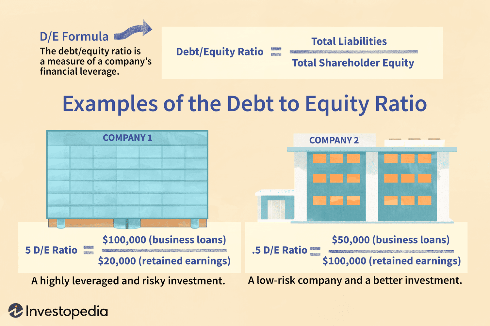

## Table of Contents

## What is the debt-to-equity ratio?

The debt-to-equity ratio is a financial measure that shows how much a company uses debt compared to its equity to finance its operations. It is calculated by dividing a company's total liabilities by its total shareholders' equity. This ratio helps investors and analysts understand the financial structure of a company and assess its risk level. A higher debt-to-equity ratio means the company relies more on borrowed money, which can be riskier because it must pay back the debt with interest.

A lower debt-to-equity ratio suggests that a company is using less debt and more of its own money to run its business. This can be seen as less risky because the company is not as dependent on loans. However, the ideal debt-to-equity ratio can vary by industry. Some industries, like utilities, often have higher ratios because they need a lot of capital to operate, while tech companies might have lower ratios because they need less physical infrastructure. Understanding the industry norms is important when evaluating this ratio.

## Why is the debt-to-equity ratio important for businesses?

The debt-to-equity ratio is important for businesses because it shows how much a company is relying on borrowed money versus money from its owners. This ratio helps business owners, investors, and lenders see if a company is taking on too much risk. If a company has a high debt-to-equity ratio, it means it's using a lot of debt. This can be risky because the company has to pay back the debt with interest. If the company can't make those payments, it could face serious financial problems.

On the other hand, a low debt-to-equity ratio means the company is using more of its own money and less debt. This can be seen as safer because the company isn't as dependent on loans. But, it's also important to know that what's considered a good debt-to-equity ratio can be different for different industries. For example, some industries like utilities need a lot of money to build things like power plants, so they might have higher ratios and that's normal for them. Knowing what's typical for an industry helps everyone understand if a company's debt-to-equity ratio is healthy or not.

## How is the debt-to-equity ratio calculated?

The debt-to-equity ratio is a way to see how much a company uses borrowed money compared to its own money. To calculate it, you take the company's total liabilities and divide them by its total shareholders' equity. Total liabilities are all the money the company owes, like loans and bills. Shareholders' equity is the money that the owners have put into the company, plus any profits that have been kept in the business.

This calculation gives you a number that shows the balance between debt and equity. If the number is high, it means the company is using a lot of borrowed money. If the number is low, it means the company is using more of its own money. This ratio helps people understand if a company might be taking on too much risk with debt or if it's being cautious by using more of its own funds.

## What is considered a good debt-to-equity ratio in the wholesale sector?

In the wholesale sector, a good debt-to-equity ratio can vary, but generally, a ratio between 1.0 and 1.5 is often seen as healthy. This means that for every dollar of equity, the company has between one and one and a half dollars of debt. This range is considered balanced because it shows that the company is using a reasonable amount of debt to grow its business without taking on too much risk.

However, what's considered good can change depending on the specific situation of the company and the overall economic conditions. If a wholesale business is growing quickly and can easily pay its debts, a slightly higher ratio might be okay. On the other hand, if the economy is uncertain, a lower ratio might be safer. It's always important to compare the company's ratio with others in the same industry to get a better idea of what's normal and healthy.

## How does the average debt-to-equity ratio in the wholesale sector compare to other sectors?

The average debt-to-equity ratio in the wholesale sector is usually between 1.0 and 1.5. This means that for every dollar of equity, wholesale companies have between one and one and a half dollars of debt. This range is seen as balanced because it shows that these companies are using a reasonable amount of debt to grow their business without taking on too much risk. Compared to other sectors, the wholesale sector's debt-to-equity ratio is often in the middle. It's not as high as industries like utilities, which might have ratios of 2.0 or more because they need a lot of money to build things like power plants. But it's also not as low as tech companies, which might have ratios below 0.5 because they need less physical stuff to run their business.

In the manufacturing sector, the debt-to-equity ratio can be similar to the wholesale sector, often ranging from 1.0 to 2.0. This is because manufacturing companies also need to invest in equipment and facilities, which can require significant borrowing. On the other hand, the retail sector might have a slightly lower debt-to-equity ratio, typically around 0.5 to 1.5, as retailers often have more variable costs and less need for large capital investments. Understanding these differences helps investors and business owners see how much risk a company in a specific sector might be taking on with its debt compared to its equity.

## What factors influence the debt-to-equity ratio in the wholesale sector?

Several factors can change the debt-to-equity ratio in the wholesale sector. One big [factor](/wiki/factor-investing) is how much money the company needs to buy things to sell. Wholesale businesses often need to buy a lot of products upfront, and if they don't have enough money from their owners, they might need to borrow more. This can make their debt-to-equity ratio go up. Another factor is how fast the company is growing. If a wholesale company is growing quickly, it might need to borrow more money to buy more products or open new places to sell them. This also can make the debt-to-equity ratio higher.

Economic conditions also play a role in the debt-to-equity ratio. In good economic times, banks might be more willing to lend money, so wholesale companies might borrow more, making their debt-to-equity ratio go up. But in tough economic times, banks might be more careful about lending, so companies might have to use more of their own money, making the ratio go down. Also, the specific industry within the wholesale sector can matter. Some parts of wholesale, like selling food, might need less money to start and run than others, like selling heavy machinery, which can affect how much debt a company takes on.

## How has the average debt-to-equity ratio in the wholesale sector changed over the past decade?

Over the past decade, the average debt-to-equity ratio in the wholesale sector has seen some changes. From around 2013 to 2018, the ratio stayed pretty stable, usually between 1.2 and 1.4. This was because the economy was doing okay, and wholesale companies could borrow money at good rates. But then, things started to change a bit. From 2018 to 2020, the ratio went up a little, getting closer to 1.5. This happened because some companies wanted to grow faster and needed more money to buy things to sell.

Then came 2020, and the big change happened because of the global health crisis. A lot of wholesale businesses had to borrow more money to keep going when things were tough. So, the debt-to-equity ratio jumped up, sometimes going over 1.5. But after 2020, as things started to get better, the ratio started to come down a bit. By 2023, it was back to being around 1.3 to 1.4. This shows that while the wholesale sector had to take on more debt during the crisis, it's been working to get back to a more normal balance between debt and equity.

## What are the implications of a high debt-to-equity ratio for companies in the wholesale sector?

A high debt-to-equity ratio in the wholesale sector means that a company is using a lot of borrowed money compared to its own money. This can be risky because the company has to pay back the debt with interest. If the company can't make those payments, it could face big financial problems. Also, if the economy gets worse, it might be harder for the company to borrow more money or sell things to pay off its debts. This could make it hard for the company to keep going or grow.

On the other hand, a high debt-to-equity ratio isn't always bad. If a wholesale company is growing quickly and can easily pay its debts, using more borrowed money might help it buy more products to sell or open new places to do business. But it's important for the company to keep an eye on its debt and make sure it can pay it back. If it can't, the high debt could become a big problem and make it hard for the company to stay healthy and successful.

## Can you provide examples of companies in the wholesale sector with notably high or low debt-to-equity ratios?

In the wholesale sector, one company with a notably high debt-to-equity ratio is Sysco Corporation. Sysco, which distributes food products to restaurants, schools, and other institutions, had a debt-to-equity ratio around 7.0 in recent years. This high ratio means Sysco uses a lot of borrowed money to run its business. While this can help them buy more products to sell and grow faster, it also means they have to pay back a lot of debt with interest. If they can't make those payments, it could be risky for them.

On the other hand, a company with a notably low debt-to-equity ratio in the wholesale sector is Costco Wholesale Corporation. Costco, known for its membership-based warehouse clubs, has kept its debt-to-equity ratio around 0.3. This low ratio shows that Costco uses more of its own money and less borrowed money to run its business. This can be seen as safer because they're not as dependent on loans. But it also means they might grow more slowly because they're not using as much debt to buy more products or open new stores.

## How do economic cycles affect the debt-to-equity ratio in the wholesale sector?

Economic cycles can really change the debt-to-equity ratio in the wholesale sector. When the economy is doing well, wholesale companies might feel more confident and borrow more money to buy more products or open new places to sell them. This can make their debt-to-equity ratio go up because they're using more borrowed money. Also, during good times, banks are usually more willing to lend money, so it's easier for companies to get loans. This means they might take on more debt, making the ratio even higher.

But when the economy is not doing so well, things can be different. Wholesale companies might be more careful and try to use less borrowed money. They might want to keep their debt-to-equity ratio lower because it's harder to pay back loans when business is slow. During tough times, banks might also be more careful about lending money, so it's harder for companies to get loans. This can make the debt-to-equity ratio go down because companies are using more of their own money and less borrowed money to run their business.

## What strategies can companies in the wholesale sector use to manage their debt-to-equity ratio?

Companies in the wholesale sector can manage their debt-to-equity ratio by being careful about how much money they borrow. One way to do this is by using more of their own money to buy products or open new stores. This can mean keeping more of their profits instead of paying them out to owners or shareholders. Another way is to sell things they own that they don't need anymore, like old equipment or warehouses. This can give them more money to use instead of borrowing.

Another strategy is to grow more slowly and not take on too much debt at once. If a company grows too fast, it might need to borrow a lot of money to keep up. But if it grows at a steady pace, it can use more of its own money and keep the debt-to-equity ratio lower. Also, companies can try to pay off their debts faster. If they can pay back loans quickly, they won't have to borrow as much in the future, which can help keep the ratio in a good range.

## How do international differences impact the average debt-to-equity ratio in the global wholesale sector?

International differences can really change the average debt-to-equity ratio in the global wholesale sector. In some countries, like those in Europe, banks might be more willing to lend money to wholesale companies. This can make companies in these countries have higher debt-to-equity ratios because they can borrow more easily. On the other hand, in places like the United States, companies might use more of their own money and less borrowed money, which can lead to lower debt-to-equity ratios. Also, different countries have different rules about how much debt a company can have, which can make the average ratio different from one country to another.

Another big factor is how the economy is doing in different countries. If a country's economy is growing fast, wholesale companies might feel more confident about borrowing money to buy more products or open new stores. This can make the debt-to-equity ratio go up in that country. But if the economy is not doing well, companies might be more careful and use less debt, making the ratio go down. So, the average debt-to-equity ratio in the global wholesale sector can be very different depending on where in the world you look.

## What is the Debt-to-Equity Ratio and How Can We Understand It?

The debt-to-equity (D/E) ratio is a fundamental financial metric used to evaluate a company's financial leverage by comparing its total liabilities to its shareholder equity. Mathematically, the D/E ratio is expressed as:

$$
\text{Debt-to-Equity Ratio} = \frac{\text{Total Liabilities}}{\text{Shareholder Equity}}
$$

This ratio serves as an indicator of the proportion of debt a company uses to finance its assets relative to equity. A higher D/E ratio suggests that a company is using more debt to finance its growth, which can result in higher financial risk due to the obligations associated with debt repayments. It also implies potential [volatility](/wiki/volatility-trading-strategies) in the company's earnings, as interest payments on debt can affect net income, especially during periods of fluctuating revenue.

In the wholesale sector, understanding the D/E ratio is particularly significant due to the nature of the industry, where companies often operate on thin margins and high volumes. The typical range for the D/E ratio in this sector is between 0.8 and 1.1. This range reflects a balanced approach to leveraging debt without overextending the company's financial stability. However, the ratio can vary considerably across different sub-industries within the wholesale sector. For example, companies in capital-intensive sub-sectors like petroleum or pharmaceuticals might exhibit higher D/E ratios due to the substantial investments required for infrastructure and research and development. Conversely, electronics wholesalers might maintain relatively lower D/E ratios given the different capital needs and faster inventory turnover associated with their operations.

Analyzing the D/E ratio across various contexts within the wholesale sector is crucial for stakeholders, such as investors and financial analysts, as it provides insights into a company's capital structure and risk profile. It also aids in making informed decisions regarding investment opportunities and assessing the company's ability to meet its long-term obligations.

## References & Further Reading

[1]: Kim, M., & MacKay, P. (2016). ["How do capital structure policies of emerging markets firms differ from those of developed markets?"](https://link.springer.com/article/10.1007/s44169-024-00076-y) Journal of Corporate Finance, 37, 354-390.

[2]: Damodaran, A. (2012). ["Investment Valuation: Tools and Techniques for Determining the Value of Any Asset, 3rd Edition"](https://books.google.com/books/about/Investment_Valuation.html?id=5SRHAAAAQBAJ) by Aswath Damodaran

[3]: Fabozzi, F. J., Focardi, S. M., & Rachev, S. T. (2007). ["The Basics of Algorithmic Trading: Concepts and Examples."](https://onlinelibrary.wiley.com/doi/book/10.1002/9781118856406) Financial Analysts Journal.

[4]: Hull, J. (2012). ["Options, Futures, and Other Derivatives."](https://www.semanticscholar.org/paper/Options%2C-Futures%2C-and-Other-Derivatives-Hull/89bdee500c8623864fc9eb7a471546aa713acc44) Pearson Education.

[5]: Ross, S. A., Westerfield, R., & Jaffe, J. (2019). ["Corporate Finance."](https://www.mheducation.com/highered/product/Corporate-Finance-Ross.html) McGraw-Hill Education.