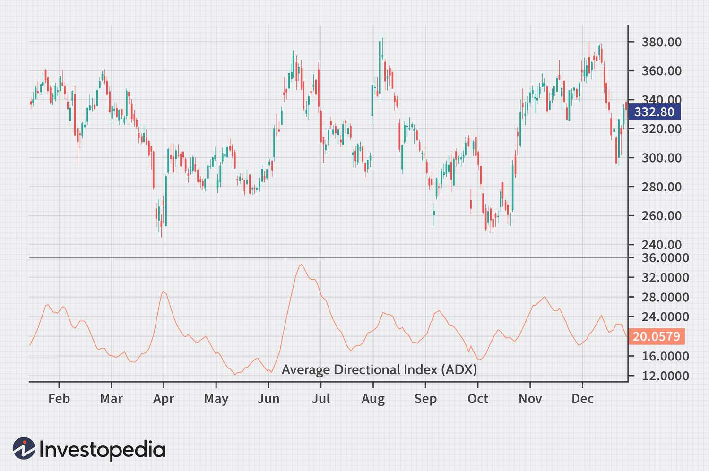

In the world of finance, traders are perpetually on the lookout for tools and strategies that can improve their decision-making capabilities. Among these tools, technical analysis is pivotal in spotting potential trading opportunities by analyzing statistical trends derived from historical price data and trading volumes. A key instrument within technical analysis is the Average Directional Index (ADX), an indicator extensively employed to gauge the strength of a price trend.

Developed by J. Welles Wilder, the ADX serves as a crucial component of many trading strategies. This indicator provides insight into whether a market is trending or not, without indicating the direction of the trend. A high ADX value indicates a strong trend, while a low value suggests a weak trend. Typically, an ADX value above 25 signifies a strong trend, whereas values below 20 suggest the absence of a trend or a weak trend.



This article focuses on the integration of ADX into algorithmic trading systems, a realm where trades are executed automatically based on predefined criteria. The significance of ADX lies in its ability to offer quantitative data about trend strength, which is invaluable in crafting and refining trading algorithms. Understanding the intricacies of ADX and its application in algorithmic trading can grant traders a competitive edge, particularly in volatile and rapidly evolving markets.

Through careful examination of the ADX's role, traders can leverage its strengths while mitigating potential drawbacks, thus enhancing their trading systems for better performance. As markets continue to fluctuate, grasping the nuances of ADX can position traders to capitalize on trend strengths effectively, helping them navigate the complexities of financial trading more successfully.

## Table of Contents

## Understanding the Average Directional Index (ADX)

Developed by J. Welles Wilder, the Average Directional Index (ADX) serves as a critical tool in technical analysis for quantifying the strength of a trend. Typically, the ADX ranges from 0 to 100; values above 25 signify a robust trend, whereas values below 20 indicate a weak trend. It does not provide information about the trend direction—only its intensity.

The ADX is often paired with two other indicators: the Positive Directional Indicator (+DI) and the Negative Directional Indicator (-DI). These three components are part of the Directional Movement System created by Wilder. The +DI value measures upward momentum, while the -DI assesses downward momentum.

### Calculation of ADX

The calculation of ADX involves several steps:

1. **Calculate the Directional Movement (DM):**
   - If the current high minus the previous high is greater than the previous low minus the current low, then the DM is calculated as the current high minus the previous high. Otherwise, the DM is zero.
   - Similarly, if the previous low minus the current low is greater than the current high minus the previous high, the DM is calculated as the previous low minus the current low. Otherwise, the DM is zero.

2. **Calculate the True Range (TR):**
   - TR is the greatest of the following:
     - Current High minus Current Low
     - Absolute value of Current High minus Previous Close
     - Absolute value of Current Low minus Previous Close

3. **Smooth the values for a fixed period:**
   - A common period is 14 days. Calculate the smoothed values of +DM, -DM, and TR for this period.

4. **Calculate DI values:**
   - +DI = 100 * (Smoothed +DM / Smoothed TR)
   - -DI = 100 * (Smoothed -DM / Smoothed TR)

5. **Calculate the ADX:**
   - First, calculate the Directional Index (DX) using the formula:
$$
     DX = 100 \times \frac{|+DI - -DI|}{|+DI + -DI|}

$$
   - The ADX is the smoothed moving average of the DX, typically over 14 periods.

### Interpretation and Trading Decisions

The ADX assists traders in recognizing the market conditions that can maximize gains and minimize risks. Although ADX does not indicate trend direction, combining it with +DI and -DI can provide comprehensive insights. For instance, when +DI crosses above -DI while ADX is above 25, it suggests a strong bullish trend. Conversely, if -DI crosses above +DI under similar ADX conditions, a strong bearish trend is likely.

Understanding the role of ADX in identifying trend strength enables traders to strategically position themselves in the market by adhering to structured rules, thereby optimizing their trading results and managing risks effectively.

## The Role of ADX in Algorithmic Trading

Algorithmic trading involves the use of automated systems to execute trades based on pre-defined criteria, allowing for high-speed and high-frequency trading that is less susceptible to emotional decision-making. The Average Directional Index (ADX) plays an important role in this domain by providing a measure of trend strength, which traders can leverage to construct more efficient trading algorithms.

### ADX as a Quantitative Measure of Trend Strength

The ADX is particularly useful for [algorithmic trading](/wiki/algorithmic-trading) because it quantifies the strength of a trend numerically. With values ranging from 0 to 100, it provides a clear indication of whether the market is trending strongly or weakly. Typically, a value above 25 suggests a strong trend, while values below 20 indicate a weak trend. This information is crucial for algorithms designed to capitalize on trending markets, as it can signal when to enter or [exit](/wiki/exit-strategy) trades.

### Integration of ADX in Trading Algorithms

Incorporating ADX into trading algorithms involves creating rules that respond to its readings. For example, an algorithm might be programmed to initiate a trade when the ADX exceeds a certain threshold, coupled with an upward movement of the Positive Directional Indicator (+DI) over the Negative Directional Indicator (-DI). Conversely, it might close a position when the ADX starts to decline, signaling a weakening trend.

**Python Example:**

```python
def trading_signal(adx, plus_di, minus_di, threshold=25):
    if adx > threshold and plus_di > minus_di:
        return "Buy"
    elif adx > threshold and minus_di > plus_di:
        return "Sell"
    else:
        return "Hold"
```

### Enhancing Trading Strategies with ADX

Using ADX in conjunction with other indicators can significantly bolster an algorithmic trading strategy. For instance, combining ADX with moving averages or stochastic oscillators can help confirm trend direction and strength, thus reducing the chances of false signals. This multi-indicator approach is vital for developing a robust algorithm that can withstand market [volatility](/wiki/volatility-trading-strategies).

### Systematic Identification of High-Probability Trades

ADX facilitates the systematic identification of trading opportunities by providing a consistent measure of trend [momentum](/wiki/momentum). Systems can be designed to scan multiple markets for instruments exhibiting strong trends, thereby helping traders focus on high-probability trades. This functionality is particularly useful in high-frequency trading environments, where rapid decision-making is essential.

### Increasing Algorithmic Robustness

Incorporating ADX into trading algorithms enhances their robustness by adding a layer of trend analysis. While ADX on its own may sometimes offer lagging signals, when used in a broader analytical framework, it contributes to a more comprehensive view of market dynamics. This is especially beneficial in markets characterized by sudden shifts, as the ADX's ability to quantify trend strength can act as a stabilizing [factor](/wiki/factor-investing).

In summary, the ADX is a valuable tool in algorithmic trading, providing quantitative insights that enhance the decision-making process. By integrating ADX with other indicators and trading rules, traders can develop sophisticated algorithms that adapt to various market conditions, thus optimizing the potential for successful trades.

## Building an ADX-Based Trading System

Constructing a trading system using the Average Directional Index (ADX) involves a meticulous process of defining precise entry and exit rules based on ADX readings. This ensures that the trading system can systematically identify trends and capitalize on them. ADX, developed by J. Welles Wilder, is crucial in determining the strength of a trend, but it is also essential to integrate it with other indicators to confirm the signals and avoid potential false positives.

### Defining Entry and Exit Rules

In a typical ADX-based trading system, entry and exit rules rely on the ADX values and its interaction with the Positive Directional Indicator (+DI) and Negative Directional Indicator (-DI). A standard entry rule could involve:

- **Entry Signal**: Enter a long position when the +DI line crosses above the -DI line and the ADX line is above a predefined threshold, commonly set at 25, indicating a strong trend.

- **Exit Signal**: Exit the long position when the -DI crosses above the +DI, suggesting a potential trend reversal, or if the ADX falls below a certain level, indicating weakening trend strength.

The same logic can be applied inversely for short positions.

### Integrating ADX with Other Indicators

To enhance the robustness of an ADX-based system, it is wise to employ additional technical indicators. For example, combining ADX with moving averages can help confirm trend directions, or using stochastic oscillators can validate overbought/oversold conditions. This multi-indicator approach can reduce the likelihood of false signals and improve the system's overall efficiency.

### Systematic Trading Approach Design

Designing a systematic trading approach with ADX involves creating a cohesive strategy where various technical tools work synergistically. This process includes:

- **Algorithm Development**: Coding the strategy in a programming language like Python, where entry and exit conditions, alongside money management rules, are clearly defined. The Python code below is a simple example of implementing ADX in a trading algorithm:

```python
import talib
import numpy as np
import pandas as pd

# Load historical data
data = pd.read_csv('historical_data.csv')
high = data['High'].values
low = data['Low'].values
close = data['Close'].values

# Calculate ADX, +DI, and -DI
adata = talib.ADX(high, low, close, timeperiod=14)
plus_di = talib.PLUS_DI(high, low, close, timeperiod=14)
minus_di = talib.MINUS_DI(high, low, close, timeperiod=14)

# Generate trading signals
buy_signal = (plus_di > minus_di) & (adx > 25)
sell_signal = (minus_di > plus_di) & (adx > 25)

# Backtest logic
```

### Case Studies and Examples

Case studies demonstrate the practical applications of ADX-based systems. For instance, a trading strategy could have identified significant trends during specific historical market events, such as a prolonged bull or bear market, validating the utility of ADX in those contexts. Illustrative examples serve to highlight the potential profitability and challenges encountered along the way.

### Importance of Backtesting

Backtesting is a vital component of developing any trading system. By applying a strategy to historical market data, traders can assess its performance and make necessary adjustments before deploying the system in a live market environment. Metrics such as win/loss ratio, maximum drawdown, and overall return on investment provide insights into the system's robustness and reliability. Without [backtesting](/wiki/backtesting), traders risk exposing themselves to unforeseen market dynamics that could lead to significant losses.

By following these guidelines, traders can construct an ADX-based trading system that maximizes trend identification and profitability while minimizing risks associated with false or weak trend signals.

## Advantages and Limitations of Using ADX

The Average Directional Index (ADX) offers several significant advantages for traders. Its primary benefit lies in its ability to quantify trend strength, providing clear, numerical guidance on whether a trend is strong or weak. With values above 25 indicating a strong trend and those below 20 suggesting a weak trend, the ADX helps traders concentrate on potential high-yield trades and avoid sideway markets that often lead to trading pitfalls.

Further, ADX is versatile across different market types—be it stocks, commodities, or Forex—making it a universally applicable tool for traders navigating various financial landscapes. This versatility is particularly useful as market conditions are constantly shifting, requiring adaptable trading strategies.

However, despite these advantages, traders must be cautious of ADX's limitations. One significant drawback is its lagging nature. Since ADX is calculated based on moving averages of price range expansion, it inherently focuses on historical data. Consequently, there can be a delay in the indicator's reflection of current market conditions. This lag can result in traders entering or exiting trade positions later than is optimal, potentially eroding profit margins.

Another limitation of ADX is its complexity in interpretation. While the ADX value itself indicates trend strength, it does not specify the trend direction. Traders need to use it in combination with the Positive Directional Indicator (+DI) and Negative Directional Indicator (-DI) to determine the trend's direction, adding layers to the analysis process that may not be straightforward for less experienced traders.

To efficiently leverage ADX while mitigating its limitations, traders can apply several practical strategies:

1. **Combine with Other Indicators**: Complementing ADX with trend-following indicators such as moving averages or oscillators like the Relative Strength Index (RSI) can provide a more comprehensive market picture. This redundancy in signal confirmation helps mitigate false signals.

2. **Multi-timeframe Analysis**: Using ADX across multiple timeframes allows traders to observe broader trends and their alignments, reducing the chances of misleading signals from short-term market fluctuations.

3. **Backtesting Strategies**: Conducting thorough backtests with historical data can help a trader understand how sensitive their ADX-based strategy is to different market conditions, enabling refinements before applying it in live settings.

4. **Constant Monitoring and Adjustment**: Markets are ever-evolving; thus, continuously monitoring and adjusting ADX parameters based on recent market conditions can improve accuracy and performance in algorithmic trading environments.

Understanding these nuanced advantages and limitations allows traders to effectively integrate ADX into their trading strategies, optimizing performance while minimizing risks associated with market volatility and the inherent lags in technical indicators.

## Conclusion

The Average Directional Index (ADX) offers considerable advantages in enhancing a trader's ability to assess and leverage trend strength effectively. By integrating ADX into trading systems, traders can systematically identify and exploit periods of strong momentum within financial markets, potentially resulting in more favorable trade outcomes. However, it is essential to recognize that ADX should not function in isolation but as a component of a broader, well-rounded trading strategy.

A comprehensive trading approach that includes ADX allows traders to make more informed decisions by corroborating trend strength signals with additional indicators and analytical tools. This multi-faceted strategy helps mitigate the setbacks associated with relying solely on ADX, such as its lagging nature. Recognizing ADX's role, combined with continuous market analysis, can lead to more robust trading strategies.

Continuous learning is fundamental in algorithmic trading due to its dynamic and rapidly evolving nature. Traders who devote time to understanding the strengths and limitations of ADX will be better positioned to harness its potential effectively. Adaptability in strategy is vital, ensuring that new information and improved techniques are consistently integrated to optimize performance.

Adopting a disciplined approach is indispensable for leveraging ADX successfully. Discipline ensures adherence to established rules and systems, minimizing emotional decision-making, which is crucial for long-term success in financial markets. Traders should maintain rigorous standards in system design, backtesting, and live trading execution, thereby enhancing the reliability and profitability of their ADX-based strategies. By combining technical acumen with strategic rigor, traders can achieve sustained success, utilizing ADX as a pivotal element of their trading arsenal.

## References & Further Reading

[1]: Wilder, J. W., & Wilder, J. W. (1978). ["New Concepts in Technical Trading Systems."](https://archive.org/details/newconceptsintec00wild) Trend Research.

[2]: Kaufman, P. J. (2013). ["Trading Systems and Methods"](https://onlinelibrary.wiley.com/doi/book/10.1002/9781119202561). Wiley.

[3]: Schwager, J. D. (1993). ["Technical Analysis"](https://archive.org/details/technicalanalysi00schw) in Futures: Strategies and Techniques. Wiley.

[4]: Pring, M. J. (2002). ["Technical Analysis Explained"](https://www.amazon.com/Technical-Analysis-Explained-Fifth-Successful/dp/0071825177). McGraw-Hill.

[5]: Murphy, J. J. (1999). ["Technical Analysis of the Financial Markets"](https://archive.org/details/technicalanalysi0000murp). New York Institute of Finance.